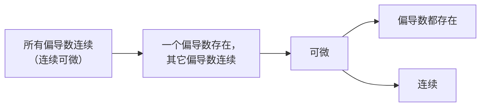

---
relevant:
  - ./calculus-1.md
---

# 工科数学分析 2

$$
\def\Z{\mathbb{Z}}
%
\def\i{\mathrm{i}}
\def\e{\mathrm{e}}
%
\def\d{\mathop{}\!\mathrm{d}}
\def\const{\mathrm{Const.}}
\def\tran{\mathsf T}
%
\def\arsinh{\operatorname{arsinh}}
\def\arcosh{\operatorname{arcosh}}
\def\artanh{\operatorname{artanh}}
%
\def\rank{\operatorname{rank}}
$$

## §1 向量代数与空间解析几何

### 二次曲面

> :material-clock-edit-outline: 2021年3月15日。
>
> [Quadratic Surface - MathWorld](https://mathworld.wolfram.com/QuadraticSurface.html)

方程：$x^2,y^2,z^2,2yz,2zx,2xy,2x,2y,2z,1$ 的线性组合为零。（暂记 $x^2$ 的系数为 $[x^2]$，以此类推）

$$
\displaylines{
e \triangleq \begin{bmatrix}
    [x^2] & [2xy] & [2zx] \\
    [2xy] & [y^2] & [2yz] \\
    [2zx] & [2yz] & [z^2]
\end{bmatrix}
\\
E \triangleq \begin{bmatrix}
    [x^2] & [2xy] & [2zx] & [2x] \\
    [2xy] & [y^2] & [2yz] & [2y] \\
    [2zx] & [2yz] & [z^2] & [2z] \\
    [2x] & [2y] & [2z] & [1]
\end{bmatrix}
\\
\rho_3 \triangleq \rank e \\
\rho_4 \triangleq \rank E \\
\Delta \triangleq \det E \\
k \triangleq \begin{cases}
    1 &  \text{if the signs of $e$'s nonzero eigenvalues are the same} \\
    0 & \text{otherwise}
\end{cases}
}
$$

> 下表未区分实虚曲面。名称中的“1”“0”指$k$。

<table style="text-align: center; vertical-align: middle;">
    <thead>
        <tr>
            <td colspan="2" rowspan="2"></td>
            <th scope="colgroup" colspan="3">rank <i>e</i></th>
        </tr>
        <tr>
            <th scope="col">1</th>
            <th scope="col">2</th>
            <th scope="col">3</th>
        </tr>
    </thead>
    <tbody>
        <tr>
            <th scope="rowgroup" rowspan="4">rank <i>E</i></th>
            <th scope="row">1</th>
            <td>重合平面</td>
            <td></td>
            <td></td>
        </tr>
        <tr>
            <th scope="row">2</th>
            <td>平行平面</td>
            <td>相交平面</td>
            <td></td>
        </tr>
        <tr>
            <th scope="row">3</th>
            <td>抛物柱面</td>
            <td>
                1 椭圆柱面 
                0 双曲柱面 
            </td>
            <td>椭圆锥面</td>
        </tr>
        <tr>
            <th scope="row">4</th>
            <td></td>
            <td>
                1 椭圆抛物面 
                0 双曲抛物面 
            </td>
            <td>
                1 椭球面 
                0 单/双叶双曲面 
            </td>
        </tr>
    </tbody>
</table>
## §2 多元函数微分学

### 连续、偏导数、可微

> :material-clock-edit-outline: 2021年3月24日，2021年3月30日，2021年4月4日。

在 $(0,0)$ 不可微的例子：

|                  |                   连续                    |              不连续              |
| :--------------: | :---------------------------------------: | :------------------------------: |
|  **存在偏导数**  |      $r\sin(2\theta) = \dfrac{2xy}r$      | $\sin(2\theta)=\dfrac{2xy}{r^2}$ |
| **不存在偏导数** | $x\sin\frac 1x + y\sin\frac 1y$（去间断） |  $\operatorname{Dirichlet}(xy)$  |

在 $(0,0)$ 不存在累次极限，而存在重极限的例子：$x \sin\frac1y + y \sin\frac1x$。

在闭矩形域内，若$z$对于$y$处处连续，对于$x$（且**关于$y$**）处处一致连续，则$z$连续。

> “且关于$y$”：
>
> $$
> \forall\varepsilon>0, \exists\delta>0, \forall x,\forall x'\in U(x;\delta),
> \underline{\forall y}, \quad
> z(x',y) \in U\left( z(x,y); \varepsilon \right)
> $$
>
> 另外，若去掉“关于$y$”，则“对$x$连续”即可说明“对$x$一致连续”。（因为是闭矩形域）

### 混合偏导数

> :material-clock-edit-outline: 2021年4月4日。

不同混合偏导数的极限式一致，只是极限过程不同，然而累次极限和重极限的存在性没有必然的蕴含关系（虽然都存在时必然都相等），导致累次极限不总能换序。

> 华东师大教材下册 §17. 4 的习题 17.（151–152页）。

若 $f_x',f_y',f_{yx}''$ 在原点的某邻域内存在，且 $f_{yx}''$ 在原点连续，则 $f_{xy}''$ 在原点也存在，且与 $f_{yx}''(0,0)$ 相等。（换为其它点也类似，只是原点写起来方便）这是因为用两次 Lagrange 中值定理可将极限式 $\dfrac{\Delta^2 f}{\d x\d y}$ 写成 $f_{yx}''(\theta_x \d x, \theta_y \d y)$，从而证明累次极限和重极限都存在，保证累次极限可以换序。

## §3 重积分

### 累次积分换序

> :material-clock-edit-outline: 2021年4月17日。

这可能简化积分。

> 设 $F(x) \triangleq \int_0^x \exp t^2 \d t$，则 $F'(x) = \exp x^2, F(0) = 0$。
>
> $$
> \begin{split}
>     & \int_0^1\d y \int_y^1 \left (\frac{\e^{x^2}}x - \e^{y^2} \right) \d x \\
>     &= \int_0^1\d x \int_0^x \left (\frac{\e^{x^2}}x - \e^{y^2} \right) \d y \\
>     &= \int_0^1 (\e^{x^2} - F(x)) \d x \\
>     &= F(1) - \int_0^1 F(x) \d x \\
>     &= F(1) - \left( F(1) - \int_0^1 x \e^{x^2} \d x\right) \\
>     &= \frac12 \int_0^1 \e^{x^2} \d(x^2) \\
>     &= \frac12 (\e - 1)
> \end{split}
> $$

另外，累次积分

$$
\int_{y_0}^{y_1} \int_{x_0(y)}^{x_1(y)} \d x \d y
$$

的积分区域相当于 $y=y_0, y=y_1, x = x_0(y), x = x_1(y)$ 四条曲线围成的区域。

> :material-clock-edit-outline: 2021年6月23日。

如果某些时候 $x_0(y) > x_1(y)$，那么建议分段写，并且某一段是负号的。

### 积分元素

> :material-clock-edit-outline: 2021年4月24日。

（此处球坐标的$\varphi$为与 $+z$ 的夹角，而非纬度）

$$
\begin{array}{ccc}
    \d x & \d x\d y & \d x\d y\d z \\
    & \rho\d\theta\d\rho & \rho\d\theta\d\rho\d z \\
    & & r\sin\varphi\d\theta\ r\d\varphi \d r \\
    & & = \d\theta \sin\varphi\d\varphi\ r^2\d r
\end{array}
$$

### 三角函数单项式的定积分

> :material-clock-edit-outline: 2021年4月28日。

$$
\begin{split}
    & (m+n)\sin^m\theta \cos^n\theta \d\theta \\
    &= -\d(\sin^{m-1}\theta \cos^{n+1}\theta) + (m-1)\sin^{m-2}\theta\cos^n\theta \d\theta \\
    &= \d(\sin^{m+1}\theta \cos^{n-1}\theta) + (n-1)\sin^m\theta\cos^{n-2}\theta \d\theta \\
\end{split}
$$

这第一项很容易是零，因此结果的形式往往类似于 $\frac{(n-1)!!}{n!!}\pi,\ \frac{(m-1)!!(n-1)!!}{(m+n)!!}\frac{(n-1)!!}{n!!}$。

### 对称性、线性

> :material-clock-edit-outline: 2021年4月28日。

往往能利用它化简。

例如积分区域是关于$z$轴对称的圆柱体，则

$$
\iint y^2\d V = \iint x^2\d V = \frac12 \iint(x^2+y^2)\d V = \frac12 \iint \rho^2\d V
$$

由此还可由物理上若干常用的转动惯量计算某些积分。

有些函数，例如 $y(1+x \exp\frac{x^2+y^2}2)$，可以拆成几部分，每部分各有各的对称性。

##  §9 曲线积分与曲面积分

### 曲线积分

> :material-clock-edit-outline: 2021年5月8日。

先化简再求值！

> 求下式可以上来就代入 $\rho = 2r\cos\theta$，也不太难。
>
> $$
> \oint\limits_{x^2+y^2 = 2rx} \left( x^2 + (y+1)^2 \right) \d l
> $$
>
> 先化简会更简单：
>
> $$
> \begin{split}
>     \text{原式}
>     &= \oint\limits_{x^2+y^2 = 2rx} \left( x^2+y^2 + 2y + 1 \right) \d l \\
>     &= \oint\limits_{x^2+y^2 = 2rx} \left( 2rx + 2y + 1 \right) \d l \\
>     &= \overline{2rx+2y+1} \oint\limits_{x^2+y^2 = 2rx} \d l \\
>     &= (2r\overline x + 2\overline y + 1) \cdot 2\pi r \\
>     &= (2r\cdot r + 0 + 1) 2\pi r \\
>     &= 2\pi r(2r^2+1).
> \end{split}
> $$
>
> 甚至可以口算。

### 化简全微分

> :material-clock-edit-outline: 2021年5月14日。

先验证旋度为零，确保原函数确实存在。

#### 凑微分

> 已知$\d u = \dfrac{y\d x - x\d y}{(x+y)^2}$，求$u$。
>
> 观察，分母可能是 $\d\dfrac1{x+y}$，来的，想办法搞出 $\d(x+y)$
>
> $$
> \begin{split}
>     \d u=\frac{y\d x - x\d y}{(x+y)^2}
>     &= \frac{(x+y)\d x - x(\d x+\d y)}{(x+y)^2} \\
>     &= \frac{\d x}{x+y} + x\d\frac1{x+y} \\
>     &= \d\frac{x}{x+y}
> \end{split}
> $$
>
> 故 $u = \dfrac{x}{x+y} + \const$.
>
> 如果凑的是 $y\d y$ 而非 $x\d x$，也能做，先得到的结果是 $-\dfrac{y}{x+y} = \dfrac{x}{x+y}-1$。
>
> 另：
>
> $$
> \begin{split}
>     \d u = \dfrac{y\d x - x\d y}{(x+y)^2}
>     &= \frac{y^2 \d\frac xy}{(x+y)^2} \\
>     &= \frac{\d \frac xy}{\left( 1 + \frac xy \right)^2} \\
>     &= -\d \frac 1{1+\frac xy} \\
>     &= -\d \frac y{x+y}
> \end{split}
> $$
>
> 若用 $x\d y - y\d x = x^2 \d\dfrac yx$，情况类似。

> :material-clock-edit-outline: 2021年6月24日。

常见的形式：

- $f\d g + g\d f = \d(fg).$
- $f\d g - g\d f = f^2 \d\frac gf.$
- $f\d x + \d f = \e^{-x} \d(\e^x f).$

#### 曲线积分

已能说明积分只与路径始末有关，所以选择一条好算的路径即可。

> 已知$\d u = \dfrac{y\d x - x\d y}{(x+y)^2}$，求$u$。
>
> $$
> \begin{split}
>     u\vert_{(0,0)}^{x_0,y_0}
>     &= \int\limits_{(0,0)}^{(x_0,y_0)} \frac{y\d x - x\d y}{(x+y)^2} \\
>     &= \int_0^{x_0} \frac{0\d x}{(x+0)^2} + \int_0^{y_0} \frac{- x_0\d y}{(x_0+y)^2} \\
>     &= 0 + \frac{x_0}{x_0+y} \Bigg\vert_{y=0}^{y_0} \\
>     &= \frac{x_0}{x_0+y_0} -1
> \end{split}
> $$
>
> 故 $u\vert_{(x,y)} = u\vert_{(0,0)} + u\vert_{(0,0)}^{(x,y)} = \dfrac{x}{x+y} + \const$。

#### 偏微分方程

$\d u = X\d x + Y\d y$，则 $\partial_x u = X,\ \partial_y u =Y$。

> 已知$\d u = \dfrac{y\d x - x\d y}{(x+y)^2}$，求$u$。
>
> $$
> \displaylines{
> \left\{ \begin{aligned}
> 	\pdv{u}{x} &= \frac{y}{(x+y)^2} \\
> 	\pdv{u}{y} &= -\frac{x}{(x+y)^2} \\
> \end{aligned} \right.
> \\
> \begin{split}
>  \therefore u
>  &= \int\frac{y\d x}{(x+y)^2} + C\vert_y \\
>  &= -\frac{y}{x+y} + C\vert_y
> \end{split}
> \\
> \begin{split}
>  \therefore \frac{\d C }{\d y}
>  &= \pdv{u}{y} + \pdv{y} \frac{y}{x+y} \\
>  &= -\frac{x}{(x+y)^2} + \frac{x+y-y}{(x+y)^2} \\
>  &= 0
> \end{split}
> \\
> \therefore C\vert_y = \const \\
> }
> $$
>
> 故 $u = -\dfrac y{x+y} + \const$。

### 面积元

> :material-clock-edit-outline: 2021年6月20日。

设 $\vec n = (n_x,n_y,n_z) = \lvert \vec n \rvert \hat n$。

$$
\displaylines{
\d\vec S = \hat n \d S = \frac{\vec n}{n_z} \d S_z, \\
\d S = \frac{\lvert \vec n \rvert}{n_z} \d S_z.
}
$$

## §10 级数

### 双阶乘

> :material-clock-edit-outline: 2021年6月14日。

$(2n)!!=2^n\times n!$。

$$
\displaylines{
(2i-1)(2i+1) < (2i)^2
\implies
\frac{(2n-1)!!}{(2n)!!} < \frac{(2n)!!}{(2n+1)!!}.
\\
\begin{split}
    \therefore \frac{(2n-1)!!}{(2n)!!}
    &< \sqrt{\frac{(2n-1)!!}{(2n)!!} \times \frac{(2n)!!}{(2n+1)!!}} \\
    &= \sqrt{\frac1{2n+1}} = \frac1{\sqrt{2n+1}}.
\end{split}
}
$$

> ~~似乎~~ 用数学归纳法可得还小于等于 $\frac1{\sqrt{\pi i}}$。二者都只在$\Z$上成立。

---

> :material-clock-edit-outline: 2021年6月20日。
>
> →[Wallis product](https://en.wikipedia.org/wiki/Wallis_product)、[Wallis' integrals](https://en.wikipedia.org/wiki/Wallis'_integrals)。

利用[三角函数单项式的定积分](#三角函数单项式的定积分)，

$$
\displaylines{
I_{2n} = \int_0^\frac{\pi}{2} \sin^{2n} x\d x
= \frac{(2n-1)!!}{(2n)!!} \times \frac\pi2, \\
I_{2n+1} =\int_0^\frac{\pi}{2} \sin^{2n+1} x\d x
= \frac{(2n)!!}{(2n+1)!!} \times 1.
}
$$

由 $\{\sin^n x\}$ 是减数列，$\{I_n\}$ 也是减数列，故

$$
\frac{(2n-1)!!}{(2n)!!}
= \sqrt{\frac2\pi I_{2n} \times \frac{1}{2n\ I_{2n-1}}}
< \frac1{\sqrt{\pi n}}.
$$

也可提供下界：

$$
\frac{(2n-1)!!}{(2n)!!}
= \sqrt{\frac2\pi I_{2n} \times \frac{1}{(2n+1) I_{2n+1}}}
> \frac1{\sqrt{\pi (n+\frac12)}}.
$$

另外可归结为阶乘的问题，因为

$$
(2n)!! = 2^n \times n!,\quad (2n)!! \times (2n+1)!! = (2n+1)!.
$$

故

$$
\frac{(2n-1)!!}{(2n)!!} = \frac{(2n)!}{(2n)!!^2} = \frac{(2n)!}{2^{2n} n!^2}.
$$

再——例如——由[Stirling's_approximation](https://en.wikipedia.org/wiki/Stirling's_approximation)，上式等价于

$$
\frac{\sqrt{2\pi} \times (2n)^{2n+\frac12} \e^{-2n}}{2^{2n} \times 2\pi \times n^{2n+1} \e^{-2n}}
= \frac{1}{\sqrt{\pi n}}.
$$

### 比阶法

> :material-clock-edit-outline: 2021年6月23日。

构造同阶无穷小永远可以判断数项级数是否收敛，只是有时很难构造，有时不存在简单的同阶无穷小。

### 级数对应相乘

> :material-clock-edit-outline: 2023年11月26日。

- Dirichlet：若 $a_n$ 单调趋于零，$\sum_n b_n$ 部分和有界，则 $\sum_n a_n b_n$ 收敛。
- Abel：若 $a_n$ 单调有界，$\sum_n b_n$ 收敛，则 $\sum_n a_n b_n$ 收敛。

对于同一对 $a_n, b_n$，两种判别法没有蕴含关系，不过 Dirichlet 判别法结合“单调有界则存在极限”可证 Abel 判别法。

两种判别法都可直接用分部求和证明——限制 $\sum_n b_n$ 部分和是分部求和所需，要求单调则是为了保证 $\Delta a_n$ 不变号。

## 杂项

### 全微分与留数

> :material-clock-edit-outline: 2022年11月21日。
>
> 这是2021年5月12日、24日在例6夹的纸。

求证下式，其中 $L$ 是任意绕原点的正向简单闭曲线。

$$
\oint\limits_L \frac{y\dd{x} - x \dd{y}}{x^2 + y^2} = -2\pi.
$$

#### 曲线积分

设以原点为圆心，$\varepsilon$ 为半径的圆。$\varepsilon$ 充分小，使之在 $L$ 内。

注意被积函数无旋：

$$
\curl \frac{(y, -x)}{x^2 + y^2} = -\frac{y^2-x^2}{\qty(x^2+y^2)^2} - \frac{x^2-y^2}{\qty(x^2+y^2)^2} = 0.
$$

故

$$
\begin{split}
\text{LHS}
&= \oint\limits_\varepsilon \frac{y\dd{x} - x \dd{y}}{x^2 + y^2} \\
&= -\frac{1}{\varepsilon^2} \oint\limits_\varepsilon \qty(x\dd{y} - y\dd{x}) \\
&= -\frac{1}{\varepsilon^2} \oint\limits_\varepsilon \varepsilon \\
&= -\frac{1}{\varepsilon^2} \times 2\pi\varepsilon \times \varepsilon \\
&= -2\pi.
\end{split}
$$

#### Cauchy 公式

$$
2\pi i \eval{f}_z = \oint \frac{\eval{f}_\zeta \dd{\zeta} }{\zeta - z}.
$$

取 $z = 1$，$f \equiv 1$，则 $2\pi i = \oint \dd{\zeta} / \zeta$。

记 $\zeta = x + yi$，则

$$
\begin{split}
\frac{\dd{\zeta}}{\zeta}
&= \frac{\bar \zeta \dd{\zeta}}{\abs{\zeta}^2} \\
&= \frac{x - yi}{x^2 + y^2} \qty(\dd{x} + \dd{y} i) \\
&= \frac{x\dd{x} + y\dd{y}}{x^2 + y^2} - \frac{y\dd{x} - x\dd{y}}{x^2 + y^2} i.
\end{split}
$$

又第一项是全微分，$\oint$ 为零，所以 $2\pi i$ 等于第二项的 $\oint$，即为所求。

#### 第三维

事实上

$$
\frac{(y, -x, 0)}{x^2 + y^2} = \curl \qty(\vu*{z} \ln \rho).
$$

> 其中 $\rho = \sqrt{x^2+y^2}$。

所以

$$
\begin{split}
\text{LHS}
&= \oint\limits_L \frac{y\dd{x} - x \dd{y} + 0 \dd{z}}{x^2 + y^2} \\
&= \oint \curl \qty(\vu*{z} \ln \rho) \vdot \dd{\vb*l} \\
&\overset?= \iint \vu*{z} \ln \rho \vdot \dd{\vb*S} \\
&= \iint \ln\rho \dd{S}.
\end{split}
$$

该函数在原点无定义，走不下去……

# 注意

- 平行向量可能同向、反向，也可能为零。
- 区分“四面体”与“平行六面体”的体积公式。
- 利用梯度求方向导数时需要<u>单位化方向向量</u>，一般的投影也是。
- $y=y_0+\sqrt{r^2-(x-x_0)^2}$ 只表示半圆弧。
- 若干曲面所围成的区域与所有曲面相邻。
- 移动坐标系原点时记得修改所有坐标的所有分量。
- $\int \sqrt{1-\cos^2\theta}\d\theta = \int \lvert\sin\theta\rvert \d\theta$，有个<u>绝对值</u>。
- 注意<u>正负</u>：
  - 区间的正负：重积分的各积分区间应当是正向区间。
  - 曲面的侧。
  - 曲线的方向。
- 注意形心、质心表达式的<u>分母</u>。
- 投影有方向，投影的数量没有。
- 多元函数的偏导数也是多元函数。
- 星形线的参数方程不是极坐标方程。
- 牟合方盖与坐标面的截面有两个是圆，有一个是正方形。
- “所围立体的外侧”是闭曲面。
- 收敛域的中心不一定是原点。
- 幂级数可能有<u>缺项</u>。
- <u>向量曲面积分给的三项的顺序</u>可能不是 $(\d y\d z, \d z\d x, \d x\d y)$。

# 后备箱

- [工数串讲6月19日](https://www.bilibili.com/video/BV1H44y1B7ho)：有我的笔记，还有欧景行。
