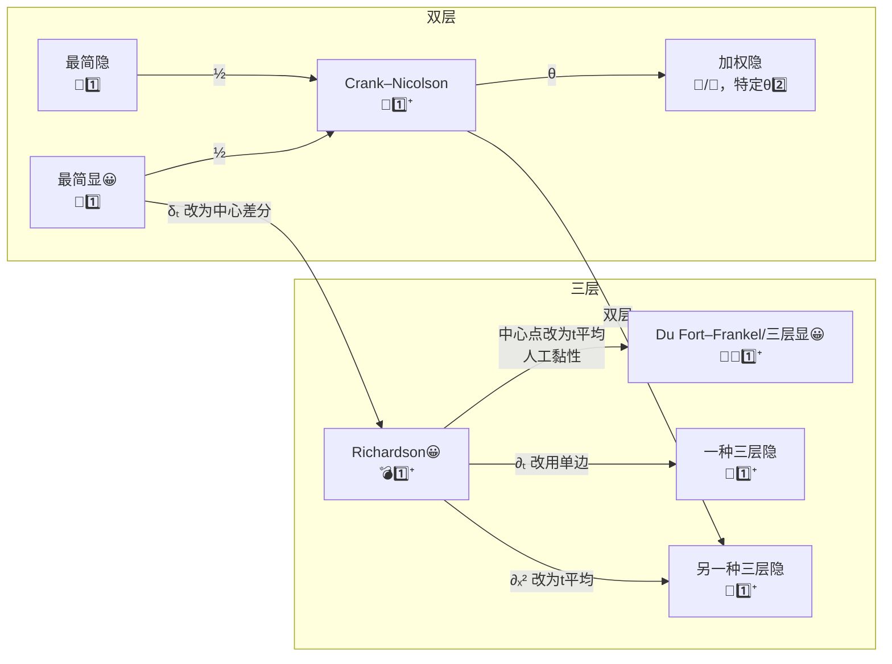

---
relevant:
  - ./calculus-1.md
  - ./complex-functions-and-equations-of-mathematical-physics.md
  - ./linear-algebra.md
---

# 科学与工程计算

$$
\def\dif{\mathop{}\!\mathrm{d}}
\def\Order{\mathcal{O}}
$$

## §1 两点边值问题

### 话题

> :material-clock-edit-outline: 2024年9月26日。

本课入口之一是（一维）两点边值问题，主要是二阶非齐次线性可变系数常微分方程：

$$
\begin{aligned}
y'' + p y' + q y = f, x \in (0,l). \\
\eval{y}_{x=0} = \alpha, \quad \eval{y}_{x=l} = \beta.
\end{aligned}
$$

一般要求 $\forall x, q \leq 0$，这是为了解存在且唯一。其道理大致如下：

1. 为简单，我们考虑齐次版本，或者说考虑解结构中的齐次部分。

2. 通过凑 $y'' + p y'$ 的微分，相应齐次方程可重述为 Sturm–Liouville 问题：$\mathcal{L} y = \lambda y$，其中特征值 $\lambda = 1$，算子

  \[
  \mathcal{L} y = \frac{1}{-q} \left(e^{\int p \dif x}\, y'\right)'.
  \]

  （这里之所以用 $-q$ 而非 $+q$，是为了能作后面内积的权重。）

  这种问题可看作 $\mathcal{L}$ 的特征分析问题——研究 $1$ 是不是 $\mathcal{L}$ 的特征值。

3. 两次分部积分，用齐次边界条件扔掉余项，可证明 $\mathcal{L}$ 在内积 $(\square, \triangle) \mapsto \int \square \triangle (-q) \dif x$ 的意义下 self-adjoint，因此特征值非负，$1$ 基本上是特征值，解正常存在。

4. 假设 $q > 0$，那内积和 $\mathcal{L}$ 定义中的 $-q$ 要改为 $+q$，齐次方程化出来是 $\mathcal{L} y = -y$，说明 $\mathcal{L}$ 有特征值 $-1$，与它 self-adjoint 矛盾，故解不存在。

这种做法还有助于理解变分法。

### 差商的误差

> :material-clock-edit-outline: 2024年9月26日。

用差商代微商难免有误差，估计误差的量级很有用。

例如二阶差商 $(y_{i+1} - 2 y_i + y_{i-1}) / h^2$：

- $y$ 是常数、一次函数时它都相互抵消为零；
- $y$ 是二次函数时它等于二次项系数的两倍，故可用于近似二阶导数。
- $y$ 是三次幂函数时它等于 $(h^3 - 0 + (-h)^3) / h^2 = 0$，故误差没有三阶项。
- $y$ 是四次幂函数时它等于 $(h^4 - 0 + h^4) / h^2 = 2 h^2$，故误差是 $2 h^2 / 4! = h^2/12$ 倍四阶导数量级。

（这种方法算出的误差满足“差商 = 微商 + 误差”，是其它定义的相反数。）

## §2 初值问题

> :material-clock-edit-outline: 2024年10月17日。

常微分方程的解可能包含快慢不同的分量，这种特点称作刚性（stiff）。对于显式格式，步长选小则要为慢变分量等待很久，步长选大则快变分量可能爆炸，都不合适。为此采用稳定性更好的隐式格式，例如以下两种。

!!! tip "显隐"

    显式与隐式的区别在于显式直接代入计算就能得到下一层，而隐式需要联立解方程组。另外，若不能直接代入，但可分开解方程，无需联立，则称作半隐式。

- **隐式 Runge–Kutta 法**

  Runge–Kutta 法有一整族。对于一阶常微分方程（组）的初值问题，它的要义是走若干**小步**（节点），用各小步处导数的线性组合（权重）近似这一步的平均增长率，即增量比步长。其中的导数由微分方程给出，可惜涉及未知的函数值，于是这函数值又只好再用导数的另一套线性组合（系数）近似。

  节点、权重、系数这些参数决定了具体方法的显隐和特性。按照 [Gauss](https://mathworld.wolfram.com/GaussianQuadrature.html)、Radau、Lobatto 等各种标准（求积公式，quadrature），可推出一系列参数组合。

- **向后差分法（backward differentiation formula, BDF）**

  线性多步法（linear multistep method）也有一整族。对于一阶常微分方程的初值问题，它的思路是利用过去**多步**函数值的线性组合近似这一步的增量，拟合标准用微分方程给出的导数衡量。

  BDF是一类特定的线性多步法，它用到的函数值包括过去多步和待求的下一步，衡量标准只利用下一步这一步的导数。具体来说，函数值的线性组合对应于一多项式（相当于 Lagrange 插值），BDF要求这多项式在下一步的导数严格满足微分方程。

  BDF所用步数可按需要选择。步数越少越稳定，步数越多约精确。

## §4 抛物方程的差分格式

### 适定性

> :material-clock-edit-outline: 2024年10月21日。

- 微分方程初值问题**适定**（well-posed）：解唯一存在，解对初始条件稳定。
- 差分方程对初值或右端项**稳定**：原始资料或计算机舍入造成的误差不会肆无忌惮地掩盖真实结果。
- 差分方程与微分方程**相容**：<u>方程</u>的局部截断误差是步长的无穷小。
- 差分方程**收敛**：差分方程的<u>解</u>在步长趋于零时趋于微分方程的真解。

!!! info "局部截断误差"

    局部截断误差（local truncation error）这一术语不是白给的。将微分方程用差分方程近似时，单步迭代中（局部，不计入累积）删去高阶项（截断）会导致微分方程不再严格成立。这种差分方程与微分方程之间的差别（误差）称作局部截断误差。

稳定性谈局部截断误差，还算容易分析；而收敛性解的误差，涉及迭代积累扩散，讨论麻烦。Peter Lax的等价定理告诉我们不必如此——如果初值问题**线性适定**，且差分方程**相容**，那么**稳定**性和**收敛**性等价。

### 格式

> :material-clock-edit-outline: 2024年11月7日。

图例：

- 计算量：显😀、隐（默认）。
- 相容性：相容（默认）、条件相容👻。
- 稳定性：绝对稳定🎯、条件稳定🎲、绝对不稳定💣。
- 局部截断误差：$\Order(\tau + h^2)$ 1️⃣、$\Order(\tau^2 + h^2)$ 1️⃣⁺、$\Order(\tau^2 + \tau h^2 + h^4)$ 2️⃣。

其它思路：

- Richardson/华罗庚外推：2️⃣。

- 多步/交替显隐（alternating–direction implicit, ADI）:

  - 预测–校正：基础版同 Crank–Nicolson，支持非线性。

  - 跳点：基础版同 Du Fort–Frankel，需要内存少。

  高维（空间高维，时间还是一维）时常用，因为单独显、隐的缺点都会被严重放大，不如交替。具体有以下三种方法。它们用于二维时在数学上等价，但具体计算过程不同，从而各有特色。

  - Peaceman–Rachford：先 $x$ 隐 $y$ 显，再 $x$ 显 $y$ 隐。只能二维。
  - Douglas：先所有维一起走一小步，然后每维依次走一小步，每小步会用到上一小步和上一大步的结果。能推广到三维。
  - 局部一维：每维依次用Crank–Nicolson走一小步，每小步只用到上一小步的结果。能推广到三维。
