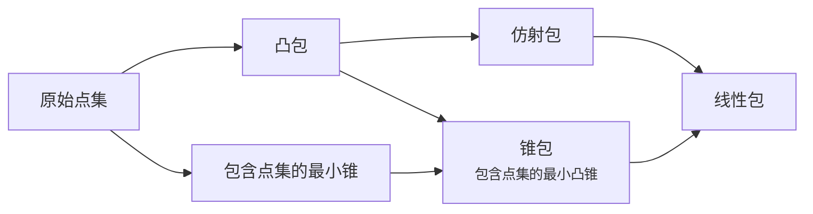

---
relevant:
  - ./linear-algebra.md
  - ./modern-math.md
---

# 最优化理论与方法

!!! info "教材"

    - [Convex Optimization – Stephen Boyd and Lieven Vandenberghe](https://web.stanford.edu/~boyd/cvxbook/)
    - [凸优化 | Stephen Boyd, Lieven Vandenberghe | download on Z-Library](https://z-lib.sk/book/oqk0owX25A/凸优化.html)

$$
\def\RR{\mathbb{R}}
$$

## 前言

> :material-clock-edit-outline: 2026年3月31日。

前言讲得很清楚，分析一下。

研究领域：凸优化。

重要性：已有的内点**法**可拓展至凸优化问题，**实践**中发现大量问题属于凸优化。此外，凸优化问题能可靠迅速求解，还能通过**对偶**等方式提供优越的理论概念解释。

地位：继承近代线性代数、线性规划。

本书目的：凸优化问题可能表面上非凸，本书帮助读者**判断、描述**、求解凸优化问题。本书不是数学知识的教材，也不是算法综述，并且又算简化。

读者范围：用到计算数学的人。主要针对使用凸优化的人，而非凸优化领域的专家。预备需要微积分、线性代数知识，数学分析、概率论也有帮助，附录有资料。

用作教材：课时，1/4, 1/2 或一整个学期。

致谢。

## 1 引言

> :material-clock-edit-outline: 2026年3月31日。

这里说的**稀疏**是指约束条件与优化变量的关系稀疏，而不是优化变量各分量的取值稀疏。

> A problem is *sparse* if each constraint function depends on only a small number of the variables

---

“鲜为人知的是”，凸优化问题也能和最小二乘问题、线性规划问题一样被可靠求解。

---

由于涉及到 $≤$，优化问题的目标、约束必须在实数域考虑；优化变量可以是复数。

### 最小二乘问题

“根据摩尔定律，以后的求解时间还会指数下降。”

---

> …the matrix $A$ is sparse, which means that it has far fewer than $kn$ nonzero entries.

这里又有第二种**稀疏**。

---

最小二乘问题正则化后，仍然是最小二乘问题。

### 线性规划

线性规划（linear programming）的线性是说约束和目标都线性。

词典上居然有这个词，但词典只提了目标线性。

> [LINEAR PROGRAMMING Definition & Meaning - Merriam-Webster](https://www.merriam-webster.com/dictionary/linear%20programming)
>
> a mathematical method of solving practical problems (such as the allocation of resources) by means of linear functions where the variables involved are subject to constraints

---

$$
\operatorname{minimize} \max_i \abs{a_i \vdot x - b_i}.
$$

$$
\begin{aligned}
&\operatorname{minimize} && t \\
&\text{subject to} && \forall i,\; t \geq a_i \vdot x - b_i \land t \geq -(a_i \vdot x - b_i).
\end{aligned}
$$

以上 Chebyshev 逼近问题相当于把最小二乘问题里的 $\norm{\cdot}_2$ 改为 $\norm{\cdot}_{\infty}$。虽然它不可微，但反而可转化成线性规划问题，可以把复杂的目标转换成多个相对简单的约束。

特别的是，Chebyshev 逼近问题转化出的约束对于每个变量都是无界的。换句话说，它的可行域投影到任一变量上都是全集。

转化 Chebyshev 逼近问题时，有点儿像在考虑“哪些条件对于目标互补”，或者“在保证目标效果相同的条件下，调整（原问题的）优化变量有多大的自由”。

---

线性规划问题的情况反映出“无解析解”和“能快速可靠求解”并不矛盾。

### 凸优化

> Ignoring any structure in the problem (such as sparsity), each step requires on the order of
>
> $$
> \max\{n^3, n^2 m, F\}
> $$
>
> operations, where $F$ is the cost of evaluating the first and second derivatives of the objective and constraint functions $\{f_0, \ldots , f_m\}$.

注意：

- 这只是一步的计算量。

- 所谓计算导数值，是指代入导数表达式得出“导数值”需要的计算量，而不是算出“导数表达式”的计算量。

  用数值方法也能算出导数值，但也许那样的计算量更大？

- 据老师说，$F \sim \mathcal{O}(n^3)$。

---

> 虽然有点夸张，我们认为，如果某个实际问题可以表述为凸优化问题，那么事实上已经解决了这个问题。

> With only a bit of exaggeration, we can say that, if you formulate a practical problem as a convex optimization problem, then you have solved the original problem.

only给翻译没了。

### 非线性优化

> 有时看似简单的问题，变量个数可能不到10，却非常难以求解，更不用说上百变量的非线性优化问题。

对于线性问题以外的问题，变量个数是问题的本质属性吗？会不会表面上有上百变量，其实只有某几个变量之间的相对大小有影响？

解微分方程时，变量个数就随时会变，比如高阶转成多元。

---

应用凸优化的难点在建模描述，应用局部优化的难点在求解技巧。

局部优化的优点：

- 仅要求目标函数和约束函数可微，建模比凸优化简单
- 可快速处理大规模问题

局部优化的缺点（或者说特点）：

- 局部最优解可能是满意解，但未必是（全局）最优解
- 无法估计局部最优解相比（全局）最优解的差距——可通过松弛为凸问题来估计
- 初始值不好选取——可根据近似凸问题的解选取
- 算法参数值不好选取——选取算法参数值可能就是凸问题

>  Roughly speaking, local optimization methods are more art than technology.

> 局部优化方法是一种技巧而不仅是一项技术。

> Local optimization is a well developed art, and often very effective, but it is nevertheless an art. In contrast, there is little art involved in solving a least-squares problem or a linear program (except, of course, those on the boundary of what is currently possible).

此处 art 指 skill acquired by experience, study, or observation，而非艺术。

---

> Global optimization is used for problems with a small number of variables, where computing time is not critical, and the value of finding the true global solution is very high.

> 对变量个数较少的小规模问题，若对计算时间没有苛刻的要求且寻找全局最优解非常有价值，我们采用全局优化。

投入，产出。

较差条件可以证明系统不可靠，但只有最差条件才能证明系统可靠。

### 本书主要内容

> 这种处理问题的方式可能会让一些专家认为不够专业，对此，我们表示歉意。但是，本书的目的是传达应用的精髓，使得更多读者能够更快接受，而不是从理论上详细、完整地进行介绍。

> 这三个章节按照问题由易到难的顺序进行安排，排在后面章节中的问题总可以表述为求解一系列前面章节所涉及的较简单的问题。

> 有不少用户都是仅仅使用（并不开发）凸优化软件，如线性规划或半定规划求解软件。对于这些用户，第III 部分所覆盖的知识旨在传达凸优化方法的基本概念和属性。对千一些开发新算法的用户，我们相信，第III 部分提供了一个较好的初步介绍。

> ……所以本书并非用例子来精确估计算法性能。我们给出这些例子只是希望读者对算法的性能，或者问题规模对计算盘的影响有个大致的了解。事实上，对同样的例子，读者的求解结果可能和我们的不一样。

> “事实上，优化问题的分水岭不是线性和非线性，而是凸性和非凸性。”

## 2 凸集

### 各种包

> :material-clock-edit-outline: 2026年4月23日。

考虑二元点集 $\{x,y\}$。（默认 $λ, μ \in \RR$）

- linear 线性包：$\{λ x + μ y : λ, μ \in \RR\}$
- affine 仿射包：$\{λ x + μ y : λ + μ = 1\}$（直线）
- convex 凸包：$\{λ x + μ y : λ + μ = 1 ∧ λ,μ \in \RR_{≥0}\}$（线段）
- conic 锥包（包含点集的最小凸锥）：$\{λ x + μ y : λ,μ \in \RR_{≥0}\}$
- 包含点集的最小锥：$x \RR_{≥0} ∪ y \RR_{≥0}$（关于原点位似的集合）

显然它们的包含关系如下。

对于一般点集，还有一系列命题：凸包的仿射包等于仿射包，仿射包的凸包也等于仿射包；仿射包的锥包等于线性包，锥包的仿射包等于线性包；……

另外，这些包的齐次性不同。平移原点时，凸包、仿射包始终不变，线性包在原点不属于点集时不变，包含点集的最小锥、锥包几乎始终变化。

又，若允许点集包含 $∞$，并且不同方向的 $∞$ 认作不同 $∞$，正负方向的 $∞$ 也当成不同 $∞$，那么锥包和凸包似乎就能统一成相同概念了。

### 多面体与单纯形

> :material-clock-edit-outline: 2026年4月23日。

单纯形用顶点表达，而多面体用边界（半空间）和所在超平面表达。这种多面体其实是初等数学所说的「凸多面体」。本书所说的多面体允许无界。

把单纯形转成多面体形式，可以先用可逆仿射变换把单纯形统一为单位单纯形（unit simplex）。单位单纯性的顶点是原点和若干轴单位一，其内点在这些轴的坐标非负，在其它轴的坐标为零，并且所有坐标之和不超过一。这样就把单位单纯形表达成了多面体形式，再转化回原来的单纯形即可。

### 正常锥与广义不等式

> :material-clock-edit-outline: 2026年4月26–27日、2026年5月5日。

把关系 $x \preceq y$ 表达成 $y - x \in K$ 本身就结合了序结构与代数结构，这种“$\preceq$”天然满足 $x \preceq y \implies \forall z, x+z \preceq y+z$（该条件是“存在那样的 $K$”的充要条件）。在该条件下，“$\preceq$”的传递性蕴含对加法保序——若 $x ⪯ x' ∧ y ⪯ y'$，则 $x + y ⪯ x' + y ⪯ x' + y'$。而且“$\preceq$”如果既对加法保序，又对非负数乘保序，那么必然对锥组合保序。

“$\preceq$”与 $K$ 的性质可以相互表达，如下表。表中自反、反对称、传递三条性质是偏序关系的定义。

|                      “$\preceq$”的性质                       |                          $K$ 的性质                          |
| :----------------------------------------------------------: | :----------------------------------------------------------: |
|                 $\forall z, x+z \preceq y+z$                 |                 （“$\preceq$”能用 $K$ 表达）                 |
|                     自反：$x \preceq x$                      |                          $0 \in K$                           |
|    反对称：$x \preceq y \land y \preceq x \implies x = y$    | 尖，pointed，不含直线（最多含射线）：$x \in K \land -x \in K \implies x =0$ |
|             传递：$x ⪯ y ∧ y ⪯ z \implies x ⪯ z$             |     对加法封闭：$x \in K ∧ y \in K \implies x + y \in K$     |
|      对非负数乘保序：$λ ≥ 0 ∧ x ⪯ y \implies λ x ⪯ λ y$      |           锥：$λ ≥ 0 ∧ x \in K \implies λ x \in K$           |
| 对锥组合保序：$λ,μ \in \RR_{≥0} ∧ x ⪯ x' ∧ y ⪯ y' \implies λ x + μ y ⪯ λ x' + μ y'$ | 凸锥：$λ,μ \in \RR_{≥0} ∧ x,y \in K \implies λ x + μ y \in K$ |
| 对极限保序：$x_n \to x ∧ y_n \to y ∧ (\forall n, x_n ⪯ y_n) \implies x ⪯ y$ |  闭：$x_n \to x ∧ (\forall n, x_n \in K) \implies x \in K$   |
| 邻域严格性：若 $x ≺ y$，则存在 $x,y$ 的邻域 $U_x, U_y$，$U_x ≺ U_y$ |      实心，solid，内部非空：$K^\circ \neq \varnothing$       |

实心的闭尖凸锥称作正常锥（proper cone）。实心的一大作用在于用 $y - x \in K^\circ$ 定义 $x ≺ y$ ——这里 $x ≺ y$ 并不是用 $x ⪯ y ∧ x ≠ y$ 定义的。这样由非空开集定义的“$$”才保证满足邻域严格性。

另外，实心可能也会带来整体性质。若 $K$ 是闭尖凸锥，但内部为空，那么 $∀x$，存在超平面 $α$，$(x + K) ∩ α = \varnothing = x ∩ (α + K)$，即 $α$ 中的点与 $x$ 按 $⪯$ 都不可比；但若 $K$ 实心，似乎就不存在这样的 $α$ 了。不过需要拓扑结构才能定义内部，但这种整体性质在哪里用到了拓扑结构呢？它就相当于“$K$ 的线性包是全集”？——在有限维空间，$K^\circ ≠ \varnothing$ 等价于 $K$ 包含满维度的开球，这个“满维度”就相当于线性包是全集了；在无穷维空间，只谈维度并不能唯一确定线性空间，所以就没有这一结论了。

为简洁，以后就不区分“$≺$”（两向量的各个分量比大小）与“$<$”（两数比大小）了，统一写成“$<$”。

### Theorem of alternatives

> :material-clock-edit-outline: 2026年4月27日、2026年5月5日。

这组定理形式都是给出一对命题，指出二者非此即彼，因此有人翻译成“择一定理”。这组定理也叫 [Farkas' lemma](https://en.wikipedia.org/wiki/Farkas%27_lemma)，只涉及等式的特例是 [Fredholm alternative](https://en.wikipedia.org/wiki/Fredholm_alternative)。

等式还是不等式、不等式严格与否在这里并不重要，各种情况都有变体，也可相互转化（例如等式 $A x = b$ 能用不严格不等式 $A x ≤ b ∧ -Ax ≤ -b$ 表达，不严格不等式 $A x ≤ b$ 也能用等式 $A x + δ = b ∧ δ \in \RR_{≥0}$ 表达）。

各种变体如下，其中逗号表示“$∧$”，$b \in \RR^m$，$A: \RR^n → \RR^m$。

$$
\begin{array}{cc}
Ax=b,\ x \in \RR^n.
  & Ax=b,\ x \in \RR_{\textcolor{red}{≥0}}^n. \\
y^\dagger A = 0,\ y^\dagger b < 0,\ y\in \RR^m.
  & y^\dagger A \textcolor{red}{≥} 0,\ y^\dagger b < 0,\ y\in \RR^m. \\
\\
Ax \textcolor{cyan}{≤} b,\ x \in \RR^n.
  & Ax \textcolor{cyan}{≤} b,\ x \in \RR_{\textcolor{red}{≥0}}^n. \\
y^\dagger A = 0,\ y^\dagger b < 0,\ y\in \RR_{\textcolor{cyan}{≥0}}^m.
  & y^\dagger A \textcolor{red}{≥} 0,\ y^\dagger b < 0,\ y\in \RR_{\textcolor{cyan}{≥0}}^m. \\
\end{array}
$$

- 左上角由于 $y^\dagger A = 0$ 和 $y \in \RR^m$ 都不区分正负，$y^\dagger b < 0$ 可以弱化为 $y^\dagger b ≠ 0$。

- 某些变体冗余对称性。

  对于 $A x = b$，变换 $b$ 所用的基不影响等式（例如变换方阵是 $P$，则 $(PA) x = (Pb)$ 仍然成立）；但对于 $A x ≤ b$ 则不然，因为 $≤$ 与基相关。

  类似地，对于 $x \in \RR^n$，变换 $x$ 所用的基不影响 $A x = b$ 和 $A x ≤ b$；但对于 $x \in \RR_{≥0}^n$ 则不然。

- 这些二选一定理和“两个凸集仅当不相交时才能被超平面分离”（超平面分离定理）密切相关。

  以上每组中 $y$ 的命题很容易否定 $x$ 的命题，而各组的择一定理进一步指出这种否定方式在逻辑上**完备**——只要 $x$ 的命题为假，一定存在某个 $y$ 的命题能把它否定。

  其实超平面分离定理也能表达成二选一的形式：$y$ 的命题对应“两个凸集被超平面分离”，$x$ 的命题对应“两个凸集相交”，二者非此即彼。

- $y^\dagger A \textcolor{red}{≥} 0$ 等价于 $\forall β \in \{A x : x \in \RR_{\textcolor{red}{≥0}}^n\},\ y^\dagger β ≥ 0$；而 $y^\dagger A = 0$ 等价于 $\forall β \in \{A x : x \in \RR^n\},\ y^\dagger β ≥ 0$，又由于这时 $u$ 所在的集合关于原点对称，$y^\dagger β ≥ 0$ 可以强化成 $y^† β = 0$。

  考虑 $A x = b$，左侧 $β = Ax$ 始终满足 $y^† β ≥ 0$，那“右侧满足 $y^† b < 0$”一定等价于原命题的否定了。

以上围绕“$≤$”，其实也可围绕“$<$”，比如所谓 theorem of alternatives for strict linear inequalities（严格线性不等式的择一定理）：

$$
\begin{array}{c}
A x \textcolor{green}{<} b,\ x\in \RR^n. \\
y^\dagger A = 0,\ y^\dagger b \textcolor{green}{≤} 0,\ y\in \RR_{≥0}^m \textcolor{green}{\setminus \{0\}}.
\end{array}
$$
