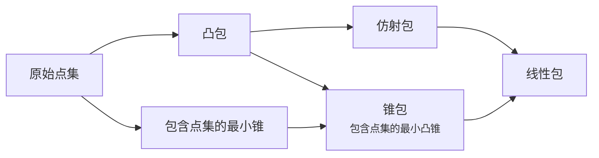

---
relevant:
  - ./linear-algebra.md
  - ./modern-math.md
---

# 最优化理论与方法

!!! info "教材"

    - [Convex Optimization – Stephen Boyd and Lieven Vandenberghe](https://web.stanford.edu/~boyd/cvxbook/)
    - [凸优化 | Stephen Boyd, Lieven Vandenberghe | download on Z-Library](https://z-lib.sk/book/oqk0owX25A/凸优化.html)

$$
\def\RR{\mathbb{R}}
\DeclareMathOperator\epi{epi}
$$

## 前言

> :material-clock-edit-outline: 2026年3月31日。

前言讲得很清楚，分析一下。

研究领域：凸优化。

重要性：已有的内点**法**可拓展至凸优化问题，**实践**中发现大量问题属于凸优化。此外，凸优化问题能可靠迅速求解，还能通过**对偶**等方式提供优越的理论概念解释。

地位：继承近代线性代数、线性规划。

本书目的：凸优化问题可能表面上非凸，本书帮助读者**判断、描述**、求解凸优化问题。本书不是数学知识的教材，也不是算法综述，并且又算简化。

读者范围：用到计算数学的人。主要针对使用凸优化的人，而非凸优化领域的专家。预备需要微积分、线性代数知识，数学分析、概率论也有帮助，附录有资料。

用作教材：课时，1/4, 1/2 或一整个学期。

致谢。

## 1 引言

> :material-clock-edit-outline: 2026年3月31日、2026年6月8日。

这里说的**稀疏**是指约束条件与优化变量的关系稀疏，而不是优化变量各分量的取值稀疏。

> A problem is *sparse* if each constraint function depends on only a small number of the variables

---

“鲜为人知的是”，凸优化问题也能和最小二乘问题、线性规划问题一样被可靠求解。

---

由于涉及到 $≤$，优化问题的目标、约束必须在实数域考虑；优化变量可以是复数。

---

凸优化对方法本身倒没有太多贡献，其贡献主要在于使用方法后的结果。一旦识别出凸优化问题，那么用普通方法就能求出全局最优解。

### 最小二乘问题

“根据摩尔定律，以后的求解时间还会指数下降。”

---

> …the matrix $A$ is sparse, which means that it has far fewer than $kn$ nonzero entries.

这里又有第二种**稀疏**。

---

最小二乘问题正则化后，仍然是最小二乘问题。

### 线性规划

线性规划（linear programming）的线性是说约束和目标都线性。

词典上居然有这个词，但词典只提了目标线性。

> [LINEAR PROGRAMMING Definition & Meaning - Merriam-Webster](https://www.merriam-webster.com/dictionary/linear%20programming)
>
> a mathematical method of solving practical problems (such as the allocation of resources) by means of linear functions where the variables involved are subject to constraints

---

$$
\operatorname{minimize} \max_i \abs{a_i \vdot x - b_i}.
$$

$$
\begin{aligned}
&\operatorname{minimize} && t \\
&\text{subject to} && \forall i,\; t \geq a_i \vdot x - b_i \land t \geq -(a_i \vdot x - b_i).
\end{aligned}
$$

以上 Chebyshev 逼近问题相当于把最小二乘问题里的 $\norm{\cdot}_2$ 改为 $\norm{\cdot}_{\infty}$。虽然它不可微，但反而可转化成线性规划问题，可以把复杂的目标转换成多个相对简单的约束。

特别的是，Chebyshev 逼近问题转化出的约束对于每个变量都是无界的。换句话说，它的可行域投影到任一变量上都是全集。

转化 Chebyshev 逼近问题时，有点儿像在考虑“哪些条件对于目标互补”，或者“在保证目标效果相同的条件下，调整（原问题的）优化变量有多大的自由”。

---

线性规划问题的情况反映出“无解析解”和“能快速可靠求解”并不矛盾。

### 凸优化

> Ignoring any structure in the problem (such as sparsity), each step requires on the order of
>
> $$
> \max\{n^3, n^2 m, F\}
> $$
>
> operations, where $F$ is the cost of evaluating the first and second derivatives of the objective and constraint functions $\{f_0, \ldots , f_m\}$.

注意：

- 这只是一步的计算量。

- 所谓计算导数值，是指代入导数表达式得出“导数值”需要的计算量，而不是算出“导数表达式”的计算量。

  用数值方法也能算出导数值，但也许那样的计算量更大？

- 据老师说，$F \sim \mathcal{O}(n^3)$。

---

> 虽然有点夸张，我们认为，如果某个实际问题可以表述为凸优化问题，那么事实上已经解决了这个问题。

> With only a bit of exaggeration, we can say that, if you formulate a practical problem as a convex optimization problem, then you have solved the original problem.

only给翻译没了。

### 非线性优化

> 有时看似简单的问题，变量个数可能不到10，却非常难以求解，更不用说上百变量的非线性优化问题。

对于线性问题以外的问题，变量个数是问题的本质属性吗？会不会表面上有上百变量，其实只有某几个变量之间的相对大小有影响？

解微分方程时，变量个数就随时会变，比如高阶转成多元。

---

应用凸优化的难点在建模描述，应用局部优化的难点在求解技巧。

局部优化的优点：

- 仅要求目标函数和约束函数可微，建模比凸优化简单
- 可快速处理大规模问题

局部优化的缺点（或者说特点）：

- 局部最优解可能是满意解，但未必是（全局）最优解
- 无法估计局部最优解相比（全局）最优解的差距——可通过松弛为凸问题来估计
- 初始值不好选取——可根据近似凸问题的解选取
- 算法参数值不好选取——选取算法参数值可能就是凸问题

>  Roughly speaking, local optimization methods are more art than technology.

> 局部优化方法是一种技巧而不仅是一项技术。

> Local optimization is a well developed art, and often very effective, but it is nevertheless an art. In contrast, there is little art involved in solving a least-squares problem or a linear program (except, of course, those on the boundary of what is currently possible).

此处 art 指 skill acquired by experience, study, or observation，而非艺术。

---

> Global optimization is used for problems with a small number of variables, where computing time is not critical, and the value of finding the true global solution is very high.

> 对变量个数较少的小规模问题，若对计算时间没有苛刻的要求且寻找全局最优解非常有价值，我们采用全局优化。

投入，产出。

较差条件可以证明系统不可靠，但只有最差条件才能证明系统可靠。

### 本书主要内容

> 这种处理问题的方式可能会让一些专家认为不够专业，对此，我们表示歉意。但是，本书的目的是传达应用的精髓，使得更多读者能够更快接受，而不是从理论上详细、完整地进行介绍。

> 这三个章节按照问题由易到难的顺序进行安排，排在后面章节中的问题总可以表述为求解一系列前面章节所涉及的较简单的问题。

> 有不少用户都是仅仅使用（并不开发）凸优化软件，如线性规划或半定规划求解软件。对于这些用户，第III 部分所覆盖的知识旨在传达凸优化方法的基本概念和属性。对千一些开发新算法的用户，我们相信，第III 部分提供了一个较好的初步介绍。

> ……所以本书并非用例子来精确估计算法性能。我们给出这些例子只是希望读者对算法的性能，或者问题规模对计算盘的影响有个大致的了解。事实上，对同样的例子，读者的求解结果可能和我们的不一样。

> “事实上，优化问题的分水岭不是线性和非线性，而是凸性和非凸性。”

## 2 凸集

### 各种包

> :material-clock-edit-outline: 2026年4月23日。

考虑二元点集 $\{x,y\}$。（默认 $λ, μ \in \RR$）

- linear 线性包：$\{λ x + μ y : λ, μ \in \RR\}$
- affine 仿射包：$\{λ x + μ y : λ + μ = 1\}$（直线）
- convex 凸包：$\{λ x + μ y : λ + μ = 1 ∧ λ,μ \in \RR_{≥0}\}$（线段）
- conic 锥包（包含点集的最小凸锥）：$\{λ x + μ y : λ,μ \in \RR_{≥0}\}$
- 包含点集的最小锥：$x \RR_{≥0} ∪ y \RR_{≥0}$（关于原点位似的集合）

显然它们的包含关系如下。

对于一般点集，还有一系列命题：凸包的仿射包等于仿射包，仿射包的凸包也等于仿射包；仿射包的锥包等于线性包，锥包的仿射包等于线性包；……

另外，这些包的齐次性不同。平移原点时，凸包、仿射包始终不变，线性包在原点不属于点集时不变，包含点集的最小锥、锥包几乎始终变化。

又，若允许点集包含 $∞$，并且不同方向的 $∞$ 认作不同 $∞$，正负方向的 $∞$ 也当成不同 $∞$，那么锥包和凸包似乎就能统一成相同概念了。

### 多面体与单纯形

> :material-clock-edit-outline: 2026年4月23日。

单纯形用顶点表达，而多面体用边界（半空间）和所在超平面表达。这种多面体其实是初等数学所说的「凸多面体」。本书所说的多面体允许无界。

把单纯形转成多面体形式，可以先用可逆仿射变换把单纯形统一为单位单纯形（unit simplex）。单位单纯性的顶点是原点和若干轴的单位一，其内点在这些轴的坐标非负，在其它轴的坐标为零，并且所有坐标之和不超过一。这样就把单位单纯形表达成了多面体形式，再转化回原来的单纯形即可。

### 保凸运算

> :material-clock-edit-outline: 2026年5月20、21、26、30日。

任意并、有限交保开集，有限并、任意交保闭集，嵌套并、任意交保凸集。（顺便提一下，测度可加性是不相交可数并。）

任意交能覆盖一大类运算，比如习题 2.12f：若 $A$ 是凸集，$B$ 是任意集合，则 $A$ 用 $B$ 挖掉一圈的集合也是凸集，具体描述如下。

$$
\{x : x + B ⊂ A \}
= \bigcap_{b ∈ B} \{x : x + b ⊂ A\}
= \bigcap_{b ∈ B} (A - b).
$$

透视映射 $\RR^{n+1} ∋ (x,t) ↦ x/t ∈ \RR^n$ 差一点就保凸集了，但从 $t > 0$ 跨越到 $t < 0$ 会镜像，破坏像的凸性。可以把定义域局限到其中一半，这样就真正保凸集了。透视映射与线性映射（不是变换的映射也允许，正逆映射也都允许）结合，又能覆盖一大类运算。

注意“正逆映射都允许”是说凸集在某些映射下的像仍凸，且在另一些映射下的原像也凸，并不是说集合在映射前后同时凸或同时不凸——一个集合可能本身不凸，但正映射得到的像凸，再逆映射得到的原像也凸，只不过像的原像比原集合大。就本质而言，映射保凸集的意思大概如下。

- 凸组合齐次，与原点与基的选取无关，所以可逆仿射映射保凸集
- 凸性的定义只涉及两点所连线段上的情况，所以透视映射保凸集
- 不可逆仿射映射的核是超平面，它与凸集之交仍凸，所以保凸集
- 凸性的定义只谈集合内，扩充域无影响，故合适映射的原像仍凸

### 正常锥与广义不等式

> :material-clock-edit-outline: 2026年4月26–27日、2026年5月5日、2026年5月16日、2026年6月3日。

把关系 $x \preceq y$ 表达成 $y - x \in K$ 本身就结合了序结构与代数结构，这种“$\preceq$”天然满足 $x \preceq y \implies \forall z, x+z \preceq y+z$（该条件是“存在那样的 $K$”的充要条件）。在该条件下，“$\preceq$”的传递性蕴含对加法保序——若 $x ⪯ x' ∧ y ⪯ y'$，则 $x + y ⪯ x' + y ⪯ x' + y'$。而且“$\preceq$”如果既对加法保序，又对非负数乘保序，那么必然对锥组合保序。

“$\preceq$”与 $K$ 的性质可以相互表达，如下表。表中自反、反对称、传递三条性质是偏序关系的定义。

|                      “$\preceq$”的性质                       |                          $K$ 的性质                          |
| :----------------------------------------------------------: | :----------------------------------------------------------: |
|                 $\forall z, x+z \preceq y+z$                 |                 （“$\preceq$”能用 $K$ 表达）                 |
|                     自反：$x \preceq x$                      |                          $0 \in K$                           |
|    反对称：$x \preceq y \land y \preceq x \implies x = y$    | 尖，pointed，不含直线（最多含射线）：$x \in K \land -x \in K \implies x =0$ |
| 任两元素都可比（全序的“全”）：$x \preceq y \lor y \preceq x$ |     每条直线一半：$x ≠ 0 \implies x \in K \lor -x \in K$     |
|             传递：$x ⪯ y ∧ y ⪯ z \implies x ⪯ z$             |     对加法封闭：$x \in K ∧ y \in K \implies x + y \in K$     |
|      对非负数乘保序：$λ ≥ 0 ∧ x ⪯ y \implies λ x ⪯ λ y$      |           锥：$λ ≥ 0 ∧ x \in K \implies λ x \in K$           |
| 对锥组合保序：$λ,μ \in \RR_{≥0} ∧ x ⪯ x' ∧ y ⪯ y' \implies λ x + μ y ⪯ λ x' + μ y'$ | 凸锥：$λ,μ \in \RR_{≥0} ∧ x,y \in K \implies λ x + μ y \in K$ |
| 对极限保序：$x_n \to x ∧ y_n \to y ∧ (\forall n, x_n ⪯ y_n) \implies x ⪯ y$ |  闭：$x_n \to x ∧ (\forall n, x_n \in K) \implies x \in K$   |
| 邻域严格性：若 $x ≺ y$，则存在 $x,y$ 的邻域 $U_x, U_y$，$U_x ≺ U_y$ |      实心，solid，内部非空：$K^\circ \neq \varnothing$       |

实心的闭尖凸锥称作**正常锥（proper cone）**。实心的一大作用在于用 $y - x \in K^\circ$ 定义 $x ≺ y$ ——这里 $x ≺ y$ 并不是用 $x ⪯ y ∧ x ≠ y$ 定义的。这样由非空开集定义的“$≺$”才保证满足邻域严格性。

另外，实心可能也会带来整体性质，即“不扁”。若 $K$ 是闭尖凸锥，但内部为空，那么 $∀x$，存在超平面 $α$，$(x + K) ∩ α = \varnothing = x ∩ (α + K)$，即 $α$ 中的点与 $x$ 按 $⪯$ 都不可比；但若 $K$ 实心，似乎就不存在这样的 $α$ 了。不过需要拓扑结构才能定义内部，但这种整体性质在哪里用到了拓扑结构呢？它就相当于“$K$ 的线性包是全集”？——在有限维空间，$K^\circ ≠ \varnothing$ 等价于 $K$ 包含满维度的开球，这个“满维度”就相当于线性包是全集了；在无穷维空间，只谈维度并不能唯一确定线性空间，所以就没有这一结论了。（“不扁”和“尖”都是整体性质。在后面定义的对偶锥的意义下，这两个性质对偶。）

为简洁，以后就不区分“$≺$”（两向量的各个分量比大小）与“$<$”（两数比大小）了，统一写成“$<$”。

### Theorem of alternatives

> :material-clock-edit-outline: 2026年4月27日，2026年5月5、6、7日。

这组定理形式都是给出一对命题，指出二者非此即彼，因此有人翻译成“择一定理”。这组定理也叫 [Farkas' lemma](https://en.wikipedia.org/wiki/Farkas%27_lemma)，只涉及等式的特例是 [Fredholm alternative](https://en.wikipedia.org/wiki/Fredholm_alternative)。

等式还是不等式、不等式严格与否在这里并不重要，各种情况都有变体，也可相互转化（例如等式 $A x = b$ 能用不严格不等式 $A x ≤ b ∧ -Ax ≤ -b$ 表达，不严格不等式 $A x ≤ b$ 也能用等式 $A x + δ = b ∧ δ \in \RR_{≥0}$ 表达）。

各种变体如下，其中逗号表示“$∧$”，$b \in \RR^m$，$A: \RR^n → \RR^m$。

$$
\begin{array}{ccc}
Ax=b,\ x \in \RR^n.
  & Ax=b,\ x \in \RR_{\textcolor{red}{≥0}}^n.
  & Ax=b,\ x \in \RR_{\textcolor{red}{>0}}^n. \\
y^\dagger A = 0,\ y^\dagger b < 0,\ y\in \RR^m.
  & y^\dagger A \textcolor{red}{≥} 0,\ y^\dagger b < 0,\ y\in \RR^m.
  & \cdots \\
\\
Ax \textcolor{cyan}{≤} b,\ x \in \RR^n.
  & Ax \textcolor{cyan}{≤} b,\ x \in \RR_{\textcolor{red}{≥0}}^n.
  & \cdots \\
y^\dagger A = 0,\ y^\dagger b < 0,\ y\in \RR_{\textcolor{cyan}{≥0}}^m.
  & y^\dagger A \textcolor{red}{≥} 0,\ y^\dagger b < 0,\ y\in \RR_{\textcolor{cyan}{≥0}}^m.
  & \cdots \\
\\
Ax \textcolor{cyan}{<} b,\ x \in \RR^n. & \cdots & \cdots \\
\cdots & \cdots & \cdots
\end{array}
$$

- 每种变体也有**多种表达方式**。

  左上角由于 $y^\dagger A = 0$ 和 $y \in \RR^m$ 都不区分正负，$y^\dagger b < 0$ 可以弱化为 $y^\dagger b ≠ 0$。

  所有变体中 $y$ 的命题都有 $y^† b < 0$，这意味着解非零，所以 $y\in \RR^m$ 可强化为 $y\in \RR^m \setminus \{0\}$，$y\in \RR_{\textcolor{cyan}{≥0}}^m$ 可强化为 $y\in \RR_{\textcolor{cyan}{≥0}}^m \setminus \{0\}$。注意 $\RR_{>0}^m \subsetneq \RR_{≥0}^m \setminus \{0\}$，后者还包括某些分量为零但整体非零的向量。

- 某些变体**冗余对称性**。

  对于 $A x = b$，变换 $b$ 所用的基不影响等式（例如变换方阵是 $P$，则 $(PA) x = (Pb)$ 仍然成立）；但对于 $A x ≤ b$ 则不然，因为 $≤$ 与基相关。

  类似地，对于 $x \in \RR^n$，变换 $x$ 所用的基不影响 $A x = b$ 和 $A x ≤ b$；但对于 $x \in \RR_{≥0}^n$ 则不然。

- 这些二选一定理和“两个凸集仅当不相交时才能被超平面分离”（**超平面分离定理**）密切相关。

  以上每组中 $y$ 的命题很容易否定 $x$ 的命题，而各组的择一定理进一步指出这种否定方式在逻辑上**完备**——只要 $x$ 的命题为假，一定存在某个 $y$ 的命题能把它否定。

  其实超平面分离定理也能表达成二选一的形式：$y$ 的命题对应“两个凸集被超平面分离”，$x$ 的命题对应“两个凸集相交”，二者非此即彼。

- 定理**具体论证**如下。

  考虑 $Ax$ 在 $x$ 变化时的范围。$y^\dagger A \textcolor{red}{≥} 0$ 等价于 $\forall β \in \{A x : x \in \RR_{\textcolor{red}{≥0}}^n\},\ y^\dagger β ≥ 0$；而 $y^\dagger A = 0$ 等价于 $\forall β \in \{A x : x \in \RR^n\},\ y^\dagger β ≥ 0$，又由于这时 $β$ 所在的集合关于原点对称，$y^\dagger β ≥ 0$ 可以强化成 $y^† β = 0$。无论哪种情况，$β$ 所在的集合都是个凸集。

  考虑能满足 $A x = b$（或  $A x \textcolor{cyan}{≤} b$）的 $Ax$。$y^† b < 0$ 等价于 $∀β \in \{b\},\ y^† β < 0$；而 $y^† b < 0 ∧ y \in \RR_{\textcolor{cyan}{≥0}}^m$ 等价于 $∀ β ≤ b,\ y^† β < 0$。无论哪种情况，这次 $β$ 所在的集合也是凸集。

  综合以上两方面，$x$ 的命题有解，等价于两个 $β$ 所在的凸集相交。由超平面分离定理，其反面就是两集合能被超平面分离，即 $y$ 的命题。

  这个分离超平面就是 $y^† β = 0$，注意它比一般的超平面 $y^† β = μ$ 少一个自由度。这是因为在这个具体问题中，引入 $μ$ 只是把 $y^† b < 0$ 改为 $y^† b < μ ≤ 0$，对 $y$ 的命题的实质无影响。

以上围绕“$≤$”，其实也可围绕“$<$”，比如所谓 theorem of alternatives for strict linear inequalities（严格线性不等式的择一定理）：

$$
\begin{array}{c}
A x \textcolor{green}{<} b,\ x\in \RR^n. \\
y^\dagger A = 0,\ y^\dagger b \textcolor{green}{≤} 0,\ y\in \RR_{≥0}^m \textcolor{green}{\setminus \{0\}}.
\end{array}
$$

$y^† b < 0$ 改为 $y^\dagger b ≤ 0$ 是因为前面分析时的第二个集合从 $\{β: β ≤ b\}$ 变成了 $\{β: β < b\}$；排除 $y = 0$ 是因为 $y^† b ≤ 0$ 不再隐含 $y ≠ 0$，这个条件必须显式写出。

### 对偶锥

> :material-clock-edit-outline: 2026年5月19、20日。

对于点集 $K$，$K^* ≔ \{y : \forall x \in K, y^† x ≥ 0\}$ 称作 $K$ 的对偶锥。$K^*$ 其实位于 $K$ 所在线性空间的对偶空间，但这里通常讨论 $\RR^n$，不区分原空间与对偶空间；有时也直接直接在 Hilbert 空间讨论，两个空间就完全相同了。

如果 $K$ 是锥，那么 $K^*$ 也可看成 $K$ 的支撑超平面法向量的集合。这里法向量不限制模长为一，甚至允许为零，但方向必须从超平面 $K$ 不在的那侧指向 $K$ 所在的那侧。

对于一般情形，$\{(y,x) : y^† x ≥ 0 \}$ 是一种关系，连接了 $K$ 与 $K^*$。

- $K ⊂ K^*$ 等价于 $∀x,y ∈ K$，$(x,y)$ 有关系。
- $K ⊃ K^*$ 等价于 $∀ y ∉ K, ∃ x ∈ K$，$(y,x)$ 没关系。
- $K = K^*$ 等价于 $K$ 是“任两元素都有关系且包含 $K$ 的各种集合”中最大的那个。

对于范数锥 $K = \{(x,t) : \norm{x} ≤ t \}$，它的对偶锥就是原范数的对偶范数 $\norm{\cdot}_*$ 形成的范数锥 $K^* = \{(y,s) : \norm{y}_* ≤ s\}$。这是因为对偶范数的定义相当于 Hölder 不等式 $\abs{x \vdot y} ≤ \norm{x} \norm{y}_*$ 成立且能取到等号，而 $(x,t)$ 与 $(y,s)$ 的内积非负等价于 $-x \vdot y ≤ t s ≤ \norm{x} \norm{y}_*$，二者刚好匹配。

### Theorem of alternatives 再总结

> 2026年5月21日

$A: \RR^n → \RR^m$ 与 $b \in \RR^m$ 是固定参数，

考虑以下 $x$ 的命题。将问题拆成目标不等式（或等式）“$\overset{?}{⪯}$”与 $x$ 的取值范围 $\mathcal{X}$ 两部分，把每部分对应的 $y$ 的条件凑起来，就是二选一另一半 $y$ 的命题。

$$
∃ x ∈ \mathcal{X}, A x \overset{?}{⪯} b.
$$

其实这里存在四套序关系：

- 标量 $y^† b, y^† β, y^† α ∈ \RR$ 最简单，就是普通的“$≥$”与“$>$”。
- 目标 $Ax,b ∈ \RR^m$，它们之间的“$⪰$”用正常锥 $K$ 定义，而“$≻$”则用 $K$ 的内部 $K^\circ$ 则定义。
- 分离平面的法向量 $y ∈ \RR^m$ 虽然在相同空间，但关注点不同，它与零的大小关系用 $K$ 的对偶锥 $K^*$ 定义。
- $A$ 各列的组合系数 $x ∈ \RR^n$，它与零的大小关系用 $\RR_{≥0}^n$ 及其内部 $\RR_{>0}^n$ 定义。

先从以下三列取一列作为 $\overset{?}{⪯}$。其中前两列最后一行的 $y ≠ 0$ 可省略，因已被 $y^† b < 0$ 蕴含。

$$
\begin{array}{r|ccc}
Ax \overset{?}{⪯} b
  & = & ⪯ & ≺
\\
\mathcal{B} ≔ {?}
  & \{b\}
  & b - K
  & b - K^\circ
\\
∀ β ∈ \mathcal{B},\ y^† β < 0. \iff {?}
  & \begin{cases} y^† b < 0 \\ y ≠ 0 \end{cases}
  & \begin{cases} y^† b \textcolor{green}{<} 0 \\ y \in K^* \setminus \{0\} \end{cases}
  & \begin{cases} y^† b \textcolor{green}{≤} 0 \\ y \in K^* \setminus \{0\} \end{cases}
\end{array}
$$

再从以下三列取一列作为 $\mathcal{X}$。

$$
\begin{array}{r|ccc}
\mathcal{X}
  & \RR^n & \RR_{\textcolor{red}{≥}0}^n & \RR_{\textcolor{red}{>}0}^n
\\
\mathcal{A} ≔ \{ A x : x ∈ \mathcal{X} \}
  & \text{线性包}
  & \text{锥包}
  & \text{锥包内部}
\\
∀ α ∈ \mathcal{A},\ y^† α ≥ 0. \iff {?}
  & y^† A = 0
  & y^† A ∈ \RR_{≥0}^m
  & y^† A ∈ \RR_{≥0}^m \setminus \{0\}
\end{array}
$$

嗯，于是得到 $3×3 = 9$ 对~儿~二选一命题……

### 矩阵的范数

> :material-clock-edit-outline: 2026年5月19日。

矩阵有很多种范数，大多数来自以下三种视角。不同视角可能构造出相同范数。

- 将矩阵看成线性映射，将向量范数的放大倍数上界作为矩阵的范数
- 将矩阵看成数阵，将数阵的某种和作为范数
- 抓住矩阵的奇异值，将奇异值向量的范数作为矩阵的范数 （Schatten norms）

| 看作线性映射  |       看作数阵       |          抓住奇异值向量          |     又名      |
| :-----------: | :------------------: | :------------------------------: | :-----------: |
| 从 $l^1$ 诱导 |       最大列和       |                                  |               |
|               |                      |         $l^1$ 范数（和）         |    核范数     |
|               | 总平方和的算术平方根 | $l^2$ 范数（平方和的算术平方根） | Frobenius范数 |
| 从 $l^2$ 诱导 |                      |       $l^∞$ 范数（最大者）       |    谱范数     |
| 从 $l^∞$ 诱导 |       最大行和       |                                  |               |

核范数的“核”是nuclear而非kernel。

$l^p$ 与 $l^q$ 范数（$1/p + 1/q = 1$）在标准内积的意义下对偶，核范数与谱范数在 [Frobenius 内积](https://en.wikipedia.org/wiki/Frobenius_inner_product)（将矩阵压平成向量的内积）的意义下对偶。

> :material-eye-arrow-right: [Matrix norm - Wikipedia](https://en.wikipedia.org/wiki/Matrix_norm)

### 半正定锥

> :material-clock-edit-outline: 2026年5月19、20日。

$n$ 阶对称阵集合记作 $S^n$，$n$ 阶半正定对称阵集合记作 $S_+^n$。$S_+^n$ 是锥，所以也称作半正定锥。

局限于 $S^n$ 范围内时，半正定锥 $S_+^n$ 是正常锥。若允许任意方阵，则所有反对称阵都半正定（因为零定），导致半正定锥不满足尖、实心，从而不算正常锥。

如果把对称阵粗略看成其特征值，那么对称阵属于 $S_+^n$ 有点儿像特征值属于 $\RR_{≥0}^n$。

在Frobenius内积 $(\cdot, \cdot)$ 的意义下，半正定锥 $S_+^n$ 自对偶，简要证明如下。（这当然也要求局限于 $S^n$ 内，否则 $(S_+^n)^*$ 会叠加各种反对称阵。）

- $S_+^n ⊃ (S_+^n)^*$

  从 $S^n$ 任取 $X ∉ S_+^n$，要证 $∃ Y ∈ S_+^n,\ (X,Y) < 0$。注意 $X$ 可以正交相似对角化且存在负的特征值。由于Frobenius在基变换前后不变，我们直接在 $X$ 的特征基下考虑，并且假设首个基向量对应一个负特征值。考虑只有左上角一个元素为一而其它元素均为零的方阵。该方阵显然属于 $S_+^n$，但它与 $X$ 的内积等于那个负的特征值，并不非负，命题从而得证。

- $S_+^n ⊂ (S_+^n)^*$

  任取 $X,Y ∈ S_+^n$，要证 $(X,Y) ≥ 0$。由于类似道理，直接在 $X$ 的特征基下考虑。此时 $X$ 是对角阵，$X$ 与 $Y$ 的Frobenius内积就等于对角线向量的标准内积。由于 $X, Y$ 正定，对角元都非负，所以内积也非负。命题得证。

> :material-eye-arrow-right: [linear algebra - Is the positive semidefinite cone still self-dual in the larger vector space of all real $n \times n$ matrices? - Mathematics Stack Exchange](https://math.stackexchange.com/questions/2853314/is-the-positive-semidefinite-cone-still-self-dual-in-the-larger-vector-space-of)

对于 $n = 2$ 的情形，局限于 $S^2$ 内，在Frobenius内积的意义下，半正定锥 $S_+^2$ 等价于 $\RR^{2+1}$ 的Lorentz锥。具体而言，$S^2 ≔ \left\{\begin{bmatrix} x & y \\ y & z \end{bmatrix} : x,y,z ∈ \RR \right\}$，其中半正定锥对应 $x ≥ 0 ∧ x z ≥ y^2 ∧ z ≥ 0$。

- 用 $y = 0$ 平面切半正定锥，交线是从零阵到 $(x,y,z) = (1,0,0)$ 的射线与从零阵到 $(x,y,z) = (0,0,1)$ 的射线。这两条射线相互垂直，与 Lorentz 锥的情况相同。
- 用 $x = z$ 平面切半正定锥，交线是从零阵到 $\begin{bmatrix} 1 & \pm 1 \\ \pm 1 & 1 \end{bmatrix}$ 的两条射线。这两条射线也相互垂直，也与 Lorentz 锥的情况相同。

根据以上情况，构造以下 $S^2$ 的标准正交基，则 $S_+^2$ 可表达为 $\{u U + v V + w W : u ≥ \sqrt{v^2 + w^2} \}$，即 Lorentz 锥。

$$
U ≔ \frac{1}{\sqrt{2}} \begin{bmatrix}1 & 0 \\ 0 & 1\end{bmatrix},\quad
V ≔ \frac{1}{\sqrt{2}} \begin{bmatrix}1 & 0 \\ 0 & -1\end{bmatrix},\quad
W ≔ \frac{1}{\sqrt{2}} \begin{bmatrix}0 & 1 \\ 1 & 0\end{bmatrix}.
$$

### 最小与极小

> :material-clock-edit-outline: 2026年5月23日。

一般最小是 global minimum，极小是 local minimum，但凸优化里最小是 minimum element，极小是 mimimal element。两种极小不是一个意思。

### 对偶的转移

> :material-clock-edit-outline: 2026年6月13日。

习题2.37指出「恒非负多项式的系数」与「Hankel 方阵半正定的序列」都是锥，并且后者是前者的对偶锥。

这个对偶能从半正定锥自对偶转移过来。大致思路是构造从半正定阵到「恒非负多项式系数」的映射 $Y ↦ x$，再构造从「Hankel 方阵半正定的序列」到半正定阵的映射 $z ↦ H$，并且 $x$ 与 $z$ 的内积恒等于 $Y$ 与 $H$ 的内积。由半正定阵所构成集合的对偶是其自身，得 $x$ 所在集合的对偶是 $z$ 所在集合。

不过并非 $Y ↦ x$ 并非单射，$z ↦ H$ 并非满射，所以自对偶转移丢了。

## 3 凸函数

### 上境图

> :material-clock-edit-outline: 2026年6月8日。

函数 $f$ 的性质与其上境图（epigraph）$\epi f :=\{(x, f(x)) : x \in \operatorname{domain} f \}$ 的性质可以相互转化。

|                 函数                 |                            上境图                            |
| :----------------------------------: | :----------------------------------------------------------: |
|               （任意）               |                每个 $x$ 截面是左闭右无穷区间                 |
|                  凸                  |                             凸集                             |
|    拟凸（各 sublevel 集合是凸集）    |            每个 $f(x) = \text{const.}$ 截面是凸集            |
|                 $-f$                 |                      $(\epi f)^∁$【边】                      |
| $x ↦ \sup_{α ∈ \mathcal{A}} f(x,α)$  |         $\bigcap_{α ∈ \mathcal{A}} \epi f(\cdot,α)$          |
|      $x ↦ \inf_{y ∈ C} f(x,y)$       |  $\epi f(\cdot, \cdot)$ 取 $y ∈ C$ 截层再沿 $y$ 投影【边】   |
| $(x,u) ↦ u\, f(\frac{x}{u}),\ u > 0$ | 点光源照射薄板透射光线 $\{(λx, λ, λt) : (x,t) \in \epi f ∧ λ > 0\}$ |
|             $g \circ f$              |               $\{(x, g(t)) : (x,t) ∈ \epi f\}$               |
|             $f \circ g$              |               $\{(x, t) : (g(x),t) ∈ \epi f\}$               |

标【边】的可能相差边界。

> :material-eye-arrow-right: [近代数学基础 → 闭图像定理](./modern-math.md#闭图像定理)

### 凸函数作为标量场

> :material-clock-edit-outline: 2026年6月17、18日。

在凸集上，一标量场是凸函数，与以下任一条件几乎等价。（有的确实是充要条件，有的在各阶导数存在时是充要条件。）

- 零阶：将函数限制于定义域中任意线段上，所得一元函数总凸。
- 半阶：一点的函数值始终不超过以该点为均值的加权点集的函数值的均值。
- 一阶：函数总在切空间及其上侧（上侧指函数值更大的那侧）；换句话说，每点的切空间都是上境图的支撑超平面。
- 一阶半：从一点到另一点的梯度增量与位移的内积恒非负，即梯度在某种意义上单调，详见习题3.11。
- 二阶：Hessian 方阵半正定。

若减弱为拟凸，则与以下任一条件几乎等价。

- 零阶：将函数限制于定义域中任意线段上，所得一元函数总拟凸。
- 半阶：定义域中任意凸集的上确界总能在边界取到。
- 一阶：每点所在等值面的切空间都是相应 sublevel 集的支撑超平面。
- 一阶半：任取一点，在所在等值面充分小邻域内任取另一点，梯度增量与位移的内积恒非负；换句话说，等值面的弯曲方向总与梯度相反。
- 二阶：Hessian 方阵限制于等值面切空间中半正定（必要但不充分；反例：在等值面切空间内，二、三阶导数为零但四阶导数负定）或正定（充分但不必要）。

### 联合对数凹函数的偏积分仍对数凹

> :material-clock-edit-outline: 2026年7月3、7–9日。

已知 $f(x,y)$ 联合对数凹，$𝒴︀$ 是凸集，求证 $x \mapsto F(x) ≔ \int_𝒴︀ f(x,y) \dd y$ 对数凹。（常用情形下 $f$ 是概率分布，但命题本身并不要求 $f$ 满足概率和是一，甚至也允许积分发散到 $+∞$。）

若把命题改为对数凸，由于 log-sum-exp 凸，那这个命题就只要求被积函数对最终剩的变量对数凸，不要求它联合对数凸，也不要求积分区域凸，证明也能由凸函数的复合性质简单推出。

但对数凹命题就复杂了。教材上没给证明，只链接了 Prékopa 的[`SCIENT1.pdf`](https://rutcor.rutgers.edu/~prekopa/SCIENT1.pdf)和[`SCIENT2.pdf`](https://rutcor.rutgers.edu/~prekopa/SCIENT2.pdf)。这时标准证明，但绕得比较远，不太直观；以下链接给了个很好的证明。

> :material-eye-arrow-right: [Log-concavity is preserved under integration over a dimension - David Kewei Lin](https://web.stanford.edu/~linkewei/blog/log-concavity-preserved/)

详细证明用 Typst 分析了，这里只写下大致思路。

- **看法**

  对数凹描述函数值之间的关系，所以把 $∫_𝒴︀ \dd 𝑦$ 理解成横着积分的 Lebesgue 积分更自然，即积分不同高度处上水平集的测度。

  这里 $\{𝑦∈𝒴︀: 𝑓(𝑥, 𝑦) ≥𝑧\}$ 正是一元函数 $𝑦↦𝑓(𝑥, 𝑦)$ 在 $𝑧$ 高度的上水平集，它也可理解为二元函数 $(𝑥, 𝑦) ↦𝑓(𝑥, 𝑦)$ 在 $𝑧$ 高度的上水平集在某一 $𝑥$ 值上的截面（或截线）。由于 $𝑓$ 对数凹（因而拟凹），两种上水平集都是凸集，这就相对容易处理了。

- **上水平集之间的关系**

  记 $𝑥_𝜆≔𝜆𝑥_1 + (1 −𝜆)𝑥_0$，记 $𝑓_□ ≔ 𝑓(𝑥_□, ⋅),□∈\{0, 𝜆, 1\}$。目标是证明 $F(x_λ)$ 大于等于 $F(x_0), F(x_1)$ 的加权几何平均，其中 $F_□ = ∫ f_□ \dd y$。

  由 $\{𝑓≥𝑧\}$ 是凸集，如果 $𝑥_0, 𝑥_1$ 两个截面非空，那么各取一点，两点连线交 $𝑥= 𝑥_𝜆$ 于一点，此点一定仍在 $\{𝑓≥𝑧\}$（凸集被三条平行面所截）。用 Minkowski 和与缩放的语言来说，就是

  $$
    \{𝑓_𝜆≥𝑧\} ⊃𝜆\{𝑓_1 ≥𝑧\} + (1 −𝜆)\{𝑓_0 ≥𝑧\}.
  $$

  暂时只考虑 $𝑦$ 一维的情形。这时以上三个集合都是区间，所以若 $\{𝑓_1 ≥𝑧\}, \{𝑓_0 ≥𝑧\}$ 都非空（或者都空），则它们的测度满足

  $$
    𝜇(\{𝑓_𝜆≥𝑧\}) ≥𝜆 \ 𝜇(\{𝑓_1 ≥𝑧\}) + (1 −𝜆)\ 𝜇(\{𝑓_0 ≥𝑧\}).
  $$

  若恰好 $∀𝑧$，这两个集合都同空同不空，则两边积分可得 $F(x_λ)$ 大于等于 $F(x_0), F(x_1)$ 的加权算术平均。

至此，我们得到了一个比原命题更强的不等式，再利用「加权算术平均大于等于加权几何平均」就能证得结论；但它依赖两个原命题没有的假设：

- $𝑦$ 只有一维
- $∀𝑧$，$\{𝑓_0 ≥𝑧\}$ 与 $\{𝑓_1 ≥𝑧\}$ 同空同不空

而且以上其实只用到了 $𝑓$ 拟凹，还勉强用了非负，总之并未用到对数凹。

第一个问题相对容易解决。给 $f$ 乘以 $𝒴︀$ 的示性函数，把积分区域转化为长方体，然后再反复应用一维命题，累次积分，就能完成证明。

第二个问题的困难在于 $\sup 𝑓_0 ≠ \sup 𝑓_1$ 时，有一段 $z$ 对应的上水平集两边对不上，不满足不等式。这可利用对数凹解决。选取 $\{f_□ ≥ z\}$ 时，不要选取相同的 $z$，而按照 $(\sup f_1)^□ (\sup f_0)^{1-□}$ 的比例选三个不同的 $z_□$。在这个弯曲截面上也有类似命题，并且不会两边对不上，可以证到结论。（这种操作要求 $\sup f_0, \sup f_1$ 都是有限正数；可以论证对数凹函数值取零与无穷会传染周围一片，积分出来都是简单情况，结论自然成立。）

注：这个截面性质是对数凹相当本质的特征。一函数加任何线性函数都拟凹，是该函数凹的充要条件（因为变化这个线性函数可遍历上境图几乎所有方向的截线，而上境图的凸性是「线」上的性质）；一函数乘任何指数线性函数都拟凹，也是该函数对数凹的充要条件。

## 4 凸优化问题

### 等价转换

> :material-clock-edit-outline: 2026年7月1日。

凸优化问题相当于把目标函数局限于可行域，然后寻找其上境图的最低点。这种观点增加了一个优化变量（高度），同时把目标函数转换成了这个变量。因此无论目标函数多复杂，都能如此等价转换成线性目标函数。

线性分式规划（可行域是若干不等式、等式描述的多面体，目标函数是两个仿射函数之比）则可通过齐次坐标与透视投影等价转换为线性规划。具体而言，记优化变量是 $x$，先把目标函数中两个仿射函数的“一”松动为可变的数，那么 $x$、$(x,1)$、$(λ x, λ)$ 对应的可行域与目标函数值的结构匹配，能相互转换；再选取合适的 $λ$ 把目标函数的分母固定为一，相当于添加一个等式约束，就把目标函数从线性分式改造成仿射函数了。
