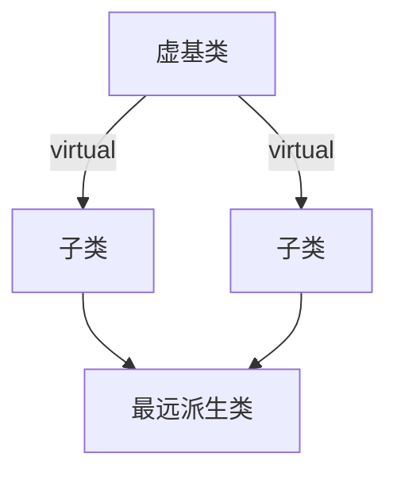
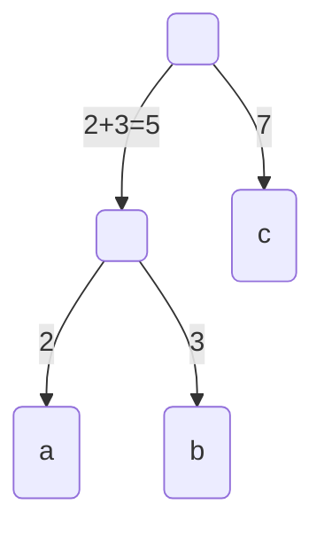

# 数据结构

!!! info "名不副实"

    本课名叫“数据结构与算法设计（C++描述）”，其实前半学期讲 C++，后半学期讲数据结构。

$$
\def\lb{\operatorname{lb}}
$$

!!! tip "记号"

    $\lb$ 是 binary logarithm，即以 $2$ 为底的对数，又写作 $\log_2$。

## 杂项／基础

> :material-clock-edit-outline: 2021年6月27日。

- 算法的特点：有穷、确定、可行，一般有输入、输出。
- 评价算法：正确、可读、健壮，效率（空间、时间）。
- 一个数据元素可以有很多数据项。
- 数据结构研究逻辑结构、存储结构、算法。

## C++

### 语法

> :material-clock-edit-outline: 2021年6月25日。

#### 动态存储

```c++
Foo *p = new Foo(/* args */);
delete p;
Foo *array = new Foo[12];
delete[] p;
```

#### 引用（`type &`）

> :material-clock-edit-outline: 2021年6月25日、2021年6月26日。

- 声明时必须初始化，且不可再指向其它对象。
- 类似常指针（`const int *` ≈ `int&`）。
- 可作函数的形参，避免调用拷贝构造函数。
- 可做函数的返回值（但不可返回内部变量的引用）。
- 不占存储。

#### `const`

> :material-clock-edit-outline: 2021年6月26日。

- 变量

  不能修改，声明时必须初始化。

  - `const int c = 1;`
  - `const int data[] = {/* ... */};`

- 函数的形参

  即使是形参，函数内也不能修改。

  - `void print(const int x);`
  - `Foo &operator+(const Foo &b);`

- 指针

  - 指向常量的指针

    `const int *p = &data; p++;`

  - 常指针

    `int *const p = &x; (*p)++;`

- 类的方法

  不修改对象的属性。

  - `bool is_empty() const;`

#### 杂项

- inline（又名内置、内联）函数
  - （对于旧标准、不智能的编译器）不支持循环、`switch`。
  - 声明时标记，定义时随意。
- 命名空间（namespace）
- 函数的重载
  - 默认参数：只能在结尾，只在声明时写。
  - 参数列表不同（类型、数量）、函数名相同的函数。
- `assert()`宏

### 面向对象

#### 基础

> :material-clock-edit-outline: 2021年6月25日、2021年6月26日。

```c++
class Foo : public Bar
{
private:
    /* data */
public:
    Foo(/* args */) {}
    ~Foo() {}
};

Foo::Foo(/* args */)
{
    /* ... */
}
```

- 成员、属性、方法

- 访问性质（访问属性）

  - `private`、`protected`、`public`。
  - `class`的成员访问属性、继承方式都默认为`private`，`struct`默认为`public`。

- 存储

  - 同一类的不同对象的属性占不同的存储空间，而方法共用同一函数代码段。
  - `this`指向方法调用时对应的对象。

- 构造

  - 与类同名，不写返回类型，不会被继承（但子类可调用父类的构造函数）。
  - 初始化列表。
  - “调用”：`Foo foo(/* args */);`。（名义上，这只是把参数传给构造函数——无法直接调用构造函数。）
  - 重载：默认（无参数，又名缺省）、拷贝。（这两个有缺省函数）
  - 若未提供任何构造函数，编译器会提供一个什么都不做的、没有参数的构造函数。

- 析构

  - 不可重载。
  - `delete`会自动调用析构函数。
  - 对象没用时自动调用。
  - 实际程序中，构造、析构总是成对反着出现，像栈、`new`与`delete`、左右括号等一样。

- 重载运算符

  - 不可重载`.`（成员访问）、`.*`（成员指针）、`::`（作用域）、`sizeof`、`?:`（if-else）。

  - 一般都可重载为成员函数或独立的函数。。

  - 编译时多态。

  - 规定用`Foo operator++(int)`表示后置自增，`Foo & operator++()`表示前置自增。

  - `=`（赋值）、`[]`、`()`、`->`只能重载为成员函数。（因为`this`）

    > `const char[]`与`std::string`的加法只能重载外独立函数。（反过来的加法则都可以）

#### 友元（`friend`）

> :material-clock-edit-outline: 2021年6月26日。

避免频繁调用接口，但破坏封装性。

不对称、不传递、不继承。

友元可以是独立函数、方法、类等。（声明对象后才能声明友元）

#### 继承或派生、子对象

> :material-clock-edit-outline: 2021年6月26日。

子类继承父类所有成员（不继承构造、析构函数），可同名覆盖父类成员、新增成员。

继承方式也有访问属性那三种，它表示从父类继承来的成员的访问属性的上限。（例：`protected`继承会把父类中的`public`成员改为`protected`，其余不变。）在子类内，永远无法访问父类的`private`成员，但可访问改来的`private`成员（例如`private`继承可访问父类的`protected`成员）。通过子类的对象，只可访问改来的`public`成员（和新增的`public`成员）。

---

调用顺序：

1. 构造父类。
   1. 构造子对象。
      1. 构造子类。
      2. 析构子类。
   2. 析构子对象。
2. 析构父类。

---

同名覆盖后也可通过作用域运算符（`::`）访问被覆盖的成员。

#### 虚基类

> :material-clock-edit-outline: 2021年6月26日。

C++允许多继承（一子多父）。各父的成员同名，而子无同名成员时，父类的这个成员只能通过`::`访问。

菱形继承时，第3层的类会有两份第1层类的成员，引起歧义。所谓“虚基类”其实指一种继承方式：`virtual public/protected/private`。`virtual`继承表示在各个子类的公共派生类（最远派生类）中，父类（虚基类）的成员共用。虚基类不能被多次初始化，所以最远派生类要负责初始化虚基类。



> 即使其中一条线全是`private`继承，也会和另一条线引起歧义。

#### 虚函数

> :material-clock-edit-outline: 2021年6月26日、2021年6月27日。

虚函数是运行时多态（运行时才能确定调用哪个函数）。

父类的指针可以指向子类。当使用这种指针调用方法时，对于普通方法，仍会调用父类的方法；而对于`virtual`方法，会调用子类的方法。引用也是。

不过，通过父类的指针、引用仍然不能调用子类新增的成员。

`virtual`性质在父类中标记，且自动继承。

父类、子类中该方法的原型完全一致，仅仅是实现不同。换句话说，子类方法会同名<u>覆盖</u>父类方法（而不是<u>重载</u>）。

> 同名覆盖要求函数名、参数、返回值都相同。

析构函数可标记为`virtual`，方便`delete`。构造函数当然不行。

纯虚函数：在原有虚函数声明后（`;`前面），直接写`= 0`。含纯虚函数的类称作抽象类，这种类不能直接实例化。

#### 模板

> :material-clock-edit-outline: 2021年6月26日、2021年6月27日。

类、函数的进一步抽象。

在类或函数前加`template <typename T>`。

匹配顺序：（若某步有多种选择，则报错）

1. 参数完全一致的函数。
2. 函数模板实例化得到的模板函数。
3. 类型转换后再匹配。

模板参数可以有默认参数。

类模板一般需要显式实例化。

## 数据结构

- 逻辑结构：线性表（一对一）、树（一对多）、图（多对多）、集合（无关系）。
- 存储结构：顺序、链式、索引（字典）、散列（Hash）。

### 线性表

#### 基础

> :material-clock-edit-outline: 2021年6月26日、2021年6月27日。

- 顺序存储：$\Delta\text{address} \propto \Delta\text{index} $。

- 链式存储：下一结点的数据是`node->next->data`。

  数据域、指针域。

  头指针→头结点→首个数据结点→……

  单向／循环（没有头结点；判空：`head->next == head`）／双向。

|                         顺序存储 |    特点    | 链式存储             |
| -------------------------------: | :--------: | :------------------- |
|             较高效，位置暗示关系 |    空间    | 较低效，单独存储关系 |
|                  $\mathcal O(1)$ |  随机存取  | $\mathcal O(n)$      |
|                  $\mathcal O(n)$ | 插入／删除 | $\mathcal O(1)$      |
| 需按**最大可能**分配**连续**空间 |  （其它）  |                      |

#### 栈与队列

> :material-clock-edit-outline: 2021年6月26日、2021年6月27日。

- 栈（stack）：进出在同一头（“栈顶”）。

  - 顺序存储

    属性：`_data[]`、`_height`或`_top`、`max_size`。

    上、下溢出。

    ```c++
    bool full() const
    {
        return _top == max_size - 1;
    }
    
    bool empty() const
    {
        return _top == -1;
    }
    
    void push(const int &x)
    {
        assert(!full());
        _top++;
        _data[_top] = x;
    }
    
    void pop()
    {
        assert(!empty());
        _top--;
    }
    
    int &top()
    {
        assert(!empty());
        return _data[_top];
    }
    ```

    双栈共享存储空间。

  - 链式存储

    头结点一般指向栈顶。

- 队列（stack）：进出分别在两端。

  - 顺序存储（循环）
  
    属性：`_data[]`、`_begin`、`_end`、`max_size`。
  
    假溢出。
  
    ```c++
    size_t shift(size_t p, int x = 0) const
    {
        while (x < 0)
            x += max_size + 1;
        return (p + x) % (max_size + 1);
    }
    
    bool full() const
    {
        return _begin == shift(_end, 1);
    }
    
    bool empty() const
    {
        return _begin == _end;
    }
    
    void Push(const int &x)
    {
        assert(!full());
        _end = shift(_end, 1);
        _data[_end] = x;
    }
    
    void Pop()
    {
        assert(!empty());
        _begin = shift(_begin, 1);
    }
    
    int &front()
    {
        assert(!empty());
        return _data[_begin];
    }
    
    int &back()
    {
        assert(!empty());
        return _data[shift(_end, -1)];
    }
    
    size_t len() const
    {
        return shift(_end - _begin);
    }
    ```
  
  - 链式存储
  
    属性：`_front`、`_back`。
  
    由于不可能像顺序存储一样指向队尾的“下一结点”，添加第一个结点或删除最后一个结点时，两个指针都要修改。
  
    ```c++
    bool empty() const
    {
        return _front == nullptr;
    }
    
    void Push(Data data)
    {
        if (empty()) {
            _front = _back = new Node<Data>(data);
        } else {
            _back->next = new Node<Data>(data);
            _back = _back->next;
        }
    }
    
    void Pop()
    {
        assert(!empty());
    
        auto delete_node = _front;
        _front = _front->next;
        delete delete_node;
    
        if (empty())
            _back = _front;
    }
    ```

### 树

> :material-clock-edit-outline: 2021年6月27日。

#### 二叉树

二叉树是有序二度树（以及空树、只有根的树、有序一度树）。

> 这里根结点按第$0$层算，高按最大层数算（空树高按$-1$算）。
>
> 记高为$H$，总结点数为$V$，总边数为$E$。记度为$d$的结点数为 $n_d$。

性质：

- 第$h$层最多 $2^h$ 个结点。

- $V \leq 2^{H+1} - 1$，满二叉树时取等。

- $V = n_0+n_1+n_2$，$E = 0n_0+n_1+2n_2$，而 $V-E = 1$，故 $n_0 = n_2 + 1$。

  > 一般树：$V=\sum_i n_i$，$E=\sum_i in_i$，$V-E=1$，故 $\sum_i (i-1)n_i = -1$，即 $\sum_{i\geq2} (i-1)n_i = n_0 - 1$。

完全二叉树的性质：

- $2^H \leq V \leq 2^{H+1}-1$，$H = \lceil \lb (V+1) \rceil - 1 = \lfloor \lb V \rfloor$（第二个等号要求二叉树非空，即 $H > -1$，即 $V > 0$）。

  > $x-1 < \lfloor x \rfloor \leq x < \lfloor x \rfloor + 1$，$\lceil x \rceil -1 < x \leq \lceil x \rceil < x+1$。

- 从$0$开始按层编号，则 $0 \leq i \leq V-1$，并且
  - $\#i$ 的子结点分别为 $\#(2i+1), \#(2i+2)$；
  - $\#i$ 的父结点为 $\# \left\lfloor \dfrac{i-1}2 \right\rfloor = \# \left( \left\lceil \dfrac i2 \right\rceil -1 \right)$，若$i$为奇数，即 $\#\dfrac{i-1}2$，否则即 $\# \left(\dfrac i2 - 1 \right)$；
  - 对于第$h$层的 $\#i$，满足 $2^h - 1 \leq i \leq 2^{h+1} - 2$，$h = \lfloor \lb(i+1) \rfloor = \lceil \lb(i+2) \rceil - 1$；
  - 第$h$层第$j$（$0\leq j \leq 2^h-1$）个结点是 $\# (2^h + j - 1)$。

---

存储：

- ==顺序==：补全成完全二叉树。
- 链式：又名二叉链表法，`Node* children[2]`。（三叉再加`Node* parent`）。

#### 一般树

存储：

- 顺序

  - “双”亲表示：`size_t parent`。

- 链式

  - 孩子多重链表表示：

    - 定长结点：`Node　*children[Max_Degree]`。
    - 不定长结点：`size_t degree`、`Node　**children`。

  - 孩子–兄弟／==二叉链表表示==：`Node *first_child`、`Node *next_sibling`。

    > 这实现了一般树与二叉树的相互转换。

- 混合

  - 孩子单链表表示：顺序存储所有结点，其每一元素再链式存储子结点。

> 后两类都可再加`Node* parent`或`size_t parent`。

#### 遍历

- 深度优先
  - 先序
  - 后序
- 广度优先
  - 层序
- 中序（仅限二叉树）

二叉树可由先序、中序遍历序列完全确定：先由先序遍历确定根，再在中序遍历中划分出两个子树，以此类推。

#### 例：最优树（Huffman 树）

最优：根到叶的带权路径长之和最小。

不带权路径长：路径的边数。

构造最优树的算法：

1. 以每个结点为根，构造若干树，权作为根结点的数据。
2. 每次选取根结点数据最小的两棵树，用新树替换它们。新树的两个子树是这两棵树，根结点数据为两子树根结点数据的和。
3. 循环操作直至只有一棵树。



这种树没有度为1的结点。

### 图

> :material-clock-edit-outline: 2021年6月27日。

- 连通分量：极大连通子图。
- 生成树：（包含所有顶点的）极小连通子图。

#### 存储

- 邻接矩阵

  `edge[i][j]`表示是否存在边或弧，或者该边或弧的权。

  行和是出度，列和是入度；无向图的是对称阵。

  适宜稠密图。

- 邻接表

  类似孩子单链表表示，顺序存储所有结点，其每一元素再链式存储相邻的结点。“相邻的结点”在无向图中指有公共边的结点；在有向图中指从该元素出发的弧的终点，也可规定为到该元素结束的弧的起点，不过那样就叫“逆邻接表”了。

#### 遍历

- 深度优先（递归）
- 广度优先（非递归）

都需要记录结点是否访问过，结果也都不唯一。

#### 最小生成树

最小：边的权之和最小。

- Prim 算法

  加结点。每次选择与某个已选结点相邻，且连接的边的权最小的结点。

  $\mathcal O(V^2)$，适宜稠密图。

- Kruskal 算法

  加边。每次选择不会产生回路，且权最小的边。

  $\mathcal O(E \log E)$，适宜稀疏图。

### 查找和排序

#### 静态查找

> :material-clock-edit-outline: 2021年6月27日。

查找表不允许有重复记录，主关键字唯一。

评估方法：平均查找长度（**a**verage **s**earch **l**ength）。

- 顺序查找

  $\mathcal O(n)$，无需排序，支持顺序、链式，支持重复记录。

- 折半查找（二分查找）

  `low`、`high`、`mid`。

  $\mathcal O(\log n)$，要求有序，只支持顺序存储。

- 索引查找。

  分块索引。

  若有$s$块且二分查找索引，则平均查找长度为 $\lb \left(1+\frac ns \right) + \frac s2$。要求分块有序，支持顺序、链式。

#### 动态查找（二叉排序树）

> :material-clock-edit-outline: 2021年6月27日。

左子树所有结点<根结点<右子树所有结点（不一定是完全二叉树），无重复结点。

- 查找

  找不到则插入。$\mathcal O(H)$。

- 删除
  - 被删结点存在空子树时，很简单。
  - 被删结点的左右子树均非空时，选左子树结点中最靠右的（它的右子树为空）替换被删结点即可。
  
- 平衡（没讲）

#### 散列表（Hash 表）

> :material-clock-edit-outline: 2021年6月27日。

- 散列函数

  常用除留余数法。

- 处理冲突

  - 开放定址法（常用）

    线性（或二次）探测再散列。

  - 再散列法

  - 链地址法

  - 公共溢出区

#### 排序

> :material-clock-edit-outline: 2021年6月27日。

- 插入

  将下一个插入到有序序列。

  - 直接：$\mathcal O(n^2)$。
  - 折半：由于需要移动，还是 $\mathcal O(n^2)$。
  - Shell（缩小增量）：不稳定。

- 交换

  - 冒泡：$\mathcal O(n^2)$。

  - ==快速排序==：$\mathcal O(n \log n)$，不稳定。

    `pivot`，`begin`、`end`，`left`、`right`。

- 选择

  选出最值，追加到有序序列。

  - 直接：$\mathcal O(n^2)$，不稳定。
  - ==堆排序==：$\mathcal O(n \log n)$，不稳定。
    - 建堆：从下向上逐渐调整，每次调整时都从上往下筛选。
    - 排序：取出最值（堆顶），用完全二叉树的最后一个替换它，筛选。

- 归并：$\mathcal O(n \log n)$。

# 注意

- <u>链式队列</u>添加第一个结点或删除最后一个结点时，<u>头、尾指针都要修改</u>。
- 有些队列、栈的实现中，单独存储了<u>长度</u>，每次添加、删除时也需要修改它。
- 顺序线性表中，没必要保持内存干净，删除结点只需逻辑上删除。
- 调用虚函数不一定是动态联编，比如用子类对象直接调用。
- 有向图的“连通”默认指强连通。
- 静态链表：存储在一片确定的连续存储空间（数组）里的链表。
- 对于无向图，邻接矩阵中非零元素总数等于边数的两倍。
- 数组的下标从零开始。
- 二叉树的某个结点即使只有一个子树，也要区分左右，因而不是树。

# 后备箱

- [教材目录](https://yd.51zhy.cn/ebook/web/newBook/queryNewBookById?id=19371277#2)。
- 没讲部分：
  - 图的最短路问题
  - 基数排序
