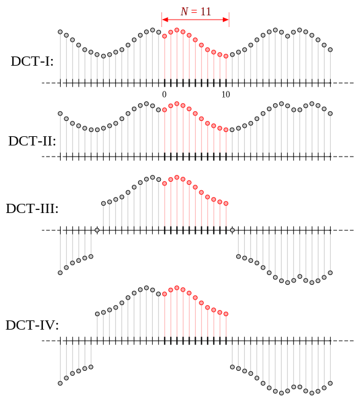
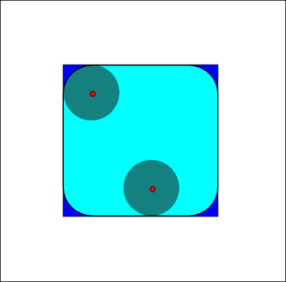

---
relevant:
  - ./digital-signal-processing.md
  - ./signals-and-systems.md
---

# 数字图像处理

$$
\DeclareMathOperator\sinc{sinc}
$$

## §1–§2 基础

### 成像方式

> :material-clock-edit-outline: 2023年6月13日。

- 电磁波

  |   波段    | 波长下限 |        特点        |                   应用                    |
  | :-------: | :------: | :----------------: | :---------------------------------------: |
  | 宇宙线、γ |    –     |   穿透，破坏生命   | 天文、PET（positron emission tomography） |
  |     X     | 0.01 nm  |      （同上）      |    CT（computed tomography）、血管造影    |
  |   紫外    |  10 nm   |     化学、荧光     |                细胞、印刷                 |
  |  可见光   |  380 nm  |    反射成像居多    |                  最广泛                   |
  |   红外    |  760 nm  |       热效应       |                   夜视                    |
  |   微波    |   1 mm   | 绕射强，穿冠、冰层 |                   遥感                    |
  |  无线电   |   1 m    |                    |     MRI（magnetic resonance imaging）     |

- 声波、超声波

- 物质波：电子

- 合成

### 视觉

> :material-clock-edit-outline: 2023年6月13日。

|  细胞   | 数量  | 功能  |
| :-----: | :---: | :---: |
| 锥 cone | 700万 |  色   |
| 杆 rod  |  亿   |  亮   |

“感觉亮度”并非与光强一一对应，还与背景照明（两种细胞）、周围光强（马赫带）、形状（心理）等有关。

## §3 空间域

### 点处理

> :material-clock-edit-outline: 2023年6月13日。

又名灰度变换。这些变换根据原灰度 ↦ 新灰度命名。

- **反转**

- **对数**

  扩展暗部，压缩亮部。

- **幂次**

  改变亮度或颜色比例。

  $γ > 1$ 压缩暗部，扩展亮部；$γ < 1$ 反之。

  CRT 天然 $γ > 1$，需补偿。

- **分段线性**

  拉伸对比度或灰度切分。

由此引出灰度直方图，可用于评估成像条件（动态范围）、增强图像（<u>直方图均衡化</u>）、分割图像、压缩图像（统计编码）。

### 空间滤波

> :material-clock-edit-outline: 2023年6月18日。

用空间子图像掩模增强图像，邻域处理。

- 平滑：加权均值（模糊扩散），统计排序（不会模糊图像）。
- 锐化：一阶微分（梯度模，斜坡），二阶微分（Laplacian，点、线）。

## §4 频率域

### 多维 DFT

> :material-clock-edit-outline: 2023年6月18日。
>
> :material-eye-arrow-right: [Discrete Fourier transform - Wikipedia](https://en.wikipedia.org/w/index.php?title=Discrete_Fourier_transform&oldid=1153873152#Multidimensional_DFT)。

$$
\begin{aligned}
  X_\vb*{k} &= \sum_{\vb*n} e^{-2 \pi j \times \vb*{k} \vdot \frac{\vb*n}{\vb*N}} x_\vb*{n}. \\
  x_\vb*{n} &= \frac{1}{\prod \vb*{N}} \sum_{\vb*n} e^{2 \pi j \times \vb*{k} \vdot \frac{\vb*n}{\vb*N}} x_\vb*{k}. \\
\end{aligned}
$$

(The division is element-wise.)

The multidimensional DFT expresses the input as a superposition of plane waves, or multidimensional sinusoids. It can be computed by the composition of a sequence of one-dimensional DFTs along each dimension. 

时域因变量共轭对应频域两次因变量共轭、自变量反转，两次共轭抵消了。

频谱因变量中，相位反映图像空间特征内容，幅度反映灰度；自变量中，直流对应平均，低频对应缓变，高频对应边缘和突变。关于方向性，请参考单缝衍射。

### 滤波

> :material-clock-edit-outline: 2023年6月18–19日。

基本步骤如下。

1. 时域补零，然后实现频域中心化。
2. 正变换。
3. 乘滤波器。
4. 反变换。
5. 时域取结果实部，恢复频域中心化，丢弃之前补零多的部分。

- 平滑：门（理想，振铃），Butterworth（仅高阶振铃明显），Gaussian。（对小物体、边界效果也有区别）
- 锐化：平滑滤波器的补，Laplacian（频谱数值数量级可能增大）。增强图像时高频提升（时域加常数）或高频加强（频域加常数），并结合直方图均衡化。

### 同态滤波

> :material-clock-edit-outline: 2023年6月19日，2023年6月20日。

采用 illumination–reflectance 模型，希望去除照度分量的影响，压缩动态范围，增强对比度。

时域取对数，改积为和，再抑制低频（照度分量变化慢，反射分量什么频率都有）。

## §5 复原与重建

> :material-clock-edit-outline: 2023年6月19日。

退化模型：线性位置不变算子、加性噪声。物理上是获取图像时光的波动性、成像器材散焦或缺陷、成像时运动、大气湍流等，和传输图像时的干扰。

- **空间滤波抑制噪声**

  - **均值**：算术、几何应对 Gaussian 或均匀噪声，几何均值不太模糊，但扩大黑物。反谐波 $g \mapsto \overline{g^{Q+1}} / \overline{g^Q}$ 应对 salt 或 pepper（不可兼）。

  - **顺序统计量**：中值（重复使用会模糊）、最大（扩散亮部）、最小（扩散暗部）应对脉冲噪声。最值中点应对 Gaussian 或均匀噪声，且毫不模糊。修正α综合，可应对多种噪声混合。

  - **自适应**：利用局部信息。
    - 均值：用局部方差与噪声方差的比例（大则信号，小则噪声），在原值与局部均值间定比分点。
    - 中值：判断中值是否为脉冲，若是，扩大窗重新计算。可处理更大概率的脉冲噪声。

- **频率滤波抑制周期噪声**

  - **带阻、带通**：旋转对称，$x \mapsto \abs{x} - \mu^2 / \abs{x}$，再代入低通或高通滤波器。

  - **陷波**（notch）：中心对称，$x \mapsto \abs{x-\mu} \times \abs{x+\mu}$。所谓“最佳陷波”先带通选出噪声，按一定比例减去，系数由邻域内最小二乘法。

- **抵消线性位置不变算子**

  **估计**退化函数：强行观察（后验方法，利用图中点、线），试验点扩散函数，建立模型（大气湍流、运动模糊、光学散焦）。

  !!! note "匀速运动模糊"

      设位移为 $2 \gamma (\alpha, \beta)$（$\alpha^2 + \beta^2 = 1$，$\gamma > 0$），则

      $$
      \eval{h}_{x,y} = \eval{\delta}_{\beta x - \alpha y} \eval{G_{2\gamma}}_{\alpha x + \beta y - \gamma}.
      $$

      于是

      $$
      \begin{split}
          \eval{H}_{u,v}
          &= \iint \eval{h}_{x,y} e^{-j (u x + v y)} \dd{x} \dd{y} \\
          &= 2\gamma \sinc(\gamma(\alpha u + \beta v)) \times e^{-j\gamma(\alpha u + \beta v)}.
      \end{split}
      $$

  **复原**图像：

  - **逆滤波**：信号弱的频率上，噪声影响不可控，还不如保持原貌或直接抑制。
  - 改进有**Wiener最小均方误差**、约束最小二乘等。

## §6 彩色

### 色彩模型

> :material-clock-edit-outline: 2023年6月19日。

面向硬件：

- RGB (red, green, blue) ——加色
- CMYK (cyan, magenta, yellow; black) ——减色

面向应用：

- HSI (hue, saturation, intensity) ——符合人的视觉，I可当作灰度图像处理
- Lab ——亮度、色彩更分离

### 伪彩色

> :material-clock-edit-outline: 2023年6月19日。

把灰度信号重映射为色彩，方便人理解。（人约40灰度，而数千色调、亮度）

- 灰度分层
- 向量的变换
- 真彩色重映射

## §8 压缩

### 冗余

> :material-clock-edit-outline: 2023年6月19日。

- 编码冗余——熵
- 空间、时间相关——条件熵
- 无关信息——心理视觉或噪声

### 具体编码

> :material-clock-edit-outline: 2023年6月19日。

- **Huffman**

  依单个符号的概率分配变长码，低概率的分长码。

- **算术**

  将累积联合概率表示为二进制小数。

  若无确定概率模型，也可依序列中频率动态估计。

- **变换**

  变换集中信号，像素解相关，适应心理视觉。编码步骤为分块、正变换、量化、熵编码，解码反之。

  DCT（discrete cosine transform）有多种，本课采用图中Ⅱ。

  <figure markdown='span'>
    
    <figcaption markdown='1'>DCT 可采用多种对称性｜[Wikimedia Commons](https://en.wikipedia.org/wiki/File:DCT-symmetries.svg)</figcaption>
  </figure>

  $$
  \eval{X}_k = \sum_n \eval{x}_n \cos(\frac{\pi}{N} \qty(n + \frac12) k).
  $$

  > :material-eye-arrow-right: [Discrete cosine transform - Wikipedia](https://en.wikipedia.org/wiki/Discrete_cosine_transform#DCT-II).

  Some authors (including this course) further multiply the $\eval{X}_{0}$ term by $\sqrt{1/N}$ and multiply the rest of the matrix by an overall scale factor of $\sqrt{2/N}$. This makes the DCT-II matrix orthogonal, but breaks the direct correspondence with a real-even DFT of half-shifted input.

## §9 形态学处理

> :material-clock-edit-outline: 2023年6月19日。
>
> :material-eye-arrow-right: [Mathematical morphology - Wikipedia](https://en.wikipedia.org/wiki/Mathematical_morphology).

形态学是 morphology。

The erosion of the binary image A by the structuring element B is defined by $A \ominus B \coloneqq \qty{z | B_z \subset A} = \bigcap_{b \in B} A_{-b}$. Dilation $A \oplus B \coloneqq \bigcup_{b \in B} A_b$. 单独 erosion, dilution 会系统性地缩小或放大图形。

<figure markdown='span'>
  
  <figcaption markdown='1'>The opening of the dark-blue square by a disk, resulting in the light-blue square with round corners | [Wikimedia Commons](https://en.wikipedia.org/wiki/File:Opening.png)</figcaption>
</figure>

Opening $A \circ B \coloneqq (A \ominus B) \oplus B$, closing $A \bullet B \coloneqq (A \oplus B)\ominus B$.

|       操作        |        作用        |
| :---------------: | :----------------: |
| erosion, opening  | 清除细物，断开窄桥 |
| dilution, closing | 填充孔洞，连接断口 |

若结构元光滑（如圆盘），则 opening, closing 也会让图形光滑，二者区别在于 opening 只对凸处有效，而 closing 只对凹处有效。（它们对偶）

## §10 分割

### 概念

> :material-clock-edit-outline: 2023年6月19日。

- 目的：基本预处理。挑出感兴趣的区域，供后续分析属性。
- 原理：灰度在区域内相似、连通，在边界处突变。
- 手段：平滑噪声后，检测边缘，连接边缘（通常用形态学手段），划分区域。

### 检测边缘

> :material-clock-edit-outline: 2023年6月19日。

- 一阶

  - Roberts 四点差分。
  - Prewitt 边界两排差分。
  - Sobel 边界两排加权差分，边界比 Prewitt 略清晰。

- 二阶

  会出双脉冲，可区分亮暗侧，但定界还要取零交叉点。

  Laplacian 各向同性（无法检测边缘方向）

  对噪声很敏感，必须前平滑或等价地采用 Laplacian of Gaussian（Marr–Hildreth），也可用 Difference of Gaussian 近似。

- Canny

  > :material-eye-arrow-right: [Canny edge detector - Wikipedia](https://en.wikipedia.org/wiki/Canny_edge_detector).

  实现全面检测、准确定位、最小响应。

  1. Gaussian 平滑。
  2. 检测梯度幅度、方向，其中方向可以分成几个扇区。
  3. Non-maximum suppression，在边缘法向上只保留梯度最强的点。（edge thinning technique）
  4. 用两个阈值挑出强、弱边缘点。强边缘点视作真正边缘，弱边缘点下面视情况而定。
  5. 按滞后阈值（hysteresis）跟踪边缘，将一些弱边缘点划入边缘。具体来说，与已知边缘相连的弱边缘点划入边缘，迭代至收敛。

### Hough 变换

> :material-clock-edit-outline: 2023年6月19日。

这是种整体处理，可用于连接边缘。抗噪声能力较强。

寻找参数空间的峰值。参数空间一点对应原空间集合，原空间一点也对应参数空间一集合。

### 阈值分割

> :material-clock-edit-outline: 2023年6月19日。

用于划分区域。

在直方图峰之间确定阈值。可利用各区域均值的算术平均迭代自动确定阈值。

# 后备箱

- 频谱可能中心化。
- 与频域对偶的叫空间域，不再叫时域了。
- 模板与图像相关时，边缘有多种处理方式。
