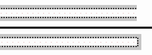

---
relevant:
  - ./physics-2.md
  - ./complex-functions-and-equations-of-mathematical-physics.md
---

# 电磁场与电磁波

$$
\def\N{\mathbb{N}}
\def\R{\mathbb{R}}
\def\C{\mathbb{C}}
$$

## §1 向量分析

> :material-clock-edit-outline: 2022年3月3日。

物理上采用的基是单位化后的自然基（除以了度量因子（scale factor））。

详情请参考《[A Practical Introduction to Differential Forms](https://www.cefns.nau.edu/~schulz/diff.pdf)》。（在[differential geometry - Short way to find the grad, curl and div in curvilinear coordinates? - Mathematics Stack Exchange](https://math.stackexchange.com/a/2930027/1031068)看到的）

## §4 恒定磁场

### 有限长直导线产生的磁场

> :material-clock-edit-outline: 2022年6月7日。

$$
\vb*{B}
= \frac{\mu_0 I}{4\pi r} \vb*{\varphi} \eval{\cos\theta}_\text{bottom}^\text{top}.
$$

可用 Biot–Savart–Laplace 定律积分，也可用 $\curl \vb*{H} = \vb*{J} + \pdv{t} \vb*{D}$ 和对称性求解。

## §5 静态场边值问题

### 镜像电荷相关的能量

> :material-clock-edit-outline: 2022年3月25日。

点电荷 $Q$ 与无限大导体表面相距 $d$，求能量 $E$。（势能零点取 $Q$ 在无穷远时的势能）

记 $E_0 = Q^2 / \qty(4\pi\varepsilon_0 \cross 2d)$。

#### 用功度量

沿旋转对称轴，将 $Q$ 自然移动到无穷远，此过程外力做的功是

$$
\int\limits_{d}^{+\infty} \frac{1}{4\pi\varepsilon_0} \frac{Q^2}{(2x)^2} \dd{x}
= \frac12 E_0.
$$

答案认为，还需再将镜像电荷移至无穷远，故总功为 $2 \times \frac12 E_0 = E_0$。因此

$$
E = -E_0.
$$

这种做法恐怕讲不通。既然把力写成 $1/(2x)^2$ 而非 $1/(x+d)^2$，就说明已经移动了镜像电荷，不该再乘 $2$；即便移动完 $Q$ 后再移动镜像电荷，那移动镜像电荷时哪~儿~有别的力，怎么需要做功？怎么算出来的 $E_0$？

#### 与镜像电荷的相互作用能

$$
E = \frac{1}{4\pi\varepsilon_0} \frac{Q (-Q)}{2d} = - E_0.
$$

这种做法需要打个问号。我们将感应电荷等效为镜像电荷，是在电场、电势意义上等效的（严格来说是它们于场区产生的电场、电势）。能量方面的结论究竟是否适用于镜像电荷，需要另外论证。

> 电路里面就有电流、电压等效，而功率、能量不等效的模型。

镜像电荷的选择很任意，而能量唯一，所以我怀疑并不适用。

例如，把 $Q$ 由点电荷换为气球（电荷在球面上均匀分布，总量仍为 $Q$）。这时镜像电荷当然可还选点电荷，但这里选成气球。现在，一边缓慢向远处移动球心，一边把气球吹大，保持气球距离导体表面最近的点不动。这样操作到最后，电荷也都移动到无穷远了。那么此过程中“镜像气球”怎么变化？至少有下面两种选择。

- 镜像气球同样一边移动，一边变大。
- 镜像气球大小不变，球心与原气球的球心关于导体表面对称。

这两种选择的能量变化不一样：前者互能、自能都没了；后者互能没了，自能还在。——构造不同的镜像电荷，可以算出不同的能量——这显然很荒谬。

#### 实际电荷的相互作用能

实际电荷有两处：导体表面的感应电荷、点电荷 $Q$。

前者是面分布，$\frac12 \iint \varphi \sigma\dd{S}$ 中的电势 $\varphi$ 用总电势即可。（无论 $\sigma$ 最后算出来是多少）注意导体延伸至无穷远，电势为零，因此 $\frac12 \iint \varphi \sigma \dd{S} = 0$。

后者是点分布，$\frac12 q\varphi$ 中的电势 $\varphi$ 应是其它电荷在此产生的电势。“其它电荷”就是“前者”，而感应电荷产生的电势等效为镜像电荷产生的电势，所以 $\varphi = \frac{1}{4\pi\varepsilon_0} (-Q)/(2d)$，$\frac12 q\varphi = -\frac12 E_0$。

二者相加，得

$$
E = -\frac12 E_0.
$$

#### 场能

前面都认为“电（势）能蕴含于电荷相互作用”，这里换种观点，认为“电（场）能蕴含于电场”。

题目中的场景记为 $A$。我们构造另一场景 $A'$：空间中没有导体，只有 $\pm Q$ 两电荷，并且它们相距 $2d$。

对比 $A$ 与 $A’$，发现半个空间中二者电场完全相同，另外半个空间中 $A$ 无电场，$A$ 有电场。因此 $A$ 的能量是 $A'$ 能量的一半。

再看 $A'$ 的能量。静电场中无法区分两种观点，$A'$ 的能量就是 $\frac{1}{4\pi\varepsilon_0} (-Q)Q / (2d) = -E_0$。

于是回到 $A$，

$$
E = -\frac12 E_0.
$$

> “点”电荷模型会导致发散的瑕积分，需替换为均匀带电球面模型。
>
> 不过不影响结论。只需注意势能零点并非指没有电场（炸碎带电球面），而是指两个带电球面相距很远（仍保留自能）。两种场景的势能零点也是 $1:2$，相减后还是 $E = -\frac12 E_0$。

## §7 时变电磁场

### 一些模型

> :material-clock-edit-outline: 2022年6月12日，2023年4月28日。

|                                                 | 理想媒质 |   一般导电媒质    |       理想导体       |
| ----------------------------------------------: | :---------------: | :---------------: | :------------------: |
|                                                 |     lossless      |       lossy       |      conducting      |
|                                                 |   $\sigma = 0$    | $\sigma \in \R^+$ | $\sigma \to +\infty$ |
|                                        **体内** | $\vb*{J} = \vb*0$ |                   | $\vb*{E} = \vb*{0}$  |
|                                  **体内时变场** |                   |       衰减，磁场为主       |全零|
|    **表面自由电荷面密度** $\rho_\text{surface}$ |        零         |                   |                      |
| **表面自由电流线密度** $\vb*{J}_\text{surface}$ |        零         |        零         |                      |

> - 理想媒质（理想导体）根本不能提供自由电荷。
> - $\sigma$ 是和 $\omega \varepsilon$ 比，相当于比传导电流和位移电流。
> - $\vb*{J_\text{surface}} = \sigma \vb*{E} \dd{h}$，一般这是有界无穷小，理想导体是 $0 \cdot \infty$ 型极限。

## §8 平面电磁波

### 判断手性

> :material-clock-edit-outline: 2022年4月11日。

#### 算法~儿~

已知 $\eval{\vb*{E}}_{\vb* r} = \vb*{E} \exp(-j\vb*{k} \vdot \vb*{r})$，其中 $\eval{\vb*{E}}_\vb*{r}: \R^3 \to \C^3$，$\vb*{E} \in \C^3$，$\vb*{k} \in \R^3$。

设

$$
\Delta = \det \begin{bmatrix}
    \Re{\vb*{E}} & \Im{\vb*{E}} & \vb*k
\end{bmatrix}.
$$

那么

- $\Delta > 0$：左旋；
- $\Delta = 0$：线极化；
- $\Delta < 0$：右旋。

#### 依据

$\Delta$ 只是算出了 $\vb*E,\ \partial_t\vb*{E},\ \vb*{k}$ 的（负）手性。（其中 $\vb*{E}$ 指 $\R^3 \to \C^3$，省略了。）

由 $\eval{\vb*{E}}_\vb*{r}$ 可知

$$
\begin{aligned}
\eval{\vb*{E}}_{\vb*{r}, t}
    &= \Re{ \eval{\vb*{E}}_\vb*{r} \exp(j\omega t) }. \\
\pdv{t} \eval{\vb*{E}}_{\vb*{r}, t}
    &= \Re{ j\omega \eval{\vb*{E}}_\vb*{r} \exp(j\omega t) }. \\
\end{aligned}
$$

取特殊时空坐标，则

$$
\begin{aligned}
\eval{\vb*{E}}_{\vb*{r}=\vb*{0},\ t=0}
    &= \Re{\vb*{E}}. \\
\pdv{t} \eval{\vb*{E}}_{\vb*{r}=\vb*{0},\ t=0}
    &= \Re{ j\omega \vb*{E} }
    = -\omega\ \Im{\vb*{E}}. \\
\end{aligned}
$$

（当然 $\omega > 0$）

### 反射、折射系数

> :material-clock-edit-outline: 2022年6月14日。

这些系数对应电场振幅。反射是 reflect，折射是 transmit（投射）。

> 列方程时都是垂直于入射面的那个量比较简单。

- 垂直极化（电场垂直于入射面）

  $K = \cos\theta / \eta$。

  $$
  \begin{array}{cccc}
  E_r & E_t & = & E_i \\
  \hline
  K_r & K_t & & K_i \\
  -1 & 1 &  & 1
  \end{array}
  $$

  $$
  \begin{aligned}
  R &= \frac{K_i - K_t}{K_i + K_t}. \\
  T &= \frac{K_r + K_i}{K_i + K_t}. \\
  \end{aligned}
  $$

  $T = R+1$，$K_i = K_r$。

- 平行极化

  $K = \eta\cos\theta$。

  $$
  \begin{array}{cccc}
  H_r & H_t & = & H_i \\
  \hline
  K_r & K_t & & K_i \\
  -1 & 1 &  & 1
  \end{array}
  $$

  $$
  \begin{aligned}
  R &= \frac{K_i - K_t}{K_i + K_t}. \\
  T &= \frac{\eta_2}{\eta_1} \frac{K_r + K_i}{K_i + K_t}. \\
  \end{aligned}
  $$

垂直入射时（传播方向垂直于反射面），习惯上按垂直极化算，

$$
\begin{aligned}
R &= \frac{\eta_2 - \eta_1}{\eta_2 + \eta_1}. \\
T &= \frac{2\eta_2}{\eta_2 + \eta_1}. \\
\end{aligned}
$$

> 光疏到光密时反射波有半波损失。

另外 $\eta = \sqrt{\mu / \varepsilon}$，$n = c/v = \sqrt{\mu_r \varepsilon_r}$。对于非磁性材料 $\mu_r \approx 1$，因此 $\eta \propto n^{-1}$。

## §9 导行电磁波

### 矩形波导管

> :material-clock-edit-outline: 2022年6月12日。

最终问题归并、解耦为

$$
\begin{aligned}
\qty(\grad^2 + {k_c}^2) \eval{E_{0z}}_{x,y} = 0. \\
\qty(\grad^2 + {k_c}^2) \eval{H_{0z}}_{x,y} = 0.
\end{aligned}
$$

其中 ${k_c}^2 = \gamma^2 + k^2$，$k^2 = \omega^2 \mu\varepsilon = \omega^2 / c^2$。

---

在矩形波导管边界条件下，一般管的方向为 $z$，$x,y$ 方向的宽度分别为 $a,b$，且习惯上 $a > b$。解系如下。

$$
\begin{array}{c|cc}
 & E_z = 0 & E_z \neq 0 \\
\hline
H_z = 0 & \text{TEM} & \text{TM / E} \\
H_z \neq 0 & \text{TE / M} & \text{（可分解）}
\end{array}
$$

> T for transversal, E for electric, M for magnetic.

$k_x a = m\pi,\ k_y b = n\pi$，其中 $m,n \in \N$，但 $\text{TE}_{00}$（$m=n=0$）、$\text{TM}_{00}$、$\text{TM}_{10}$、$\text{TM}_{01}$ 不是时变场。

$$
{k_x}^2 + {k_y}^2 = {k_c}^2 = \gamma^2 + k^2 = -{\beta_{mn}}^2 + \omega^2/c^2.
$$

> 带下标 $mn$ 的是波导中的量。

- **传输条件**

  $\beta_{mn} \in \R$（$\gamma = j \beta_{mn}$）。高频短波（粒子性强）易传播。

  临界时 $\beta_{mn} = 0$，此时 $\omega$ 的值是截止角频率

  $$
  \omega_{mn} = c \sqrt{{k_x}^2 + {k_y}^2}.
  $$

  也可用 $\omega_{mn}$ 表示 $\beta_{mn}$：

  $$
  \beta_{mn} = \frac1c \sqrt{ \omega^2 - {\omega_{mn}}^2 }
  = \frac{\omega}{c} \sqrt{1 - \qty(\frac{\omega_{mn}}{\omega})^2} .
  $$

  > $\omega > \omega_{mn} > 0$。

- **参数**

  - 相速度 $v_\text{phase} = \omega / \beta_{mn} > c$。
  - 导波波长 $\lambda_\text{guided} = v_\text{phase} / f > \lambda$。
  - 波阻抗 $Z_\text{TE} = -E_x / H_y = \omega\mu/\beta_{mn} > \eta$，$Z_\text{TM} = -E_x / H_y = \beta_{mn} / \qty(\omega \varepsilon) < \eta$。

### 传输线理论

> :material-clock-edit-outline: 2022年6月12日，2023年3月3日。

分布参数模型：$R_0,\, L_0,\, G_0,\, C_0$。

$$
\begin{cases}
\displaystyle
\pdv{z} u + R_0 i + L_0 \pdv{t}i = 0. \\
\displaystyle
\pdv{z} i + G_0 u + C_0 \pdv{t}u = 0. \\
\end{cases}
$$

> 注意 $u,i$ 不在同一方向上（$u$ 从传输线的一条到另一条，而 $i$ 沿着传输线），与低频电路中的单导线不同。

以下在复频域考虑。

记

$$
\begin{aligned}
{Z_c}^2
&= \frac{R_0 + j\omega L_0}{G_0 + j\omega C_0}
&\overset{\text{无耗}}{\to} \frac{L_0}{C_0}.
\\
\gamma^2
&= (R_0 + j\omega L_0) (G_0 + j\omega C_0)
&\overset{\text{无耗}}{\to} - \omega^2 L_0 C_0.
\end{aligned}
$$

> $$
> \underset{\text{传播}}\gamma = \underset{\text{衰减}}\alpha + j \underset{\text{相位}}\beta.
> $$
>
> Note: propagation, attenuation, phase.

则

$$
\begin{bmatrix}
  \pdv{z} & \gamma \\
  \gamma & \pdv{z} \\
\end{bmatrix}
\begin{bmatrix}
  u \\ Z_c i
\end{bmatrix}
= 0.
$$

$\pdv{z} \leftrightarrow \mp\gamma$ 时，系数矩阵行列式为零，相应解是 $u  = \pm Z_c i$。（特征线？）

也可独立出来，写成

$$
\begin{cases}
\displaystyle
\dv[2]{z} u = \gamma^2 u. \\
\displaystyle
\dv[2]{z} i = \gamma^2 i. \\
\end{cases}
$$

以负载（load）处为原点，向负载传播为 $+z$，则可分解 $U = U^+ + U^-$，$\boxed{U^\pm = U^\pm_\text{load} e^{\mp\gamma z}}$，相应 $Z_c I^\pm = \pm U^\pm$，$I = I^+ + I^-$。

一些特殊解：

- 已知负载 $U_l,\ I_l$（$U_l = Z_l I_l$）

  $\boxed{U = U_l \cosh(\gamma z) - I_l Z_c \sinh(\gamma z)}$，$Z_c I = Z_c I_l \cosh(\gamma z) - U_l \sinh(\gamma z)$。

  易将之转换为行波叠加的形式。

- 已知源端 $U_0,\ I_0$

  同上，只需把 $l$ 换为 $0$，把 $z$ 换成 $z+d$。

一些名词：

- 输入阻抗 $Z_\text{in} \coloneqq U/I$，可用 $Z_l,\ Z_c$ 表示。

- 反射系数 $\Gamma \coloneqq U^- / U^+ = \Gamma_l \exp(2\gamma z)$。

  $$
  \Gamma_l \coloneqq \frac{U^-_l}{U^+_l}
  = \frac{U_l - I_l Z_c}{U_l + I_l Z_c}
  = \frac{Z_l - Z_c}{Z_l + Z_c}.
  $$

  <figure markdown='span'>
  
  <figcaption markdown='1'>Smith圆图｜[Wikimedia Commons](https://commons.wikimedia.org/wiki/File:Smith_chart_explanation.svg)</figcaption>
  </figure>

- 工作状态：

  - 行波 $\Gamma_l = 0$，阻抗匹配。

  - 纯驻波 $\abs{\Gamma_l} = 1$，负载开路、短路或匹配纯电抗。

    <figure markdown='span'>
      
      <figcaption markdown='1'>两种全反射情况｜[Wikimedia Commons](https://commons.wikimedia.org/wiki/File:Transmission_line_pulse_reflections.gif) 箭头表示电场（电压），黑点表示电子（电流）。 上：终端开路；下：终端短路。</figcaption>
    </figure>

  - 混合。

    电压驻波比（voltage standing wave ratio）$\rho \coloneqq U_\text{max} / U_\text{min}$。可由 $U = U^+ + U^- = U^+ \qty(1 + \Gamma)$ 进一步表示为 $\qty(1+ \abs{\Gamma_l}) / \qty(1 - \abs{\Gamma_l})$。

# 后备箱

- 坐标单位向量不一定是常向量。
- 区分导体和电介质。
- “方向”对应单位向量。
- 区分瞬时向量和复向量。
- 注意导体有没有接地。
- 转换瞬时向量与复向量时，区分 $\sin$ 和 $\cos$。
