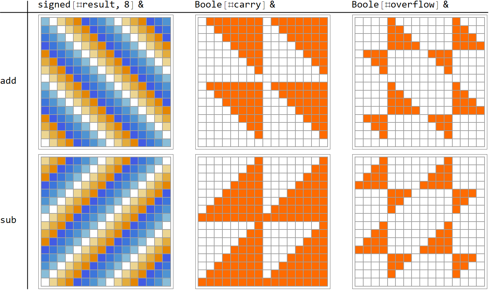

---
relevant:
  - ./digital-circuits-and-systems.md
  - ./operating-system.md
---

# 嵌入式系统原理与应用

!!! info "课程内容"

    本课基于 ARM v7 Cortex-A8。

    [网络教室](https://lexue.bit.edu.cn/course/view.php?id=12984)向所有同学开放——`justforfun`。

> :material-file-move-outline: [《嵌入式系统原理与应用》复习要点](https://mp.weixin.qq.com/s/wKfp-C6usm6yX7lrgeIZaQ)。

## §1 概述

### 嵌入式系统的处理器

> :material-clock-edit-outline: 2023年3月9日，2023年5月24日。

1. MCU: Micro controller unit.
2. DSP: Digital signal processor.
3. MPU: Micro processor unit.
4. SoC: System on a chip.

MCU 没有存储管理单元（memory management unit, MMU），一般无法安装 Linux；MPU 一般可以。

嵌入式处理器大量使用寄存器（为实时多任务），看重存储区保护，可扩展，小、低功耗、低成本。

### 层次

> :material-clock-edit-outline: 2023年5月24日。
>
> :material-eye-arrow-right: [2.1 TCP/IP 网络模型有哪几层？ | 小林coding](https://www.xiaolincoding.com/network/1_base/tcp_ip_model.html#%E5%BA%94%E7%94%A8%E5%B1%82)。

1. 物理和数据链路：Wi-Fi、Ethernet、MAC等。
2. 网络：IP。
3. 传输：TCP、UDP。
4. 应用：FTP、SSL、HTTP、WebSocket、MQTT等。

## §2 ARM 处理器体系结构

### 架构特点

> :material-clock-edit-outline: 2023年5月24日。

- RISC（reduced instruction set computer）
  - 指令个数少，绝大部分单周期执行。
  - 定长，易解码。（ARM 4 B，Thumb 2 B，Thumb-2 则为 2 B 或 4 B）

- Harvard 结构——指令和数据存储的总线分开（两套 control、data、address bus），可同时进出 CPU，采用流水线（fetch、decode、execute，若涉及内存还有 memory、write）。

  PC 指向流水线上当前 fetch 的指令。

- 寻址方式简单，hard-wiring，无微代码。

- 只有 load/store，无直接寄存器、存储器运算的指令。

- 寄存器多：至少 32 个，其中 16 个通用。

### 工作模式与寄存器组

> :material-clock-edit-outline: 2023年3月9日，2023年3月10日，2023年3月13日，2023年5月24日。

<u>工作模式</u>如下。

- `usr` (user)（其余都是内核模式）
- `sys` (system)（其余内核模式都是异常模式）
- `svc` (supervisor)
- 中断相关：
  - `irq` (interrupt request)
  - `fiq` (Fast IRQ)
- 其它异常相关：
  - `abt` (abort)
  - `und` (undefined)
  - `mon` (secure monitor)

!!! info "优先级"

     除了`usr`、`sys`，所有模式都可由异常进入。这些异常按优先级从高到低如下。（此处优先数与优先级负相关）

     1. `svc`（复位）
     2. `abt`（data abort，目标地址无法或禁止访问）
     3. `fiq`（传送数据）
     4. `irq`（外设）
     5. `abt`（所取指令保护而不允许，prefetch abort）
     6. `svc`（正常调用子程序，software interrupt，SWI）、`und`（undefined，译码时未定义或转给协处理器）

     这和异常返回地址（`sub pc, lr, ○○`）一致。

     1. 复位不用返回。
     2. data abort 返回到数据异常的指令，即 lr - 8。
     3. fiq、irq 返回到异常时正要执行的指令，即 lr - 4。
     4. prefetch abort 返回到预取失败的指令，即 lr - 4。
     5. SWI、undefined 返回到下一条指令，即 lr。

处理器有许多<u>通用寄存器</u>，但每种模式同时只用 16 个（R0–R15）。

- 前一半（R0–R7）所有模式通用。
- R8–R12 在 FIQ 专用，其余模式通用。
- R13 是 stack pointer（SP），用于函数调用、局部变量（堆栈指针）；R14 是 link register（LR），保存返回地址（断点地址）。这两个寄存器每种异常模式自己专用。
- R15 是 program counter（PC），记录程序当前运行的译码后的地址。

除了通用寄存器，还有<u>状态寄存器</u>，共用一个 current program status register（CPSR），6种异常模式各自专用 saved program status register（SPSR）。处理异常时，原来的 CPSR 会备份至 SPSR。

状态寄存器内容如下。

- 条件标志位（flag field）

  N（negative）、Z（zero）、C（carry）、V（overflow）。有许多指令会判断这些标志位。

- 控制位（control field）：

  - 中断屏蔽位 I（IRQ）、F（FIQ）可屏蔽所有来源的中断，处理异常时会用这两位实现优先级。
  - 状态控制位 T 表明处理器在 ARM 还是 Thumb 状态。（有多套指令集）Thumb 和 ThumbEE（已废弃）进一步靠 J 区分。
  - 模式控制位决定处理器的工作模式。虽只有 8 种模式，但用了 5 位。

- ……

### 存储数据

> :material-clock-edit-outline: 2023年3月9日。

“低地址⇔低位”则称作小端（little-endian）模式，否则称作大端。

为了方便寻址，存储时对齐数据。具体方式如下。（以`struct`为例）

!!! note "不一定要对齐"

    ARM 也支持不对齐，但那样地址必然增加位数，仍会牺牲效率。

1. 按声明顺序依次处理每项数据。
   1. 存储本项数据：`char` ↦ 1 B，`short` ↦ 2 B，……（按大／小端）
   2. 必要时空出一些位置，保证下一项数据对齐。（首地址是所占空间的整倍数）
2. 必要时空出一些位置，保证按数组存储时下一项也能对齐。（所占空间是最长数据的整倍数）

```rust
use std::mem;

#[repr(C)]
struct FieldStruct {
    first: u8,
    second: u16,
    third: u8
}

// The size of the first field is 1, so add 1 to the size. Size is 1.
// The alignment of the second field is 2, so add 1 to the size for padding. Size is 2.
// The size of the second field is 2, so add 2 to the size. Size is 4.
// The alignment of the third field is 1, so add 0 to the size for padding. Size is 4.
// The size of the third field is 1, so add 1 to the size. Size is 5.
// Finally, the alignment of the struct is 2 (because the largest alignment amongst its
// fields is 2), so add 1 to the size for padding. Size is 6.
assert_eq!(6, mem::size_of::<FieldStruct>());
```

!!! tip "🦀 Rust"

    数据对齐部分参考了 [Rust Doc](https://doc.rust-lang.org/std/mem/fn.size_of.html#size-of-reprc-items)。

### 存储体系

> :material-clock-edit-outline: 2023年5月24日。

按速度递减、容量递增、成本递减，有如下存储器。

1. 寄存器
2. cache
3. 主存（SDRAM）
4. 辅存（硬盘、flash）

高级嵌入式操作系统有 MMU，实现虚拟内存（请求页式）的地址映射。另外 MMU 还能实现保护、缓冲。

Cache 对编程透明，和 CPU 在同一芯片，维护先入先出写缓存，减少 CPU 访问主存的等待时间。

## §3 ARM 指令集

### Bit string & integer

> :material-clock-edit-outline: 2023年5月22日。
>
> :material-eye-arrow-right: [Bitstring manipulation - Operators and built-in functions | ARMv6-M Architecture Reference Manual](https://developer.arm.com/documentation/ddi0419/c/Appendices/Pseudocode-Definition/Operators-and-built-in-functions/Bitstring-manipulation?lang=en).
>
> :material-eye-arrow-right: [Arithmetic - Operators and built-in functions | ARMv6-M Architecture Reference Manual](https://developer.arm.com/documentation/ddi0419/c/Appendices/Pseudocode-Definition/Operators-and-built-in-functions/Arithmetic).
>
> :material-eye-arrow-right: [Integer arithmetic | ARMv6-M Architecture Reference Manual](https://developer.arm.com/documentation/ddi0419/c/Application-Level-Architecture/Application-Level-Programmers--Model/ARM-processor-data-types-and-arithmetic/Integer-arithmetic?lang=en#:~:text=Pseudocode%20details%20of%20addition%20and%20subtraction%20In%20pseudocode%2C,bitstrings%2C%20the%20bitstrings%20must%20be%20identical%20in%20length).

计算机用有限长 bit string 表示无符号或有符号整数，这是三个域。

| integer  |                  bit string                  |
| :------: | :------------------------------------------: |
| unsigned |                    二进制                    |
|  signed  | 在 $[0, 2^N)$ 内同余的唯一无符号整数的二进制 |

!!! note "bit string → integer"

    对于整数`x`，`x<i>`（bit）定义如下。

    > Let `y` be the unique integer in $[0, 2^{i+1}-1)$ that is congruent to `x` modulo $2^{i+1}$. Then `x<i>` is `'0'` if `y < 2^i` and `'1'` if `y >= 2^i`.

带进位的加法在结果上等价于如下伪代码，在实现上只是简单的加法器。

```rust
fn add_with_carry(x: bits[N], y: bits[N], carry_in: bit) -> (bits[N], bit, bit) {
    let unsigned_sum: integer = UInt(x) + UInt(y) + UInt(carry_in);
    let signed_sum: integer = SInt(x) + SInt(y) + UInt(carry_in);

    let result: bits[N] = unsigned_sum<N-1:0>;
    assert!(result == signed_sum<N-1:0>); // Always true

    let carry_out = if UInt(result) == unsigned_sum { '0' } else { '1' };
    let overflow = if SInt(result) == signed_sum { '0' } else { '1' };
    (result, carry_out, overflow)
}
```

<figure markdown='span'>
  
  <figcaption markdown='1'>加减法的结果</figcaption>
</figure>

`add_with_carry(x, Not(y), '1')`可以实现减法`x - y`（$-y \equiv 2^N - y = (2^N-1 - y) + 1 = \operatorname{Not}(y) + 1$），`add_with_carry(x, Not(y), '0')`则是借一位的减法。**此时 carry out 相当于 no borrow。**

下面举几个 N = 32 的例子。（为简洁，整数全都按有符号理解，留空则为零。）

|      “指令”[^instruction]      |   result    | carry | overflow |
| :----------------------------: | :---------: | :---: | :------: |
|             1 + 2              |      3      |       |          |
|            (-1) + 2            |      1      |   1   |          |
|            (-2) + 1            |     -1      |       |          |
|          (-2) + (-1)           |     -3      |   1   |          |
|            (-2) - 1            |     -3      |   1   |          |
|            2 + (-1)            |      1      |   1   |          |
|             2 - 1              |      1      |   1   |          |
|             1 + 0              |      1      |       |          |
|             1 - 0              |      1      |   1   |          |
|             0 + 1              |      1      |       |          |
|             0 - 1              |     -1      |       |          |
|             0 - 0              |      0      |   1   |          |
|             1 - 1              |      0      |   1   |          |
|          (-1) - (-1)           |      0      |   1   |          |
|         2147483647 + 1         | -2147483648 |       |    1     |
|    2147483647 + 2147483647     |     -2      |       |    1     |
| (-2147483648) + (-2147483648)  |      0      |   1   |    1     |
| (-2147483648) - (-2147483648)  |      0      |   1   |          |
|   (-2147483648) + 2147483647   |     -1      |       |          |
| (-2147483648) + 2147483647 + 1 |      0      |   1   |          |


[^instruction]: 真的指令要求至少有一个操作数是寄存器，不能都是直接数，太繁琐。而且存在不合法直接数，还要用`LDR □, =○`伪指令。

加减相关指令（含 CMP、CMN，它们只是不存结果的 SUBS、ADDS）对标志位 C、V 的影响都源于此。

### 指令

> :material-clock-edit-outline: 2023年3月13日，2023年5月23日。
>
> :material-eye-arrow-right: [ARM and Thumb instruction summary | ARM Compiler armasm User Guide](https://developer.arm.com/documentation/dui0473/m/arm-and-thumb-instructions/arm-and-thumb-instruction-summary).
>
> :material-eye-arrow-right: [VisUAL2 - A User-friendly Educational Assembler and Simulator for ARM UAL. | visual2.github.io](https://tomcl.github.io/visual2.github.io/).

- **跳转**（B, BL, BX, BLX）

  - B: Branch.
  - –L: …with link (set [R14 link register](#工作模式与寄存器组)).
  - –X: …change instruction set (ARM / Thumb).

- **处理数据**

  - **复制**

    - MOV: Move.

    - MVN: Move not.

  - **算术**（ADD, ADC; SUB, SBC, RSB, RSC）

    - ADD, AD–: Add.
    - SUB, SB–, –S–: Subtract.
    - R–: Reverse…
    - –C: …with carry (from flag field).

  - **位、逻辑**

    - AND: Logical and.
    - ORR: Logical or.
    - EOR: Exclusive or.
    - BIC: Bit clear. (and not)

  - **比较**

    这些指令只设置标志位，中间结果不存储到通用寄存器。

    - CMP: Compare. (SUB)
    - CMN: Compare negative (sum). (ADD)
    - TST: Test. (AND)
    - TEQ: Test equivalence. (EOR)

- **状态寄存器**

  - MRS: Move from PSR / system coprocessor to register.
  - MSR: Move from register to PSR / system coprocessor.

- **存储器**（LDR, LDM; STR, STM; SWP）

  ```mermaid
  flowchart LR
      Rn[Rn<br><small>address base</small>] -.-> memory
      Rt[Rt<br><small>target</small>]
      Rt -->|"STR Rt, [Rn]"| memory([memory])
      memory -->|"LDR Rt, [Rn]"| Rt
  ```

  - LDR, LD–: load register with word.

  - STR, ST–: Store register with word.

  - [–M](https://developer.arm.com/documentation/dui0473/m/arm-and-thumb-instructions/stm): …multiple registers.

    !!! note "顺序"

        `LDR Rt, [Rn]`，但是`LDM Rn, {Rt, …}`。

    - Address mode

      - I– / D–: Increase / decrease address…
      - –A / – B: …after / before each transfer.

      IA is the default.

      PUSH = STMDB, POP = LDMIA.

      [Alternatively](https://developer.arm.com/documentation/ddi0597/2022-12/Base-Instructions/STMDA--STMED--Store-Multiple-Decrement-After--Empty-Descending--),

      - F– / E–: Full / empty… (equivalent to LDM–A / LDM–B and STM–B / STM–A)
      - –A / –D: …ascending / descending stack. (equivalent to LDMD– / LDMI– and STMI– / STMD–)

      !!! info "Full / empty stack"

          In an empty stack, the stack pointer points to the next empty location on the stack. In a full stack, it points to the top-most item.

  - `!` is an optional suffix for the address register. If present, the final address is written back into base register.

    !!! info "[Addressing modes](https://developer.arm.com/documentation/den0042/a/Unified-Assembly-Language-Instructions/Memory-instructions/Addressing-modes)"

        | Instruction          | Addressing mode | Address | Write back               |
        | -------------------- | --------------- | ------- | ------------------------ |
        | `LDR R0, [R1]`       | Register        | R1      | ✗                        |
        | `LDR R0, [R1, #2]`   | Pre-indexed     | R1 + 2  | ✗                        |
        | `LDR R0, [R1, #2]!`  | Pre-indexed     | R1 + 2  | R1 ≔ R1 + 2              |
        | `LDR R0, [R1], #2`   | Post-indexed    | R1      | R1 ≔ R1 + 2              |
        | `LDMIA R1!, {R2-R7}` | Pre-indexed     | R1      | R1 ≔ R1 + 1 (many times) |

        Additionally, the offset (`#2` here) can also be `R2` or `R2, LSL #3` (R2 × 2³).

  - SWP: Swap between registers and memory. (deprecated in ARMv6 and above)

    ```assembly
    LDR <destination>, <source>, [<address>]
    ```

    ```mermaid
    flowchart LR
        source[Rt2<br><small>source</small>] --> memory([memory]) --> destination[Rt1<br><small>destination</small>]
        address[Rn<br><small>address base</small>] -.-> memory
    ```

    source ≠ address ≠ destination. (source can be the same register as destination.)

### 条件标志位

> :material-clock-edit-outline: 2023年5月22日。
>
> :material-eye-arrow-right: [Updates to the condition flags | ARM Compiler armasm User Guide Version 5.06](https://developer.arm.com/documentation/dui0473/m/condition-codes/updates-to-the-condition-flags).
>
> :material-eye-arrow-right: [Condition code suffixes and related flags | ARM Compiler armasm User Guide Version 5.06](https://developer.arm.com/documentation/dui0473/m/condition-codes/condition-code-suffixes-and-related-flags?lang=en).

Most instructions only update the condition flags if you append an S suffix to the mnemonic, except that CMP, CMN, TEQ, and TST always update the flags. These instructions can update all or a subset of the flags.

指令加后缀可让它只在某些条件下执行。

|        后缀        |                              意义                               |           条件            |
| :----------------: | :-------------------------------------------------------------: | :-----------------------: |
|      EQ / NE       |                          (not)? equal                           |         Z = (1,0)         |
|      MI / PL       |                  (negative, positive or zero)                   |         N = (1,0)         |
|      VS / VC       |                      overflow (set, clear)                      |         V = (1,0)         |
| CS / CC<br>HS / LO | carry (set, clear)<br>(higher or same, lower)<br>unsigned (≥,<) |         C = (1,0)         |
|      HI / LS       |            (Higher, lower or same)<br>unsigned (>,≤)            | C = (1,0) (∧,∨) Z = (0,1) |
|      GE / LT       |       (greater than or equal, less than)<br>signed (≥,<)        |         N (=,≠) V         |
|      GT / LE       |       (greater than, less than or equal)<br>signed (>,≤)        | N (=,≠) V (∧,∨) Z = (0,1) |

### 阅读汇编程序

> :material-clock-edit-outline: 2023年5月26–27日。

- 跳转可制造分支、循环，对程序结构很重要。
- 除了所有指令的序列，涉及某一寄存器的所有指令序列也对理解有帮助。
- 有些场景中，一组指令内的顺序并不重要。

分析复杂程序时，可将指令按时序、寄存器组织成表格。

## §4 微处理器与接口

### 如何看电路图

> :material-clock-edit-outline: 2023年4月3日，2023年5月21日。

|         关系          |                 例子                  |                                                 依据                                                 |
| :-------------------: | :-----------------------------------: | :--------------------------------------------------------------------------------------------------: |
|  物理设备 🡘 设备名称  |         LEFT 按键开关 🡘 `SW1`         |                      `开发板文档和例程/x210v3s硬件手册.pdf`<br>电路板上印的标号                      |
|  设备名称 🡘 芯片端口  |            `SW1` 🡘 `EINT2`            |                           `开发板文档和例程/原理图/Study210底板原理图.pdf`                           |
|     芯片端口别名      | `EINT2` = `EXT_INT[2]` = `GPH0CON[2]` |                         `芯片手册/三星S5PC110和5PV210/S5PV210_UM_REV1.1.pdf`                         |
| 芯片端口 🡘 寄存器地址 |       `GPH0CON` 🡘 `0xE020_0C00`       | `芯片手册/三星S5PC110和5PV210/S5PV210_UM_REV1.1.pdf`<br>厂商库`include/hardware/s5pv210/reg-timer.h` |
|  物理设备 🡘 芯片端口  |     LEFT 按键开关 🡘 `GPH0CON[2]`      |                                   厂商库`source/hardware/hw-key.c`                                   |

### 处理器组成

> :material-clock-edit-outline: 2023年5月21日。

系统包括CPU核心、系统外设（RTC、定时器、ADC等）、多媒体（摄像头接口、图形编解码器等）、电源管理（睡眠等低功耗模式控制）、存储器接口、连接模块（音频、存储、通用接口，如 USB）。CPU 与设备之间通过多层次总线通信。

### 时钟系统

> :material-clock-edit-outline: 2023年5月21日。

晶振产生最初信号，锁相环（phase-locked loop，PLL）倍频再一步步分频，得各频率时钟源。

可用循环抢占地延时，如下，使用时还要将循环次数与时间换算（`loops_per_jiffy`）。

```c
void __attribute__ ((noinline)) delay(volatile u32_t loop) {
    while (loop > 0) {
        loop--;
    }
}
```

- `noinline`是 GNU 的语法，禁用`inline`函数优化，避免`delay`的时间与预想的不一致。（`inline`可能比不优化快）
- `volatile`标明`loop`可能在外部被修改。若不标，`while`循环因为字面上是无用逻辑，优化时会被删掉。多次设置寄存器也有这个问题，例如`*x = 3; *x = 5`不该被优化为`*x = 5`。

基于时钟，可实现 PMW（pulse width modulation）定时器，原理如下。输出信号边沿有中断服务程序，这段程序可以编程更改定时器设置。

1. 系统时钟分频，得到所需信号频率。寄存器中的 prescaler 几位设置预分频器，diverder MUX 几位设置时钟分频。
2. 定时器维护 counter 计数器，与 compare 比较，大小关系决定输出高低电平。counter 初值、compare 由寄存器设定，调节 compare 可调整脉冲宽度。（counter 可以循环计数，也能只计一次，都能设置）

!!! note "另一种理解"

    counter 生成锯齿波，门限 compare 出矩形波。

### GPIO

> :material-clock-edit-outline: 2023年5月21–22日。

GPIO（general-purpose input/output）是芯片引脚的接口。每个 GPIO 使用多个寄存器；在芯片手册上，多个 GPIO 可能会被记在同一寄存器，只是所用的位不同。

- CON（control）设置输入输出方向（一般 0x0000 表输入，0x0001 表输出）。若引脚复用，还可选择功能。
- DAT（data）存或写数据。
- PUD（pull-up/down）设置是否上拉或下拉，高阻态时会决定电平。
- ……

### UART

> :material-clock-edit-outline: 2023年5月22日。

数据有下面两种传输方式。

- 串行：在一根线上每次传一位，慢。

  若收发双方时钟不同步，则称为异步串行通信（UART）。

- 并行：在多根线上同时传输多位。如数据、地址总线。

UART 的帧结构包括起始位（固定一位零）、数据位、奇偶校验位、停止位（固定一，位数需具体约定）。

UART 可以使用 RS-232C 接口传输。这种接口包括 RXD（receive）、TXD（transmit）、SGND（ground），有的还有 VCC 甚至更多引脚。

### 中断处理

> :material-clock-edit-outline: 2023年5月22日，2023年5月23日，2023年5月24日。

设备发起中断，中断控制器收集，CPU 响应。

1. 保存现场，进入相应工作模式。
   - 保存现场：保存原有寄存器（fiq有自己的寄存器，可不保存），原有 CPSR 存入 SPSR，将原本下一条指令的地址存入 lr（BL 的“L”）。
   - 进入响应工作模式：设定 CPSR_c，例如屏蔽其它中断。
2. 跳转到中断向量，寻找中断入口，执行中断程序。
3. （复位异常除外）恢复现场（寄存器、CPSR），清除工作模式，返回（[用 lr 设定 pc](#工作模式与寄存器组)）。

!!! note "同步"

    在 ARM 处理器中，除了复位，异常都是同步的——处理器线执行完当前指令，再处理异常。

```assembly title="key-interrupt/source/startup/start.S"
    .global irq
irq:
    // get irq's sp (stack pointer)
    ldr sp, _stack_irq_end

    // 1. 保存用户寄存器
    // 1.0 在堆栈中开辟空间
    // 要保存了中断之前的现场，计划完成后内存如下。（低地址在前）
    //   r0_old - lr_old ← r0 == sp == sp_old - #72
    //   lr, spsr, r0    ← r8 == sp_old - #60
    // 一共 (15 + 3) × 4 B = 72 B，所以减了 72。
    sub sp, sp, #72

    // 1.1a 保存 r0 - r12——各模式（除了 FIQ）通用
    stmia sp, {r0 - r12}
    add r8, sp, #60  // 60 = 72 - (13 + 2) × 4
    // 1.1b 保存 sp, lr——每种异常模式专用，要用“^”标记存的是用户模式的
    // 若不存 sp, lr，无法处理嵌套的中断
    stmdb r8, {sp, lr}^
    // 1.2 保存 calling pc
    str lr, [r8, #0]
    // 1.3 保存 saved program status register
    mrs r6, spsr
    str r6, [r8, #4]
    // 1.4 save r0_old, and replace it with sp（没用？）
    str r0, [r8, #8]
    mov r0, sp

    // 2. 调用中断服务程序
    // 跳转前将下一条指令的地址存到 lr，完成后返回
    bl  do_irqs
    // do_irqs 定义在 key-interrupt/source/hardware/s5pv210-irq.c 中

    // 3. 恢复用户寄存器
    // 3.1 恢复 r0 - lr
    ldmia sp, {r0 - lr}^
    // 歇会儿？
    mov r0, r0
    // 3.2 恢复 calling pc
    ldr lr, [sp, #60]
    // 3.3 释放堆栈
    add sp, sp, #72

    // 4. 继续执行原来程序
    // ARM 流水线并行 fetch, decode, execute 三步
    // lr 之前存的是 execute 时取到的地址，即下下条指令，再减一个指令的长度才是下面要运行的指令
    subs pc, lr, #4
```

```c title="key-interrupt/source/hardware/s5pv210-irq.c"

void do_irqs(struct pt_regs_t * regs)
{
    // Read vector interrupt controller's irq status.
    u32_t vic0 = readl(S5PV210_VIC0_IRQSTATUS);
    … // 还有 vic1 – vic3

    if(vic0 != 0) {
        // 1. 根据 vic 获得中断处理函数
        u32_t offset = irq_offset(vic0);

        // 2. 处理中断
        (s5pv210_irq_handler[offset].func)(s5pv210_irq_handler[offset].data);

        // 3. 标记已完成
        /* clear software interrupt */
        writel(S5PV210_VIC0_SOFTINTCLEAR, 0x1<<offset);
        /* set vic address to zero */
        writel(S5PV210_VIC0_ADDRESS, 0x00000000);
    }
    else {
        … // 检查 vic1 – vic3，同理应对

        // 若全都没有，clear all software interrupts，set all vic address to zero
        writel(S5PV210_VIC0_SOFTINTCLEAR, 0xffffffff);
        writel(S5PV210_VIC0_ADDRESS, 0x00000000);
        … // 还有 vic1 – vic3
    }
}
```

处理中断与调用函数不同。

- 处理中断的时机随机。
- 中断服务程序和主程序平行，中断服务程序无参数、不返回。
- 处理中断后可能引发进程调度。
- 响应中断涉及硬件电路。

## §5–§6 Linux

### 组件

> :material-clock-edit-outline: 2023年5月23日。

Linux 内核管理整个系统的进程、进程间通信（POSIX）、内存、文件和设备（特别是虚拟文件系统 virtual file system，VFS）、网络。

- **进程管理**

  - 内核的基本架构

    ```mermaid
    flowchart
      subgraph service[OS services]
        api[API]
      end

      subgraph process[process scheduler]
        sci["system call interface"]
        --> all[architecture independent scheduler]
        ---> arch[architecture specific scheduler]

        all --- policy[scheduling policy]
      end

      subgraph hardware
        cpu[CPU]
      end

      api ---> sci
      arch ---> cpu

      all --- other[inter-process communication<br>network<br>memory management<br>file system]
    ```

  - `task_struct`

    - process ID
    - 状态
    - 优先级
    - program counter
    - 内存指针
    - 上下文寄存器数据
    - I/O 信息
    - 记账（时间等）

  - 状态及切换

    ```mermaid
    flowchart LR
      创建
      -->|fork| ready["Running<br>准备好但未执行"]
      -->|schedule| running["Running<br>执行"]
      -->|exit| 终止

      running
      -->|sleep on| waiting["Interruptible / uninterruptible<br>等待"]
      -->|wake up| ready

      running -->|"被抢占"| ready
    ```

    - 创建：用户模调用`fork()`（copy on write）、`clone()`（精确控制与父进程共享的资源）等API，软中断进入内核，再调用相应系统服务。
    - 执行：`exec`函数族有`(list|vector)(env_var|path)?`。用某个可执行文件的数据段、代码段和堆栈段覆盖当前进程。（PID 不变）
    - 终止：释放资源（不再排队，恢复引用计数），告知父进程（zombie）。终止有正常结束、信号、`exit()`三种方法。

  - 各种 task

    - 进程：分配资源最小单位。
    - 线程：独立运行基本单位。独享栈、寄存器、PC、状态字，其余资源共享。
    - 内核中的 task：既可称线程也可称进程。永远在内核模，无法调用用户空间的函数。只能使用地址空间高于 3 GiB 的部分。

  - 进程调度

    分时、动态优先级。

- **进程间通信**

  在内核中开辟缓冲区，交换两个进程的用户区数据。

  有以下几种通信方式。

  - 管道：最基本。无名管道仅限父子进程。
  - 共享内存：及时，同步难（互斥锁或信号量）。
  - 消息传递：信息量可任意大。

  再具体一些其实如下。

  - 信号（signal）：如`SIGABRT`。软件模拟的中断。处理异步事件。
  - 信号量（semaphore）。
  - 套接字（socket）：用于网络。

- **内存管理**

  分配、回收，转换地址，扩充，共享、保护。

  请求页式虚拟存储。

  在用户模，物理地址、虚拟地址并不相同，动态映射。另外，虚拟地址除了可映射到物理内存，还可映射到 I/O 设备，如寄存器、小块存储器。

  进程在内存中从低地址起有如下内容。

  1. 代码段`.text`——代码，一般只读。常数字面量也可能在此。
  2. 数据段`.data`——初始化的全局变量。`static`变量也在此。
  3. `.bss`（block started by symbol）——未初始化的全局变量。在可执行文件中，BSS 只存占位符，几乎不占空间；运行时再由操作系统初始化。
  4. 堆 heap——动态分配的内存（`malloc()`、`free()`）。
  5. 栈 stack——临时（如函数中）创建的局部变量。
  6. 参数、环境变量等。
  7. 内核空间（3 GiB 以上）。

  内存映射`mmap()`将一片内存（`start` + `length`）映射到文件或设备（`open()`得到的`fd` + `offset`）上，可指定读写权限（如`PROT_READ`）和共享策略（如`MAP_SHARED`）。

  分页机制将物理内存看成一系列存储块。虚拟地址空间称作页（page），物理地址空间称作页框（frame）。

- **设备**

  字符设备、块设备、网络设备。

### 内核模块

> :material-clock-edit-outline: 2023年5月23日。
>
> :material-eye-arrow-right: [c - Linux Kernel Module Development "module: x86/modules: Skipping invalid relocation target, existing value is nonzero for type 1" - Stack Overflow](https://stackoverflow.com/questions/71746914/).

```c title="hello.c"
#include <linux/init.h>
#include <linux/kernel.h>
#include <linux/module.h>

static int __init hello_init(void)
{
    printk(KERN_ALERT "Hello, world!\n");
    return 0;
}

static void __exit hello_exit(void)
{
    printk(KERN_ALERT "Goodbye, cruel world!\n");
}

// 用宏标记
module_init(hello_init);
module_exit(hello_exit);

MODULE_LICENSE("GPL");
```

```makefile title="Makefile"
obj-m   += hello.o
KDIR    := /lib/modules/$(shell uname -r)/build
PWD := $(shell pwd)

all:
    $(MAKE) -C $(KDIR) M=$(PWD) modules

clean:
    @rm -rf *.o *.ko *.mod *.mod.* *.symvers *.order
```

```shell
$ sudo make
$ sudo insmod hello
```

# 后备箱

- 十六进制最大数码是 F（15）。
- 用波特率计算 UART 传输时间时，应当考虑所有位，包括起始位。
- UART 的数据位有限，需约定几位有效。超出部分无意义，不用传输。
