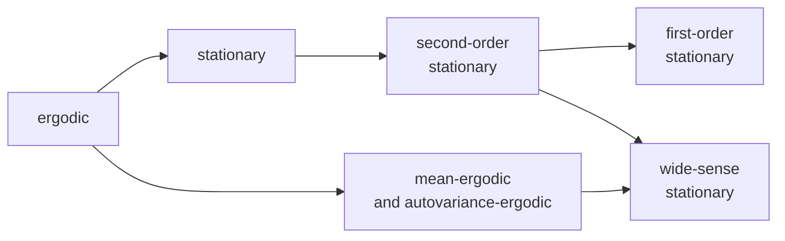

---
relevant:
  - ./probability-and-statistics.md
  - ./linear-algebra.md
---

# 信息论与编码

> :material-eye-arrow-right: [国防科技大学-信息论与编码基础（国家级精品课）](https://www.bilibili.com/video/BV1pJ411U7G8)

$$
\DeclareMathOperator\expect{\mathbb{E}}
\newcommand\cond[2]{\left(#1\middle|#2\right)}
\newcommand\SI[2]{#1\ \mathrm{#2}}  % siunitx (package)
\def\tran{\mathsf T}
\def\R{\mathbb{R}}
$$

## §1 绪论

> :material-clock-edit-outline: 2022年8月27日。

- 1930年以前：提高信道利用率。
  - 1917年 G.A. Campbell 滤波器——频分复用。
  - 1924年 H. Nyquist 采样定理——时分复用。
- 1930s–1940s：抗干扰、噪声。
  - 1930 N. Wiener 随机信号的 Fourier 分析。
  - 1948年 N. Wiener《控制论》，C.E. Shannon 信息论。
- 1950起：编码。
  - 1952年 Huffman 信源编码。
  - 1950s Hamming 信道编码。
  - 1993年 Turbo 码，1995 LDPC 码。（信道编码）
  - 1959年 Shannon 限失真信源编码。
  - 1949年 Shannon 保密编码。
  - 1997年 AES 保密编码。
- 近代：网络信息论、MIMO、协同统信、物理层安全、……

## §2 离散信源

- 信息测度。
- 信源编码。

<figure markdown='span'>
{: style="zoom:67%;" }
<figcaption>互信息熵 | <a href='https://commons.wikimedia.org/wiki/File:Entropy-mutual-information-relative-entropy-relation-diagram.svg'>Wikimedia Commons</a></figcaption>
</figure>

> 上图中 $I(X;Y)$ 是 mutual information，$I(x;y)$ 是 pointwise mutual information。（pointwise 和 mutual 同时出现真是绝了……）

### 几个命题

> :material-clock-edit-outline: 2022年8月27日，2022年9月1日，2022年11月9日。

#### 离散最大熵定理

> $n$ 是样本点的数量。

$\sum p = 1$，$\forall p, p>0$，$I_p = -\log p$，则

$$
\begin{split}
\log n - H
&= \sum p I_{1/n} - \sum p I_p \\
&= \sum p \qty(I_{1/n} - I_p) \\
&= \sum p I_{\frac{1}{np}} \\
&\geq I_{\sum p \frac{1}{np}} \quad @ p \equiv \frac{1}{n} \\
&= I_1 = 0.
\end{split}
$$

> 其中“$\geq$”利用了 $I$ 上凸。Jensen 不等式用完后要把变量消掉，所以不是考虑 $\sum p I_{np}$。
>
> 另法：$I \geq \qty(p-1) \log e$，故 $\sum p I_{\frac{1}{np}} = \sum p \qty(\frac{1}{np} - 1) \log e = 0$。

故 $H \leq \log n$。

另外，Lagrange 乘数法更易下手。

---

另：$\log$ 下凸，故

$$
H = \expect[\log(1/p)] \leq \log \expect[1/p] = \log n.
$$

#### 熵的独立界

> :material-eye-arrow-right: Thomas M. Cover; Joy A. Thomas (1991). *Elements of Information Theory*. Hoboken, New Jersey: Wiley. ISBN [978-0-471-24195-9](https://en.wikipedia.org/wiki/Special:BookSources/978-0-471-24195-9). Page 19 or so. ([Elements of Information Theory - Thomas M. Cover, Joy A. Thomas - Google 图书](https://books.google.com.hk/books?id=j0DBDwAAQBAJ&printsec=frontcover&hl=zh-CN#v=onepage&q&f=false))

Conditioning reduces entropy.

> $$
> H_{X|Y}
> \coloneqq \expect I_{X|Y} = \sum_{x,y} \Pr(xy)\ I_{\Pr(x|y)}.
> $$
>
> 注意不是 $\Pr(x|y)\ I_{\Pr(x|y)}$。
>
> 另外区分 $H_{X|Y}$ 与 $H_{X|y}$。

$$
\begin{split}
& H_X \geq H_{X|Y}. \\
&\iff H_X + H_Y \geq H_{XY}. \\
&\iff I_{X;Y} \geq 0.
\end{split}
$$

> 第二行体现“独立界”：
> 
> $$
> H_{X_1, \ldots,X_n} \leq \sum_i H_{X_i}.
> $$

证明如下。$I_{X;Y} = D(\Pr_{XY} \parallel \Pr_X \Pr_Y)$，其中 $D(p \parallel q)$ 是分布列 $p,q$ 之间的 relative entropy 或 Kullback–Leibler divergence。

$$
\begin{split}
D(p \parallel q)
&\coloneqq \expect_p \log\frac{p}{q} \\
&= \expect_p I_{q/p} \\
&\geq I_{\expect_p q/p} \geq I_1 = 0.
\end{split}
$$

> $0 \log(0/0) = 0$，$0 \log(0/q) = 0$，$p \log(p/0) = +\infty$。

> $\expect_p$ 应只在 $p>0$ 部分求和，而 $p=0$ 部分对应的 $q$ 可能不是 $0$，因此第二个“$\geq$”不能改成“$=$”。

> 该非负性可改写成下面的不等式。
> 
> $$
> 0 \geq \expect_p\log p \geq \expect_p \log q.
> $$
> 
> 反过来说，$\log$ 与分布一致时更大。或者说，错误估计 $\log$，则倾向于高估熵。

$\implies$ 平稳序列的条件熵（不严格地）递减。

### Venn 图的奇异处

> :material-clock-edit-outline: 2022年9月30日。

$I(X;Y |Z)$ is not always less than $I(X;Y)$ — The *area* of $X \cap Y \cap Z$ can be negative.

[Chapter 2: Entropy and Mutual Information (cs.uic.edu)](https://www.cs.uic.edu/pub/ECE534/WebHome/ch2.pdf), page 28; Mackay’s textbook:

> (The Venn diagram) correctly shows relationship such as
> 
> $$
> H(X) + H(Z|X) + H(Y|X,Z) = H(X,Y,Z).
> $$
> 
> But it gives the misleading impression that the conditional mutual information $I(X;Y|Z)$ is *less than* the mutual information $I(X;Y)$. If fact the area (that represents $X \cap Y \cap Z$) can correspond to a *negative* quantity. Consider the joint ensemble $(X,Y,Z)$ in which $x,y\in \qty{0,1}$ are independent binary variables and $z\in\qty{0,1}$ is defined to be $z = x+y \pmod 2$. Then clearly $H(X) + H(Y) = \SI{1}{bit}$. Also $H(Z) = \SI{1}{bit}$. And $H(Y|X) = H(Y) = 1$ since the two variables are independent. So the mutual information between $X$ and $Y$ is zero. $I(X;Y) = 0$. However, if $z$ is observed, $X$ and $Y$ become dependent — knowing $x$, given $z$, telss you what $y$ is: $y = z-x \pmod 2$. So $I(X;Y|Z) = \SI{1}{bit}$. Thus the area labelled $A$ must correspond to $\SI{-1}{bit}$ for the figure to give the correct answers.
>
> The above example is not at all a capricious or exceptional illustration. The binary symmetric channel with input $X$, noise $Y$, and output $Z$ is a situation in which $I(X;Y) = 0$ (input and noise are independent) but $I(X;Y|Z) > 0$ (once you see the output, the unknown input and the unknown noise are intimately related!).
>
> The Venn diagram representation is therefore valid only if one is aware that positive areas may represent negative quantities. With this proviso kept in mind, the interpretation of entropies in terms of sets can be helpful (Yeung, 1991).

## §3 信道容量

### Binary Erasure Channel

> :material-clock-edit-outline: 2022年9月24日。

转移概率 $P$ 为

$$
\begin{bmatrix}
1-q & q & 0 \\
0 & q & 1-q \\
\end{bmatrix}.
$$

设 $X \sim (\omega, \bar\omega)$。于是，

$$
H\cond{Y}{X} = \expect_x H\cond{Y}{x} \equiv \expect_x H(q, \bar q) = H(q, \bar q).
$$

$$
H(Y) = H(q, \bar q) + \bar q H(\omega, \bar\omega).
$$

故

$$
I(X;Y) = H(Y) - H(Y|X) = \bar q H(\omega, \bar\omega).
$$

$$
C = \max_\omega I(X;Y) = \bar q \log 2.
$$

另外，这是输入对称（准对称）信道——置换输入总可等价于某种输出置换（充分不必要），但不是输出对称信道。换句话说，每个输入对应的输出分布在置换意义下等价，而每个输出对应的输入分布不一定等价。当然它也不是强对称信道（均匀信道）。——$H(Y|x) \equiv \expect_x H(Y|x) = H(Y|X)$ 是输入对称信道的通性。

### 对称信道

> :material-clock-edit-outline: 2022年9月24日，2022年11月9日。

信道转移矩阵描述 $P(Y|X)$，故求信道容量常从 $I(X;Y) = H(Y) - H(Y|X)$ 入手。

“输入等概率则输出等概率”是对称信道的通性。因此 $C = \max H(Y) - H(Y|x) = \log\abs{Y} - H(Y|x)$。（其中 $x$ 任意）取等的充分条件是输入均匀分布。

### 匹配条件

> :material-clock-edit-outline: 2022年11月9日。

由 Lagrange 乘数法，信源匹配信道时，各个（概率非零的）$x$ 的 $I(x;Y)$ 一致。这会导致输出分布唯一。

应用此命题，可得任意输入对称信道的信道容量：

$$
\begin{split}
C
&= \max H(Y) - H(Y|x) \\
&= \max \expect_y \log \frac{1}{\sum_x P(x) P(y|x)} - H(Y|x) \\
&= \expect_y \log \frac{1}{\sum_x {\color{red} \frac{1}{\abs{\mathcal X}}} P(y|x)} - H(Y|x) \\
&= \log \abs{\mathcal X} + \expect_y \log\frac{1}{\sum_x P(y|x)} - H(Y|x).
\end{split}
$$

> 去掉 $\max$ 后，$\expect_y$ 对应的分布指均匀输入时 $Y$ 的分布。

## §4 波形信源和信道

### 平稳与遍历

> :material-clock-edit-outline: 2022年9月11日。

[random - What is the distinction between ergodic and stationary? - Signal Processing Stack Exchange](https://dsp.stackexchange.com/a/1169/64418)

(Assuming finite second momentum)

- Stationary
  - Wide-sense stationary: the mean and autocovariance.
  - $N$th-order stationary: the probability distribution.
- Ergodic (etymology: work-path or the sample paths): time average and statistical average.

### 例子

> :material-clock-edit-outline: 2022年11月10日。

$\vb*{x} \in \R^N$，$\Sigma \coloneqq \expect[(\vb*x - \expect x)^\tran (\vb*x - \expect\vb*x)]$，若 $\Sigma$ 可逆，则

$$
\expect[\qty(\vb*x - \expect \vb*x)^\tran \Sigma^{-1} \qty(\vb*x - \expect \vb*x)] = N.
$$

> 用抽象指标记号展开，得最后结果是 $\trace[ \Sigma^{-1} \Sigma^\tran]$。

由此可论证 $N$ 维正态随机变量的微分熵是

$$
\log \sqrt{ \qty(2\pi)^N \det\Sigma } + \frac{N}{2} \log e.
$$

计算时出现的 $\operatorname{Var}$ 很重要，它是限功率最大熵定理的关键。

## §5 信源编码

### 历史

> :material-clock-edit-outline: 2022年10月5日。

Morse 电码划时代地根据字母出现频率设计了变长码。

### 信源编码

> :material-clock-edit-outline: 2022年10月5日。

压缩信源的客观冗余，提高有效性。

途径：时间去相关，分布均匀化。

### 信源信息率、码率是两个概念

> :material-clock-edit-outline: 2022年11月7日。
>
> :material-file-move-outline: [`信息论与编码学习辅导及习题详解-傅祖芸.pdf`](https://onedrive.bit101.cn/zh-CN/course/信息论与编码-100057404/book/信息论与编码学习辅导及习题详解-傅祖芸.pdf)202页§5.1.8.2。

信源编码后有两个速率可以谈。

- 编码后<u>信源</u>的信息率 $R'= \bar L \log r$。

  平均每个<u>信源符号</u>能载荷的信息量的<u>最大</u>值。

  比特／信源符号 = (码符号／信源符号) × (比特／码符号)。

- 编码后<u>信道</u>的信息传输率（码率） $R = H_\infty / \bar L$。

  平均每个<u>码符号</u>携带的信息量。

  比特／码符号 = (比特／信源符号) ÷ (码符号／信源符号)。

以上所列公式都只是计算式，不是定义式。

- $\bar L$ 是平均每个信源符号的码长（码符号数），而非平均每次编码的码长——如果给 $N$ 个符号一起编码，则 $\bar L = \overline{L_N} / N$。
- $r$ 是<u>码符号</u>数。

编码效率

$$
\eta = \frac{H_\infty}{R'} = \frac{R}{\log r}.
$$

对于无噪无损信道，它的容量 $C$ 刚好是其中的 $\log r$。

## §6 有噪信道编码

### 检测与纠正

> :material-clock-edit-outline: 2022年11月10日，2022年11月10日。

- 成功检测：收到的不是码字 ⇒ 发生了错误。
- 未能检测：发生了错误，但收到的恰好也是码字。
- 纠正：收到的虽然不是正确码字，但根据译码规则，翻译结果仍是正确的码字。
- 未能纠正：收到的不是正确码字，翻译完之后也不是。
- 若采用“既检又纠”策略，则错误纠正不算成功检测。

设发送了 $T$，接收到 $R$，距离 $T$ 最近的码字是 $T’$（$d(T, T') ≥ d_\text{min}$）。

注意按照译码规则，“能纠正 ⇔ $d(T, R) < d(T’, R)$”。下面指出 $d(T, R) < \frac12 d_\text{min}$ 时总能纠正：一方面 $d(T, R) + d(R, T’) ≥ d(T, T’) ≥ d_\text{min}$，另一方面 $d(T, R) < \frac12 d_\text{min}$，两不等式相减，得 $d(T’, R) > d_\text{min} - \frac12d_\text{min} = \frac12 d_\text{min} \geq d(T, R)$。

## §7 率失真理论

### 例子

> :material-clock-edit-outline: 2022年11月10日。

- **二元信源，Hamming 失真**

  $$
  R(D) = \begin{cases}
      H(\omega) - H(D) & D \leq \omega. \\
      0 & \text{other}. \\
  \end{cases}
  $$

- **$r$ 元均匀信源，Hamming 失真**

  $$
  R(D) = \begin{cases}
      \log r - H(D) - D \log(r-1) & D \leq 1 - \frac1r. \\
      0 & \text{other}. \\
  \end{cases}
  $$

  → Fano 不等式。

- **方差为 $\sigma^2$ 的 Gaussian 信源，平方失真**

  $$
  R(D) = \begin{cases}
      \frac12 \log\frac{\sigma^2}{D} & D \leq \sigma^2. \\
      0 & \text{other}. \\
  \end{cases}
  $$

### 香农的三个极限定理

> :material-clock-edit-outline: 2022年11月8日。

教材上的证明大多只关注无记忆系统，有些还要求平稳，再补充说可以进一步推广。下面还是尽量写没推广的版本。

三个极限定理都是连接信息论与码，阐明了这些信息论概念（自信息熵、互信息）的 operational 意义。

#### （无失真）变长信源编码定理

给定信源，通过信源编码尽可能压缩。

$$
R' \to {H_\infty}^+.
$$

---

对于 $N$ 次扩展无记忆离散信源，码字数为 $r$，则总存在一种编码方法（无失真，唯一可译），使

$$
R' = \bar L \log r \in H + \left[0, \frac{\log r}{N} \right).
$$

$N$ 充分大时，$R'$ 可以任意接近 $H_\infty$。

要领：

- 对整个信源符号*序列*一起编码，所以 $\bar L$ 其实是 $\overline{L_N} / N$。
- 给高概率序列编更短的码，例如尽量让码长与自信息一致。（这天然满足 Kraft 不等式）

---

下面是等价表述。

- **无噪（无损）信道编码定理**

  $$
  R \to C^-.
  $$

  给定信源和完美信道，尽可能让编码后的信源匹配信道。

  对于无噪无损信道，信道容量 $C = \log r$，与无记忆均匀信源最匹配，和上述编码方法一致。

- **效率的规定**

  $$
  \eta = \frac{H_\infty}{R'} = \frac{R}{\log r} < 1.
  $$

#### 有噪信道编码定理

给定有噪信道，通过信道编码保证可靠，同时尽可能有效。

$$
R \to C^-.
$$

> $$
> C\coloneqq \sup_\text{信源$X$} I(X;Y).
> $$

---

对于 $n$ 次扩展无记忆有噪信道，对任意

$$
R < C,
$$

总存在某种编译码规则保证误码率 $P_E \to 0^+$，同时信息传输率取到 $R$（总码字数可为 $\exp(nR)$）。

逆定理也成立。

要领：

- 对整个序列一起编码。
- 只编码典型序列。
- 按最大似然译码。

#### 保真度准则下的信源编码定理

给定信源和失真标准，通过信源编码尽可能压缩。

$$
R' \to R(D) + 0^+.
$$

> $$
> R(D) \coloneqq \inf_{\text{试验信道}U \to V} I(U;V).
> $$
>
> 其中试验信道描述信源编码方法。$\inf$ 时仅限于期望失真小于等于 $D$ 的试验信道。

---

对于 $n$ 次扩展无记忆平稳信源，$\forall D \geq 0$，$\forall \varepsilon > 0$，$\exists \delta > 0$，总存在一种编码方法，保证期望失真不超过 $D + \delta$，且

$$
R' \in R(D) + \left[0, \varepsilon \right).
$$

（即总码字数可以为 $\exp(n (R + \varepsilon))$）

逆定理也成立。

要领：

- 随机码书。
- 只编码典型序列。（此“典型”比前面的“典型”更强）

## 杂项

### [19-3-2密码学与信息安全概述](https://www.bilibili.com/video/BV1pJ411U7G8?p=19)

> :material-clock-edit-outline: 2022年9月24日。

安全：客观无威胁，主观无担忧。

保密、完整、认证、抗否认、……

挂号信。

---

加密、解密、破译、伪造。

对称密钥体系的密钥安全性决定体系安全性。然而密钥管理很困难。（每两个用户都需一密钥）

非对称密钥体系可用不安全信道传递密钥。相对容易管理密钥。（线性）

Simmons 模型：

- Authenticate：第三方不能冒充发送方。
- Identify：接收方也不能向第三方冒充发送方。
- Sign：发送方不能否认自己发起的通信。

### [25-3-4对称信道的信道容量](https://www.bilibili.com/video/BV1pJ411U7G8?p=25)

> :material-clock-edit-outline: 2022年9月24日，2022年9月28日。

这个问题并不是单纯研究熵。

$X,Y$ 相互独立，则 $H(X) = H(X|Y)$。$Z = X+Y$，则 $H(X|Y) = H(Z|Y)$，$0 = H(X|YZ) = H(Y|ZX) = H(Z|XY)$。

推论：

- $H(X) = H(X|Y) = H(Z|Y) \leq H(Z)$。
- 联合熵 $H(X,Y) = H(X) + H(Y) - I(X;Y) = H(X) + H(Y) \leq 2 H(Z)$。
- $H(X,Y) = H(X+Y, X-Y) = H(Z, X-Y) \geq  H(Z)$。
- $I(X;YZ) = I(X;Z) + I(X;Y | Z) = I(X;Z) \leq H(X)$。
- $I(X; Y|Z) = H(X|Z)- H(X|YZ) = H(X|Z)$。

# 后备箱

- Markov 链转移方阵左乘上次概率是下次概率，不是右乘。信道转移概率也如此规定。
- Markov 链稳定后才**平稳**，这时谈各种信源熵才有较大意义。例如，即使谈 $H_2$，也应在平稳后谈。
- 率失真函数 $R(D)$ 在整个 $[0,+\infty)$ 都有定义，只是 $D$ 充分大后恒零。
- 区分采样频率和最高频率。
- **独立**时要强调。
- Markov 信源的 $H_\infty$（即平稳后的熵）一般达不到独立界。
- 注意 $\log$ 的底数，区分 $\log_2$ 与 $\ln$。$\dv{x} \log x = \log x \log e$，$\log e$ 不总是一。
- 区分 Markov 链的状态和输出，它们的熵未必相同。
- Markov 链的极限分布不一定存在——遍历的才一定存在，遍历的条件是状态数有限、无可约闭子集。
