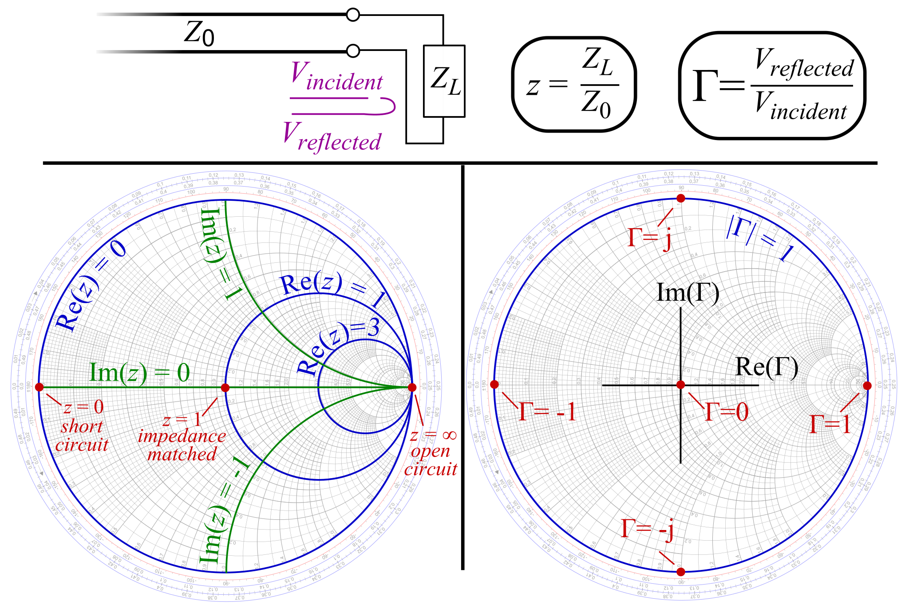
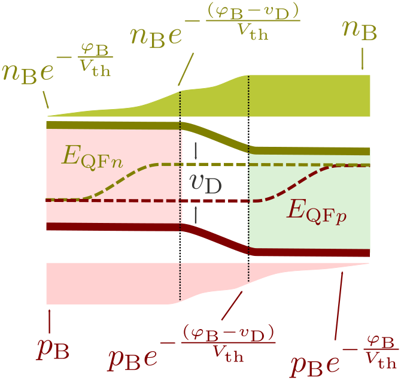
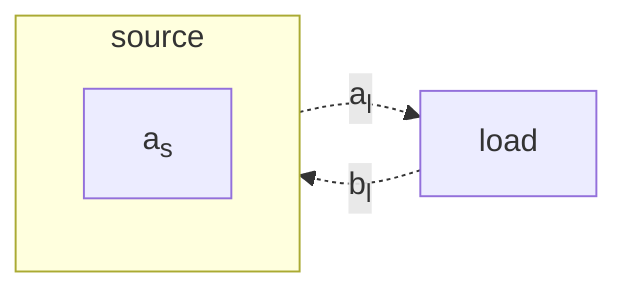
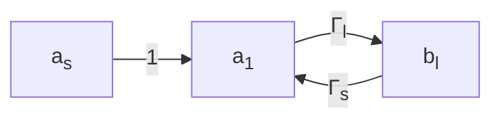
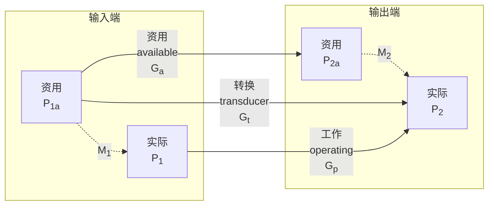
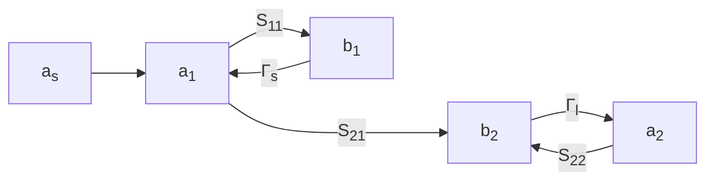
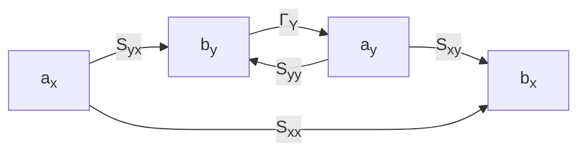

---
relevant:
  - ./semiconductor-physics.md
  - ./electromagnetic-field-and-wave.md
---

# 微波电路与系统

$$
\def\N{\mathbb{N}}
\def\Z{\mathbb{Z}}
\def\R{\mathbb{R}}
\def\C{\mathbb{C}}
$$

## 无源器件和半导体器件

### Smith 圆图上的变换

> :material-clock-edit-outline: 2023年3月8日。

$z = \frac{Z_\text{in}}{Z_c}$，$\Gamma = \frac{z-1}{z+1}$。（一种 [Möbius 变换](https://en.wikipedia.org/wiki/M%C3%B6bius_transformation))

|  情况  |     $z$     |       $\Gamma$        |
| :----: | :---------: | :-------------------: |
|  短路  |     $0$     |         $-1$          |
|  开路  |  $\infty$   |          $1$          |
|  匹配  |     $1$     |          $0$          |
| 纯驻波 | $j\times\R$ | $e^{j\times[0,2\pi)}$ |

<figure markdown='span'>

<figcaption markdown='1'>Smith圆图｜[Wikimedia Commons](https://commons.wikimedia.org/wiki/File:Smith_chart_explanation.svg)</figcaption>
</figure>

|                     变换                     |         $\Gamma$ 的效果         | 解释                                |
| :------------------------------------------: | :-----------------------------: | ----------------------------------- |
| 沿传输线移动 $l$ （$+l$ 为“源→负载”方向） | 绕 $\Gamma = 0$ 旋转 $2\beta l$ | 入射、反射波分别转动 $\pm\beta l$。 |
|                  串联纯电抗                  |  沿内切于 $\Gamma=1$ 的圆转动   | $z$ 变化纯虚数                      |
|                  串联纯电阻                  |  沿正交于 $\Gamma=1$ 的圆转动   | $z$ 变化实数                        |
|                  并联纯电抗                  |  沿内切于 $\Gamma=-1$ 的圆转动  | $z^{-1}$ 变化纯虚数                 |
|                  并联纯电阻                  |  沿正交于 $\Gamma=-1$ 的圆转动  | $z^{-1}$ 变化实数                   |

!!! note "Möbius 变换的复合"

    $z \leftrightarrow \Gamma$，则 $z^{-1} \leftrightarrow -\Gamma$。

    $$
    \frac{z^{-1}-1}{z^{-1}+1}
    = \frac{1-z}{1+z}
    = - \frac{z-1}{z+1}.
    $$

### 用微带线实现集总电容、电感

> :material-clock-edit-outline: 2023年3月7–8日。

对于宽 $W$、厚 $d$ 的平板传输线，（传播方向）单位长度的电容、电感

$$
L_0 = \mu \frac{d}{W},\quad
C_0 = \varepsilon \frac{W}{d}.
$$

!!! note "平板传输线理想模型"

    电磁场方向、传播方向相互垂直。电磁场局限在平板之间的长方体中，并且均匀分布。

    此时 $E d = U$（电势定义），$H W = I$（安培环路定律）。

从而特性阻抗

$$
Z_c = \sqrt{\frac{L_0}{C_0}}
= \sqrt{\frac{\mu}{\varepsilon}} \frac{d}{W},
$$

以及传播速率

$$
\frac{\omega}{\beta} = \frac{1}{\sqrt{L_0 C_0}} = \frac{1}{\sqrt{\mu\varepsilon}} = c.
$$

#### 微带

由物理参数，可得以下近似。

|   $W/d$   |   $Z_c$   | 短线双端口特性 |
| :-------: | :-------: | :------------: |
|   $0^+$   | $+\infty$ |  仅有串联电感  |
| $+\infty$ |   $0^+$   |  仅有并联电容  |

!!! note "短线"

    以上“短线”是指传播方向上的长度小于 $\frac18 \lambda$。

也可从[转移参数](https://en.wikipedia.org/wiki/Two-port_network#ABCD-parameters)（输出电压电流 ↦ 输入电压电流）理解。

取 $+z$ 为“源→负载”方向，$\theta = \beta z$，则微带线的转移参数为

$$
\begin{bmatrix}
    \cos\theta & j \sin\theta Z_c \\
    j \sin\theta / Z_c & \cos\theta \\
\end{bmatrix}.
$$

!!! note "观察"

    - 行列式为一 ⇔ 倒易（reciprocal）。
    - 主对角线上两数相等 ⇔ 对称。（取逆再统一正方向后不变）
    - 主对角线纯实，反对角线纯虚 ⇐ 倒易 ∧ 无耗。
    - 特征值为 $\exp(\pm j\theta)$，特征向量分别是 $U = \pm I Z_c$。

对比串联电感、并联电容的转移参数

$$
\begin{bmatrix}
    1 & j\omega L \\
      & 1 \\
\end{bmatrix},
\quad
\begin{bmatrix}
    1 \\
    j\omega C  & 1 \\
\end{bmatrix},
$$

即得 $\theta \approx 0$，$Z_c \to +\infty$、$Z_c \to 0^+$ 下的近似。

#### 微带支线

除了用作双端口器件，还可用作支线（支线一端短路或开路，另一端接入电路），这相当于与负载**并联**一段传输线。（传输线的输入阻抗可由 Smith 圆图判断）

### P–N结

> :material-clock-edit-outline: 2023年3月25–26日。

!!! note "结与二极管"

    应当区分结（junction）与二极管（diode），前者更微观。然而这里只写大致原理，并不太区分。

P、N区交界处（空间电荷区）扩散作用导致平衡时出现 N→P 方向内建电场。外部加正向电场（P→N）时减弱内建电场，导通；加反向电场时加强空间电荷区，截止。

Shockley diode equation:

$$
I \propto e^u - 1,
$$

其中 $u = q V / \qty(k_B T)$，有时还要除以一个（略大于一的）修正因子。

> :material-eye-arrow-right: [`ECE531-Fall-19-Lecture-07-PN Junctions Electrostatics.pdf` (broken 💔)](https://web.eecs.utk.edu/~azeumaul/courses/ee531/fall2019/lecturenotes/ECE531-Fall-19-Lecture-07-PN%20Junctions%20Electrostatics.pdf).

这很大程度上是经验公式，不过也能推导。考虑突变结，采用耗尽层假设（空间电荷区多子耗尽，电荷密度分别等于杂质浓度，从而电荷分别均匀分布），电势在突变处两侧分别为半抛物线状分布。

!!! info "势垒区电容"

    势垒区电势为半抛物线状分布，$\abs{Q} \propto \sqrt{\abs{V_\text{势垒}}}$，$C \propto 1/\sqrt{\abs{V_\text{势垒}}}$。

扩散—漂移运动：

1. 扩散取决与浓度负梯度（与 $E_v - E_F$ 或 $E_F - E_c$ 负梯度一致，参考[“载流子浓度公式记忆技巧”中的箭头](./semiconductor-physics.md#重制版)）。
2. 漂移取决于电势负梯度（电子的电势能、真空能级、$E_c$ 或 $E_v$ 之间只差固定常数，负梯度一致）。
3. 两种运动共同效果是 electron/hole exchange is determined by the relative position of the Fermi energies。

<figure markdown='span'>
    
    <figcaption markdown='1'>Quasi-fermi levels in p-n diode in forward bias｜[Wikimedia Commons](https://commons.wikimedia.org/wiki/File:Diode_quasi-fermi_levels.svg)</figcaption>
</figure>

无外电场时，平衡后两区 $E_F$ 一致，内建电场 N→P，能带（导带底、价带顶或真空能级）P区高于N区。这个电势差记作 $V_D$。

有偏压时，分析恒定电场：

1. 电势仍降落在势垒区（上图中空白区）上，P区、N区远处 $E_F$ 的差等于 $-qV$，远处 $E_c$、$E_v$ 或真空能级的差则是 $q(V_D - V)$。
2. 势垒区由于持续注入非平衡载流子，Fermi 能级分化为两个准 Fermi 能级，$E_{F,p},\, E_{F,n}$ 都不随空间变化。
3. 与其同时，这些非平衡载流子逸出到扩散区（上图中空白区以外），若这里只考虑复合、扩散，则载流子浓度（从边界到远处）按指数变化到平衡浓度。
4. 由于非平衡载流子的影响总以少子为主，可认为扩散区多子的准 Fermi 能级不随空间变化。

!!! info "扩散区电容"

    扩散区 $Q \propto e^u$，$C \propto e^u$。

现在分析电流。

1. 势垒区没有合电流（因为准 Fermi 能级无梯度），但其边界决定了扩散区情况。

    势垒区两端电势能之差等于 $q(V_D - V)$，$E_{F,n} - E_{F,p} = qV$。

    再看载流子浓度。对每一种载流子，在它是多子的一侧，它的浓度就是平衡时浓度；在它是少子的一侧，根据 $E_{F,n} - E_c$ 或 $E_v - E_{F,p}$ 的情况，按 Maxwell–Boltzmann 分布，它的浓度是另一侧浓度再乘 $\exp(q(V_D-V) / (k_B T))$。

    也可直接考虑每一侧。对每一种载流子，在它是少子的一侧，平衡时 $E_F$ 就等于这里多子的准 Fermi 能级，因此它的浓度等于平衡时浓度再乘 $\exp(\Delta E_F / (k_B T)) = \exp(qV / (k_B T)) \eqqcolon e^u$。

    总之，边界处少子有非平衡载流子，浓度等于平衡时浓度再乘 $(e^u - 1)$。

2. 扩散区没有漂移电流（因为电势无梯度），但非平衡载流子指数分布，它有扩散电流。

    指数分布时，扩散电流密度正比于非平衡载流子浓度。（系数是 $qD/L$，其中 $D,L$ 分别是这种载流子的扩散系数、扩散长度）

    因此，$I \propto e^u - 1$。

!!! abstract "一言以蔽之"

    - 正偏压下，势垒降低，势垒区持续注入非平衡载流子，扩散区非平衡少子形成正向扩散电流，导通。
    - 反偏压下，势垒升高，Fermi 能级仍然分化，但效果是减少势垒区的载流子，扩散区非平衡少子仍形成反向电流，但这点~儿~载流子太少了，截止。反偏压较高后，势垒区几乎完全没有载流子，再升高势垒也没用，反向电流于是饱和了。

!!! info "总电容"

    电荷有扩散区、势垒区两部分。两种电容都随电压变化。正偏时扩散区电容很大，为主；反偏时扩散区电容很小，势垒区电容为主。

!!! info "击穿"

    反向电压较高时，反向电流可能突破饱和。

    - 热击穿：反向电流、电压都较大，电热效应明显，再加上热激发载流子恶性循环，最终烧毁。
    - 电击穿
      - 雪崩击穿（又名硬击穿）：反向电压较高时，势垒区电场很强，载流子动能很高，碰撞电离增加载流子浓度，从而反向电流雪崩式增大。
      - Zener 击穿（又名软击穿）：P、N区都重掺杂时，空间电荷区很薄就杂质就能提供足够多电荷达到平衡，因而反向电压不太高时内建电场就很强，存在内部场致发射，增大反向电流。

### M–S结

> :material-clock-edit-outline: 2023年3月26日，2023年6月7日，2023年6月10日。

Metal–Semiconductor 结又名 Schottky 结，制成的二极管叫 Schottky barrier diode（SBD）。

M–S结中金属内部均一，接触表面有势垒，半导体内部有缓一些的势垒。外偏压影响半导体内部势垒，决定载流子浓度分布，形成整流特性；接触表面的势垒因钉扎（半导体表面态密度非常高，电子填不过来）而几乎不变。

与P–N结不同，M–S结有整流特性是因为多子在表面附近的势垒，与非平衡载流子、少子关系不大。因此与比P–N结相比，M–S结一般电容更小（没有少子积累），反向饱和电流更大。输运原理不同也导致M–S结略更偏离 $e^u -1$，正向导通电压更小。

|               P–N结                |                  M–S结                   |
| :--------------------------------: | :--------------------------------------: |
|        少子器件，电荷有存贮        |          多子器件，载流子无存贮          |
| 正偏扩散电容为主，反偏势垒电容为主 |               只有势垒电容               |
|            只适用于低频            |                高频也可用                |
|        正向导通电压 ≈ 0.6 V        |        ≈ 0.3 V（想伏安特性曲线）         |
|                                    | 势垒更薄，反向饱和电流更大，击穿电压更小 |
|  两种掺杂，两端都要 Ohm 接触处理   |                 制造简单                 |

制作半导体器件时，金属引线与半导体天然形成的M–S结有害，这时可在半导体表面附近重掺杂，减薄势垒，实现欧姆接触。

### 各种二极管的特性

> :material-clock-edit-outline: 2023年3月26日，2023年6月7日，2023年6月8日。

- **变容管**

  主要利用P–N结反向工作时的微分电容特性，可用作<u>调谐</u>。

  对于突变结，$C \propto 1 / \sqrt{\phi - V}$，其中 $\phi$ 是P–N结接触电压。缓变结的$C$对$V$更不敏感，$C \propto 1 / \qty(\phi - V)^m$，$m \approx \frac13$。

  实际还能制造出 $m = 2$ 的超突变结（用于线性调频：$\omega \propto 1 / \sqrt{C} \propto \phi - V$），以及 $m \approx 0^+$ 的阶跃恢复结（正向导通，反向固定电容）。

- **阶跃恢复管**（step recovery diode）

  P⁺–N–N⁺。正偏时低阻，同时在N–N⁺界面积累大量电荷，大电容；反偏时高阻，同时仅P⁺–N势垒区有小电容。非平衡少子寿命很长，与一般P–N结不同。

  正向导通时，电压如普通二极管一样变化不大；由正偏转反偏时（注意因载流子寿命长，模式切换明显滞后于输入电压变化），电容突然变小，而电荷来不及转移，故输出电压会反向<u>脉冲</u>；重新正偏后恢复。

- **P⁺–I–N⁺管**

  低频时，具有与P–N管类似的整流特性，但耗尽层人为加厚，电容更小且更恒定，反向击穿电压更高。

  高频时I区复合跟不上，是否导通取决于低频分量及相应整流特性。——可利用低频信号<u>控制</u>高频信号通断。

- **雪崩管**（又名 Read 管、放大芯片）

  全名 impact ionization avalanche transit-time（IMPATT）diode。

  原初版为N⁺–薄P–厚I–P⁺，可在N⁺–P发生雪崩，然后向P⁺渡越。这种管可实现放大，且峰值落后于输入交变电压，射频下对外可呈现<u>负阻</u>。

  实用版的薄P–厚I可合并为一个区。为让两种载流子都漂移，还可对称过去做P⁺–P–N–N⁺（双漂移区）。

  大功率时，还可改用 trapped plasma avalanche triggered transit（TRATT）管，P⁺–N–N⁺，整个N区雪崩击穿。

- **转移电子效应管**（transfer electron diode, TED）

  第三代半导体产物。利用多能谷材料的 Gunn 氏效应天然产生振荡。（这种二极管无需结）

  因偶极畴的存在，电压增加、减小时伏安特性不完全相同：增加时的阈值电压会比减小时的保持电压略高。

## 频率变换器

### 一般原理

> :material-clock-edit-outline: 2023年4月15日，2023年6月8日。

- 下变频：(source, local) ↦ out

  一般用阻性变频器，核心是非线性电阻，如 Schottky 势垒二极管。

- 上变频：(source, pumping) ↦ out

  一般用参量变频器，核心是非线性电容，如变容管及阶跃恢复二极管。

线性器件无法改变频率（频域仅仅是相乘，不能搬移），变换频率关键在于非线性。

举个例子。某一器件的输入输出关系 $u_\text{in} \mapsto u_\text{out}$ <u>非线性</u>，想实现下变频 $(u_\text{source},\ u_\text{local}) \mapsto u_\text{out}$。

1. 用线性电路实现 $u_i = u_l + u_s$。
2. 只考虑小信号（$u_s \ll u_l$ 且 $u_s$ 高阶项可忽略），则 $u_i \mapsto u_o$ 微分关系只由 $u_l$ 决定。比如 $\dd{u_o} = g \dd{u_i}$，其中 <u>$g$ 与 local 有关</u>而与 source 无关。
3. 至此，$\dd{u_o} = g \dd{u_i} = g \times u_s$ ——输出（的微分）是 $g$（取决于 local）与 $u_s$（source）的<u>积</u>。时域相乘对应频域卷积，可搬移频谱，变换频率。

!!! note "必须非线性"

    若是线性器件，虽仍有相乘，但 $g$ 也不随 local 变化……于是工作不了。

!!! note "大信号也差不多"

    大信号（$u_s$ 高阶项不可忽略，但仍有 $u_s \ll u_l$）时，微分关系为 Taylor 级数，形式仍是“local、source 决定量”之积（的线性组合）。

再仔细考察上述关系。设 $u_l$ 单频 $\omega_l$，则 $g$ 也具有相同周期，频谱包含 $\Z \omega_l$。

!!! note "都是时间的函数"

    $g$ 是 $u_l$ 的函数，$u_l$ 是时间 $t$ 的函数。为方便 Fourier 分析，我们把 $g$ 也看成 $t$ 的函数。

各频率成分如下表。

|          $g$          |     $u_s$      |    $\dd{u_o} = g \times u_s$     |   $u_o$    |     称呼     |
| :-------------------: | :------------: | :------------------------------: | :--------: | :----------: |
|           –           |       –        |                –                 | local 本身 |     本振     |
|  $\pm \Z^+ \omega_l$  | $\pm \omega_s$ |  $\pm(\omega_s + \Z^+\omega_l)$  |  （同左）  |     和频     |
|          $0$          | $\pm \omega_s$ |          $\pm\omega_s$           |  （同左）  |   信号基波   |
|    $\mp \omega_l$     | $\pm \omega_s$ |    $\pm(\omega_s - \omega_l)$    |  （同左）  | **所需中频** |
|   $\mp 2 \omega_l$    | $\pm \omega_s$ |   $\mp(2 \omega_l - \omega_s)$   |  （同左）  |     镜像     |
| $\mp (3+\N) \omega_l$ | $\pm \omega_s$ | $\mp((3+\N)\omega_l - \omega_s)$ |  （同左）  |  更高次差频  |

!!! tip "频率大小关系"

    下变频时，$\omega_s \gtrsim \omega_l \gg \omega_s - \omega_l$。

### 下变频器

> :material-clock-edit-outline: 2023年6月8日。

实际下变频器都会设计对称性保证输出中某些频率成分为零，提高效率。具体来说，采用多个特性一致的二极管，输出前将这些路相减，称作“平衡”混频器。（单平衡一对二极管，双平衡两对）

另外，由于这种设计采用多管，同等输入下，每一管分担的电压小了，于是提高了动态范围。

- **90°相移单平衡**

  有 1,2 两个反接的二极管。

  $$
  \begin{bmatrix}
    u_1 \\ u_2
  \end{bmatrix}
  = \begin{bmatrix}
    1 & -j \\
    j & -1 \\
  \end{bmatrix} \begin{bmatrix}
    u_\text{source} \\ u_\text{local}
  \end{bmatrix}.
  $$

  $u_1 \mapsto i_1$，$u_2 \mapsto i_2$，$i_\text{out} = i_1 - i_2$。

  source 的 $s (\in \Z)$ 次谐波与 local 的 $l (\in \Z)$ 次谐波对应输出

  $$
  {u_s}^s (-j u_l)^l - (j u_s)^s (-u_l)^l
  = {u_s}^s {u_l}^l (-j)^l \times (1 - j^s (-j)^l).
  $$

  当 $j^s (-j)^l = 1$，即 $s - l \in 4\Z$ 时，这一项为零——输出中有 1/4 的频率成分被平衡掉了。

  具体分析几例。

  - 输入 $\omega_s, \omega_l$，$(l,s) = \pm (1,-1)$ 对应输出 $\pm(\omega_s - \omega_l)$，为所需中频。由上式，系数为 $-1 \times (j - (-j)) = 2j$，不为零。因此正常输入时，输出中<u>存在所需中频</u>，并且强度还是无平衡单端版本的两倍。

  - 输入 $(2\omega_l - \omega_s, \omega_l)$，$(l,s) = \pm (1,-1)$ 对应输出 $\mp(\omega_s - \omega_l)$，还是所需中频。同理系数不为零。因此输入端在镜像频率有噪声时，这些噪声在输出端会混入所需中频——<u>无法抑制外来镜像干扰</u>。

    !!! note "镜像频率"

        “镜像”一名因镜像、本振、源的频率成等差数列。混频器仅凭算术关系，无法区分它与正常输入，要想抑制这种噪声，必须在混频器前滤波。

  - 输入 $\omega_s, \omega_l$，$(l,s) = \pm (1,1)$ 对应输出 $\pm(\omega_s + \omega_l)$，为和频。由上式，系数为零，抵消掉了。

  另外还可考虑本振引入的噪声。在 local 端同时输入 $\omega_l, \omega_n$，而 source 端置零。

  这时关系变为

  $$
  \begin{bmatrix}
    u_1 \\ u_2
  \end{bmatrix}
  = \begin{bmatrix}
    -j & -j \\
    -1 & -1 \\
  \end{bmatrix} \begin{bmatrix}
    u_\text{noise} \\ u_\text{local}
  \end{bmatrix},
  $$

  输出则是

  $$
  (-j u_n)^n (-j u_l)^l - (-u_n)^n (-u_l)^l
  = {u_n}^n {u_l}^l (-j)^n (-j)^l \times (1 - (-j)^n (-j)^l).
  $$

  我们只关心输入前难滤掉，输出又混到中频的噪声。$\omega_n = 2\omega_l - \omega_s$ 时，$(n,l) = \pm(1,-1)$ 对应输出 $\mp\omega_s$，由上式系数为零。因此可<u>抑制本振噪声</u>。

- **180°相移单平衡**

  $$
  \begin{bmatrix}
    1 & 1 \\
    1 & -1 \\
  \end{bmatrix}.
  $$

  local、source 分别接哪列都行，local 接到 $\pm 1$ 一列则称“本振”180°相移型（或反相型），source 接到 $\pm 1$ 同理。

- **双平衡**

  $$
  \begin{bmatrix}
    -1 & -1 \\
    1 & -1 \\
    1 & 1 \\
    -1 & 1 \\
  \end{bmatrix}.
  $$

  $i_\text{out} = i_1 - i_2 + i_3 - i_4$。

  输出中非零频率成分又少了一半。

微带典型实现如下。

- **单端**

  1. 叠加本振、源——平行线耦合器，两个输出端一个接后续电路，另一个接匹配负载。
  2. 变换阻抗——λ/4 阻抗变换器，相移线段。（本振、源频率相近，λ 按哪个都行；一般源弱一些，更希望保护，λ 按源）
  3. 中频、直流通路——λ/4 高阻细线接地。
  4. 抑制镜像频率——λ/4 开路线，直接连或用平行线耦合。（λ 按镜像频率的）
  5. Schottky 势垒二极管。
  6. 输出低通滤波——高频旁路 λ/4 低阻粗线开路、半环电感、缝隙电容。

- **90°相移单平衡**

  平行线耦合器或分支线耦合器，两个输出端各接一路二极管。

- **180°相移单平衡**

  环形电桥。

### 上变频器

> :material-clock-edit-outline: 2023年6月8日。
>
> :material-eye-arrow-right: [Manley-Rowe Relations | Dmitry Pelinovsky Web Page: Principles of Fiber Optics](https://dmpeli.math.mcmaster.ca/ResearchProjects/DispersionManagement.html).

非线性系统涉及频率 $f_1 \Z + f_2 \Z$，在 $m f_1 + n f_2$ 输入系统的功率记作 $P_{mn}$。一般系统 $\forall m,n \in \Z$，$P_{+m,+n} = P_{-m, -n}$。**Manley–Rowe 关系**如下。

$$
\sum_{m,n \in \Z} \frac{(m,n) P_{mn}}{m f_1 + n f_2} = (0,0). \\
$$

另外，输出支路无源，不可能向系统输入功率，$P \leq 0$。由这两点可证明参量下变频器中，频率较低的输入反而从系统获得功率，因而总不稳定。

### 变容管倍频器的微带典型实现

> :material-clock-edit-outline: 2023年6月1日。

1. 输入低通滤波、阻抗变换——如串联电感、并联电容。
2. 直流偏置网络——从信号上分出直流支路，λ/4 高阻、λ/4 低阻、自偏电位器、地。（此处 λ 是输入信号的）
3. 变容管。
4. 匹配输出阻抗——λ/4 阻抗变换器。（此处 λ 是输出信号的）
5. 输出带通滤波器——λ/2 如平行耦合线。（此处 λ 是输出信号的）
6. 空闲回路——λ/4 开路线。（此处 λ 是不想要的低次谐波的）

## 放大器

### 实际功率与资用功率

> :material-clock-edit-outline: 2023年4月24日，2023年5月1日。

考虑单端口负载，给定电源及其阻抗，则传给负载的<u>实际功率</u>随负载阻抗变化。共轭匹配时实际功率取最大，称作<u>资用（available）功率</u>。（前述“阻抗”可全部换作（电压）“反射系数”）实际功率与资用功率之比称作<u>失配系数</u> $M$。

- 低频电路
  - 负载阻抗太小 ⇒ 负载分压小 ⇒ 给负载的功率小。
  - 负载阻抗太大 ⇒ 电流太小 ⇒ 给负载的功率小。
  - 源、负载阻抗相加未能抵消虚部 ⇒ 电源输出电流、电压不同相 ⇒ 总功率小 ⇒ 给负载的功率小。
- 波
  - 负载反射系数太大 ⇒ 负载吸收太少 ⇒ 给负载的功率小。
  - 负载反射系数太小 ⇒ 再经电源反射的功率小 ⇒ 给负载的功率小。
  - 源、负载反射系数相乘未能抵消相位 ⇒ 波在源、负载间反射时不能完全同相叠加 ⇒ 存在内阻振荡 ⇒ 给负载的功率小。

详细论证如下。

先考虑简单的低频电路：源（source）端输入 $V_s$（有效值），有内阻 $Z_s$，接上负载（load） $Z_l$。

可知 $I_l = V_s / (Z_s + Z_l)$，$V_l = I_l Z_l$，从而传给负载的功率

$$
\begin{split}
   P_l
   &= \operatorname{\Re} V_l {I_l}^* \\
   &= \operatorname{\Re} \frac{\abs{V_s}^2 Z_l}{\abs{Z_s + Z_l}^2} \\
   &\leq \frac{\abs{V_s}^2 \operatorname{\Re} Z_s}{\abs{2 \operatorname{\Re} Z_s}^2}.
\end{split}
$$

!!! note "记号"

    上标 $*$ 表共轭。

当 $Z_s = {Z_l}^*$（共轭匹配）时取等。（分实虚，转化为实函数可证）

再考虑波。

!!! info "记号"

    一般入射波记作 $a$，反射波记作 $b$。（按幅度计）

各量间算术关系如上图，可解得比例如下。

$$
\begin{array}{c|c|c}
    a_s & a_1 & b_1 \\
    \hline
    1 - Γ_l Γ_s & 1 & Γ_l \\
\end{array}
$$

因此传给负载的功率

$$
\begin{split}
    P_l
    &= \abs{a_l}^2 - \abs{b_l}^2 \\
    &= \frac{1 - \abs{Γ_l}^2}{\abs{1 - Γ_l Γ_s}^2} \times \abs{a_s}^2 \\
    &\leq \frac{\abs{a_s}^2}{1 - \abs{Γ_s}^2}. \\
\end{split}
$$

当 $Γ_s = {Γ_l}^*$（共轭匹配）时取等。

!!! note "不等式的证明"

    一般 $\abs{Γ_l}, \abs{Γ_s} \in [0,1]$。

    先优化 $Γ_l$ 的辐角。由三角不等式，

    $$
    \abs{1 - Γ_l Γ_s} \geq \abs{1 - \abs{Γ_l Γ_s}},
    $$

    当 $Γ_l Γ_s \in \R^+$ 时取等。

    再优化 $Γ_l$ 的模。设 $\abs{Γ_l} = λ \abs{Γ_s}$，$λ \geq 0$，则

    $$
    \frac{1 - \abs{Γ_l}^2}{\abs{1 - \abs{Γ_l Γ_s}}^2}
    = \frac{1 - \lambda^2 \abs{Γ_s}^2}{\abs{1 - \lambda \abs{Γ_s}^2}^2}.
    $$

    设 $u = 1 - \lambda \abs{Γ_s}^2$，$\lambda = \frac{1 - u}{\abs{Γ_s}^2}$，则上式可化为 $u^{-1}$ 的二次函数

    $$
    \frac{1 - (u-1)^2 / \abs{Γ_s}^2}{u^2}
    = \frac{1 - 1 / \abs{Γ_s}^2}{u^2} + \frac{2}{\abs{Γ_s}^2 u} - \frac{1}{\abs{Γ_s}^2},
    $$

    从而求极值。

### 各种增益

> :material-clock-edit-outline: 2023年4月24日，2023年5月1日。
>
> :material-eye-arrow-right: [Calculate power gain from two-port S-parameters - MATLAB `powergain`](https://www.mathworks.com/help/rf/ref/powergain.html).
> :material-eye-arrow-right: [2.3: Amplifier Gain Definitions - Engineering LibreTexts](https://eng.libretexts.org/Bookshelves/Electrical_Engineering/Electronics/Microwave_and_RF_Design_V%3A_Amplifiers_and_Oscillators_(Steer)/02%3A_Linear_Amplifiers/2.03%3A_Amplifier_Gain_Definitions).

输出、输入比是增益。放大器是双端口器件，它有两处匹配问题，可定义多种功率增益（power gain）。

!!! note "影响因素"

    $M_1$ 与 $Γ_s$ 有关，$M_2$ 与 $Γ_l$ 有关，各种增益都与放大器散射参量有关。

对于绝对稳定的放大器，可以实现双共轭匹配（两端口同时共轭匹配），$M_1 = 1 = M_2$，从而 $G_p = G_t = G_a$。这一值称作<u>最大</u>功率增益 $G_m$。可推出 $G_m = \abs{S_{21} / S_{12}} \times \qty(K_s - \sqrt{{K_s}^2 - 1})$，其中 $K_s$ 为放大器的稳定系数。人为规定临界稳定（$K_s = 1$）时的最大功率增益为<u>最大稳定</u>功率增益 $G_s = \abs{S_{21} / S_{12}}$。

另外，若假设放大器只能“1端 → 2端”（$\abs{S_{12}} \ll \abs{S_{21}}$），则可计算<u>单向化</u>（unilateral）转换功率增益。

$$
G_\text{tu}
= \frac{1 - \abs{Γ_s}^2}{\abs{1 - S_{11} Γ_s}^2}
    \times \abs{S_{21}}^2
    \times \frac{1 - \abs{Γ_l}^2}{\abs{1 - S_{22} Γ_l}^2}.
$$

### 稳定性判据

> :material-clock-edit-outline: 2023年5月1–2日。
>
> :material-eye-arrow-right: [2.6: Amplifier Stability - Engineering LibreTexts](https://eng.libretexts.org/Bookshelves/Electrical_Engineering/Electronics/Microwave_and_RF_Design_V%3A_Amplifiers_and_Oscillators_(Steer)/02%3A_Linear_Amplifiers/2.06%3A_Amplifier_Stability).

应当要求放大器稳定——所有端口的反射系数的模都小于一。这些反射系数不仅与放大器的散射参量 $S$ 有关，还取决于 $Z_\text{source},\ Z_\text{load}$。因此，要想保证放大器稳定，应同时限制 $Z_s, Z_l$。

分别考虑每个端口。

以 $x$ 端为例，需求 $\qty{Γ_Y : \abs{Γ_x} < 1}$。

算术关系如上图，可得 $x$ 端各种因素总的反射系数

$$
Γ_x
= S_{xx} + S_{yx} \times \frac{Γ_Y}{1 - Γ_Y S_{yy}} \times S_{xy}
= \frac{\square - \square Γ_Y}{\square - \square Γ_Y}.
$$

!!! note "记号"

    此处下标小写字母指放大器，下标大写字母指放大器以外部分（源、负载等）。

!!! tip "Möbius变换"

    > :material-eye-arrow-right: [3.2: Inversion - Mathematics LibreTexts](https://math.libretexts.org/Bookshelves/Geometry/Geometry_with_an_Introduction_to_Cosmic_Topology_(Hitchman)/03%3A_Transformations/3.02%3A_Inversion)
    >
    > :material-eye-arrow-right: [3.4: Möbius Transformations - Mathematics LibreTexts](https://math.libretexts.org/Bookshelves/Geometry/Geometry_with_an_Introduction_to_Cosmic_Topology_(Hitchman)/03%3A_Transformations/3.04%3A_Mobius_Transformations).

    $$
    a^{-1} - b^{-1} = - \frac{1}{ab} \times (a-b).
    $$

    Möbius变这种形式保交比，保广义圆。

    $$
    \begin{split}
        & \abs{\frac{az+b}{cz+d}} < 1. \\
        &\iff \abs{az+b}^2 < \abs{cz+d}^2. \\
        &\iff \begin{bmatrix}
            z^* & 1
        \end{bmatrix}
        \begin{bmatrix}
            a a^* - c c^* & a^* b - c^* d \\
            a b^* - c d^* & b b^* - d d^* \\
        \end{bmatrix}
        \begin{bmatrix}
            z \\ 1
        \end{bmatrix}
        < 1.
    \end{split}
    $$

    这种 Hermitian 阵对应广义圆或 $\varnothing$。事实上，若 $A,C \in \R$，$B \in \C$，则

    $$
    \begin{bmatrix}
            z^* & 1
    \end{bmatrix}
    \begin{bmatrix}
        A & B \\
        B^* & C \\
    \end{bmatrix}
    \begin{bmatrix}
        z \\ 1
    \end{bmatrix}
    = A \times \abs{z + \frac{B}{A}}^2
        + \frac{1}{A^2} \times
        \begin{vmatrix}
            A & B \\
            B^* & C \\
        \end{vmatrix},
    $$

    与 $B \in \R$ 时类似。

电路无源时 $\abs{Γ_Y} < 1$。为降低后续设计难度，可要求放大器<u>绝对稳定</u>（只要 $\abs{Γ_Y} < 1$ 即稳定），问题归结为

$$
\max_{\abs{Γ_Y} < 1} \abs{Γ_1} \overset?< 1.
$$

Rollett 绝对稳定性（stability）判据：

$$
K_s \coloneqq \frac{1 - \abs{S_{11}}^2 - \abs{S_{22}}^2 + \abs{\det S}^2}{2 \abs{S_{12} S_{21}}}
\overset{?}{>} 1.
$$

这只是必要条件。下面是充要条件。

$$
\begin{cases}
    K_s &> 1. \\
    1 - \abs{S_{11}}^2 &> \abs{S_{12} S_{21}}. \\
    1 - \abs{S_{22}}^2 &> \abs{S_{12} S_{21}}. \\
\end{cases}
$$

另外，放大器实际接入电路后，要求可从 $\abs{Γ_x} < 1$ 放松为 $\abs{Γ_x Γ_X} < 1$。

### 设计匹配网络

> :material-clock-edit-outline: 2023年5月2日。

1. 验证放大器绝对稳定。（条件稳定的放大器设计困难，一般不考虑）
2. 按目标计算需要的输入、输出反射系数。
   - 追求大功率增益：双共轭匹配。
   - 追求低噪声系数：输入端取 $Γ_{s, \text{optimal}}$，输出端共轭匹配。
3. 利用 Smith 圆变换阻抗。

### 功率放大器的指标

> :material-clock-edit-outline: 2023年6月9日。

除了效率，功率放大器还特别在意线性程度。

- **1 dB 压缩点**

  输入功率太大时，放大器增益会下降。增益比小信号时低 1 dB 时的输入或输出功率称作 1 dB 压缩点。

- **三阶交调系数**

  输入双频 $\omega_1, \omega_2$，由于非线性，输出可能有 $\Z \omega_1 + \Z \omega_2$，串扰其它信道。离得最近的两个频率是 $2 \omega_1 - \omega_2, 2 \omega_2 - \omega_1$，这两个频率的幅度称作三阶交调幅度，占基频的比例称作系数。

- **调幅–调相转换系数**

  输入功率变化单位比例导致的输出相位变化，单位常用 $\deg / \text{dB}$。

## 振荡器

### Kurokawa 负阻理论

> :material-clock-edit-outline: 2023年5月10日。

在一定电压范围内，器件可以呈现微分负阻，直流能量转化到交流，实现放大。

将电路划分为器件、谐振电路两个单端口器件。器件非线性，微分阻抗 $-Z_D$ 与直流工作点 $I$ 强相关，随频率缓慢变化，实部为负。谐振电路由电阻、电感或电容组成，阻抗 $Z$ 只与频率有关，不过实部几乎不随频率变化。

- **起振**：总电阻以负阻为主（$\Re(-Z_D + Z) < 0$），电量振幅指数增长。
- **平衡**：电量幅度、相位都进入稳态，$-Z_D + Z = 0$，振幅稳定。
- **稳定性**：微扰可恢复，条件是平衡点处 $\Im( \pdv{I}(-Z_D)^* \pdv{\omega} Z ) < 0$。（这是向量积的正负，即手性）

调谐时，$\omega \mapsto Z$ 会变化，移动平衡点。若 $\qty{Z}$ 有环，$\omega \mapsto Z$ 时平衡点可能突然消失，导致工作点被迫移动，频率、功率跳变。而且即使调谐到原位置，平衡点也未必恢复，轨迹会滞后。

### TED振荡器的工作模式

> :material-clock-edit-outline: 2023年5月10日。

TED 天然负阻，可用来实现振荡器。外围谐振电路有多种选择。

!!! note "记号"

    TED的阈值电压（增大电压时电流的极大值点）记作 $V_\text{threshold}$，维持电压（减小电压时电流的极大值点）记作 $V_\text{sustain}$。（$V_\text{sustain} \lesssim V_\text{threshold}$）

    TED中偶极畴的生长时间记作 $T_\text{domain}$，渡越时间记作 $T_\text{transit}$。谐振电路的周期记作 $T_\text{resonate}$。

    TED的长度指畴移动的距离，充分长指大于 $10^{-12} / \text{cm}^2$ 比载流子浓度。

!!! note "注"

    $T_\text{transit}$ 与器件尺寸正相关，而尺寸会影响功率容量。

    高场畴会降低其它地方的电场强度，减小电流。

    电流越接近正弦型函数，能量越集中于单频，效率越高。

- **纯粹渡越时间**（John Battiscombe Gunn）

  - TED充分长。
  - 器件上的电压始终超过 $V_\text{threshold}$。（⇒ 交流分量不能太强）
  - $T_\text{domain} < T_\text{resonate}$，成熟畴。
  - $T_\text{resonate} = T_\text{transit}$，一畴被吸收后，随即形成另一畴。（另 ⇒ 无法调谐）
  - 电流为脉冲串。

- **猝灭畴**

  - TED充分长。
  - 器件上的电压大部分时间超过 $V_\text{threshold}$，不时摆动到 $V_\text{sustain}$ 以下。
  - $T_\text{domain} < T_\text{resonate}$，成熟畴。
  - $T_\text{resonate} < T_\text{transit}$，畴来不及渡越完，就会因电压低于 $V_\text{sustain}$ 而猝灭。
  - 电流峰更宽，更接近正弦型函数。

- **延迟畴**

  - TED充分长。
  - 器件上的电压大部分时间超过 $V_\text{threshold}$，不时摆动到 $V_\text{sustain}$ 与 $V_\text{threshold}$ 之间。
  - $T_\text{domain} < T_\text{transit}$，成熟畴。
  - $T_\text{resonate} \in (T_\text{transit}, 2T_\text{transit})$，一畴被吸收后，端压还没升到 $V_\text{threshold}$，等一会儿才能形成另一畴。
  - 电流较大的时间占比不小，进一步接近正弦型函数。

- **限制空间电荷积累**（猝灭积累层，limited space-charged accumulation）

  - $T_\text{resonate} < T_\text{domain}$，畴积累不到成熟。不过 $T_\text{resonate}$ 仍远大于弛豫时间。
  - 器件大小适当，掺杂均匀，内部始终是匀强电场。（直接利用负微分电导）
  - 器件上的电压大而振荡剧烈，从 $V_\text{sustain}$ 到正微分电导区都有分布。
  - 效率在这几种模式中最高。

## 控制电路

### 限幅器

> :material-clock-edit-outline: 2023年6月9日。

保护器件，尽可能继续工作。

- 并联两个反接的SBD，利用整流特性。
- 并联两个反接的变容管，利用阻抗不匹配时反射。
- 并联一个P⁺–I–N⁺管，也是利用失配反射。

# 后备箱

- 评价器件的角度：频率成分，频率（带宽）、幅度（动态范围）范围，噪声，隔离，制造复杂程度。
