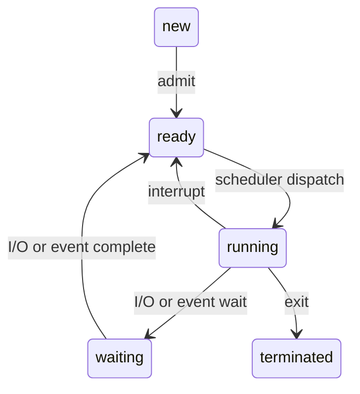

# 操作系统原理

> :material-eye-arrow-right: 实验与作业：[os_homework](https://github.com/YDX-2147483647/os_homework/)。
>
> :material-eye-arrow-right: 问答：[os_qa](https://github.com/YDX-2147483647/os_qa)。

## §1 概论

### 操作系统的功能

> :material-clock-edit-outline: 2022年10月26日。

- 处理机／进程
  - 控制
  - 同步
  - 通信
  - 调度
- 存储器
  - 内存分配
  - 内存保护
  - 地址映射
  - 内存共享
  - 内存扩充
- 文件
  - 文件存储空间管理
  - 目录管理
  - 文件读写管理和保护
- 设备
  - 缓冲管理
  - 设备分配

## §2 进程管理与调度

### 管理

> :material-clock-edit-outline: 2022年10月27日。

制约：间接（共享资源）、直接（协作）。

原语：创建、撤销，阻塞，唤醒。其中撤销、阻塞会转进程调度，唤醒也可能（抢占 CPU）。

在现代操作系统中，进程是分配资源的单位，线程是调度的单位。

### 调度

> :material-clock-edit-outline: 2022年10月27日。

准则；

- 批处理系统：吞吐量、资源利用率。
- 分时系统：每个用户的响应时间。

## §3 进程通信与死锁

### 死锁

> :material-clock-edit-outline: 2022年10月26日。

临界资源：互斥使用、有空让进、有限等待，往往还让权等待（转入阻塞态）。

- 原因：资源有限且不可抢占，进程推进顺序不合理。
- 必要条件：资源互斥、不可剥夺，进程保持并等待，且出现循环链。
- 解决方案：
  - 忽略。
  - 预防（静态分配），避免（动态分配前，银行家算法）。
  - 检测（进程资源分配图）、恢复。

# 后备箱

- 可变式分区中，一个空闲区被分配后，可能还剩余一部分，它仍然空闲。
- 注意<u>编号</u>从 0 还是从 1 开始。
- 磁盘寻道算法中，区分正在处理的请求和刚刚处理的。
- 区分<u>字节和位</u>。
- 优先级和相应数字的关系无统一规定。
- 有些同步问题也隐含互斥问题。
