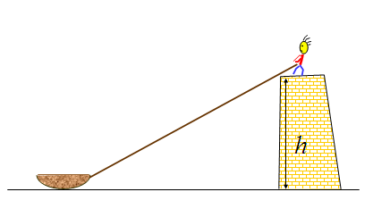
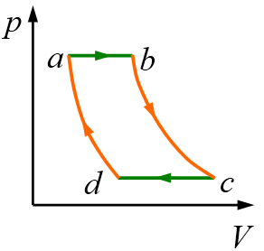

---
relevant:
  - ./calculus-1.md
  - ./calculus-2.md
  - ./linear-algebra.md
---

# 物理1

$$
\def\i{\mathrm{i}}
\def\e{\mathrm{e}}
% 
\def\d{\mathop{}\!\mathrm{d}}
\def\dbar{\mathop{}\!\bar{} \hspace{-0.5em} \mathrm{d}}
\def\const{\mathrm{Const.}}
% 
\newcommand\SI[2]{#1\ \mathrm{#2}}  % siunitx (package)
% 
\def\arsinh{\operatorname{arsinh}}
\def\arcosh{\operatorname{arcosh}}
\def\artanh{\operatorname{artanh}}
% 
\def\R{\mathbb{R}}
$$

## §2 刚体力学

### 转动惯量

> :material-clock-edit-outline: 2021年6月21日。

总质量均记为 $m$。

|         物体          |       转动轴       |    转动惯量    |
| :-------------------: | :----------------: | :------------: |
|     长 $l$ 的细杆     | 过一端点且垂直于杆 | $\frac13ml^2$  |
| 半径为 $r$ 的实心圆柱 |     旋转对称轴     | $\frac12mr^2$  |
|   半径为 $r$ 的球面   |     旋转对称轴     | $\frac23mr^2$  |
|  半径为 $r$ 的实心球  |     旋转对称轴     | $\frac25 mr^2$ |

## §4 气体动理论

> Boltzmann 常量 $k_B$，Avogadro 常量 $N_A$，理想气体常量 $R$。（$R = k_BN_A$）

### 宏观

> :material-clock-edit-outline: 2021年4月17日。

|                  |      按数量       |     按物质的量     |
| :--------------: | :---------------: | :----------------: |
|       总量       |   分子总数 $N$    |  总物质的量 $\nu$  |
|       密度       |    数密度 $n$     |   $\frac \nu V$    |
| 压强—温度、密度  |     $p=nk_BT$     | $p=\frac\nu V R T$ |
| 压强、体积—温度  |    $pV=Nk_B T$    |    $pV=\nu RT$     |
| 每个自由度的能量 | $\frac12 N k_B T$ | $\frac12 \nu R T$  |

温度仅包括平动的三个自由度。

### $\overline{v^2} \geq \bar v^2$

> :material-clock-edit-outline: 2021年4月18日。

$$
0 \leq \overline{(v-\bar v)^2} = \overline{v^2} - \bar v^2
$$

> 另证：设概率密度函数为 $\operatorname{pdf} v$，累积分布函数为 $\operatorname{cdf} v$，则 $\frac{\d}{\d v} \operatorname{cdf} v = \operatorname{pdf} v$。于是
> 
> $$
> \begin{split}
>     \overline{v^2}
>     &= \int_{\R^+} v^2 \operatorname{pdf}v \d v = \int_{\R^+} v^2 \d(\operatorname{cdf}v) \\
>     &= \int_{\R^+}\int_{\R^+} v^2 \d(\operatorname{cdf}v) \d(\operatorname{cdf}u)
>     = \int_{\R^+}\int_{\R^+} u^2 \d(\operatorname{cdf}v) \d(\operatorname{cdf}u) \\
>     &= \int_{\R^+}\int_{\R^+} \frac{u^2+v^2}2 \d(\operatorname{cdf}v) \d(\operatorname{cdf}u) \\
>     &\geq \int_{\R^+}\int_{\R^+} uv \d(\operatorname{cdf}v) \d(\operatorname{cdf}u) \\
>     &= \int_{\R^+} u \d(\operatorname{cdf}u) \int_{\R^+} v \d(\operatorname{cdf}v) \\
>     &= \left( \int_{\R^+} v \d(\operatorname{cdf}v) \right)^2
>     = \left( \int_{\R^+} v \operatorname{pdf}v \d v \right)^2 \\
>     &= \bar v^2
> \end{split}
> $$
> 
>  这将加权平均转化成了普通算术平均。

### Maxwell 分布的特征速率

> :material-clock-edit-outline: 2021年5月28日。

设 $u= \sqrt\frac{RT}{M}$ ，则 $\text{PDF}\propto \exp\left( -\frac{u^2}2 \right)$。

最概然速率为 $\sqrt2 u$， 平均速率为 $\sqrt{\dfrac 8\pi} u$，方均根速率为 $\sqrt3 u$，平均相对速率为 $\sqrt{\dfrac{16}\pi} u$。

## §5 热力学基础

### 理想气体的几个准静态过程

> :material-clock-edit-outline: 2021年5月16日。

$$
\displaylines{
\dbar Q = \d U + \dbar W \\
\dbar W = p\d V,\quad
pV = \nu RT, \quad
U = \frac i2 \nu R T \\
\d S = \frac{\dbar Q}{T}
}
$$

#### $\d V \equiv 0, \dbar W \equiv 0$

$$
\begin{aligned}
    W &= 0 .\\
    Q &= \Delta U
        = \frac i2 \nu R \Delta T
        = \frac i2 V \Delta p. \\
    \Delta S &= \frac i2 \nu R \cdot \Delta\ln T. \\
\end{aligned}
$$

#### $\d p \equiv 0$

$$
\begin{aligned}
    W &= p\Delta V .\\
    Q &= c_p^\text{mol} \nu \Delta T
        = \frac{i+2}2 \nu R \Delta T
        = \frac{i+1}2 p\Delta V. \\
    \Delta S &= \frac {i+2}2 \nu R \cdot \Delta\ln T. \\
\end{aligned}
$$

#### $\d T \equiv 0, \d U \equiv0$

$$
\begin{aligned}
    W &= \nu R T \cdot \Delta\ln V 
        = -\nu R T \cdot \Delta\ln p .\\
    Q &= W. \\
    \Delta S &= \frac QT
        = \nu R \cdot \Delta\ln V
        = - \nu R \cdot \Delta\ln p. \\
\end{aligned}
$$

#### $\dbar Q \equiv 0$

$$
\begin{aligned}
    W &= -\Delta U= -\frac i2\nu R \Delta T = -\frac{\Delta(pV)}{\gamma-1} .\\
    Q &= 0. \\
    \Delta S &= 0. \\
\end{aligned}
$$

状态方程等：

$$
\displaylines{
pV^\gamma = \const \\
\gamma = 1 + \frac 2i,\quad i = \frac2{\gamma-1}.
}
$$

#### 杂项

$$
\Delta S
= \int\frac{\dbar Q}T
= \int\frac{c^\text{mol} \nu \d T}T
= c^\text{mol} \nu \cdot \Delta\ln T
$$

### 可逆过程

> :material-clock-edit-outline: 2021年6月22日。

- 正过程前后，系统、环境允许有变化；
- 只是相应逆过程能把这些变化都复原。

（书上写得比较乱）

## 物理光学

### 干涉与衍射

> :material-clock-edit-outline: 2021年6月7日。

干涉、衍射都是惠更斯-菲涅尔原理的推论，只是干涉中子波源有限多，衍射中无限多。在字面上，“干涉”侧重于H-F原理中的“叠加”，“衍射”侧重于“各个方向”。其实两个现象往往是同时发生的：杨氏双缝干涉实验中，若双缝处不发生衍射，则两缝出射光根本不相交，不可能干涉；单缝远场衍射中，若经过单缝不同处的光不发生干涉，则半波带法无从下手，无法形成衍射条纹。在光栅衍射中，这两种现象更是相伴而生了。

## 慕课的一些题目

!!! warning "存在无法访问的链接"

    “抱歉，课程本学期已结束。老师已将学期的查看权限关闭，你无法再查看本学期的内容。”

### 拉小船

> :material-clock-edit-outline: 2021年3月4日，[第一周单元作业](https://www.icourse163.org/learn/BIT-46002?tid=1463232449#/learn/hw?id=1237094608)，2。

在堤岸顶上用绳子拉小船。设岸顶离水面的高度$h$为20m，收绳子的速率$u$为3m/s，且保持不变， 若当船与岸顶的距离$x$为40m时开始计时，则5秒时小船速率$v$与加速度大小$a$各几何？

<figure markdown='span'>

<figcaption markdown='1'>拉小船｜[MOOC](https://edu-image.nosdn.127.net/1B4FCA5AA71BBCDA6AA581619D047E4B.png)</figcaption>
</figure>

#### 解

记剩余绳长为$l$，绳仰角为$\theta$。

易知所求时刻 $x = \SI{15}{m}, l= \SI{25}{m}, \cos\theta = 0.6, \sin\theta = 0.8$ 。

（就不用向量了，这里它没什么好处。）

##### 初等

> →“[加速度求法](https://www.icourse163.org/learn/BIT-46002?tid=1463232449#/learn/forumdetail?pid=1321684340)”。

画图，建立两组基：一组为水平-竖直参考系，一组为“船沿绳收缩”-“船绕人旋转”参考系。前者易描述船，后者易描述绳。

先用第一组基判断船的速度、加速度方向，然后用第二组基写出绳末端（相当于船）的速度（$u$）、法向加速度（$\dfrac{v^2\sin^2\theta}l$）。利用各参考系中合速度一致，可得

$$
\displaylines{
v\cos\theta = u \\
a\cos\theta = \frac{v^2\sin^2\theta}l
}
$$

故 $v=\SI{5}{m/s}, a = \SI{\frac{16}{15}}{m/s^2}$

##### 导数

> →“[加速度求法](https://www.icourse163.org/learn/BIT-46002?tid=1463232449#/learn/forumdetail?pid=1321684340)”的1楼、“[加速度](https://www.icourse163.org/learn/BIT-46002?tid=1463232449#/learn/forumdetail?pid=1321669729)”。

由勾股定理，$x=\sqrt{l^2-h^2}$  。又 $\dfrac{\d l}{\d t} = u$

$$
\displaylines{
\therefore v = \frac{\d x}{\d t} = \frac{l}{\sqrt{l^2-h^2}}u \\
\therefore a = \frac{\d v}{\d t} = \frac{\sqrt{l^2-h^2}u - l \frac{lu}{\sqrt{l^2-h^2}}}{l^2-h^2}u
= \frac{l^2-h^2 - l^2}{(l^2-h^2)^{\frac32}} u^2
= -\frac{h^2u^2}{(l^2-h^2)^{\frac32}}
}
$$

代入数据计算，再取绝对值即可。

##### 微分

对勾股定理 $l^2 = x^2 + h^2$ 微分，得 $2l\d l = 2x \d x$，即 $\d x = \dfrac lx \d l$，故

$$
\displaylines{
v = \frac{\d x}{\d t} = \frac{l}{x} \frac{\d l}{\d t} = \dfrac{lu}{x}
}
$$

变形为 $vx=lu$ ，微分得

$$
\displaylines{
v\d x + x\d v = u\d l \\
\therefore \d v = \frac{u\d l - v\d x}{x} \\
\therefore a = \frac{\d v}{\d t} = \frac{u\frac{\d l}{\d t} - v\frac{\d x}{\d t}}{x}
= \frac{u^2 - v^2}{x}
}
$$

之后类似导数法。

### 三角形周长质心

> :material-clock-edit-outline: 2021年3月20日，[第三周单元测验](https://www.icourse163.org/learn/BIT-46002?tid=1463232449#/learn/quizscore?id=1237094609&aid=2269556170)。

三角形周长的质心是中点三角形的内心。

证明：对于 $\triangle ABC$，设三边 $a,b,c$ 的中点分别为 $E,F,G$，那么

$$
CoM = \frac{aE+bF+cG}{a+b+c}
= \frac{eE+fF+gG}{e+f+g}
$$

> 另：
> 
> $$
> \begin{split}
>     CoM &= \frac{a\frac{B+C}2 + b\frac{C+A}2 + c\frac{A+B}2}{a+b+c} \\
>     &= \frac{(a+b)C + (b+c)A + (c+a)B}{2(a+b+c)} \\
>     &= \frac32 \frac{A+B+C}{3} - \frac12 \frac{aA+bB+cC}{a+b+c} \\
>     &= \frac{3G_{\triangle ABC} - I_{\triangle ABC}}{2} \\
>     &= G_{\triangle EFG} +\frac{G_{\triangle ABC} - I_{\triangle ABC}}{2} \\
>     &= I_{\triangle EFG} \\
> \end{split}
> $$

#### 内心的表达式

对于 $\triangle ABC$，设一点

$$
\displaylines{
I= \frac{aA+bB+cC}{a+b+c} \\
\begin{split}
    \therefore I-A &= \frac{bB+cC - (b+c)A}{a+b+c} \\
    &= \frac{b(B-A) + c(C-A)}{a+b+c} \\
    &= \frac{\frac{B-A}c + \frac{C-A}b}{bc(a+b+c)} \\
    &= \frac{\frac{\overrightarrow{AB}}{|AB|} + \frac{\overrightarrow{AC}}{|AC|} }{bc(a+b+c)} \\
    &\parallel \text{$\angle BAC$的平分线}
\end{split}
}
$$

同理可得，$I-B,I-C$ 也是另外两角的平分线。

故$I$就是 $\triangle ABC$ 的内心。

### 伪卡诺循环

> :material-clock-edit-outline: 2021年5月1日，[第九周作业](https://www.icourse163.org/learn/BIT-46002?tid=1463232449#/learn/hw?id=1237092622)。

<figure markdown='span'>

<figcaption>伪卡诺循环｜MOOC</figcaption>
</figure>

如图，理想气体经历循环（等压膨胀–绝热膨胀–等压压缩–绝热压缩）。已知$T_b,T_c$，求效率$\eta$。

仅a→b吸热，仅c→d放热，故 $1-\eta = \dfrac{Q_{cd}}{Q_{ab}}$。由于这两个过程都是等压过程，热容相等，故 $Q\propto \Delta T$，$1-\eta = \dfrac{T_b-T_a}{T_c-T_d}$。

由于b→c，d→a都是绝热过程，均满足

$$
\left(\frac{p_f}{p_i}\right)^{1-\gamma} \left(\frac{T_f}{T_i}\right)^\gamma  = 1
$$

因为 $p_b=p_a,p_c=p_d$，所以

$$
\frac{T_b}{T_c} = \frac{T_a}{T_d} = \frac{T_b-T_a}{T_c-T_d}
$$

所以

$$
\eta = 1-\frac{T_b}{T_c}
$$

注意，这不是卡诺循环，$T_b,T_c$也不是工作温度的上下限。

### 负热容

> :material-clock-edit-outline: 2021年5月3日，[讨论10：热容](https://www.icourse163.org/learn/BIT-46002?tid=1463232449#/learn/forumdetail?pid=1321375236)。

> 理想气体热容一定是正值吗？
>
> 理想气体等温过程的热容是什么？
>
> 热容是否可以为负值？若可以，在怎样的过程中热容是负值？

0/0，无意义，或者说∞。

可负。Q = ΔU + W = i/2 νRΔT + W，故 c = Q/ΔT = iνR/2 + W/ΔT，W/ΔT 一项其实是任意的。具体地说，理想气体膨胀得比绝热膨胀还夸张时，c就是负的。一楼同学举了例子：热带气旋。

### 等温膨胀不违反热力学第二定律

> :material-clock-edit-outline: 2021年5月3日，[讨论12：热力学第二定律的讨论](https://www.icourse163.org/learn/BIT-46002?tid=1463232449#/learn/content?type=detail&id=1240519191&cid=1262066804)。

> 理想气体等温过程内能不变，系统从外界吸收的热量全部转换为有用功，效率为100%。这违反热力学第二定律吗？为什么？

不违反。从功热转换的角度，该过程引起了其他变化（体积增大），不违法“将热全部转化为功，而不引起其他变化”。从永动机的角度，这只是半个循环；若考虑整个循环，则为把气体压缩回原状，外界要对系统做功，一正一负，整个过程的功就变少了，效率达不到一，并非第二类永动机。

# 注意

- 注意向量的<u>方向</u>。
- 弹簧的弹性势能与伸缩量而不是长度有关。
- 区分<u>直径与半径</u>。
- $\dfrac\omega{\SI{}{rad/s}} = \dfrac{2\pi n}{\SI{}{r/min} \times \SI{60}{s/min}}$，有个“60”。
- 对于概率密度为$f$的速率分布，部分平均值 $\bar v_D = \frac{\int_D v f\d v}{\int_D f\d v}$，注意<u>分母</u>与$D$有关。
- 分清“改变到多少”与“改变了多少”。
- 区分“过质心轴”的转动惯量和<u>一般轴</u>的转动惯量。
- 求熵变时注意 $\dbar Q$ 的<u>正负</u>。
- 区分<u>波形图</u>和某点的<u>振动图象</u>，以及速度随时间的图象。
- 记得<u>重力</u>。
- 用等厚干涉观察表面缺陷时，区分空气突出和工件突出。
- 区分真空中的波长与<u>介质中的波长</u>，以及它们与光程的关系。
- 注意内能包括分子转动动能。
