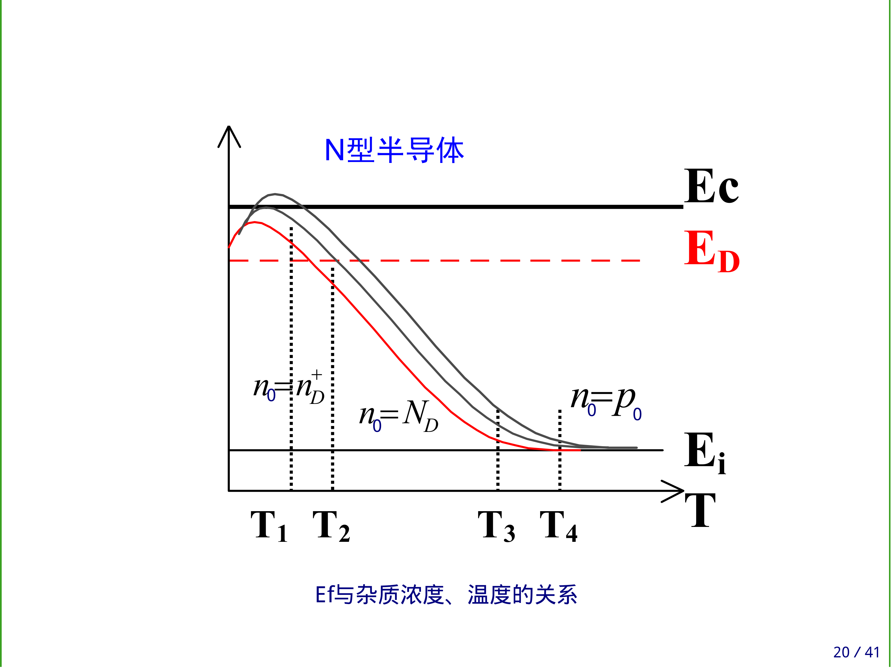
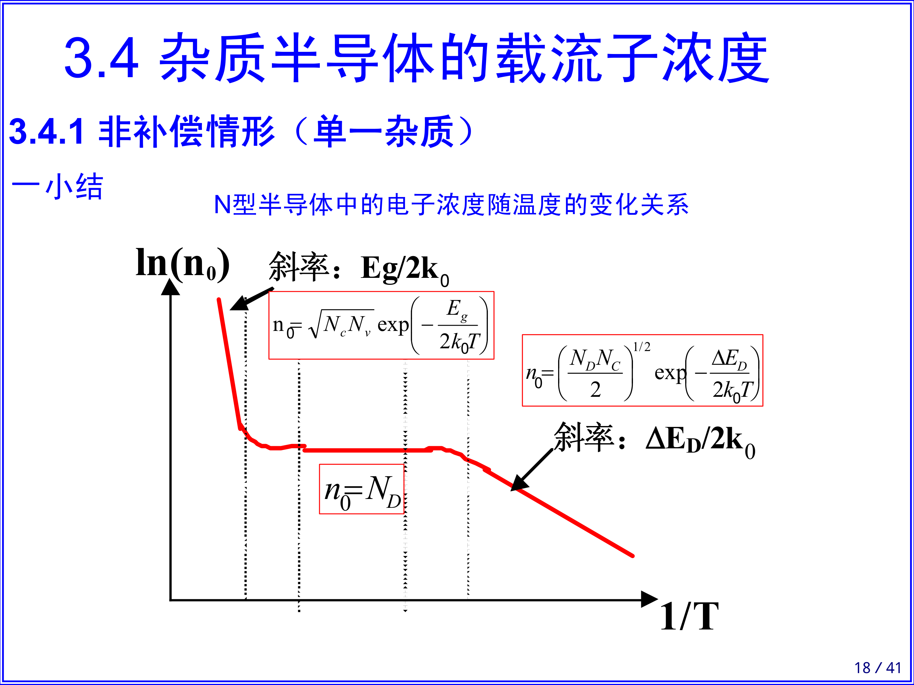
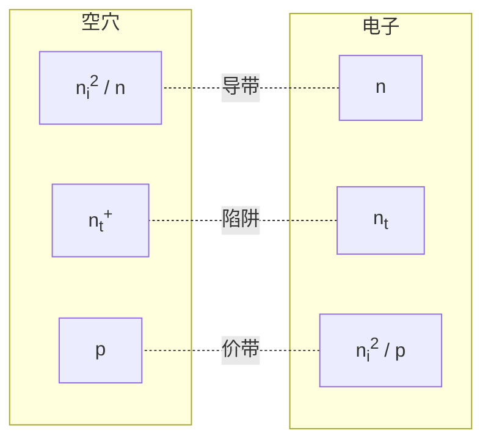
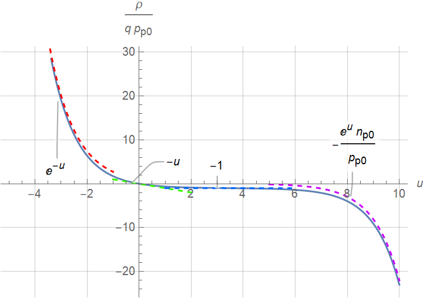
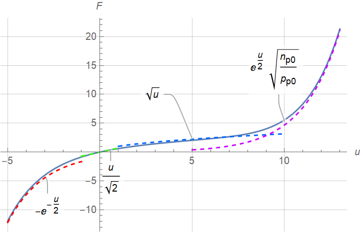

# 半导体物理

$$
\newcommand\SI[2]{#1\ \mathrm{#2}}  % siunitx (package)l
\def\FD{\operatorname{FD}}
\def\arsinh{\operatorname{arsinh}}
\def\Z{\mathbb{Z}}
$$

## §0 固体物理

> :material-clock-edit-outline: 2022年2月26日。

晶向、晶面分别用`[···]`、`(···)`表示，相应等价类分别用`<···>`、`{···}`表示。都是方向向量或法向量的坐标分量最简整数比。（负数写作“$\bar{\cdot}$”）

## §1 电子状态

> :material-clock-edit-outline: 2022年3月20日。

自由电子：$\vb*{p} = \hbar \vb*{k}$，$E = \hbar \omega$。

---

晶体中电子：$\vb*{p}_\text{crystal} := \hbar \vb*{k}$（“crystal”可能省略），$\vb*{v}_\text{group} = \dv{E}{\vb*{k}}$。

第一 Brillouin 区边界：$\exists \vb*{G} \in \Z \vb*{b}_1 + \Z b_2 + \Z \vb*{b}_3$，$\abs{\vb*{k} + \vb*{G}} = \abs{\vb*{k}}$，即 $\vb*{k} \vdot \vu*{G} = -\frac12 G$。

---

$\vb*{a} := \dv{t} \vb*{v}_\text{group}$，$\vb*{F} := \dv{t} \vb*{p}$，故

$$
\vb*{a} = \dv[2]{E}{\vb* p} \vb*{F}.
$$

其中的系数称为 inverse mass tensor。选取适当坐标轴，可对角化之，其分量还原为质量量纲后，称为（导带底或价带顶）电子（或空穴）有效质量 $m^*$。

---

> :material-clock-edit-outline: 2022年4月6日。

单电子近似：晶体中的某一个电子是在周期性排列且固定不动的原子核的势场，以及其它电子的平均势场（也有周期，且与原子核相同）中运动。

## §3 载流子浓度

### 背景

> :material-clock-edit-outline: 2022年4月6日。

热平衡：载流子激发与复合动态平衡。

### 一些公式

> :material-clock-edit-outline: 2022年3月20–21日。

基本都是在导带底或价带顶讨论的。

#### 状态密度

状态密度（考虑自旋）

$$
\begin{split}
    g 
    &:= \dv{Z}{E} \\
    &= \dv{Z}{\Omega_p} \dv{\Omega_p}{p} \dv{p}{E} \\
    &= 2 \qty(\frac{L}{2\pi \hbar})^3 \times 4\pi p^2 \times \frac{1}{v_\text{group}} \\
    &= \boxed{ \frac{V}{\pi^2 \hbar^3} p m_* }.
\end{split}
$$

其中 $p$ 是相对极值点的晶体动量。对于电子，$p = \sqrt{2 m_n^* (E-E_c)}$。

#### Fermi—Dirac 分布

Fermi—Dirac 分布中，量子态被电子占据的概率

$$
\boxed{ f = \FD{\frac{E-E_F}{k_B T}} }.
$$

其中 $E_F$ 称作 Fermi 能级，半导体物理中一般等于化学势 $\mu$。

> $\FD$ 函数是我随便起的名字，它指 standard logistic function 的“负”函数，即 $1 / (1 + \exp{x})$。
>
> 它的一些性质：
>
> - $\FD(x) + \FD(-x) = 1$。
>
> - $x\to +\infty$ 时，$\FD(x) \sim \exp(-x)$ ——Fermi—Dirac 分布退化为 Maxwell—Boltzmann 分布，此时称“非简并半导体”。
>
> - $\FD(x + \ln \gamma) + \FD(-x + \ln{\gamma^{-1}}) = 1$，即
> 
>   $$
>   \frac{1}{1+\gamma \exp{x}} + \frac{1}{1 + \gamma^{-1} \exp(-x)} = 1.
>   $$

#### 载流子浓度

导带电子、价带空穴浓度

$$
\begin{aligned}
n_0 &:= \frac{1}{V} \int\limits_\text{conduction} f g \dd{E}, \\
p_0 &:= \frac{1}{V} \int\limits_\text{valence} (1-f) g \dd{E}. \\
\end{aligned}
$$

**非简并**时（与 $k_BT$ 相比，$E_v \ll E_F \ll E_c$）可用 Maxwell—Boltzmann 分布替代 Fermi—Dirac 分布；积分区间可从 $(E_c, E_c')$ 或 $(E_v', E_v)$ 近似为 $(E_c, +\infty)$ 或 $(-\infty, E_v)$。计算可得

$$
\begin{aligned}
n_0 &= N_c \exp\frac{E_F - E_c}{k_B T}, \\
p_0 &= N_v \exp\frac{E_v - E_F}{k_B T}. \\
\end{aligned}
$$

其中

$$
\boxed{ N_{c/v} = 2 \sqrt{\frac{m_{n/p}^* k_B T}{2\pi \hbar^2}}^3 }
$$

称作有效状态密度。（量纲同倒空间中的体积）

故下式与 $E_F$ 无关。$n_\text{intrinsic}$ 称作本征载流子浓度。

$$
n_0 p_0 = N_c N_v \exp\frac{-E_\text{gap}}{k_B T} =: n_i^2.
$$

另外注意 $N_{c/v} = \order{T^{3/2}}$，故由 $T^{-3/2} \ln n_i$—$1/T$ 图线的斜率可测得 $E_g$。

使 $n_0 = p_0 = n_i$ 的 $E_F$ 记作 $E_i$。这样可给出更对称的形式：

$$
\begin{aligned}
n_0 &= n_i \exp\frac{E_F - E_i}{k_B T}, \\
p_0 &= n_i \exp\frac{E_i - E_F}{k_B T}. \\
\end{aligned}
$$

#### 杂质

每个杂质能级最多容纳一个电子，不像能带里那样可被自旋相反的两个电子占据。但仍类似 Fermi—Dirac 分布：

$$
\boxed{ f = \FD\qty(\frac{\Delta E}{k_B T} + \ln\frac{1}{g}) }.
$$

> 其中
>
> - $g$ 是基态简并度，又称简并因子。$g_\text{donor} = 2$，$g_\text{acceptor} = 4$。
> - 对于施主，$\Delta E = E_D - E_F$；对于受主，$\Delta E = E_F - E_A$。

一般 $E_F > E_A \gtrsim E_v$，$E_F <E_D \lesssim E_c$。

因此未电离的浓度 $n_D = N_D f$，$p_A = N_A f$。

电离的浓度自然是 $N(1-f)$，即

$$
\begin{aligned}
n_D^+ &= N_D \FD\qty(\frac{E_F - E_D}{k_B T} + \ln g_D), \\
p_A^- &= N_A \FD\qty(\frac{E_A - E_F}{k_B T} + \ln g_A). \\
\end{aligned}
$$

> 其中 $N_{D/A}$ 是施主／受主杂质浓度。

——离目标越远，电离浓度越低。

电中性条件：

$$
\boxed{ n_0 + p_A^- = p_0 + n_D^+ }.
$$

#### 非简并半导体的 $E_F$—$T$ 关系

##### 论证

联立以上几式，可解出 $E_F$，进而得到 $E_F$ 随温度 $T$ 的变化关系。

以掺了一种施主杂质的 n 型半导体为例。（$p_A^- = 0$，$n_D^+ > 0$）

1. 低温：“非主流”载流子可忽略（$\boxed{ p_0 = 0 }$，$n_0 = n_D^+$）。

  1. 弱电离：$n_D^+ \ll N_D$，施主电离部分退化为 Maxwell—Boltzmann 分布。
      
    $$
    n_D^+ = \frac{N_D}{g_D} \exp\frac{E_D - E_F}{k_B T}.
    $$

    故

    $$
    n_0 n_D^+ = N_c \frac{N_D}{g_D} \exp\frac{-\Delta E_D}{k_B T}.
    $$

    > 其中 $\Delta E_D := E_c - E_D$ 是电离能。

    代入电中性条件可得 $n_0 = \sqrt{n_0 n_D^+}$， 从而由 $T^{-3/4} \ln n_0$—$1/T$ 图线的斜率可测得 $\Delta E_D$。

    另外可解得

    $$
    2E_F = E_D + E_c + k_B T \ln\frac{N_D/g_D}{N_c}.
    $$

    > $E_F - \eval{E_F}_{T=0} = \order{T \ln T}$。

  2. 中间电离

    同上。

    $N_D / g_D = N_c$ 时，$E_F = \eval{E_F}_{T=0}$。

    $n_D^+ = N_D/g_D$ 时，$E_F = E_D$。

  3. 强电离（饱和区）：$n_D^+ = N_D$；与 $k_BT$ 相比，$E_F \ll E_D$，施主未电离部分退化为 Maxwell—Boltzmann 分布。

    $$
    n_0 = n_D^+ = N_D.
    $$

    代入电中性条件可得

    $$
    E_F = E_c + k_B T \ln\frac{N_D}{N_c}.
    $$

    一般就要求工作在此区。

2. 高温：本征激发显著。

  1. 过渡：仍然强电离（$n_D^+ = N_D$），但必须考虑“非主流”载流子。

    由电中性条件 $n_0 = N_D + p_0$，结合 $n_0 p_0 = n_i^2$ 得 $n_0^2 = N_Dn_0 + n_i^2$，从而可解得 $n_0$。从图象可知 $N_D \ll n_i$ 时 $n_0 \approx p_0$，$N_D \gg n_i$ 时 $n_0 \gg p_0$。

    又，$N_D = n_0 - p_0 = 2 n_i \sinh\frac{E_F - E_i}{k_B T}$，故
      
    $$
    E_F = E_i + k_B T \arsinh\frac{N_D}{2n_i}.
    $$

  2. 高温本征激发：与 $n_0, p_0$ 相比，$N_D \approx 0$。
   
    $2E_F \approx E_c + E_v$，载流子浓度取决于对温度非常敏感的本征激发载流子。

##### 总结

|     分区     |       杂质电离       |      本征激发       |
| :----------: | :------------------: | :-----------------: |
|    弱电离    |   $n_D^+ \ll N_D$    |      $p_0 = 0$      |
|   中间电离   | $n_D^+ \lesssim N_D$ |      （同上）       |
|    强电离    |    $n_D^+ = N_D$     |      （同上）       |
|     过渡     |       （同上）       |      $p_0 > 0$      |
| 高温本征激发 |       （同上）       | $n_0 = p_0 \gg N_D$ |

|     分区     |                            $n_0$                             |                            $E_F$                            |
| :----------: | :----------------------------------------------------------: | :---------------------------------------------------------: |
|    弱电离    | $\sqrt{n_0 n_D^+} = \sqrt{(\cdots)\exp(-\Delta E_D / k_B T)}$ |  $\frac12(E_c+E_D) + \frac12 k_B T \ln\frac{N_D/g_D}{N_c}$  |
|   中间电离   |        $n_D^+ = (\cdots) \FD\qty((E_F-E_D) / k_B T)$         |                     （仅特殊点易写出）                      |
|    强电离    |                            $N_D$                             |              $E_c + k_B T \ln\frac{N_D}{N_c}$               |
|     过渡     |                  （由 $n_0=p_0+N_D$ 解出）                   |            $E_i + k_B T \arsinh\frac{N_D}{2n_i}$            |
| 高温本征激发 |          $n_i = \sqrt{(\cdots) \exp(-E_g / k_B T)}$          | $E_i = \frac12(E_c+E_v) + \frac12 k_B T \ln\frac{N_v}{N_c}$ |

{: style="zoom: 20%;" }

{: style="zoom: 20%;" }

### 重制版

> 2022 年 4 月 16—17 日。

:material-eye-arrow-right: [载流子浓度公式记忆技巧 | 推送 (ydx-2147483647.github.io)](https://ydx-2147483647.github.io/subs-articles/carrier-concentration/)

## §5 非平衡载流子

### 一些公式

> :material-clock-edit-outline: 2022年5月29日。

模型：n 型半导体，光注入（两种非平衡载流子等浓度，即 $\Delta n = \Delta p$）。

复合率 $U \coloneqq \Delta p / \tau$，其中 $\tau$ 是寿命，而非平均自由时间。

判据：

- 小注入：$\Delta p \ll n_0 + p_0$。
  - 强 n 型：$n_0 \gg p_1 \gg n_1 \gg p_0$。（在此有 $\tau_p$）
  - 高阻：$p_1 \gg n_0 \gg p_0 \gg n_1$。

表面复合速度 $s \coloneqq U_s / \eval{\Delta p}_s$，其中 $U_s$ 是单位面积（而非单位体积）的复合速率。

### 间接复合

> :material-clock-edit-outline: 2022年5月29日。

“激发（generate）出导带电子、价带空穴”相当于“导带空穴、价带电子复合（recombine）”，书上都是按实际物理过程考虑，这里都按复合考虑。

一共有四种复合过程（两个叉，如下表），每种的复合率都正比于复合双方的浓度，另外若某个浓度几乎是零，则可看作常数。（其实并非“看作”，而是物理机制变了。）

| 复合一方 |                    导带                     |                     价带                     |
| :------: | :-----------------------------------------: | :------------------------------------------: |
|   电子   |     导带电子–陷阱空穴 $r_n n n_t^+.$     | 价带电子–陷阱空穴 $s_+n_t^+=r_pp_1n_t^+.$ |
|   空穴   | 导带空穴–陷阱电子 $s_-n_t = r_n n_1n_t.$ |       价带空穴–陷阱电子 $r_p pn_t.$       |

> 设简并因子为一，则 $n_{t0}^+ / n_{t0} = \exp\qty(\qty(E_t - E_F) / k_B T)$，由此可构造 $n_1,\ p_1$，恰好形式上同 $n_0,\ p_0$。

平衡时，$U = r_nnn_t^+ - r_nn_1n_t = r_ppn_t - r_pp_1n_t^+$，通过线性组合凑 $n_t + n_t^+ = N_t$，得

$$
\begin{split}
U
&= N_t \frac{
    \begin{vmatrix}
        r_nn & r_pp_1 \\
        r_nn_1 & r_pp \\
    \end{vmatrix}
}{
    r_n n + r_n n_1 + r_pp + r_pp_1
}
&= N_t \frac{r_n r_p \qty(p_0\Delta n + n_0\Delta p + \Delta n \Delta p)}{\cdots}.
\end{split}
$$

考察 $U$ 随 $E_t$ 的关系。注意 $n_1 p_1 = {n_i}^2$，故 $r_n n_1 + r_p p_1 \geq \sqrt{r_n r_p} n_i$，当 $r_n n_1 = r_p p_1$ 时取等。一般 $r_n \approx r_p$，于是 $n_1 \approx p_1$，故 $E_t \approx E_i$ ——有效复合中心在禁带中央附近。

再看 $U$，它的极限之一为 $N_t r_p \Delta p$，意义是 $\tau_p \Delta p$。

## §8 MIS 结构

### 理想情况

> :material-clock-edit-outline: 2022年5月24日。

以 Metal – Insulator – p-Semiconductor（Al – SiO~2~ – p-Si）为例。

理想 MIS 结构：

- $W_\text{metal} = W_\text{semiconductor}$。
- 绝缘层（insulator）无电荷且完全不导电。
- 无界面态。

> 与其说是理想结构，不如说是简化结构，比如第一条不满足也不会怎么样。

#### 电荷分布模型

$\rho = q(n_D^+ + p_p - p_A^- - n_p)$，与 $x$（到界面的距离）有关。又密度正比于 $\exp\frac{- \text{电势能}}{k_B T}$、体内（$x \to +\infty$）电中性，可得

$$
\frac{\rho}{q} = -n_{p0} \qty(\exp\frac{qV}{k_BT} - 1) + p_{p0} \qty(\exp\frac{-qV}{k_B T} - 1).
$$

> 其中 $V$ 含 $x$。

> 注意 Metal 那~儿~还有一些电荷，总体电荷守恒。后面考虑电场时也要记得这一点。

$\frac{qV}{k_BT}$ 将频繁出现，这里简记作 $u$。

注意是 p 型半导体，$n_{p0} \ll p_{p_0}$，再提出一个 $p_{p0}$ 有助于抓住主要矛盾：

$$
\begin{split}
\frac{\rho}{q p_{p0}}
&= \exp(-u) - 1 - \frac{n_{p0}}{p_{p0}} \qty(\exp{u} - 1) \\
&= \begin{cases}
    \exp(-u) & u \ll -1. \\
    -u & u \approx 0. \\
    -1 & 1 \ll u \ll \log\frac{p_{p0}}{n_{p0}}. \\
    \displaystyle
    -\frac{n_{p0}}{p_{p0}} \exp{u} & u \gg \log\frac{p_{p0}}{n_{p0}}.
\end{cases}
\end{split}
$$

> 若无 $n_{p0} \ll p_{p0}$（此时可能应写成 $n_0,\ p_0$），则 $u \approx 0$ 时近似为 $u \frac{n_0+p_0}{p_0}$。

{: style="zoom:67%;" }

#### 总电荷

以上只是各处电荷体密度，而讨论电容效应时涉及总电荷面密度 $Q_s$。

准备用高斯定理从电场强度 $E$ 求 $Q_s$ —— $E_s \coloneqq -\eval{\dv{V}{x}}_{x=0} = -Q_s/\varepsilon$。因为只有 $\rho$ 与 $V$ 的关系，不好直接积分。

> 还知道 $\laplacian V = - \rho /\varepsilon$，以及边界条件 $\eval{V}_{x=0} = V_s, \eval{V}_{x\to+\infty} = 0$，其中 $\varepsilon$ 是半导体的介电常数，s 表示 surface 或 semiconductor。

$$
\begin{split}
0
&= \int\limits_0^{+\infty} \qty(\dv[2]{V}{x} + \frac{\rho}{\varepsilon}) \dv{V}{x} \dd{x} \\
&= \int\limits_0^{+\infty} \dv{V}{x} \dv{x} \dv{V}{x} \dd{x} +
    \int\limits_0^{+\infty} \frac\rho\varepsilon \dv{V}{x} \dd{x} \\
&= \frac12 \eval{\qty(\dv{V}{x})^2}_{x=0}^{+\infty} +
    \int\limits_{E_s}^0 \frac\rho\varepsilon \dd{V} \\
&= -\frac12 {E_s}^2 - \int\limits_0^{E_s} \frac\rho\varepsilon \dd{V}.
\end{split}
$$

> 这种做法的三维版本是什么？向量曲线积分？可由 $\rho = \eval{\rho}_V$ 证明 $\rho \grad V$ 无旋，但 $(\laplacian V) \grad V$ 呢？

下面计算 $\int_0^{E_s} \rho/\varepsilon \dd{V}$。

先转换为 $u$：$\frac\rho\varepsilon \frac{q}{k_BT} \dd{V} = \frac{qp_{p0}}{\varepsilon} \frac{\rho}{qp_{p0}} \dd{u}$。设 Debye 长度

$$
\boxed{
L_D := \sqrt{ \frac{\varepsilon}{qp_{p0}} \frac{k_B T}{q}}
},
$$

> $L_D$ 与 $u_s$ 无关。

则

$$
L_D^2 \frac\rho\varepsilon \dd{V} = \qty(\frac{k_BT}{q})^2 \frac{\rho}{q p_{p0}} \dd{u}.
$$

再计算 $u$ 的积分。

$$
\begin{split}
\int\limits_0^{u_s} \frac\rho{qp_{p0}} \dd{u}
&= \int\limits_0^{u_s} \qty(\exp(-u) - 1 - \frac{n_{p0}}{p_{p0}} \qty(\exp{u} - 1)) \dd{u} \\
&= \eval{\qty(- \exp(-u) - u - \frac{n_{p0}}{p_{p0}} \qty(\exp{u} - u))}_0^{u_s} \\
&= 1-\exp(-u_s) - u_s - \frac{n_{p0}}{p_{p0}} \qty(\exp{u_s}-1 - u_s) \\
&=: - F^2.
\end{split}
$$

> $F$ 函数的正负与 $u_s$ 保持一致。
>
> $F$ 的各段近似也可直接由 $\frac{\rho}{q p_{p0}}$ 的近似得到。

{: style="zoom:67%;" }

综合上述内容，得

$$
\begin{aligned}
& \frac{{Q_s}^2}{2 \varepsilon^2} = \qty(\frac{k_BT}{q})^2 \frac{F^2}{{L_D}^2}. \\
& \implies \boxed{
    Q_s = -\sqrt{2} \varepsilon \frac{k_BT/q}{L_D} F.
}
\end{aligned}
$$

#### 微分电容

$$
\begin{split}
C_s &= \pdv{(-Q_s)}{V_s} \\
&= \pdv{u} \sqrt{2} \varepsilon \frac{1}{L_D} F \\
&= \boxed{\sqrt{2} \frac\varepsilon{L_D} \pdv{F}{u}}.
\end{split}
$$

注意 $F^2$ 比较规整，转化过去。

$$
\begin{split}
\pdv{F}{u}
&= \pm \pdv{u} \sqrt{F^2} \\
&= \frac{1}{2 F} \pdv{u}\qty(F^2) \\
&= \frac{1}{2 F} \qty(1-\exp(-u) + \frac{n_{p0}}{p_{p0}} \qty(1-\exp{u})) .
\end{split}
$$

故

$$
\boxed{
C_s = \frac{1}{\sqrt{2}} \frac{\varepsilon}{L_D} \frac{\pdv{u} F^2}{F}.
}
$$

#### 整个结构

前面只考虑了 Semiconductor，这里还要考虑 Insulator，看整个 MIS 结构的（微分）电容。

$$
C^{-1} = {C_\text{oxide}}^{-1} + {C_s}^{-1}.
$$

### 实际情况

> :material-clock-edit-outline: 2022年5月26日。

$V = V_\text{flat band}$ 是相当于原来的 $V$ 为零。其中平带电压 $V_{FB}$ 是以下因素的和。

- 功函数差：$-V_\text{ms} = - \frac{W_m - W_s}{-q}$。
- 绝缘层中电荷：$- \int_\text{oxide} \rho \dd{x} / (\varepsilon_\text{ox} / x)$。（$C_\text{ox} = \varepsilon_\text{ox} / d_\text{ox}$）
- I–S 表面附近固定电荷：$- Q_\text{fixed} / C_\text{ox}$。

## 数据

- 熔点：Si $\SI{1410}{\celsius}$，Ge $\SI{937}{\celsius}$。
- 纯 Si 室温（$\SI{300}{K}$）电阻率 $\SI{2\times 10^5}{\Omega\cdot cm}$。
- 正四面体共价键键角 $2\arccos\frac{1}{\sqrt3} = 109\degree 28'$。
- 晶体结构：Si、Ge 金刚石，GaAs（一般）闪锌矿。
- Si 单晶几何参数：晶格常数 $\SI{543}{pm}$，原子数密度 $\SI{5.00 \times 10^{22}}{cm^{-3}}$，原子半径 $\SI{118}{pm}$，原子体积占比 $34.0\%$。
- 电子惯性质量 $\SI{9.109 \cross 10^{-31}}{kg}$。
- 禁带宽度 $E_{\text{gap}}$：Si $\SI{1.12}{eV}$，Ge $\SI{0.67}{eV}$，GaAs $\SI{1.43}{eV}$。
- Si 相对介电常数 $12$。
- $k_B \times(\SI{300}{K}) \approx \SI{25.9}{meV}$。
- 室温下 Si 本征载流子浓度 $n_\text{intrinsic} \approx \SI{1.0 \times 10^{10}}{cm^{-3}}$，导带底有效状态密度 $N_{\text{conductance}} \approx \SI{2.8 \times 10^{19}} {cm^{-3}}$，价带顶有效状态密度 $N_{\text{valency}} = \SI{1.1 \times 10^{19}} {cm^{-3}}$。

# 后备箱

- $\SI{1}{cm^{{-3}}} = \SI{10^{6}} {m^{-3}}$。
