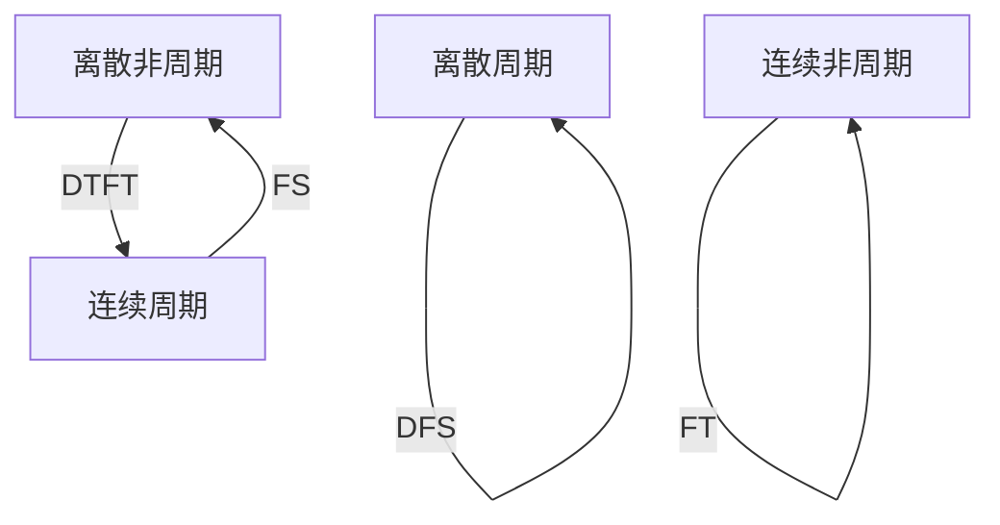

---
relevant:
  - ./calculus-1.md
  - ./complex-functions-and-equations-of-mathematical-physics.md
---

# 信号与系统

$$
\def\period#1{\left<#1\right>}
\DeclareMathOperator\sinc{sinc}
\def\N{\mathbb{N}}
\def\Z{\mathbb{Z}}
\def\Q{\mathbb{Q}}
\def\R{\mathbb{R}}
\def\C{\mathbb{C}}
$$

## Fourier 分析

### 周期—离散

> :material-clock-edit-outline: 2022年5月4日。

“一个域周期”与“另一域离散”等价。

> - D: discrete.
> - F: Fourier.
> - T: transform / time.
> - S: series.

|                                 | $x(t)$ | $x[n]$ |
| :-----------------------------: | :----: | :----: |
|              $c_k$              |   FS   |  DFS   |
| $X(\omega)$ 或 $X(e^{j\Omega})$ |   FT   |  DTFT  |

### 综合—分析

> :material-clock-edit-outline: 2022年5月4日。

|                                 |                           $x(t)$                            |                            $x[n]$                            |
| :-----------------------------: | :---------------------------------------------------------: | :----------------------------------------------------------: |
|              $c_k$              | $c_k = \frac{1}{T_0} \int_{T_0} x e^{-jk\omega_0 t} \dd{t}$ | $c_k = \frac{1}{N} \sum_{k\in\period{N}} x e^{-jk\Omega_0 n}$ |
| $X(\omega)$ 或 $X(e^{j\Omega})$ |       $X(\omega) = \int_{\R} x e^{-j\omega t}\dd{t}$        |      $X(e^{j\Omega}) = \sum_{n\in\Z} x e^{-j\Omega n}$       |

|                                 |                            $x(t)$                            |                            $x[n]$                            |
| :-----------------------------: | :----------------------------------------------------------: | :----------------------------------------------------------: |
|              $c_k$              |        $x(t) = \sum_{k \in \Z} c_k e^{jk\omega_0 t}$         |     $x[n] = \sum_{k\in\period{N}} c_k e^{jk\Omega_0 n}$      |
| $X(\omega)$ 或 $X(e^{j\Omega})$ | $x(t) = \frac{1}{2\pi} \int_{\R} X e^{j\omega t} \dd{\omega}$ | $x[n] = \frac{1}{2\pi} \int_{2\pi} X e^{j\Omega n} \dd{\Omega}$ |

### 常用变换对

> :material-clock-edit-outline: 2022年6月13、15、19日。

#### FT

|              $x(t)$              |                         $X(\omega)$                          |
| :------------------------------: | :----------------------------------------------------------: |
|             $\delta$             |                             $1$                              |
|               $1$                |                        $2\pi \delta$                         |
|               $u$                |               $\frac{1}{j\omega} + \pi\delta$                |
|              $G_T$               |                  $T \sinc\frac{T\omega}{2}$                  |
| $\sin(\omega_c t) / \qty(\pi t)$ |                       $G_{2\omega_c}$                        |
|       $\sinc(\omega_c t)$        |             $\frac{\pi}{\omega_c} G_{2\omega_c}$             |
|    $e^{-at} u$，$\Re\ a > 0$     |                   $\frac{1}{a + j\omega}$                    |
|   $t e^{-at} u$，$\Re\ a > 0$    |               $\frac{1}{\qty(a + j\omega)^2}$                |
|  $\sum \eval{\delta}_{t-T_0\Z}$  | $\omega_0\sum \eval{\delta}_{\omega - \omega_0 \Z}$，$\omega_0 T_0 = 2\pi$ |

#### Laplace

|           $x(t)$            |                $X(s)$                 |      ROC      |
| :-------------------------: | :-----------------------------------: | :-----------: |
|          $\delta$           |                  $1$                  |     $\C$      |
|             $1$             |             $2\pi \delta$             |     $\C$      |
|         $e^{-at} u$         |           $\frac{1}{a + s}$           | $\Re\ s > -a$ |
|  $-e^{-at} \eval{u}_{-t}$   |            $\frac{1}{a+s}$            | $\Re\ s < -a$ |
| $t e^{-at} u$，$\Re\ a > 0$ |       $\frac{1}{\qty(a + s)^2}$       | $\Re\ s > -a$ |
|    $\cos(\omega_0 t) u$     |    $\frac{s}{s^2 + {\omega_0}^2}$     | $\Re\ s > 0$  |
|    $\sin(\omega_0 t) u$     | $\frac{\omega_0}{s^2 + {\omega_0}^2}$ | $\Re\ s > 0$  |

#### DTFT

> 下表中 $z = e^{j\Omega}$。

|              $x[n]$              |                 $X(e^{j\Omega})$                 |
| :------------------------------: | :----------------------------------------------: |
|             $\delta$             |                       $1$                        |
|               $1$                |               周期化 $2\pi\delta$                |
|               $u$                |      周期化 $\frac{1}{1-1/z} + \pi \delta$       |
| $\alpha^n u$，$\abs{\alpha} < 1$ |            $\frac{1}{1 - \alpha /z}$             |
|        $(n+1) \alpha^n u$        |          $\frac{1}{\qty(1-\alpha/z)^2}$          |
| $G_\tau$，其中 $\tau \in 2\N +1$ | $\sin(\frac\tau2 \Omega) / \sin(\frac12 \Omega)$ |
| $\sin(\omega_c n) / \qty(\pi n)$ |              周期化 $G_{2\omega_c}$              |

#### Z

> ROC: Range of convergence.

|           $x[n]$            |                $X(z)$                 |           ROC            |
| :-------------------------: | :-----------------------------------: | :----------------------: |
|          $\delta$           |                  $1$                  |           $\C$           |
|         $\alpha^nu$         |        $\frac{1}{1-\alpha/z}$         | $\abs{z} > \abs{\alpha}$ |
| $-\alpha^n \eval{u}_{-n-1}$ |               （同上）                | $\abs{z} < \abs{\alpha}$ |
|     $(n+1) \alpha^n u$      |    $\frac{1}{\qty(1-\alpha/z)^2}$     | $\abs{z} > \abs{\alpha}$ |
|     $n \alpha^n u$      | $\frac{\alpha z}{\qty(z - \alpha)^2}$ |         （同上）         |

### 一些容易忘的性质

> :material-clock-edit-outline: 2022年6月19日。

- 对偶：$\eval{X}_t \leftrightarrow 2\pi \eval{x}_{-\omega}$ 或 $\eval{X^*}_t \leftrightarrow 2\pi \eval{x^*}_\omega$。
- Z 域尺度变换、频移：$a^n x \leftrightarrow \eval{X}_{z/a}$。（ROC 会变化）

### Fourier 变换与 Laplace 变换

> :material-clock-edit-outline: 2023年10月19日。

$j \omega = \lim_{\Re\ s \to 0} s$。

例如 $u$ 的 Fourier 变换是 $\frac{1}{j\omega} + \pi \delta$，Laplace 变换是 $\frac{1}{s}$。$\Im\ s \neq 0$ 的常规区域自不必说，$s \to 0$ 时 $\frac{1}{s} \to \infty$，但这是 $\delta$ 吗？确实如此。设 $\sigma \coloneqq \Re\ s > 0$，则

$$
\begin{split}
\int_\R \frac{\dd{\omega}}{s}
&= \int_{\sigma + j\R} \frac{\dd{s}}{s} \\
&= \eval{\ln s}_{\sigma-j\infty}^{\sigma+j\infty} \\
&\equiv \frac\pi2 - \qty(- \frac\pi2) \\
&= \pi. \\
\end{split}
$$

## Z 变换

> :material-clock-edit-outline: 2022年6月29日。

Z 变换就是序列的生成函数。

## 杂项

### 积分变换法解微分方程

> :material-clock-edit-outline: 2022年7月4日。

$$
\dv{t}v + av + b = 0.
$$

- 时域凑微分。

  $$
  \dv{t}\qty(e^a v) = e^a b.
  $$

  故 $e^{at}v - \eval{v}_0 = \frac{b}{a}\qty(1-e^{at})$，

  $$
  v = \qty(\eval{v}_0 + \frac{b}{a}) e^{-at} - \frac{b}{a}.
  $$

- 在 $t\in\R^+$ 考虑，$b$ 应看成 $bu$。

  $$
  \begin{split}
  & \qty(sV-\eval{v}_{0^-}) + aV+ \frac{b}{s} = 0. \\
  &\implies V = \frac{b}{s(s+a)} + \frac{\eval{v}_0}{s+a} = \frac{b/a}{s} + \frac{\eval{v}_0 -b/a}{s+a}. \\
  &\implies v = \qty(\eval{v}_0 + \frac{b}{a}) e^{-at}u - \frac{b}{a}u.
  \end{split}
  $$

- 在 $t\in\R$ 考虑。

  $$
  V = \qty(\eval{v}_0 + \frac{b}{a}) \times 2\pi \eval{\delta}_{s+a} - \frac{b}{a} 2\pi\delta.
  $$

  这确实满足 $sV + aV + 2\pi b \delta = 0$，但体现不出 $2\pi \eval{\delta}_{s+a}$。（$s\delta \equiv 0$）

注意积分性质 $\mathcal{L} \int X\dd{t} = X/s + \int_{\R^-}x\dd{t} / s$。

### Dirac δ

> :material-clock-edit-outline: 2023年1月9日。
>
> :material-eye-arrow-right: [real analysis - Can $e^{c\delta(t)}$ be rewritten some how? - Mathematics Stack Exchange](https://math.stackexchange.com/a/1115921/1031068)

事实上 $\delta$ 可看成 $\R^\R \to \R$ 的映射。

$$
\int\limits_\R f \delta \dd{t} \coloneqq \eval{f}_0.
$$

> $Y^X$ is the set of functions that maps $X \to Y$. (in the sense of $\abs{Y}^\abs{X}$)

# 后备箱

- 复合变换时总是变换整个函数的自变量，而非最外层函数的自变量。

- $\sin(\omega \Z)$ 仅在 $2\pi / \omega \in \Q$ 时有周期。

- 范围
  - 解微分方程时注意自变量的范围。（或乘上 $u$）

  - 区分单边信号和双边信号。双边信号可能是 LTI 系统的**特征函数**。

    例如，Laplace 变换涉及 $\sin(\omega_c t) u$ 时应考虑卷积，而涉及 $\sin(\omega_c t)$ 时应考虑频移定理。

  - 注意系统函数的**<u>收敛域</u>**，尤其是 Laplace 变换的。

  - 单边 Laplace 变换默认是右边。

- 注意 $\eval{\delta}_{x/a} = a\eval{\delta}_x$，$a > 0$。

- 频域卷积定理、Parseval 定理、对偶性质有 $\boxed{\frac{1}{2\pi}}$。

- 可以合并同类项。

- $\mathcal{L} \dv{t} x = sX - \eval{x}_{0^-}$，$\mathcal{Z}\eval{x}_{n-1} = X/z + \eval{x}_{-1}$，差不少。

- 频率响应用 $H(\omega)$ 表示，别用 $H(s)$。

- 注意**正负号**：平移信号，时移、频移定理。

- 区分最大频率 $\omega_m$ 和 Nyquist 抽样率 $\omega_c = 2 \omega_m$。

- 区分卷积和乘积。

- $\max[G_{T_1} * G_{T_2}] = \min[T_1, T_2]$，是最大重合面积，不是面积之积。

- 使用终值定理前，要先检查是否存在终值。

- $\eval{\delta}_t \eval{f}_t = \eval{\delta}_t \eval{f}_0 \neq \eval{f}_0$。

- $\alpha^n u$ 在 $\abs{\alpha} \leq 1$ 时才存在 DTFT。（取等时有奇异函数）
