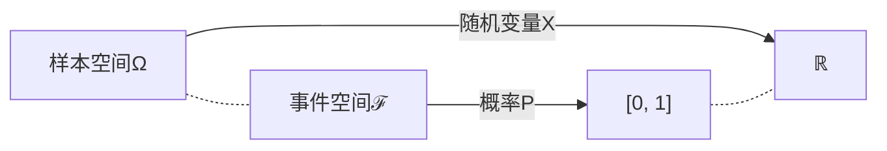
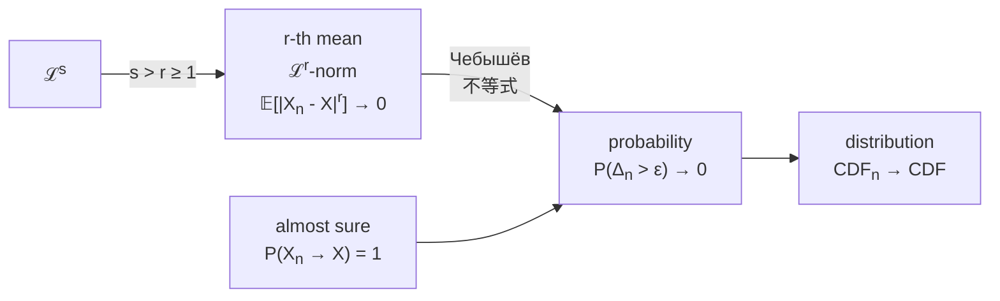

---
relevant:
  - ./probability-and-statistics.md
  - ./signals-and-systems.md
  - ./information-theory-and-coding.md:
      dir: both
---

# 随机信号分析

$$
\DeclareMathOperator\expect{\mathbb{E}}
\def\tran{\mathsf T}
\def\Z{\mathbb{Z}}
\def\R{\mathbb{R}}
\newcommand\mark[1]{{\color{teal}#1}}
\DeclareMathOperator\sgn{sgn}
$$

## §1 概率论

### 连续型随机变量或分布

> :material-clock-edit-outline: 2023年2月22–23日。

确实有“像集可数/不可数 ⇔ 离散/连续型随机变量”的说法，但按这种定义，连续型随机变量并不一定有概率密度（从而与“连续型分布”定义不一致）：随机变量只涉及样本空间，都没谈概率呢。实际上，这种定义下还要进一步“绝对连续”才能有概率密度。

我们学的时候是先有累积分布，再借积分定义“连续型分布”，顺带绕回来提“连续型随机变量”。

像集不可数（甚至连续）但不是连续型的反例：

- 混合型。
- [Cantor 分布](https://en.wikipedia.org/wiki/Cantor_distribution)。

事实上按 [Lebesgue 分解](https://en.wikipedia.org/wiki/Lebesgue%27s_decomposition_theorem#Refinement)，随机变量可以分解成三部分：

- **绝对连续**：一般所谓的连续型。
- **奇异连续**：如上面的 Cantor 分布。
- **离散**：纯点状。

### 多变量正态分布的边缘分布和条件分布

> :material-clock-edit-outline: 2023年2月22日–2023年3月5日。

#### 铺垫

[多变量正态分布](https://en.wikipedia.org/wiki/Multivariate_normal_distribution)有均值 $\vb*\mu$、协方差 $\Sigma$ 两个参数。

- 只考虑 $\vb*\mu = \vb*0$ 情形；若不为零，考虑减去 $\vb*\mu$ 的随机变量即可。
- 设随机变量 $X\in\R^{n\times 1}$，则 $\Sigma \coloneqq \expect[(X-\vb*\mu) (X-\vb*\mu)^\tran]$ 从而对称、半正定。下面只考虑正定的 $\Sigma$；若是退化情形，改到子空间考虑即可。

仍设随机变量 $X\in\R^{n\times 1}$，此时联合概率密度为

$$
\frac{1}{\sqrt{\abs{2\pi \Sigma}}} \exp(-\frac{\vb*X^\tran \Sigma^{-1} \vb*X}{2}).
$$

也可用 [precision matrix](https://stats.stackexchange.com/questions/10795/how-to-interpret-an-inverse-covariance-or-precision-matrix) $\Phi = \Sigma^{-1}$ 写为

$$
\sqrt{\abs{\frac{\Phi}{2\pi}}} \exp(-\frac{\vb*X^\tran \Phi \vb*X}{2}).
$$

在正态分布中，

- $\Phi_{ij} = 0 \iff$ $X_i, X_j$ 条件独立。（给定其它随机变量下）

  给定条件下，$\Phi_{ij} = 0$ 意味着联合概率密度无交叉项 $x_i x_j$，可直接分解为两个边缘密度。

- 分量两两线性无关 $\iff$ 分量相互独立。

  此时 $\Sigma$ 是对角阵，于是 $\Phi$ 也是。

#### 边缘分布和条件分布

现在设随机变量为

$$
\begin{bmatrix}
    \vb*X \\ \vb* Y
\end{bmatrix},
$$

相应设

$$
\begin{aligned}
\Sigma &= \begin{bmatrix}
    \Sigma_{XX} & \Sigma_{XY} \\
    \Sigma_{YX} & \Sigma_{YY} \\
\end{bmatrix}, \\
\Phi &= \begin{bmatrix}
    \Phi_{XX} & \Phi_{XY} \\
    \Phi_{YX} & \Phi_{YY} \\
\end{bmatrix}. \\
\end{aligned}
$$

!!! note "这很自然"

    例如，概率密度中的指数是 $\vb*X^\tran \Phi_{XX} \vb*X + \vb*X^\tran \Phi_{XY} \vb*Y + \vb*Y^\tran \Phi_{YX} \vb*X + \vb*Y^\tran \Phi_{YY} \vb*Y$。

考虑分布 $\vb*X$ 和 $\vb*Y | \vb*x$。

- **边缘分布 $\vb*X$**
  - $\mu_{\vb*X} = \vb*0$。
  - $\Sigma_{\vb*X} = \Sigma_{XX}$。

- **条件分布 $\vb*Y|\vb*x$**
  - $\mu_{\vb*Y | \vb*x} = \Sigma_{YX} {\Sigma_{XX}}^{-1} \vb*x$。

    这与最小二乘法一致。

    !!! info "最小二乘法"

        模型为 $y_i = A_{ij}\, x_j$，收到样本（samples）$y_{is}$ 与 $x_{js}$。试图解 $y_{is} = A_{ij}\, x_{js}$，但无解，转而考虑方程

        $$
        y_{is}\ x_{sk} = A_{ij}\ x_{js}\ x_{sk},
        $$

        于是 $\hat A_{ij} = \qty(y_{is}\ x_{sk}) \times \qty(x_{js} x_{sk})^{-1}$。

        把样本均值转为期望便是 $\hat A = \Sigma_{YX} {\Sigma_{XX}}^{-1}$。

  - $\Phi_{\vb*Y | \vb*x} = \Phi_{YY}$。

    若用 $\Sigma$ 表示，则为 $\Sigma / \Sigma_{XX}$（$\Sigma_{XX}$ 在 $\Sigma$ 中的 [Schur complement](https://en.wikipedia.org/wiki/Schur_complement)）。

这可以理解为配方：

$$
\begin{bmatrix}
    \vb*x \\ \vb*y
\end{bmatrix}^\tran
\Phi
\begin{bmatrix}
    \vb*x \\ \vb*y
\end{bmatrix}
=
\qty(\vb*y - \mu_{\vb*Y | \vb*x})^\tran \Phi_{YY} \qty(\vb*y - \mu_{\vb*Y | \vb*x})
+ \vb*{x}^\tran {\Sigma_{XX}}^{-1} \vb*x.
$$

!!! note "验证"

    将上式展开，反复利用 $\Phi \Sigma = I = \Sigma \Phi$ 的分块形式即可。

### 特征函数

> :material-clock-edit-outline: 2023年5月14日。

!!! note "变体"

    存在多种定义，它们只有自变量不同：$\pm u$（characteristic function）或 $\pm t = \pm j u$（moment-generating function）。

$$
C_\vb*{X} = \expect e^{j \vb*{u} \vdot \vb*{X}}
= \sum_{n\in\Z} \frac{\expect (j \vb*{X} \vdot \vb*{u})^n}{n!},
$$

——各阶原点矩的线性组合。

### 随机变量序列的收敛性

> :material-clock-edit-outline: 2023年5月14日。
>
> :material-eye-arrow-right: [Convergence of random variables - Wikipedia](https://en.wikipedia.org/wiki/Convergence_of_random_variables).

## §2 随机过程

### 化循环平稳为平稳

> :material-clock-edit-outline: 2023年3月16日。

!!! note "平稳"

    此处指[广义平稳](./information-theory-and-coding.md#平稳与遍历)。

设 $X$ 是周期为 $T$ 的[循环平稳随机过程](https://en.wikipedia.org/wiki/Cyclostationary_process)，即

$$
\begin{cases}
    \forall t\in\R, \quad&
        \expect \eval{X}_t = \expect \eval{X}_{t+T}. \\
    \forall t_1, t_2 \in\R, \quad&
        \expect(\eval{X}_{t_1} \eval{X}_{t_2}) = \expect(\eval{X}_{t_1+T} \eval{X}_{t_2+T}). \\
\end{cases}
$$

另取与之独立的随机变量 $A \sim U(0,T)$，则 $\eval{Y}_t \coloneqq \eval{X}_{t-a}$ 平稳。

例如 $Y$ 的均值时间平移不变：

$$
\begin{split}
    \expect \eval{Y}_t
    &= \underset{a}\expect\
        \underset{x | a}\expect\
        \eval{x}_{t-a} \\
    &= \underset{a}\expect\
        \underset{x}\expect\
        \eval{x}_{t-a} \\
    &= \int\limits_0^T \frac{\dd{a}}{T} \times \underset{x}\expect\
        \eval{x}_{t-a} \\
    &= \int\limits_0^T \frac{\dd{a}}{T} \times \underset{x}\expect\
        \eval{x}_{a}, \\
\end{split}
$$

从而不含 $t$。这些等号的依据如下。

1. $Y$ 的构造。

   $\expect_{x|a}$ 表示在 $A=a$ 条件下考虑 $X$ 的分布。

2. $A,X$ 独立：$p(x,t | a) = p(x,t)$。（$p$ 是概率密度）

  若考虑自相关，则进一步需要二维联合分布与 $A$ 独立。

3. $A$ 均匀分布。

4. 周期函数的性质。

  将 $u \mapsto \expect_x \eval{x}_{u}$ 记作 $f$，它具有周期 $T$。

$$
  \begin{split}
      \int\limits_0^T \eval{f}_{t-a} \dd{a}
      &= \int\limits_{t-T}^{t} \eval{f}_u \dd{u} \\
      &= \int\limits_0^t \eval{f}_u \dd{u} - \int\limits_0^{t-T} \eval{f}_u \dd{u} \\
      &= \int\limits_0^t \eval{f}_u \dd{u} - \int\limits_0^{t-T} \eval{f}_\mark{u+T} \dd{u} \\
      &= \int\limits_0^t \eval{f}_u \dd{u} - \int\limits_\mark{T}^\mark{t} \eval{f}_\mark{u} \dd{u} \\
      &= \int\limits_0^T \eval{f}_u \dd{u}. \\
  \end{split}
$$

  若考虑自相关，此处 $f$ 是

$$
  \qty(\frac{t_1+t_2}2,\ t_2-t_1)
  \mapsto \underset{x}\expect\qty(\eval{x}_{t_1-a} \eval{x}_{t_2-a}),
$$

  它对第一个自变量具有周期 $T$，推理仍适用。

### 自相关的周期分量

> :material-clock-edit-outline: 2023年4月21日，2023年5月16日。
>
> :material-eye-arrow-right: [autocorrelation - Does the auto-correlation function of stationary random process always converge? - Signal Processing Stack Exchange](https://dsp.stackexchange.com/questions/51877/does-the-auto-correlation-function-of-stationary-random-process-always-converge).
>
> :material-eye-arrow-right: [Wold's theorem - Wikipedia](https://en.wikipedia.org/wiki/Wold%27s_theorem).

平稳信号的自相关在 $\tau \to +\infty$ 时极限可能不存在，例如随机相位信号，$\lim \frac12 \cos(\omega_0 \tau)$ 就不存在。

根据 Wold 定理，随机信号似乎可被分解为三部分：

- 确定信号，如 $\sin(\omega_0 t)$。
- 可预测随机信号，如 $\sin(\omega_0 t + \Phi)$。
- 不可预测随机信号，如白噪声。（innovations part）

可预测部分提供自相关的周期分量。

!!! question "仍存在疑问"

    任给函数，如何定义它的周期分量？

## §3 谱分析

### Wiener–Хи́нчин–Einstein 定理

> :material-clock-edit-outline: 2023年4月13日。
>
> :material-eye-arrow-right: [The Wiener-Khinchin Theorem](https://www.comm.utoronto.ca/frank/notes/wk.pdf).

该定理不仅限于平稳随机信号，也适用于确定信号和一般随机信号；而且即使 Fourier 变换不存在，该定理仍有某种形式。

Einstein 识别出了自相关与功率谱密度的关系，Wiener 研究了确定信号，Хи́нчин 研究了随机信号。

### $A \cos(\Omega t + \Theta)$

> :material-clock-edit-outline: 2023年5月15日。

$A, \Omega, \Theta \in \R$ 是相互独立的三个随机变量。

随机过程 $A \cos(\Omega t + \Theta)$ 的自相关

$$
\begin{split}
R
&\coloneqq \expect[A \cos(\Omega t_1 + \Theta) \times A \cos(\Omega t_2 + \Theta)] \\
&= \expect[A^2] \times \frac{\expect[\cos(\Omega \tau)] + \expect[\cos(\Omega (t_1+t_2) + 2\Theta)]}{2}.
\end{split}
$$

!!! note "平稳性"

    这一般并不平稳。若再考虑时间平均，最后一项化为零。（除非 $\Omega = 0$）

若 $2\Theta$ 在一周内均匀分布，则 $\expect[\cos(\cdots + 2\Theta)] = 0$，从而 $R = \frac12 \expect A^2 \times \expect\cos(\Omega \tau)$。事实上

$$
\begin{split}
\expect\cos(\Omega \tau)
= \int f_\Omega \cos(\omega \tau) \dd{\omega}
= \Re \int f_\Omega e^{j \omega \tau} \dd{\omega},
\end{split}
$$

与 Fourier 变换相关，其功率谱密度与直观一致，具体来说是

$$
2\pi \times \frac{\eval{f_\Omega}_\omega + \eval{f_\Omega}_{-\omega}}{2}.
$$

随机过程 $A e^{j(\Omega t + \Theta)}$ 则更简单：

$$
\begin{split}
R
&\coloneqq \expect[A e^{-j(\Omega t_1 + \Theta)} \times A e^{j(\Omega t_2 + \Theta)}] \\
&= \expect A^2 \times \expect e^{j\Omega \tau}.
\end{split}
$$

$$
S = \expect A^2 \times 2\pi f_\Omega.
$$

!!! note "关系"

    $2 A \cos(\Omega t + \Phi) = \sum A e^{j(\pm\Omega t \pm\Phi)}$，后两项的自相关分别是

    $$
    R_{\pm \pm} = \expect A^2 \times \expect e^{\pm j\Omega \tau},
    $$

    而互相关是

    $$
    \begin{split}
    R_{-+}
    &\coloneqq \expect[A e^{-j(-\Omega t_1 - \Theta)} \times A e^{j(\Omega t_2 + \Theta)}] \\
    &= \expect A^2 \times \expect e^{j(\Omega (t_1 + t_2) + 2\Theta)},
    \end{split}
    $$

    一般并不为零。

    因此，$A \cos(\Omega t + \Phi)$ 的自相关

    $$
    \begin{split}
    R
    &\coloneqq \frac{R_{++} + R_{+-} + R_{-+} + R_{--}}{4} \\
    &= \frac{R_{++} + R_{--}}{4} + \frac{R_{-+} + R_{+-}}{4} \\
    &= \frac{1}{2} \Re[R_{++} + R_{-+}]. \\
    \end{split}
    $$

## §4 随机信号通过系统

### 中心极限定理

> :material-clock-edit-outline: 2023年5月16日。

<u>大量</u>相互<u>独立</u>的随机变量的<u>算术和</u>标准化后服从正态分布。

下面以独立同分布随机变量序列 $\qty{X_i}$ 为例。

!!! note "推广"

    分布不一致但均值、方差一致的随机向量序列。

记每一 $X$ 的特征函数为 $C \coloneqq \expect e^{j u X}$。不妨设 $\expect X = 0$、$\expect {X}^2 = 1$。于是 $\eval{\dv{C}{u}}_{u=0} = j \times 0 = 0$，$\eval{\dv[2]{C}{u}}_{u=0} = j^2 \times 1 = -1$，即 $u \to 0$ 时，$C = 1 - u^2 / 2 + o(u^2)$。

由于独立，$\sum_{i=1}^n X_i$ 的特征函数为 $\prod_{i=1}^n C = C^n$。

注意 $\sum X$ 的均值为零，方差为 $n$，标准化后为 $\sum X / \sqrt{n}$，它的特征函数

$$
\begin{split}
   C_n
   &= \eval{C^n}_{u / \sqrt{n}} \\
   &= \qty(1 - \frac12 \qty(u / \sqrt{n})^2 + o\qty(\qty(u / \sqrt{n})^2))^n \\
   &= \qty(1 - \frac{u^2}{2n} + o\qty(\frac{u^2}{n}))^n. \\
\end{split}
$$

$n \to +\infty$ 时，这是 $1^\infty$ 型极限，

$$
\begin{split}
    \ln C_\infty
    &= \lim
       n \qty(- \frac{u^2}{2n} + o\qty(\frac{u^2}{n})) \\
    &= \lim
       \frac{o(u^2 / n)}{u^2 / n} \times u^2 - \frac{u^2}{2} \\
    &= -\frac{u^2}{2}.
\end{split}
$$

——这正对应标准正态分布。

随机信号通过线性时不变系统时，即使输入不服从正态分布，输出也可能因中心极限定理而服从（联合）正态分布。

- 算术和——线性系统的输出是各时刻输入的线性组合。
- 大量——这种线性组合是个积分。
- 独立——若输入的相关时间远小于系统的相关时间（即输入的带宽远大于系统的带宽），可认为输入不同时刻相互独立。

## §5 窄带随机过程

### 实信号表示为解析信号

> :material-clock-edit-outline: 2023年5月15日。

解析信号是相量（phasor）的推广。

给定确定实信号 $x$，可构造解析信号 $\tilde x = x + j \hat x$，保证只有正频率。

$$
\begin{aligned}
   j \hat X &= X \sgn \omega. \\
   \tilde X &= 2 X u = 2 j\hat X u.
\end{aligned}
$$

!!! note "时域"

    $\sgn t \leftarrow e^{0^- t} \sgn t \leftrightarrow \frac{2}{0^+ + j\omega} \rightarrow \frac{2}{j\omega}$，$-\frac{1}{j\pi t} \leftrightarrow \sgn \omega$，$\frac{1}{\pi t} \leftrightarrow \sgn \omega / j$。

    $x \mapsto \hat x$ 称作 Hilbert 变换 $\mathcal H$。这是一种线性时不变系统，并且 $\delta$ 响应 $\frac{1}{\pi t}$ 是奇函数。

!!! note "功率谱"

    频谱乘单位复数不改变功率谱密度，$S_x = S_{j \hat x} = S_{\hat x}$。

    $\tilde x = x + j\hat x$ 的功率谱在负频率反相相消，在正频谱同相叠加，于是 $S_{\tilde x} = 4 S_x u$。

    若谈总功率，$E_{\tilde x} = 2 E_x = 2 E_{\hat x}$。

若 $x$ 的频谱集中在 $\pm\omega_0$ 附近，正负频率无交叠（例如 $x = \cos(\omega_0 t)$），则容易采用复信号表示：

$$
\tilde x = \tilde A e^{j\omega_0t},
$$

其中 $\tilde A$ 称作复振幅（复包络），频谱集中在 $0$ 附近，形状、强度同 $\tilde X$。

上式详细写开如下。

$$
\begin{array}{c|cc}
\tilde x & e^{j \omega_0 t} & \tilde A \\
\hline
x + j\hat x & \cos(\omega_0 t) + j \sin(\omega_0 t) & A_c + jA_s \\
\end{array}
$$

$$
\begin{cases}
x &= \begin{bmatrix} \cos(\omega_0t) \\ -\sin(\omega_0t) \end{bmatrix} \vdot \begin{bmatrix} A_c \\ A_s \end{bmatrix}. \\
\hat x &= \begin{bmatrix} \cos(\omega_0t) \\ -\sin(\omega_0t) \end{bmatrix} \cross \begin{bmatrix} A_c \\ A_s \end{bmatrix}.
\end{cases}
$$

!!! note "记号"

    $A_c, A_s \in \R$。它们也被记作 $X_I, X_Q$（in-phase, quadrature）或 $a,b$。

也可反过来：

$$
\begin{array}{c|cc}
\tilde A & e^{-j \omega_0 t} & \tilde x \\
\hline
A_c + j\hat A_s & \cos(\omega_0 t) - j \sin(\omega_0 t) & x + j \hat x \\
\end{array}
$$

$$
\begin{cases}
A_c &= \begin{bmatrix} \cos(\omega_0t) \\ \sin(\omega_0t) \end{bmatrix} \vdot \begin{bmatrix} x \\ \hat x \end{bmatrix}. \\
A_s &= \begin{bmatrix} \cos(\omega_0t) \\ \sin(\omega_0t) \end{bmatrix} \cross \begin{bmatrix} x \\ \hat x \end{bmatrix}.
\end{cases}
$$

### 解析随机过程

> :material-clock-edit-outline: 2023年5月15日。

|        相关         | 用相量比喻 |
| :-----------------: | :--------: |
|      $R_{X X}$      |     →→     |
| $R_{\hat X \hat X}$ |     ↑↑     |
|   $R_{X \hat X}$    |     →↑     |
|   $R_{\hat X X}$    |     ↑→     |

于是 $R_{X X} = R_{\hat X \hat X} \xrightarrow{\mathcal H} R_{X \hat X} = - R_{\hat X X}$，以及 $R_{\tilde X} = 2\tilde{R}_{X}$。

!!! note "奇偶性"

    实随机过程的自相关偶对称，$\mathcal H$ 把偶函数变换为奇函数。

!!! note "内积"

    $$
    \begin{split}
        R_{x+j y, x+j y}
        &= R_{xx} + R_{jy, jy} + R_{x, jy} + R_{jy, x} \\
        &= R_{xx} + R_{yy} + j R_{xy} - j R_{yx}. \\
    \end{split}
    $$

    $\tau = 0$ 时交叉项抵消，$R_{x+jy, x+jy} = R_{xx} + R_{yy}$。

这些从频域（功率谱密度）也能理解。

$$
\begin{aligned}
    S_{\hat X} &= S_{j \hat X} = S_{X}. \\
    j S_{X \hat X} &= S_{X, j \hat X} = S_X \sgn \omega. \\
    S_{\tilde X} &= 4 S_{X} u = 4 S_{\hat X} u. \\
\end{aligned}
$$

### 窄带随机过程

> :material-clock-edit-outline: 2023年5月15日。

有实平稳随机过程 $X$，若功率谱只分布于 $\pm \omega_0$ 附近 $\Delta \omega$，$\Delta \omega \ll \omega_0$，则称窄带。可应用前面的理论。

!!! note "定义只是存在"

    对某一 $X$，$\omega_0, \Delta \omega$ 其实有多种选择，不过按哪种算都是窄带。

$$
\begin{aligned}
    X + j\hat X &= (A_c + j A_s) e^{j\omega_0 t}. \\
    R_{XX} + j R_{X \hat X} &= (R_{cc} + j R_{cs}) e^{j \omega_0 \tau}. \\
\end{aligned}
$$

再看频域。设 $S_X = \eval{\alpha}_{\omega + \omega_0} + \eval{\beta}_{\omega - \omega_0}$，其中 $\alpha, \beta$ 对应低通随机过程。

$$
\begin{array}{rl|rl}
    S_{X} = S_{\hat X} &= \eval{\alpha}_{\omega + \omega_0} + \eval{\beta}_{\omega - \omega_0} &
    S_{A_c} = S_{A_s} &= \alpha + \beta \\
    \hline
    j S_{X \hat X} = -j S_{\hat X X} &= -\eval{\alpha}_{\omega + \omega_0} + \eval{\beta}_{\omega - \omega_0} &
    j S_{A_c A_s} = -j S_{A_s A_c} &= - \alpha + \beta \\
    \hline
    S_{\tilde X} &= 4\eval{\beta}_{\omega - \omega_0} &
    S_{\tilde A} &= 4\beta \\
\end{array}
$$

$X \in \R$ 时，$\eval{\beta}_\omega = \eval{\alpha}_{-\omega}$，$\beta \mp \alpha$ 是奇偶部。

# 后备箱

- 区分角频率与普通频率：$\omega = 2\pi f$，$\int \dd{\omega} = 2\pi \int \dd{f}$。
- 复向量的内积共轭对称。
- 系统的噪声等效带宽由信号转化定义，故有模方。
- 注意随机变量的取值范围。
- 联合宽平稳也要求每一随机过程自身平稳。
- 分析随机过程时，区分样本函数和概率密度。
- 概率密度一定非负。
- 随机变量的函数可能一对一、多对一、无穷多对一，不过若只需数字特征，不求解函数的分布也可。
- 存在可预测随机过程。
- 单位白噪声是指（双边）功率谱密度为 $1$。
- 区分成形滤波器和白化滤波器，它们作用相反。
- 区分单边、双边功率谱密度。
