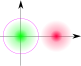
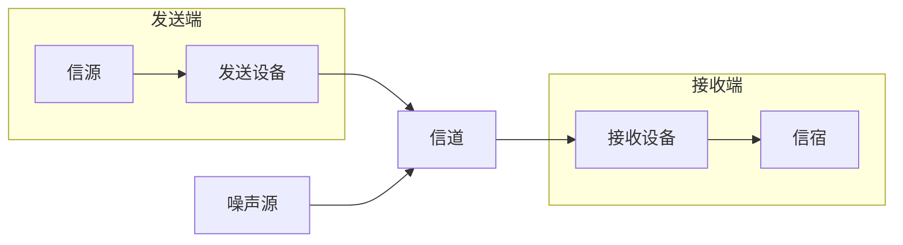
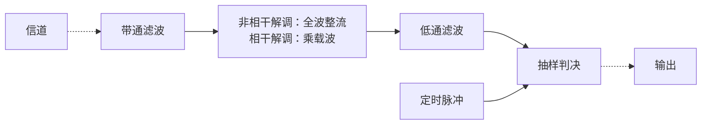

# 数字通信原理

$$
\DeclareMathOperator\sinc{sinc}
\DeclareMathOperator\erfc{erfc}
\newcommand\SI[2]{#1\ \mathrm{#2}}  % siunitx (package)
\def\N{\mathbb{N}}
\def\Z{\mathbb{Z}}
\def\R{\mathbb{R}}
\def\C{\mathbb{C}}
$$

> 以下所有 $\Pr(\cdot)$ 中的 $Z$（例：$\Pr(Z > z)$）默认为标准正态随机变量，即 $Z \sim \mathcal{N}(0,1)$。

## §3 随机过程

### 平稳与遍历

> :material-clock-edit-outline: 2022年12月3日。
>
> :material-eye-arrow-right: `总结：信息论与编码.md`同名小节。

- stationary but not ergodic (for any sense)：$Y$ 为一随机变量，$\eval{X}_t \equiv Y$。
- wide-sense stationary but neither stationary (for any order) nor ergodic (for any sense)：$\Theta$ 服从 $\qty{0, \frac12\pi, \pi, \frac32\pi}$ 上的均匀分布，$\eval{X}_t = \cos(\omega t + \Theta)$，其中 $\omega > 0$。

## §4 信道

### 多径传播的影响

> :material-clock-edit-outline: 2022年12月10日。

信号快衰落（fading）。

单一频率信号：

- 时域包络不稳定。
- 频谱弥散。

若信号频带有限宽，有频率选择性衰落。若码元时宽 $T_B$ 超过各路径延时极差 $\Delta\tau_m$ 数倍，带宽 $B$ 小于 $1/\Delta\tau_m$ 数倍分之一 ，可缓解。

## §5 模拟调制系统

### 调幅

> :material-clock-edit-outline: 2022年12月4日–5日。

记基带信号最高频率为 $f_H$。

|                      |    带宽<small>ordinary frequency</small>    |        相干解调<small>信号功率增益</small>        |        包络检波<small>信噪比增益</small>        |
| -------------------: | :---------: | :--------------------------------: | :--------------------------------: |
| Amplitude Modulation |   $2 f_H$   |            $\frac12 \times \frac{P_\text{signal}}{P_\text{carrier} + P_\text{signal}}$            |            好时同相干解调，坏时崩溃            |
|     Double Side Band |   $2 f_H$   |             $\frac12$              |             ✗ 不适用             |
|     Single Side Band |    $f_H$    | $\frac12 \times \frac12 = \frac14$ | ✗ 不适用 |
|  Vestigial Side Band | DSB、SSB 之间 | 类似 SSB | ✗ 不适用 |

- “增益”指接收方解调器两端的增益，不是从发射到接收的增益。
- 相干解调时，噪声功率都一样：输入中 $n_0 B$，输出中 $\frac14 n_0 B$（$\frac14$ 的来源同 SSB 信号功率）；不过 $B$ 每种方式不一定一样。比较输出信噪比时，应当控制 $f_H$、$n_0$ 相同。
- 相干解调时，SSB 信号功率增益：第一个 $\frac12$ 因为同相分量的功率只占一半，第二个因为 $\cos^2(\omega_\text{carrier} t)$ 的平均下来只有一半。
- AM 包络检波的 $\frac{P_\text{signal}}{P_\text{carrier} + P_\text{signal}}$ 应当理解为 $\overline{m^2} / \qty(A^2 + \overline{m^2})$。因为相对载波而言，$A$ 恒定，信号也算恒定；而长期时间平均时，$A$ 仍恒定，但信号不再能算恒定，平均功率只有峰值功率的一半。

### 调频和调相

> :material-clock-edit-outline: 2022年12月5日，2022年12月15日。

-   调相灵敏度 $K_\text{phase} \coloneqq \Delta \varphi / m$。（$m$ 是调制信号的瞬时值，下同）

-   调频灵敏度 $K_\text{frequency} \coloneqq \dv{\Delta\varphi}{t} / m$。

-   最大角频偏 $(\Delta\omega)_\text{max}$。

    如果是调频，并且输入信号是单频正弦波，则 $(\Delta \omega)_\text{max} = K_\text{frequency} m_\text{max}$。

    $(\Delta \omega)_\text{max} \ll \frac\pi6$ 则认为是窄带调频。

    若基带信号最高频率为 $\omega_H$，则调制后带宽为 $2 \qty(\omega_H + (\Delta\omega)_\text{max})$。

-   调频指数 $m_\text{frequency} \coloneqq (\Delta \omega)_\text{max} / \omega_\text{modulate}$。

调频、调相后信号总功率等于载波功率——只是重新分配功率，并不添加功率。

> “调制信号”相对载波而言，在通信系统中通常是基带信号。（莫与“已调信号”混淆）

与线性调制相比，这两种非线性调制不止搬移基带信号的频谱，还有弥散。

### 比较

> :material-clock-edit-outline: 2022年12月5日。

|                |  AM  | DSB  | SSB  |       VSB       |     FM     |
| :------------: | :--: | :--: | :--: | :-------------: | :--------: |
|    $B/f_H$     | $2$  | $2$  | $1$  | $1+\varepsilon$ | $2(1+m_f)$ |
| **抗噪声性能** |  +   |  ++  |  ++  |       ++        |    ++++    |
| **功率利用率** |  +   |  ++  |  ++  |       ++        |    ++++    |
| **设备简单度** | ++++ | +++  |  +   |       ++        |    +++     |

## §6 数字基带传输系统

### 作为模拟信号的基带信号

> :material-clock-edit-outline: 2022年12月5日。

以二元码为例。记码元重复周期、频率为 $T_B, f_B$（B for baud, named after Émile Baudot）。记两种码元的波形分别为 $g_+, g_-$，出现概率分别为 $p_+,p_-$（$p_+ + p_- = 1$）。认为不同时刻发送的码元相互独立。

-   **稳态**部分 $\mathop{\mathbb E} g = p_+g_+ + p_-g_-$

    这是确定信号，有周期，频谱离散，导致直流分量、定时分量。无定时分量并不代表无法定时——变换波形后可能存在定时分量。

    $\sum \eval{\delta}_{t - \Z T_B} \leftrightarrow f_B \sum \eval{\delta}_{f - \Z f_B}$，故稳态部分的功率谱（不是频谱）如下。

    $$
    \sum \qty(f_B \mathop{\mathbb{E}} G)^2 \eval{\delta}_{f-\Z f_B}.
    $$
    
    可以看到，等概率双极性信号无此部分。对于单极性信号，还要看 $\mathop{\mathbb E} G$ 的零点会不会与 $\Z f_B$ 碰撞——不归零的方波谱就全都碰撞了。

-   **交变**部分 $g - \mathop{\mathbb E}G$

    这是随机信号，有连续功率谱，影响信号带宽。

    在每一码元，以 $p_\pm$ 的概率出现 $\pm p_\mp \qty(g_+ - g_-)$。期望当然为零，方差为 $p_+ p_- \qty(g_+ - g_-)^2$。由此大约能得到自相关函数，反正最终功率谱如下。
    
    $$
    f_B \times p_+ p_- \qty(G_+ - G_-)^2.
    $$
    
    可以看到，对于方波，带宽与占空比成反比。

### 基带信号的编码

> :material-clock-edit-outline: 2022年12月5日，2022年12月15日。

基带信号是与模拟信号紧密相关的数字信号。

编码目标：频谱、定时、纠错。

-   **Alternative Mark Inversion**

    如其名。

    为保证定时分量，需避免连续零，改进为 High Density Bipolar。

    连续0 → `00…0V` / `B0…0V`。（保证编码后连零数量不超过 order，order 实用时常取 3）

    - V (Violation) 同时满足两个条件：
        - （V之间）交替 ±1 ——保证平均仍是零。
        - 极性与前一号相同（“前一号”包括原有1和新加的V、B）——方便译码。
    - V 的两个条件可能矛盾，于是要引入 B (Balance)。

-   **块编码**

    - 1 binary → 2 binary
        - Manchester 双相码：用上升沿、下降沿区分。
        - Coded Mark Inversion：用有沿、无沿区分。
    - x binary → y binary
    - x binary → y (pseudo) ternary
        - AMI, HDB.

-   **相对码**（aka. 差分码）

    这是一种设计，可以和其它编码结合。

### 码间串扰

> :material-clock-edit-outline: 2022年12月5日，2022年12月15日。

码间串扰（InterSymbol Inference）完全不存在的充要条件如下。

- **时域**：$h$ 在其它抽样时刻（$\Z T_B - \qty{0}$）均为零。
- **频域**：$H$ 以 $f_B$ 为周期延拓后，对所有 $\omega$ 一致。

$$
\begin{array}{crcl}
&
h \delta &=& h \sum \eval{\delta}_{t - \Z T_B}. \\
\iff&
\eval{h}_0 &\equiv& H * f_B \sum \eval{\delta}_{f - \Z f_B}. \\
\iff&
\eval{h}_0 T_B &\equiv& \sum \eval{H}_{f - \Z f_B}.
\end{array}
$$

由频域条件，$2B \geq f_B$，故频带利用率 $\eta \coloneqq \frac{f_B}{B} \leq 2$（这是无码间串扰的必要不充分条件），或者对于 $M$ 元码，$\eta_b \leq 2 \log M$。

> $B$ 只算正频率。这里是基带系统，两侧对称分布于 $\omega = 0$ 附近，$2B$ 才是频域等效宽度。

这最小的 $B$ 称作 Nyquist 带宽 $f_N$。（仅限基带系统）

有人说，[Nyquist ISI criterion](https://en.wikipedia.org/wiki/Nyquist_ISI_criterion) 只是 [Nyquist–Shannon sampling theorem](https://en.wikipedia.org/wiki/Nyquist%E2%80%93Shannon_sampling_theorem) 的另一角度。

### 噪声

> :material-clock-edit-outline: 2022年12月5日。

对于二元信号和 Additive Gaussian White Noise（AGWN），最佳门限电平

$$
V_d^* = \frac{A_+ + A_-}{2} + \frac{{\sigma_n}^2}{A_+ - A_-} \ln \frac{P_-}{P_+}.
$$

- 噪声越强，先验概率影响越大。
- 谁先验概率大，谁的判定区域大。

信源均匀分布时，$V_d^* = 0$，两个条件误码率一致，总误码率也一致，为 $\Pr(\sigma_n Z > \frac{A_+ - A_-}{2})$。

### 眼图

> :material-clock-edit-outline: 2022年12月5日。

- 最佳抽样时刻、最佳判决门限。
- 抽样失真。
- 噪声容限。
- 定时误差灵敏度。

### 时域均衡

> :material-clock-edit-outline: 2022年12月5日。

目的：抑制码间串扰。

- 按幅度失真（aka. 峰值失真），要迫零调整。（要求初始失真够小）
- 按平方失真，应用自适应均衡器，让每一处抽样的误差与抽样值不相关。

### 评价传输特性

> :material-clock-edit-outline: 2022年12月15日。

- 码间串扰。
- 带宽利用率。
- 时域拖尾情况。

## §7 数字带通调制系统

### 二进制数字调制

> :material-clock-edit-outline: 2022年12月9日。

以下判决门限 $V_d^*$、误码率 $P_\text{error}$ 都是在信源均匀分布条件下估计的。

#### Amplitude Shift Keying

特例：On / Off Keying。

**调制**：

- 模拟相乘。
- 数字键控。（用开关电路）

**功率谱**：将基带信号平移到载频附近，带宽变为原来两倍。

**解调**：

-   **相干解调**。

    误码率 $P_e = \Pr(\sigma_n Z > \frac{a}{2})$，其中 ${\sigma_n}^2$ 为噪声功率，$a$ 为信号幅度（$\frac12 a^2$ 为信号功率）。信噪比 $r = \frac12 a^2 / {\sigma_n}^2$，因此
    
    $$
    \boxed{P_e = \Pr(Z > \sqrt{\frac{r}{2}})}
    = \frac12 \erfc\sqrt{\frac{r}{4}}.
    $$

-   **包络检波**。

    大信噪比下，最佳门限同相干解调。发送零时，结果服从 Rayleigh 分布，误码率为

    $$
    \exp(- \frac{(a/2)^2}{2 {\sigma_n}^2}) = e^{-r/4}.
    $$

    发送一时，在大信噪比下，结果服从正态分布，误码率同相干解调。

    > 
    >
    > 按旋转向量法可绘出上图。
    >
    > -   结果是信号叠加噪声。
    >     - 信号发送零时（绿色）为 $(0,0)$，发送一时（红色）为 $(a,0)$。
    >     - 噪声服从二维正态分布，均值为零，标准差为 $\sigma_n$，协方差为零。
    > -   判决边界是紫色圆环。
    >
    > 可以看到，发送零时更容易越过判决边界。

    总误码率是二者平均。由于[第一项是第二项的高阶无穷小](#正态分布的累积分布)，大信噪比下，
    
    $$
    \boxed{P_e = \frac12 e^{-r/4}.}
    $$

#### Frequency Shift Keying

相当于两路 ASK 叠加。

**调制**：键控。

**功率谱**：将基带信号平移到两个载频附近，传输时带宽相当于同等 ASK 带宽加上两载频距离。（解调时因为有带通滤波，噪声谱的范围还和同等 ASK 一样。）

**解调**：

-   用两路带通滤波器分解为 <u>ASK</u>，然后各自用 ASK 的方法解调，最后比较。

    注意有两路结果，只需比较大小，无需专门设置判决门限。另外差的方差等于方差的和，因此“两路结果之差”的噪声方差是原本的两倍（$2 {\sigma_n}^2$）；同时两种码元的幅度差从 $a-0$ 变成了 $a - (-a)$，变为原来的两倍。综合两点，误码率同 ASK，只需把 $r$ 替换为 $\frac12 r$。

-   <u>过零检测</u>：将零点转换为脉冲（限幅、微分、整流），展宽脉冲，低通滤波。

#### Phase Shift Keying

改进：Differential PSK（输入决定输出变不变）。

**调制**：

- 变换<u>码型</u>为双极性，模拟相乘。
- 制备反相信号，数字<u>键控</u>。

**功率谱**：先将基带信号转换为双极性信号，再像 ASK 一样搬移，带宽也是最初两倍，不过信源均匀分布时无离散谱。

**解调**：

-   <u>相干</u>解调（aka. 极性比较法）。若是 DPSK，解调后再变换码型。

    同 ASK，只需把 $a/2$ 换成 $a$，即 $r$ 换成 $4r$。若是 DPSK，变换码型时，相邻两位任意一个错误都会导致结果错误，误码率小时相当于翻倍。

-   对于 DPSK，还可<u>比较相位</u>。

    将接收引号延时一个码元后与自身相乘，低通滤波，抽样判决。（无需另外变换码型）

    > 这相当于自相干，因此又称“差分相干解调”。不过一般“相干解调”是信号与载波相干，与此不同。

    类似 ASK 的包络检波，只需把 $a/2$ 换成 $a$，即 $r$ 换成 $4r$。

#### 横向比较

|          |                       相干解调                        | 非相干解调（包络检波等） | 与 ASK 比较                              |
| -------: | :---------------------------------------------------: | :----------------------: | ---------------------------------------- |
|  **ASK** | $\Pr(\sigma_n Z > \frac{a}{2}) = \Pr(Z > \sqrt{r/2})$ |   $\frac12 \exp(-r/4)$   | ✗不适用                                  |
|  **FSK** |   $\Pr(\sqrt2 \sigma_n Z > a) = \Pr(Z > \sqrt{r})$    |   $\frac12 \exp(-r/2)$   | 同下，加上两路比较时 ${\sigma_n}^2$ 翻倍 |
|  **PSK** |      $\Pr(\sigma_n Z > a) = \Pr(Z > \sqrt{2r})$       |         ✗不适用          | 两种码元距离从 $a$ 变成 $2a$             |
| **DPSK** |                       以上两倍                        |    $\frac12 \exp(-r)$    | 同上，相干解调再加码型变换               |

其中 DPSK 的相干解调、全部非相干解调仅限 $r \gg 1$。

|                | ASK  | FSK  | PSK / DPSK |
| -------------: | :--: | :--: | :--------: |
| **抗噪声性能** |  +   |  ++  |    +++     |
| **频带利用率** |  ++  |  +   |     ++     |
|     **适应性** |  +   | ++++ |    +++     |
| **功率利用率** |  +   |  ++  |     ++     |

**设备简单度**：非相干解调优于相干解调。

### 多进制数字调制

> :material-clock-edit-outline: 2022年12月9日。

与二进制相比，提高有效性（$R_b$），牺牲可靠性（抗噪声性能）。

为比较不同体制，用 $r_b \coloneqq \frac12 a^2 / ({\sigma_n}^2 \log M)$ 衡量 $M$ 进制的信噪比。

> $$
> \frac{E_b R_B}{n_0 B} = \frac{a^2/2}{{\sigma_n}^2 \log M}.
> $$
>
> 对于 ASK、PSK，$B = R_B$。

### Quadrature Shift Keying

> :material-clock-edit-outline: 2022年12月9日。

Also known as 4 – phase shift keying.

改进：Offset QPSK，π/4 相移 QPSK，Q Differential PSK（A、B方式）。

**调制**：（都先串行转并行）

- <u>正交调相</u>，模拟相乘。
- <u>选择相位</u>。

**解调**：

-   相干解调（aka. <u>极性比较</u>法）。

    分两路，分别乘同相、正交载波，后同 2PSK。若是 DPSK，还需变换码型。

-   对于 DPSK，还可<u>比较相位</u>。

    也需要两路。

## §9 最佳接收

### 相关形式

> :material-clock-edit-outline: 2022年12月9日，2022年12月15日。

#### 概念

目标：最小误码率。

方法：哪个信号的后验概率大就判为哪个。后验概率 = 先验概率 × 似然函数。

对于 AGWN，似然函数（发送 $s$ 的条件下收到 $r$ 的概率密度）如下

$$
\frac{1}{\sqrt{(2\pi)^k {\sigma_n}^{2k}}} \exp(-\frac{\int \qty(r - s)^2 \dd{t}}{n_0}).
$$

> - 这时 $k$ 维概率密度。
> - 指数部分分母的量纲是`[归一化功率]/[频率]`，分子的是`[幅度平方]×[时间]`。
> - ${\sigma_n}^2 = n_0 B$，其中 $n_0$ 是噪声的单边功率谱密度。
> - 指数部分分子在 $k \to +\infty$ 时才是积分。积分范围是一个码元重复周期。

#### 结构

此时

$$
\begin{split}
\ln P
&= \ln P_\text{prior} - \frac{1}{n_0} \int (r-s)^2 \dd{t} + (\cdots) \\
&\propto n_0 \ln P_\text{prior} - \int (r-s)^2 \dd{t} + (\cdots).
\end{split}
$$

> 其中 $(\cdots)$ 与发送码元无关，比较概率时无需考虑。
>
> 此处 $\propto$ 都保证系数是正数。

注意积分中 $\int r^2 \dd{t}$ 与发送码元无关。对于 FSK、PSK，$\int s^2 \dd{t}$ 也无关，可进一步简化为

$$
\ln P \propto \boxed{
    \frac12 n_0 \ln P_\text{prior} + \int rs \dd{t}
} + (\cdots).
$$

这就是最佳接收机的结构。

#### 误码率

判决依据各个码元的 $\ln P$，误码等价于 $\ln P < \ln P'$（发送 $s$，误判为 $s'$）。

$$
\begin{split}
& \Delta\ln P = \ln P' - \ln P > 0 \\
&\iff n_0 \Delta\ln P_\text{prior} - \int \Delta(r-s)^2 \dd{t} > 0.
\end{split}
$$

噪声 $n = r-s$ 的分布更简洁，我们向它看齐。

$$
\begin{split}
& \Delta\ln P > 0 \\
&\iff n_0 \Delta\ln P_\text{prior} - \int \qty((n+\Delta s)^2 - n^2) \dd{t} > 0 \\
&\iff n_0 \Delta\ln P_\text{prior} - \int (\Delta s)^2 \dd{t} - 2\int n \Delta s \dd{t} > 0. \\
\end{split}
$$

> 每一项的量纲都是`[幅度平方]×[时间]`。

> $n$ 越与 $\Delta s = s' - s$ 符合，$r = s + n$ 越容易被误判为 $s'$。

任意时刻 $n \sim \mathcal{N}(0, \frac12 n_0)$。$\int n \Delta s \dd{t}$ 是其线性组合，应当服从

$$
\mathcal{N}\qty(0,\ \frac{n_0}{2} \times \int \qty(\Delta s)^2 \dd{t}).
$$

记 $\Delta E = \int \qty(\Delta s)^2 \dd{t}$，则

$$
\begin{split}
P_\text{error}
&= \Pr(\Delta\ln P < 0) \\
&= \Pr(n_0 \Delta\ln P_\text{prior} - \Delta E - 2\sqrt{\frac{n_0}{2} \Delta E} \times  Z < 0). \\
\end{split}
$$

信源均匀分布时 $\Delta \ln P_\text{prior} = 0$，上式简化为

$$
\boxed{P_e = \Pr(\sqrt{n_0} \times Z > - \sqrt{\frac{\Delta E}{2}}).}
$$

> $\Delta E = E + E' - 2 (s, s')$。若 $E = E' = E_b$，$(s,s') = \rho E_b$，则 $\Delta E = 2(1-\rho) E_b$。

下面分析特例。设发一时的能量为 $E_b$。

| 基带系统体制 | $\Delta E$ |
| :----------: | :--------: |
|    单极性    |   $E_b$    |
|    双极性    |  $4 E_b$   |

| 带通系统体制 | $\Delta E$ |
| :----------: | :--------: |
|     2ASK     |   $E_b$    |
|     2FSK     |  $2 E_b$   |
|     2PSK     |  $4 E_b$   |

> 2ASK、2PSK 显然；2FSK 可展开完全平方差，利用正交性。

将这些结果中的 $E_b / n_0$ 换为 $r$，就变成了[实际接收机的公式](#横向比较)。

### 匹配滤波形式

> :material-clock-edit-outline: 2022年12月10日。

目标：最大信噪比。

接收到 $s + n$（$n$ 是 AGWN），传输函数为 $h$，则输出中

- 信号频谱密度：$HS$。（量纲：`[幅度]/[频率]`）
- 噪声功率谱密度：$\frac{n_0}{2} \abs{H}^2$。（量纲：`[幅度平方]/[频率]`）

瞬时信噪比

$$
\begin{split}
r
&= \frac {\eval{\abs{s_\text{output}}^2}_{t_0}} {\int \frac{n_0}{2} \abs{H}^2 \dd{f}} \\
&= \frac {\qty(H^*,\ S e^{j\omega t_0})^2} {\frac{n_0}{2} \qty(H,H)}
    \qq{(inverse Fourier transform)} \\
&\leq \frac {\qty(H^*,\ H^*) \times \qty(S e^{j\omega t_0},\ S e^{j\omega t_0})} {\frac{n_0}{2} \qty(H,H)}
    \qq{(Cauchy–Schwartz inequality)} \\
&= \frac {(H,H) \times (S,S)} {\frac{n_0}{2} \qty(H,H)} \\
&= \frac{(S,S)}{n_0 / 2}
\eqqcolon \frac{E}{n_0/2}.
\end{split}
$$

> $(x,y) = \int x^* y \dd{f}$ 是内积。
>
> $E$ 是码元能量。

取等时， $H$ 可取 $S^* e^{-j\omega t_0}$，即 $h = \eval{s}_{t_0 - t}$。

匹配滤波在 $t_0$ 时刻的输出，与前述相关在 $T_B$ 时刻的输出相同。（要求信源均匀分布）

### 多电平基带系统

> :material-clock-edit-outline: 2022年12月10日。

设输出端 $M$ 种电平分别为 $\pm d, \pm 3d, \ldots, \pm(M-1)d$。记输出噪声功率为 ${\sigma_n}^2$。

误码有两种可能，在两端为 $\Pr(Z\sigma_n > d)$，在内部为 $\Pr(\abs{Z\sigma_n} > d)$。设信源均匀分布，则总误码率

$$
P_\text{error} = \frac{M-1}{M} \Pr(\abs{Z}\sigma_n > d).
$$

信源均匀分布时，输出码元平均能量

$$
E_\text{output} = \overline{\qty((2i-1)d)^2} = \frac{M^2-1}{3} d^2.
$$

> $1^2 + 3^2 + \cdots + (2n-1)^2 = \frac13 n (2n-1)(2n+1)$。

最佳接收时，$\frac12 n_0 = {\sigma_n}^2 / (H,H)$，输入码元平均能量 $E = E_\text{output} / (H,H)$，可转换为输入信噪比：

$$
P_e = \frac{M-1}{M} \erfc\sqrt{\frac{3}{M^2-1} \times \frac{E}{n_0/2 \times 2}}.
$$

以上要求 $H$ 能无码间串扰。

## §10 信源编码

### 带通信号抽样定理

> :material-clock-edit-outline: 2022年12月10日。

给定 $f_H, B$，若 $f_H = n B'$，$n \in \N_+$，$B' \geq B$，则按 $f_s = 2B'$ 抽样也不会失真，与带宽为 $B'$ 的低通信号一样。

### 13段折线量化编码

> :material-clock-edit-outline: 2022年12月10日，2022年12月16日。

这是一种脉冲编码调制（Pulse Coded Modulation，PCM），近似不均匀编码的A律（$A = 87.6 \gg 1$，如下），主要用于语音信号。

$$
y = \operatorname{sgn} x \times \begin{cases}
    \dfrac{A\abs{x}}{1 + \ln A} & \abs{x} \leq A^{-1}. \\
    \dfrac{1 + \ln (A\abs{x})}{1 + \ln A} &  A^{-1} \leq \abs{x} \leq 1. \\
\end{cases}
$$

以 $\abs{x} \leq A^{-1}$ 段的量化间隔为 1。

-   1位极性码

-   3位段落对数量化码

    `000`为`0..16`，`001`为`16..32`。从下一段开始，每段长度翻倍。最后一段`111`为`1024..2048`。

-   4位段内均匀量化码

    每一段都取 16 个点。`000`、`001`的量化间隔是 1。从下一段开始，每段量化间隔翻倍，最后一段`111`为 64。

编码时向下对齐，译码时按期望估计。

### 噪声

> :material-clock-edit-outline: 2022年12月15日。

若均匀量化为 $M$ 个电平，则信源在零两侧对称均匀分布时，量噪比 $S_\text{out} / N_\text{quantize}$ 为 $M^2$。

加性噪声在此的信噪比 $S_\text{out} / N_\text{additive} = 1 / (4P_\text{error})$。（$M \in 2^\N$ 时）

## §11 信道编码

### 差错控制能力

> :material-clock-edit-outline: 2022年12月10日。

最小码距 $d$、译码策略决定了差错控制能力。

- 保证正确检测 $e$ 位：$d > e$。
- 保证正确纠错 $t$ 位：$d > 2t$。
- 保证正确纠错 $t$ 位，正确检测 $e$ 位（$e > t$）：$d > t+e$。

## 杂项

### 频带利用率

> :material-clock-edit-outline: 2022年12月4日。

这个利用率是 utilization 而非 efficiency，衡量数字通信系统的有效性。

$$
\eta \coloneqq \frac{R_B}{B}.
$$

> 以上按码元（$\text{Baud}$）衡量，也可按信息（$\text{bit}$）衡量—— $\eta_b \coloneqq R_b / B$。
>
> 若符号数为 $M$，则 $R_b = R_B \log M$。

### 量纲

> :material-clock-edit-outline: 2022年12月4日，2022年12月10日。

其中功率、能量是指归一化功率、归一化能量。

|   `[幅度]`   |     `[功率] = [幅度平方]`     | `[能量] = [幅度平方]×[时间]` | 关系                                                         |
| :----------: | :---------------------------: | :--------------------------: | ------------------------------------------------------------ |
|  $\sigma_n$  | 噪声功率或方差 ${\sigma_n}^2$ |     噪声功率谱密度 $n_0$     | ${\sigma_n}^2 = n_0 B$                                       |
| 信号振幅 $a$ |         信号功率 $S$          |         信号能量 $E$         | $E = ST_B$，$S = \frac12 a^2$                                |
|   信号 $x$   |        自相关函数 $R$         |        功率谱密度 $P$        | $R = \mathbb{E}[\eval{x}_{t_1} \eval{x}_{t_2}] \leftrightarrow P$ |

`[时域物理量]×[时间] = [频域物理量]`。

### 角频率与频率度量的频域

> :material-clock-edit-outline: 2022年11月8日，2022年12月13日，2022年12月15日。

1.  $ω = 2π f$，$ω$ 与 $f$ 数值并不相同，但表示相同的复指数信号。就像 $v = \SI{36}{km/h}$ 与 $v = \SI{10}{m/s}$ 里的 $36 ≠ 10$，却表示相同速度。

2.  $\eval{X}_\omega$ 与 $\eval{X}_f$ 是不同的数学函数，但表示相同的信号。

    $X$ 是个 $\R \to \C$ 函数，自变量是频率，因变量是频谱密度。$\eval{X}_\omega$ 与 $\eval{X}_f$ 的**自变量数值不同**（前者用角频率 $\omega$ 度量，后者用频率 $f$ 度量），**因变量相同**。$\eval{X}_f = \eval{X}_{\omega = 2\pi f}$ 给出了自变量的换算关系，它永远成立。

    ```mermaid
    flowchart LR
        subgraph 频率
            ω -.-|"ω = 2π×f"| f
        end
    
        subgraph 频谱密度
            X
        end
    
        ω -->|"X(ω)"| X
        f -->|"X(f)"| X
    ```

    这里为了更清楚，写成 $\eval{\tilde{X}}_\omega$ 与 $\eval{X}_f$，则 $\eval{X}_f = \eval{\tilde X}_{2\pi f}$。（实际因变量是重点，自变量不写都行，没必要区分）

    比如逆 Fourier 变换：
   
    $$
    \begin{split}
    \eval{x}_t
    &= \int\limits_\R {\color{red} \eval{\tilde X}_\omega} e^{j\omega t} \frac{\dd{\omega}}{2\pi} \\
    &= \int\limits_\R \eval{\tilde X}_{\color{red} 2\pi f} e^{j (2\pi f) t} \frac{\dd{(2\pi f)}}{2\pi}
       \qq{($\omega \mapsto f = 2\pi f$)} \\
    &= \int\limits_\R \eval{\tilde X}_{2\pi f} e^{2\pi j f t} \dd{f} \\
    &= \int\limits_\R {\color{red} \eval{X}_{f}} e^{2\pi j f t} \dd{f}.
       \qq{($\tilde X \mapsto X$)} \\
    \end{split}
    $$
   
    这也会影响卷积：
   
    $$
    \begin{split}
    & \frac{1}{2\pi} \int\limits_\R \eval{\tilde X}_{\omega'} \eval{\tilde Y}_{\omega - \omega'} \dd{\omega'} \\
    &= \int\limits_\R \eval{\tilde X}_{2\pi f'} \eval{\tilde Y}_{2\pi (f-f')} \frac{\dd{(2\pi f')}}{2\pi} \\
    &= \int\limits_\R \eval{X}_{f'} \eval{Y}_{f-f'} \dd{f'}.
    \end{split}
    $$

3.  Dirac $δ$ 是 $\sin$、$\exp$ 一样的数学函数，和信号没关系，它的定义只有一种形式—— $\int_\R \eval{\delta}_x \dd{x} = 1$。

    如果已有 $\eval{\tilde X}_\omega$，其中含 $\eval{\delta}_\omega$，想写出 $\eval{X}_f$，那直接把自变量全换了，变成 $\eval{\delta}_{2\pi f}$ 就好了。不过人们习惯于写 $\frac{1}{2\pi} \eval{\delta}_f$ 而非 $\eval{\delta}_{2\pi f}$，就像把 $\cos(2x)$ 整理成 $1 - 2\sin^2 x$。

### Fourier 参数之间的关系

> :material-clock-edit-outline: 2022年8月31日。
>
> :material-eye-arrow-right: [“数字信号处理”同名小节](../digital-signal-processing/#fourier)。

频域可用频率 $f$ 或角频率 $\omega$ 度量。

$$
\begin{aligned}
\eval{X^{(f)}}_{f} &= \eval{X^{(\omega)}}_{2\pi f}. \\
2\pi \dd{f} &= \dd{\omega}. \\
\end{aligned}
$$

这是频域的两种度量，不涉及 Fourier 变换的对偶性。

例如设 $x = \sum \eval{\delta}_{t - \Z T_0}$，则

$$
\begin{aligned}
X^{(\omega)} &= \omega_0 \sum \eval{\delta}_{\omega - \Z \omega_0}. \\
X^{(f)} &= f_0 \sum \eval{\delta}_{f - \Z f_0}. \\
\end{aligned}
$$

> $\omega_0 T_0 = 2\pi$，$f_0 T_0 = 1$。

注意 $\eval{\delta}_{2\pi f} = \frac{1}{2\pi} \eval{\delta}_f$，因为 Dirac $\delta$ 的定义里有个积分。

### 正态分布的累积分布

> :material-clock-edit-outline: 2022年12月4日，2022年12月5日。

$Z \sim \mathcal{N}(0,1)$，则

$$
\Pr(Z > z) = \frac12 \erfc \frac{z}{\sqrt 2}.
$$

其中

$$
\erfc x \coloneqq \frac{2}{\sqrt\pi} \int\limits_x^{+\infty} e^{-u^2} \dd{u}.
$$

这是 $x \to + \infty$ 下的无穷小量。诈唬使用 L’Hospital 法则，能得到

$$
\frac{\int\limits_{x}^{+\infty} e^{-au^2} \dd{u}}
    {e^{-ax^2}}
\approx \frac{-e^{-ax^2}}{-2ax \times e^{-ax^2}} = \frac{1}{2ax}.
$$

> 可以严谨证明 $\int_{u\geq x} \exp(-au^2) \dd{u} \sim \exp(-ax^2) / \qty(2ax)$。
> 
> $$
> \lim \frac{\int\limits_{x}^{+\infty} e^{-au^2} \dd{u}}
>     {\frac{1}{2ax} e^{-ax^2}}
> = \lim \frac{- e^{-ax^2}}{\qty(\frac{-2ax}{2ax} - \frac{1}{2ax^2}) e^{-ax^2}}
> = \lim \frac{1}{1 + \frac{1}{2ax^2}} = 1.
> $$

### 带宽

> :material-clock-edit-outline: 2022年12月9日，2022年12月10日，2022年12月13日。

信号的功率谱、频率千姿百态，带宽只是一个数字特征。门函数大约是带宽歧义最少的谱。

-   习惯上只算**正频率**。因此基带系统中的带宽往往是调制后的一半。

-   **等效带宽**

    $B_\omega \coloneqq \int_\R X \dd{\omega} / \eval{X}_{\omega=0}$，$B_f$ 同理。在中心处数值不变、积分相等的意义下，等效为门函数。

    这是良定义，应用于几乎所有谱都合理，而且若类似定义等效时宽，则两域宽度严格成反比。
    
    $$
    \begin{split}
    B_f B_t
    &\coloneqq \frac{\int_\R X \dd{f}}{\eval{X}_{f=0}}
      \times \frac{\int_\R x \dd{t}}{\eval{x}_{t=0}} \\
    &= \frac{\int_\R X \dd{f}}{\eval{x}_{t=0}}
      \times \frac{\int_\R x \dd{t}}{\eval{X}_{f=0}} \\
    &= 1 \times 1 = 1.
    \end{split}
    $$

-   **谱零点带宽**

    在中心处数值不变、两侧首个零点不变的意义下，等效为门函数。

    主要用于 $\sinc$ 式频谱，它的谱零点带宽是等效带宽的两倍。又名主瓣带宽。

    给定信号，用滤波器去除噪声。若按等效带宽滤波，信号往往被削掉太多，按谱零点带宽就好一些。

下面是一些案例。

-   无码间串扰限制下，频域最窄时为门函数，时域为 $\sinc$ 型。按任意带宽计算，$B = \frac12 R_\text{Baud}$。

-   基带信号标准时域脉冲为门函数（i.e. 不归零矩形脉冲），频域为 $\sinc$ 型。按谱零点带宽算，$B = R_\text{Baud}$。

    不过发送出去之前，往往还用滤波器均衡一下码间串扰。这里若用理想低通滤波器，带宽又是上面的了。

### 模型与结构

> :material-clock-edit-outline: 2022年12月14–15日。

#### 通信系统



按信道中信号形式，分为模拟、数字通信系统。

-   **模拟**

    发送设备是调制器，将基带信号转为已调信号；接收设备是解调器。

-   **数字**

    信源、信宿旁有信源压缩编码，信道旁有信道差错控制编码，二者之间还有密码。

    如果是数字调制系统（而非数字基带系统），同样有数字版本的调制、解调（键控，Shift Keying）。

    ```mermaid
    flowchart LR
      信源 -.-> 信道编码 --> 数字调制
      subgraph 编码信道["编码信道（广义信道）"]
          数字调制 --> 调制信道["调制信道<br>（狭义信道）"] --> 数字解调
      end
      数字解调 --> 信道译码 -.-> 信宿
    ```

#### 模拟调制系统

调制：

- AM：加上 $A_0$ 再乘 $\cos(\omega_c t)$。
- DSB：似上，去掉 $A_0$。
- SSB：似上，滤波。另法移相再相乘。
- VSB：似 DSB，滤波。

解调：

- 相干解调：乘载波，低通滤波。
- 包络检波：电容单向充放电。

#### 数字基带系统

接收设备：


#### 数字调制系统

调制：

- 模拟相乘。
- 数字键控。

解调：



QPSK 更具体实现见前面§7。

#### 最佳接收

- 相关形式：分多路，相乘，积分（信号→数），偏置，比较。有时可省略一路；信源均匀分布时无需偏置。
- 匹配滤波形式：滤波，等到抽样时刻，比较。

# 后备箱

- 用 $\sin$ 表示 $\sinc$ 时，若求 $0$ 处的函数值，不能只看分子。
- 区分 $\omega$ 和 $f$，例如带宽。
- Baud 率描述码元，信息速率描述信息，<u>多电平</u>信号时二者不一致。
- 区分每信息能量 $E_b$ 和每码元能量 $E$。
- $\sum \eval{\delta}_{t - \Z T_0} = \omega_0 \sum \eval{\delta}_{\omega - \Z \omega_0} = f_0 \sum \eval{\delta}_{f - \Z f_0}$，有个系数。
- 平顶抽样也时变：它是理想抽样经线性时不变系统，而理想抽样当然时变。
- 注意信号有几路。
- “最小码距 > 纠正位数 + 检测位数”只在“检测位数 > 纠正位数”时有意义。
- 线性分组码中，全零码总许用。
- 区分卷积和相关。一般写为相关更方便用计算器。
- 基带系统判决后时域均衡，若要衡量失真，应考虑所有输出，而不只是输入对应的那些输出。
- 功率谱密度有个平方，通过线性时不变系统前后倍数也是平方。
- 单边带移相调制有个 $1/2$：$\cos x \cos y = \frac12 \qty(\cos(x+y) + \cos(x-y))$。
- 模拟调制系统中，区分原始基带信号功率、发射机发送功率、接收机接收功率。前两者可相差一倍。
- 给定传输特性，无码间串扰对码率的限制是一些离散点，而非连续区间。
- <u>差分相干解调</u>确实有“干涉”，但从无需载波、误码率、比较相位等方面看，应该算<u>非相干解调</u>。
