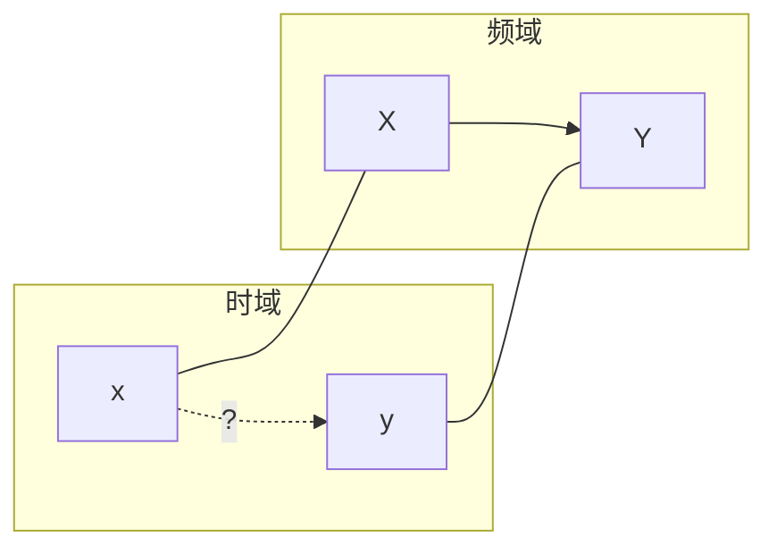
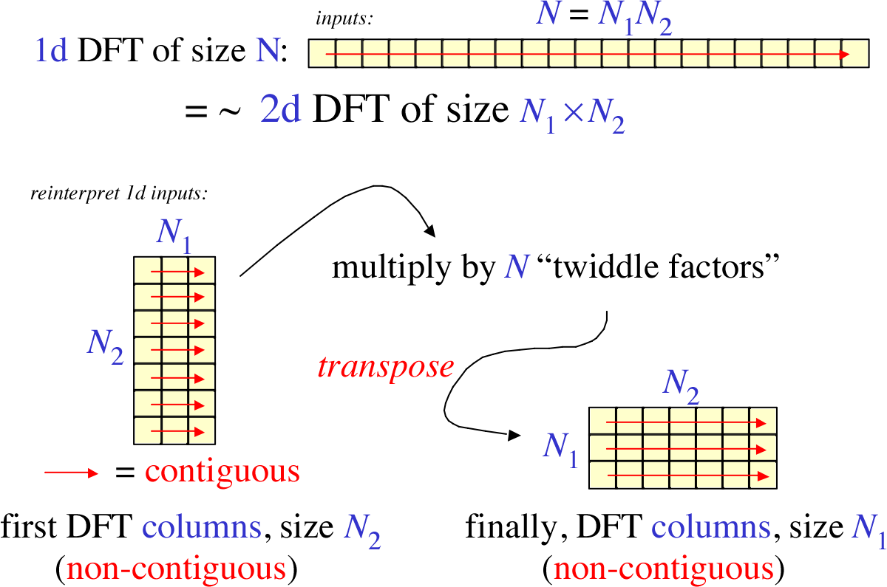
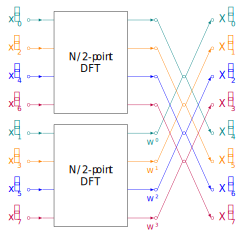
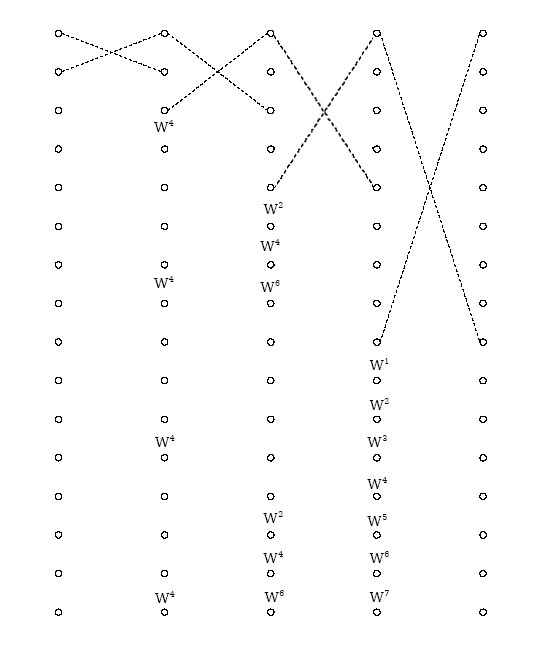
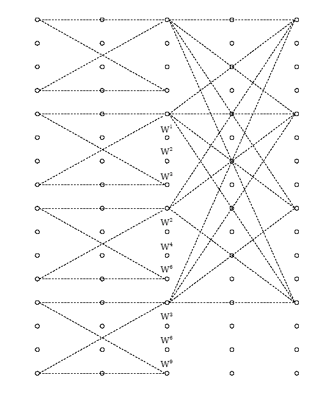
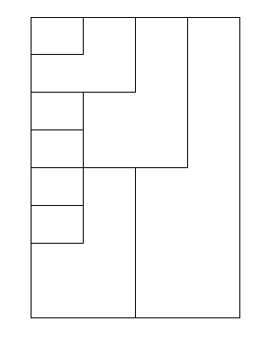
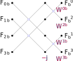
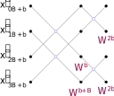
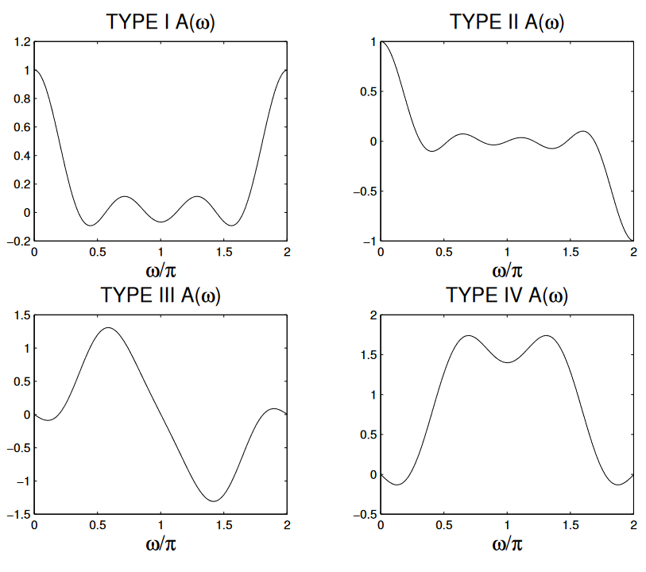

# 数字信号处理

$$
\def\N{\mathbb{N}}
\def\Z{\mathbb{Z}}
\def\R{\mathbb{R}}
\def\C{\mathbb{C}}
\def\Alpha{Α} % capital alpha
$$

> :material-file-move-outline: [`数字信号处理 习题集2019.pdf`](https://isip.bit.edu.cn/jxgz/jxzyxz/b142394.htm)

## §3 离散 Fourier 变换

### Fourier 参数之间的关系

> :material-clock-edit-outline: 2022年8月31日，2022年12月4日。

→ [`FourierTransform`](https://reference.wolfram.com/language/ref/FourierTransform.html.zh)、[`InverseFourierTransform`](https://reference.wolfram.com/language/ref/InverseFourierTransform.html) 文档的“更多信息和选项”。

$$
\begin{aligned}
X &= \sqrt\frac{\abs{b}}{\qty(2\pi)^{1-a}} \int\limits_\R x e^{jb\omega t} \dd{t}. \\
x &= \sqrt\frac{\abs{b}}{\qty(2\pi)^{1+a}} \int\limits_\R X e^{-jb\omega t} \dd{t}. \\
\end{aligned}
$$

|             场景 |  $a$  |   $b$   |
| ---------------: | :---: | :-----: |
|         现代物理 |  $0$  |   $1$   |
|         经典物理 | $-1$  |   $1$   |
| 纯数学、系统工程 |  $1$  |  $-1$   |
|         信号处理 |  $0$  | $-2\pi$ |

---

记 $T(k)$ 为

$$
\qty(u \mapsto f) \mapsto \qty(v \mapsto \int\limits_\R f e^{jkvu} \dd{u}).
$$

可知 $\forall \lambda>0,\ T(\lambda k) = T(k) / \lambda$。

又，开头两式化为 $\mathcal{F} = \sqrt{\abs{b} / \qty(2\pi)^{1-a}}\ T(b)$，$\mathcal{F}^{-1} = \sqrt{\abs{b} / \qty(2\pi)^{1+a}}\ T(-b)$，即

$$
\sqrt\frac{\abs{b}}{\qty(2\pi)^{1+a}}\ T(-b)
\circ \sqrt\frac{\abs{b}}{\qty(2\pi)^{1-a}}\ T(b)
= \qty(f\mapsto f).
$$

因此

$$
\begin{split}
\qty(f \mapsto f)
&= \frac{\abs{b}}{2\pi}\ T(-b) \circ T(b).
\end{split}
$$

### 等差比数列

> :material-clock-edit-outline: 2022年9月30日，2022年12月3日。

$$
\begin{split}
\sum_{n=0}^{N-1} n q^{n-1}
&= \pdv{q} \sum_n q^n \\
&= \pdv{q} \frac{1-q^N}{1-q} \\
&= \frac{1-q^N}{\qty(1-q)^2} - \frac{Nq^{N-1}}{1-q}.
\end{split}
$$

（$q \neq 1$）

### 等比数列

> :material-clock-edit-outline: 2022年12月3日。

$a \neq b$ 则

$$
a^n + a^{n-1} b + a^{n-2}b^2 + \cdots + b^n
= \frac{a^{n+1} - b^{n+1}}{a-b}.
$$

$\tau \in \Z / 2$，$N = 2\tau + 1 \in \Z$，则

$$
\begin{split}
\sum e^{j\omega \times \qty[-\tau, +\tau]}
&= e^{-j\omega\tau} + e^{-j\omega (\tau-1)} + \cdots + e^{+j\omega\tau} \\
&= \frac{e^{-j\omega N/2} - e^{+j\omega N/2}}{e^{-j\omega/2} - e^{+j\omega/2}} \\
&= \frac{\sin \frac{N\omega}{2}}{\sin\frac\omega2}.
\end{split}
$$

注意，$\tau \in \Z + \frac12$ 时这不是严格的 DTFT，$4\pi$ 才是最小正周期。

### 对偶关系

> :material-clock-edit-outline: 2022年10月1日。
>
> :material-file-move-outline: `DFT的间隔与总长.nb`

| 一个域 | 另一域 |
| :----: | :----: |
|  周期  |  离散  |
|  混叠  |  疏松  |
| 非周期 |  连续  |
|  补零  |  细致  |

> 补零相当于增大最小正周期，减弱周期性。细致相当于增强连续性。混叠、疏松同理。

| 一个域 | 另一域 |
| :----: | :----: |
|  插零  |  重复  |

$$
\begin{array}{c|cc}
    & 时域 & 频域 \\ \hline
    间隔 & T & F \\
    总长 & t_p & f_s \\
\end{array}
$$

> 时域插零相当于减小 $T$ 而 $t_p$ 不变。

第二行是第一行的 $N$ 倍（$N$ 是点数），对角线之积是一。

> - 时域间隔：采样周期。
> - 频域间隔：频谱分辨率。
> - 时域总长：记录时间。
> - 频域总长：无专门名词，等于采样频率。

### 用 DFT 取样 Z 频域

> :material-clock-edit-outline: 2022年10月12日。

今有 8 点序列 $x$，问 $\eval{X}_{z=0.2\exp(2\pi jk/7)}$（$k=1,\ldots,7$）。要求只用一次 DFT，点数不超过 8。

#### 分析

这种取样的频谱分辨率为 $\frac17$，所以 DFT 点数只能是 7。

下面试图构造一个 7 点序列 $y$，使 $\eval{Y}_k$ 为所求。

方案：

1. 用 $x$ 计算 $y$。
2. 计算 $y$ 的 7 点 DFT。
3. 整理一下 $k$ 的顺序。

#### 代入

注意题目给定了 $X, Y$ 关系，我们需要确定 $x,y$ 关系。那么可走 $x \mapsto X \mapsto Y \mapsto y$ 这一圈试试。

从后往前代入，首先是 $Y \mapsto y$：

$$
{\color{red} \eval{y}_n } = \frac 17 \sum_{k:7} W^{-kn} {\color{red} \eval{Y}_k }.
$$

> - “$k:N$”表示 $k \in [0,N) \cap \Z$。
> - $W = \exp(-2\pi j /7)$。

代入 $X \mapsto Y$：

$$
\eval{y}_n = \frac 17 \sum_{k:7} W^{-kn} {\color{red} \eval{X}_{z = 0.2 W^{-k}} }.
$$

再代入 $x \mapsto X$（Z 变换）：

$$
\begin{split}
\eval{y}_n
&= \frac 17 \sum_{k:7} W^{-kn} \times \color{red} \sum_{m:8} \eval{x}_m \qty(0.2W^{-k})^{-m} \\
&= \frac 17 \sum_{k:7} W^{-kn} \times \sum_{m:8} \eval{x}_m \color{red} 5^m W^{km} \\
&= \frac 17 \sum_{k:7} \sum_{m:8} \qty(\eval{x}_m 5^m) \times W^{k \color{red} (m-n)}. \\
\end{split}
$$

交换求和顺序，得

$$
\eval{y}_n
= \sum_{m:8} \qty(\eval{x}_m 5^m) \times {\color{red} \frac 17 \sum_{k:7} W^{k(m-n)} }.
$$

#### 整理

下面考虑 $\frac17\sum_k W^{k(m-n)}$。回忆一下，$\xi \in \Z$ 时，

$$
\frac 17 \sum_{k:7} W^{k\xi}
= \begin{cases}
    1 & \xi \in 7\Z. \\
    0 & \xi \notin 7\Z. \\
\end{cases}
$$

这里 $\xi = m-n$，可能是哪种情况？注意 $m:8$，$n:7$，所以 $m -n \in [0-(7-1),\ (8-1)-0] \cap \Z = [-6,7] \cap \Z$，而 $[-6,7] \cap \qty(7\Z) = \qty{0, 7}$，故

$$
\begin{split}
\frac17\sum_k W^{k(m-n)}
&= \begin{cases}
    1 & m = n \lor m = n + 7 \\
    0 & \text{other}
\end{cases} \\
&= \eval{\delta}_{m-n} + \eval{\delta}_{m-n-7}. \\
\end{split}
$$

代回 $x \mapsto y$ 那个式子，得

$$
\begin{split}
\eval{y}_n
&= \sum_{m:8} \qty(\eval{x}_m 5^m) \times \qty({\color{orange} \eval{\delta}_{m-n}} + {\color{green} \eval{\delta}_{m-n-7}}) \\
&= {\color{orange} \eval{x}_n 5^n} + {\color{green} \eval{x}_{n+7} 5^{n+7}}. \\
\end{split}
$$

而 $x$ 只有 8 点，于是

$$
\eval{y}_n = \eval{x}_n 5^n + \eval{x}_7 5^7 \eval{\delta}_n.
$$

### 内插

> :material-clock-edit-outline: 2022年11月24日，2022年12月3日。

由 $\eval{X}_k$ 内插回 $\eval{X}_z$：

$$
\begin{split}
\eval{X}_z
&= \sum_n z^{-n} \eval{x}_n \\
&= \sum_n z^{-n} \frac{1}{N} \sum_{k} \eval{X}_k W^{-nk} \\
&= \frac{1}{N} \sum_k \eval{X}_k \sum_n \qty(W^{k} z)^{-n} \\
&= \frac{1}{N} \sum_k \eval{X}_k \frac{1-z^{-N}}{1 - \qty(W^kz)^{-1}} \\
&= \frac{1}{N} \sum_k \boxed{ \color{red}
    \frac{1-z^{-N}}{1 - W^{-k}/z}
} \eval{X}_k.  \\
\end{split}
$$

若只考虑 DTFT，还可进一步化简；不过不如重新考虑，除非你能想起来 $(e^{j\omega_k}/z)^N = z^{-N}$。

这一过程针对离散信号，并且其时域有限（最多在 $[0,N) \cap \Z$ 有值）。

1. 频域取样就是
   
$$
  \hat X
  = \eval{X}_\omega \times \qty(\sum_k \eval{\delta}_{\omega - \omega_k})
  = \sum_k \eval{X}_{\omega_k} \eval{\delta}_{\omega - \omega_k},
$$

  其中 $k \in [0,N) \cap \Z$，$\omega_k = \frac{2\pi}{N} k$，$\delta$ 省略了 $2\pi$ 的周期化。

  这在时域相当于 $N$ 的周期化。

2. 恢复相当于只保留时域主值序列，即乘 $R_N$。

  这在频域相当于卷积 $R_N$ 的频谱（如下），再除以 $N$。

$$
  R_N \leftrightarrow \frac{\sin\frac{N\omega}{2}}{\sin\frac\omega2} e^{-j\omega\tau},
$$

  其中 $2\tau + 1 = N$。

其实

$$
\eval{\frac{1 - z^{-N}}{1 - e^{j\omega_k} / z}}_{z = e^{j\omega}}
= \eval{\qty(\frac{\sin\frac{N\omega}{2}}{\sin\frac\omega2} e^{-j\omega\tau})}_{\omega = \omega - \omega_k}.
$$

### 用圆周卷积分段计算长输入与短响应的线性卷积

> :material-clock-edit-outline: 2022年12月7日。
>
> :material-eye-arrow-right: [Overlap Add, Overlap Save Visual Explanation](https://blog.robertelder.org/overlap-add-overlap-save)

-   **重叠相加**（overlap add）
  
    利用线性卷积的线性，将输入拆成多段，每一段用圆周卷积补零计算线性卷积。

-   **重叠保留**（overlap save）

    将输出拆成多段，抛弃每一段圆周卷积混叠的部分。

### 对称序列的圆周卷积

> :material-clock-edit-outline: 2022年12月8日。

$$
\begin{split}
\eval{\qty(x \circledast y)}_n
&= \sum_{m} \eval{x}_m \eval{y}_{n-m} \\
&= \pm \sum_{m} \eval{x}_{\color{red} -m} \eval{y}_{n-m} \\
&= \pm \pm \sum_{m} \eval{x}_{-m} \eval{y}_{\color{red} m-n} \\
&= \pm \pm \eval{\qty(x \circledast y)}_{-n}.
\end{split}
$$

在频域考虑类似。

另：若 $x$ 以 $2$ 为周期，则只有零频和最高频分量。假如 $y$ 奇对称，那么 $Y$ 也奇对称，零频和最高频为零。因此 $x \circledast y$ 将恒零。

## §4 快速 Fourier 变换

> :material-eye-arrow-right: [Reducible](https://www.youtube.com/@Reducible), [*The Fast Fourier Transform (FFT): Most Ingenious Algorithm Ever?*](https://www.youtube.com/watch?v=h7apO7q16V0), YouTube. ([哔哩哔哩](https://www.bilibili.com/video/BV1ee411c7B7/))

### Cooley–Sande–Tukey 算法

> :material-clock-edit-outline: 2022年11月18日，2022年12月6日。
>
> :material-eye-arrow-right: [Idea - Cooley–Tukey FFT algorithm - Wikipedia](https://en.wikipedia.org/wiki/Cooley%E2%80%93Tukey_FFT_algorithm#Idea)
>
> :material-eye-arrow-right: [Fast Fourier transform - Wikipedia](https://en.wikipedia.org/wiki/Fast_Fourier_transform)

<figure markdown='1'>

<figcaption>推广算法｜<a href='https://en.wikipedia.org/wiki/File:Cooley-tukey-general.png'>Wikipedia</a></figcaption>
</figure>

> 记号如下
>
> - 大写字母：常量。
>   - 衬线体 $A$：很多元素组成的张量。
>   - 无衬线体 $\mathsf A$：单个数字。
> - 小写字母：变量。
>   - 拉丁字母 $a$：时域。
>   - 希腊字母 $\alpha$：频域。
>
> 注：不太区分大写拉丁字母与大写希腊字母，例如 $A$ 与 $\Alpha$。
>
> 又注：常见数学常量、函数除外。

DFT 点数 $N = AB$，则时域优先排 $B$ 维度（$x = aB + b$），频域优先排 $A$ 维度（$\xi = A \beta + \alpha$）。

> 在上图中，$A$ 对应 $N_2$、行数、每列长度，$B$ 对应 $N_1$、列数、每行长度。

信号 $F_x$ 的 DFT 定义为

$$
F^\xi \coloneqq \sum_x \mathsf{N}^{\xi x} F_x.
$$

> 其中 $\mathsf{N} \coloneqq \exp(-2\pi j / N)$，它的上标表示指数。下面的 $\mathsf{A}, \mathsf{B}$ 同理。
>
> 其余上下标表示元素的指标。

注意

$$
\begin{split}
\mathsf{N}^{\xi x}
&= \mathsf{N}^{(A\beta + \alpha) (aB + b)} \\
&= \mathsf{N}^{AB \beta a}
    \mathsf{N}^{A\beta b}
    \mathsf{N}^{B\alpha a}
    \mathsf{N}^{\alpha b} \\
&= \qty(\mathsf{N}^{N})^{\beta a}
    \qty(\mathsf{N}^{A})^{\beta b}
    \qty(\mathsf{N}^{B})^{\alpha a}
    \mathsf{N}^{\alpha b} \\
&= \mathsf{B}^{\beta b} \mathsf{A}^{\alpha a} \mathsf{N}^{\alpha b}.
\end{split}
$$

> $\mathsf{N}^{N} = \exp(-2\pi j N/N) = 1$。
>
> $\mathsf{N}^A = \exp(-2\pi j A/N) = \exp(-2\pi j /B) = \mathsf{B}$，同理 $\mathsf{N}^B = \mathsf{A}$。

代回，得

$$
F^{\beta \alpha}
= \sum_{a,b} \mathsf{B}^{\beta b} \mathsf{A}^{\alpha a} \mathsf{N}^{\alpha b} F_{ab}.
$$

> 若删掉旋转因子（twiddle factor）$\mathsf{N}^{\alpha b}$（将之替换为一），则上式与二维变换相同。

下面运用交换结合律，把它重组为两次变换。

$$
F^{\beta \alpha}
= \sum_{b} \mathsf{B}^{\beta b} \mathsf{N}^{\alpha b}
    \sum_a \mathsf{A}^{\alpha a} F_{ab}.
$$

1. $F_{ab} \mapsto {F^\alpha}_b = \sum_a \mathsf{A}^{\alpha a} F_{ab}$

    变换时域次要排的 $A$ 维度。Performs $B$ DFTs of size $A$.

2. ${F^\alpha}_b \mapsto {\tilde{F}^\alpha}_b = {F^\alpha}_b \mathsf{N}^{\alpha b}$

    旋转（twiddle），应用于时域、频域优先排的维度 $b, \alpha$。

3. ${\tilde{F}^\alpha}_b \mapsto {F_b}^\alpha = {\tilde{F}_b}^\alpha$

    转置。

4. ${F_b}^\alpha \mapsto F^{\beta\alpha} = \sum_b \mathsf{B}^{\beta b} {F_b}^\alpha$

    变换频域次要排的 $B$ 维度。Performs $A$ DFTs of size $B$.

无论 $A,B$ 哪个维度，都可能被认作基（radix）。哪一域优先要排的维度被认作基，就称作在哪一域抽取（因为这一域那步变换一般点数更多），相应的因子称作蝶形。例如 $B$ 维度在时域优先排，若 $B$ 被称作基，则这种算法称作在时域抽取（decimation in time），$\mathsf{B}^{\beta b}$ 称作蝶形。

> decimation 为何以 dec- 开头？其词源很血腥。

<figure markdown='1'>

<figcaption>Radix-2 DIT FFT | <code>data-flow-diagram</code></figcaption>
</figure>

### 算法流图

> :material-clock-edit-outline: 2022年12月6日。

<figure markdown='1'>

  
  
  

<figcaption markdown='1'>N=16 radix-2 (left), radix-4 (middle), and split-radix (right) DIT FFT | <a href='https://cnx.org/contents/wtdd66e0@5/Split-radix-FFT-Algorithms'>Connexions</a>, revised</figcaption>
</figure>

- **radix-2**
  
  - 系数是旋转因子，画在两列蝶形之间也许更科学。
  - 这是递归算法，但所有系数都要求换算为 $W_N$。每一列系数的指数总是等间隔分布于 $[0, \frac{N}{2})$。
  - 如果系数标在线上，那么出现位置与输入的二进制表示相同。（0 没有，1 有，且可能为 $W_0$）
  - 序列反序与远距离蝶形的用意相同，因此不可能出现在流图的同一侧。例如 DIT 输入反序，输入一侧便是近距离蝶形。
  - 不同列蝶形的线平行时更好看，为此远距离蝶形的宽度要画得大一些。
  
- **other mixed-radix**
  
  - radix-4 中的 4 点变换既可按 DFT 定义（矩阵乘法）处理，也可用 $2\times 2 = 4$ 的 radix-2 FFT 处理。后者增加的旋转因子中 $3/4$ 是一，$1/4$ 是 $-j$，都可不计运算量；并且流图与 radix-2 相同，$N$ 较小时系数也会退化成纯粹的 radix-2。
  
  <figure markdown='1'>
  

    
    
  

  <figcaption>Radix-2 or -4 to split-radix | <code>data-flow-diagram</code></figcaption>
  </figure>

- **split-radix**

  - 流图和 radix-2 相同，可通过移动系数相互转化。

## §5 数字滤波器

### $\R$ 上的部分分式展开

> :material-clock-edit-outline: 2022年11月27日，2022年12月3日。

!!! note "CASIO fx-911 的功能"

    - $\C$ 上的四则运算。
    - 求 $\R$ 上某点的导数值。
    - 解 $\R$ 上方程。
    - 给定 $\C$ 上含变量的表达式，计算（calculate，<kbd>CALC</kbd>）变量取特定值时的值。
    - 存储（store，<kbd>STO</kbd>）、使用 $\C$ 上的变量。

以展开下式为例。

$$
f =
\frac{ 2(1-x) \qty(1 + \sqrt{2} x + x^2) }
    { (1 + 0.5 x) (1 - 0.9x + 0.81x^2) }.
$$

1.  **确定形式**

  分子、分母都是三次，分母有一个实根、两个虚根。

$$
  \triangle + \frac{\bigcirc}{1+0.5x} + \frac{\square + \square x}{1 - 0.9x + 0.81x^2}.
$$

2.  **求 $\triangle$**

  $x \to \infty$ 时：

  - 由分解后形式，$\lim f = \triangle$。
  - 由原始形式，$\lim f = \qty(2 \times (-1) \times 1) / \qty(0.5 \times 0.81) = -4.938\cdots$。

  故 $\triangle = -4.938\cdots$。

3.  **求 $\bigcirc$**

  $1 + 0.5 x \to 0$，即 $x \to -2$ 时，

  - 由分解后形式，$(1+0.5) f \to 0 + \bigcirc + 0 = \bigcirc$。

  - 由原始形式，

    $$
    \begin{split}
    (1+0.5)f
    &= \frac{ 2(1-x) \qty(1 + \sqrt{2} x + x^2) } { 1 - 0.9x + 0.81x^2 } \\
    &\to \eval{\frac{(\cdots)}{(\cdots)}}_{x=-2}.
    \end{split}
    $$

  计算得 $\bigcirc = 2.157\cdots$。

4.  **求 $\square + \square x$**

  延拓到 $\C$，则 $1 - 0.9x + 0.81x^2$ 的根是 $\frac{0.9}{2\times0.81} \pm \sqrt{\qty(\frac{0.9}{2})^2 - 0.81^2} = 0.556\cdots \pm 0.673\cdots i$，记作 $\gamma$ 和 $\bar\gamma$。（$\gamma$ 具体取哪个无所谓）

  > 因为最初 $f: \R \to \R$，结合原始形式，这里必为一对共轭虚数 $\gamma,\bar\gamma$。

  $1 - 0.9x + 0.81x^2 \to 0$，即 $x \to \gamma$ 或 $x \to \bar\gamma$ 时，

  - 由分解后形式，$\qty(1 - 0.9x + 0.81x^2) f \to \square + \square \gamma$ 或 $\square + \square \bar\gamma$。
   
  -   由原始形式，
  
    $$
    \begin{split}
    \qty(1 - 0.9x + 0.81x^2) f
    &= \frac{ 2(1-x) \qty(1 + \sqrt{2} x + x^2) } { 1+0.5 x } \\
    &\to \eval{\frac{(\cdots)}{(\cdots)}}_{x=\gamma, \bar\gamma} \\
    &= 3.894\cdots \mp 1.536\cdots i,
    \end{split}
    $$
    
    记作 $A$ 和 $\bar A$。

    > 因为最初 $f: \R \to \R$，这里必为一对共轭复数 $A,\bar A$。

  因此

$$
  \begin{bmatrix}
     1 & \gamma \\
     1 & \bar\gamma \\
  \end{bmatrix}
  \begin{bmatrix}
     \square \\ \square
  \end{bmatrix}
  = 
  \begin{bmatrix}
     A \\ \bar A
  \end{bmatrix}.
$$

  可解得

$$
  \begin{split}
  \square + \square x
  &= \frac{\Im(\bar A \gamma) + \Im A\ x}{\Im \gamma} \\
  &= 4.781\cdots - 1.596\cdots x.
  \end{split}
$$

  > $\Im{\bar A \gamma}$ 是外积。

### 线性相位

> :material-clock-edit-outline: 2022年11月29–30日，2022年12月4日。
>
> :material-eye-arrow-right: [*Linear-Phase FIR Filters*](https://eeweb.engineering.nyu.edu/iselesni/EL713/zoom/linphase.pdf).

#### 群时延及相应幅度函数

设群时延为 $\tau$，则 $\operatorname{Arg} H = -\omega\tau$（其实应该再 $\pm \pi$）—— $H = \qty(e^{j\omega\tau}H) e^{-j\omega\tau}$，其中幅度函数 $e^{j\omega\tau} H \in \R$。

> 群时延其实是 $-\dv{\omega} \operatorname{Arg} H$，而不是 $- \frac{1}{\omega} \operatorname{Arg} H$。

> 广义“线性相位”只要求 $e^{j\omega\tau} H$ 的辐角不随 $\omega$ 变化，不要求具体是多少。

$$
\begin{split}
& \forall \omega,\quad
    e^{j\omega\tau} H \in \R. \\
&\iff \forall \omega,\quad
    e^{j\omega\tau} H = \qty(e^{j\omega\tau} H)^*. \\
&\iff \forall t,\quad
    \eval{h}_{\tau+t} = \eval{h^*}_{\tau-t}.
\end{split}
$$

若抽样转为离散，则最好满足 $\forall t,\quad \tau + t\in\Z \iff \tau-t\in\Z$，即 $\tau \in \Z/2$。

另外注意，

$$
\eval{H}_{e^{j\omega}} = \sum_n \eval{h}_n e^{-nj\omega}.
$$

响应有限长（finite impulse response）时，记长为 $N$，则 $H$ 由 $1, e^{-j\omega}, e^{-2j\omega}, \ldots, e^{-(N-1)j\omega}$ 构成，可以想见 $2\tau = N-1$，不然虚部无法保持抵消。

> 另：由 $\eval{h}_{\tau+t} = \eval{h^*}_{\tau-t}$。

- $\tau \in \Z$，$N \in 2\Z+1$
  
  $$
  \begin{split}
  e^{j\omega\tau} H
  &= \sum_{n=0}^{N-1} \eval{h}_n e^{(\tau-n)j\omega} \\
  &= \eval{h}_\tau + \sum_{m=1}^{\tau} \qty(
          \eval{h}_{\tau-m} e^{mj\omega} +
          {\color{red} \eval{h}_{\tau+m}} e^{-mj\omega}
      ) \\
  &= \eval{h}_\tau + \sum_{m=1}^{\tau} \qty(
          \eval{h}_{\tau-m} e^{mj\omega} +
          {\color{red} \eval{h^*}_{\tau-m}} e^{-mj\omega}
      ) \\
  &= \eval{h}_\tau + \sum_{m=1}^\tau 2 \Re{\eval{h}_{\tau-m} e^{mj\omega}} \\
  &\in \R.
  \end{split}
  $$

- $\tau \in \Z + \frac12$，$N \in 2\Z$

  与前一情况类似，只是没有单独的 $\eval{h}_\tau$ 项。
  
  $$
  \begin{split}
  e^{j\omega\tau} H
  &= \sum_{m = 1-\frac12}^{\tau} 2 \Re{\eval{h}_{\tau - m} e^{mj\omega}} \\
  &\in \R.
  \end{split}
  $$

#### 幅度函数的对称性

现在讨论一下幅度函数 $e^{j\omega\tau} H$ 的对称性。

前面已提到它是实函数。

$$
e^{j\omega\tau} H \equiv \qty(e^{j\omega\tau} H)^*.
$$

$e^{j\omega\tau} H$ 的对称性由 $H$ 和 $e^{j\omega\tau}$ 的对称性共同决定。

- $H$

  - 关于 $\omega = 0$

    $h\in\R$ 则共轭对称，$h \in \R/j$ 则共轭反对称。

  - 关于 $\omega = \pi$

    同上。

    $$
    \begin{aligned}
    (-1)^n \eval{h}_n &\leftrightarrow \eval{H}_{\pi+\omega}. \\
    (-1)^n \eval{h^*}_{n} &\leftrightarrow \eval{H^*}_{\pi-\omega}. \\
    \end{aligned}
    $$

- $e^{j\omega\tau}$

  - 关于 $\omega = 0$ 共轭对称。

  - 关于 $\omega = \pi$

    $\tau \in\Z$ 则共轭对称，$\tau \in \Z + \frac12$ 则共轭反对称。

> 注意 $2\pi$ 总是 $H$ 的周期，但不一定是 $e^{j\omega\tau}$ 的；$e^{j\omega\tau}$ 只能保证 $4\pi$ 是它的周期。这是 $\operatorname{Arg} \pm \pi$ 的多值性导致的。

综合一下，得幅度函数 $e^{j\omega\tau} H$ 的共轭对称性如下表。

$$
\begin{array}{lc|cc}
  &  &  \tau\in\Z  &  \tau \in \Z+\frac12  \\
  &  &  N \in 2\Z+1  &  N \in 2\Z  \\
  &  &  +/+  &  +/-  \\
\hline
h\in\R  &  +  &  +/+  &  +/-  \\
h\in\R/j  &  -  &  -/-  &  -/+  \\
\end{array}
$$

> 上表中 $+,-$ 分别表示共轭对称、共轭反对称；$x/y$ 表示关于 $\omega=0$ 为 $x$，关于 $\omega=\pi$ 为 $y$。
>
> 由于 $e^{j\omega\tau} H \in \R$，共轭［反］对称就是奇／偶对称。

{: style="width: 60%;" }

#### 时域实序列及其零点分布

下面讨论两种特殊情况。

- $h \in \R$
  
  $$
  \Re{\eval{h}_{\tau - m} e^{mj\omega}}
  = \eval{h}_{\tau - m} \cos(m\omega).
  $$
  
  最开始的时域条件化为
  
  $$
  \eval{h}_{\tau+m} \equiv \eval{h}_{\tau-m}.
  $$
  
- $h \in \R/j$
  
  $$
  \Re{\eval{h}_{\tau - m} e^{mj\omega}}
  = \eval{(jh)}_{\tau - m} \sin(m\omega).
  $$
  
  设 $h' = jh \in \R$，$H' = jH$，则 $\operatorname{Arg} H' = \frac\pi2 - \omega\tau$，系统广义线性。

  > $\R \to \qty{j}$ 共轭反对称，故 $H' = jH$ 与 $H$ 的共轭对称性相反。不过 $H’$ 对应的幅度函数不再是 $e^{j\omega\tau}H' \in j\R$，而是 $e^{j\omega\tau}H' / j = e^{j\omega\tau}H \in \R$，与 $H$ 的相同。
  
  最开始的时域条件化为
  
  $$
  \eval{h'}_{\tau+m} \equiv -\eval{h'}_{\tau-m}.
  $$

下面在 $Z$ 平面考察零点分布。

> 以上第二种特殊情况中，$H' = jH$，所以其实 $H'$ 与 $H$ 的零点一致。

- 由 $\eval{h}_{\tau+m} = \eval{h^*}_{\tau - m}$，

  $$
  z^\tau \eval{H}_z
  = z^{-\tau} \eval{H^*}_{1/z^*}
  $$

  > $\tau \in\Z+\frac12$ 时以上写法不严谨，应从 $\eval{h}_{n} = \eval{h^*}_{2\tau - n}$ 出发，不过由 $z = e^{sT}$ 也能说通。

  故零点 $z,\ 1/z^*$ 成对出现。（关于单位圆反演对称）

- 对于以上两种特殊情况

  - 有 $h \equiv \pm h^*$，故 $\eval{H}_{z} \equiv \pm \eval{H^*}_{z^*}$ ，因此零点 $z, z^*$ 成对出现。（关于实轴对称）
  - 幅度函数可能共轭反对称，这可在 $\omega = 0,\pi$ 导致零点。

### 从模拟原型 Butterworth 滤波器设计 IIR 数字滤波器

> :material-clock-edit-outline: 2022年12月3日。

IIR: Infinite impulse response.

1. 给定数字域**指标**

  $\omega, \alpha$ for pass and stop band.

  （$\alpha$ 总是功率比）

2. **转换**为模拟域特性

  $\alpha$ 不变；$\Omega$ 从 $\omega$ 变换，要求下面能变换回去。

  - **脉冲响应不变法**：$\Omega T = \omega$。
  - **双线性变换法**：$\frac{\Omega T}{2} = \tan\frac{\omega T}{2}$。

3.  确定模拟原型 Butterworth 滤波器的**参数**
    
$$
  \begin{cases}
  1 + \qty(\Omega_s / \Omega_c)^{2N} > \alpha_s. \\
  1 + \qty(\Omega_p / \Omega_c)^{2N} < \alpha_p. \\
  \end{cases}
$$

  要求 $N \in \N$，$\Omega_c > 0$。

  解得

$$
  N \geq \frac12 \log_{\Omega_s / \Omega_p} \frac{\alpha_s - 1}{\alpha_p - 1}.
$$

$$
  \frac{\Omega_p}{\sqrt[2N]{\alpha_p -1}}
  < \Omega_c <
  \frac{\Omega_s}{\sqrt[2N]{\alpha_s - 1}}.
$$

  一般 $N,\Omega_c$ 尽可能小：$N$ 小结构更简单，$\Omega_c$ 小阻带性能更好。

4. 转换回**数字**滤波器

  - **脉冲响应不变法**：$\eval{H}_{z = e^{sT}} = \eval{H_a}_s$ 并周期化。实际操作是展开为部分分式，然后 $\frac{1}{s - s_0} \mapsto \frac{1}{1 - e^{s_0 T} / z}$。（还可再乘 $T$ 以修正增益）
  - **双线性变换法**：$\eval{H}_z = \eval{H_a}_{\frac12 sT = \frac{z-1}{z+1}}$。

### 设计 FIR 数字滤波器

> :material-clock-edit-outline: 2022年12月3日。

FIR: Finite impulse response.

这种滤波器可用对称性让相位严格线性。

#### 时域窗函数法

1. 设定窗和理想数字滤波器

  这需要反复试验。

  -   **窗**：下面以长 $N$ 的矩形窗为例。

    $N \in 2\Z+1$ 时，没有奇对称导致的零点，适于设计所有类型的滤波器。（低通、高通、带通、带阻均可）

  -   **理想数字滤波器**：下面以门函数为例。

    $$
    h_d = \frac{\sin(\omega_c n)}{\pi n} \leftrightarrow G_{2\omega_c}.
    $$

    $\omega_c$ 其实也要确定，有时直接取通带、阻带截止频率的中点 $(\omega_s + \omega_p) / 2$。

2. 处理为因果、有限的滤波器

$$
  \eval{h}_n = \eval{h_d}_{n - \tau} \eval{R_N}_n.
$$

  其中 $2\tau = N-1$。

#### 频域取样法

1. 设定取样数、有符号幅度函数的取样值 $\eval{A}_k$

  通带取一，阻带取零，过渡带设计略有讲究。

  一般只设定前半截，后半截就由相位线性确定了。

2. 内插

  要保证线性相位性质。

## 杂项

### 不确定性原理

> :material-clock-edit-outline: 2022年10月5日。
>
> :material-eye-arrow-right: Mitch Hill, [*The Uncertainty Principle for Fourier Transforms on the Real Line*](https://math.uchicago.edu/~may/REU2013/REUPapers/Hill.pdf).

$\hat\cdot$ 表示正变换，$\check\cdot$ 表示反变换，例如 Parseval 定理如下。

$$
\norm{f}_2^2 = \frac1{2\pi} \norm{\hat f}_2^2.
$$

又如 $\widehat{f'} = j\omega \hat f$。

---

设 $f: \R \to \C$ 属于 Schwartz 类（衰减快于任何幂函数），则可分部积分

$$
\begin{split}
\norm{f}_2^2
&\coloneqq \int\limits_\R f \bar f \dd{t} \\
&= \eval{f\bar f t}_{-\infty}^{+\infty}
    - \int\limits_\R t \qty(f'\bar f + f \bar{f'}) \dd{t} \\
&= -2 \int\limits_\R t \mathfrak{Re}[f\bar{f'}] \dd{t}.
\end{split}
$$

补上虚部，再由 Cachy – Schwartz 不等式，

$$
\begin{split}
\norm{f}_2^2
&\leq 2 \abs{\int\limits_\R t f \cdot \bar{f'} \dd{t}} \\
&\leq 2 \norm{tf}_2 \cdot \norm{f'}_2.
\end{split}
$$

注意 $f’ = \qty(j\omega \hat f)^\check{}$，$\norm{f'}_2^2 = \frac{1}{2\pi } \norm{j\omega \hat f}_2^2 = \frac{1}{2\pi} \norm{\omega \hat f}_2^2$，上式化为

$$
\norm{f}_2^2 \leq \sqrt\frac{2}{\pi} \norm{tf}_2 \cdot \norm{\omega \hat f}_2.
$$

> 在时域、频域平移后，证明仍成立。

取等时，$\exists \lambda \in \C,\ f' \equiv \lambda xf$，即 $f$ 是 Gaussian 函数。

---

以 $f = \exp(-t^2/2)$ 为例。

$$
\begin{split}
\hat f
&= \int\limits_\R \exp(-\frac{t^2}{2} -j\omega t) \dd{t} \\
&= \int\limits_\R \exp\frac{-\qty(t+j\omega)^2}{2} \exp\frac{\qty(j\omega)^2}{2} \dd{t} \\
&= e^{-\omega^2/2} \int\limits_\R \exp\frac{-\qty(t+j\omega)^2}{2} \dd{t}.
\end{split}
$$

考虑矩形围道 $(-\varepsilon,0) \to (-\varepsilon, j\omega) \to (+\varepsilon,j\omega) \to (+\varepsilon,0) \to (-\varepsilon, 0)$，在 $\varepsilon \to +\infty$ 时，可知 $\int_\R \exp(-\frac12 (t+j\omega)^2) \dd{t} = \int_\R \exp(-\frac12t^2) \dd{t}$，从而等于 $\sqrt{2\pi}$。（另法：求 $\pdv{\omega} \int_\R \dd{t}$）

故

$$
\hat f = \exp(-\frac{\omega^2}{2}) \sqrt{2\pi}.
$$

此时代入不等式

$$
\text{LHS} = \int\limits_\R \exp(-t^2) \dd{t} = \sqrt{\pi}.
$$

> 正态分布 $\sigma^2 = 1/2$，概率和为一。

$$
\begin{split}
\norm{t f}_2^2
&= \int\limits_\R t^2 \exp(-t^2) \dd{t} = \frac{\sqrt\pi}{2}.
\end{split}
$$

> 方差。

同理 $\norm{\omega \hat f}_2^2 = 2\pi \cdot \frac{\sqrt\pi}{2} = \pi\sqrt{\pi}$。

$$
\therefore \text{RHS} = \sqrt\frac{2}{\pi} \sqrt{\frac{\sqrt\pi}{2}} \cdot \sqrt{\pi \sqrt\pi}
= \sqrt\frac2\pi  \frac{\pi}{\sqrt2} = \sqrt\pi.
$$

满足 $\text{LHS} \leq \text{RHS}$，且能取等。

### 时域频域翻转

> :material-clock-edit-outline: 2022年11月30日，2022年12月5日。

$$
\begin{array}{cc}
\eval{h}_t \leftrightarrow \eval{H}_s  &
\eval{h}_{-t} \leftrightarrow \eval{H}_{-s}  \\
\eval{h^*}_t \leftrightarrow \eval{H^*}_{s^*}  &
\eval{h^*}_{-t} \leftrightarrow \eval{H^*}_{-s^*}  \\
\end{array}
$$

$$
\begin{array}{cc}
\eval{h}_n \leftrightarrow \eval{H}_z  &
\eval{h}_{-n} \leftrightarrow \eval{H}_{1/z}  \\
\eval{h^*}_n \leftrightarrow \eval{H^*}_{z^*}  &
\eval{h^*}_{-n} \leftrightarrow \eval{H^*}_{1/z^*}  \\
\end{array}
$$

当 $s = j\Omega$，$z = e^{j\omega}$ 时，$s = -s^*$（关于虚轴对称），$z = 1/z^*$（关于单位圆反演）。

这大约与 $H$ 和 $H^*$ 不能同时解析有关。必须自变量、因变量同时取共轭才行，那样才不打破 Cauchy–Riemann 条件，特别是变换保角导致的手性不变性。

### 概念

#### DFT 逼近连续信号

> :material-clock-edit-outline: 2022年12月6日。

|     问题     | 原因                                               | 改善方法                              |
| :----------: | :------------------------------------------------- | :------------------------------------ |
| **频域混叠** | 时域（周期）取样 频域周期化                     | 加紧采样，提高折叠频率                |
| **栅栏效应** | 频域（周期）取样（只取基频整倍） 时域周期化     | 在时域补零凑数                        |
| **频谱泄露** | 时域截断 频域每个横向滤波器的响应太宽，副瓣太强 | 乘缓变（taper）窗，减弱截断处的不连续 |

在时域补零时窗函数宽度仍应按数据实际长度选取，并且只能提高频谱分辨率，增加总采样时长才能提高频率分辨能力。

#### 提升 DFT 运算效率的途径

> :material-clock-edit-outline: 2022年12月7日。

注意 ${W_N}^{nk}$ 的性质。

- 对称性 ⇒ 合并首尾项。
- 周期性、对称性、可约性 ⇒ 将长序列 DFT 分解为多个短序列 DFT。

#### radix-2 及 split-radix FFT 的特点

> :material-clock-edit-outline: 2022年12月7日。

- **原位运算**

  每个蝶形的输入位置和输出位置相同，无需额外寄存器。

- **输入输出顺序**

  抽取的域反序，另一域正序。

- **系数**

  抽取一侧全为 $W^0$，另一侧为 $W^0, W^1, \ldots, W^{N/2 - 1}$。
  
  从另一侧向抽取一侧推进，每次只剩偶序号那一半。

- **蝶形跨度**

  抽取一侧最小，相邻（相差一）；另一侧最大，相差 $N/2$。
  
  从抽取一侧向另一侧推进，每次跨度增加一倍。

以上主要针对 radix-2，但 split-radix 基本一致，只是系数有挪动。

split-radix 算法中“大蝶形”数量规律如下。

- 抽取一侧有 $N/4$ 个。
- 从抽取一侧向另一侧推进，每次新增加的“大蝶形”数量是 $N/4$ 减上次增加的一半。

#### 运算量

> :material-clock-edit-outline: 2022年12月7日。

##### DFT

$$
\begin{array}{c|cc}
& \text{DFT} & \text{radix-2 FFT} & \text{split-radix FFT} \\
\hline
\times & N^2 & \frac12 N\nu & \frac13 N\nu + \order{N} \\
+ & N(N-1) & N\nu & N\nu \\
\end{array}
$$

- $N=2^\nu$ 是序列长。
- split-radix FFT 不计 $-j$。
- $\times, +$ 按复数的计算。

若是实序列，radix-2 FFT 还可进一步合并运算。

$$
\begin{array}{c|c}
\hline
\times & \frac14 N(\nu-1) + N = \frac14 N\nu + \order{N} \\
+ & \frac12 N(\nu-1) + 2N = \frac12 N\nu + \order{N} \\
\end{array}
$$

##### 卷积

两个序列分别长 $N,M$。用 FFT 卷积时补零到 $L= 2^\nu$。

$$
\begin{array}{c|cc}
& \text{by definition} & \text{FFT} \\
\hline
\times & NM & 3 \times \frac12 L\nu + L \\
+ & (N-1)(M-1) & 3 \times L\nu 
\end{array}
$$

#### 采样定理

> :material-clock-edit-outline: 2022年12月7日。

-   **陈述**

  - 对于频带有限的信号 $x_a$，若其频率上限为 $f_H$，则时域采样频率 $f_s \geq 2 f_H$ 可避免频域混叠。

  - 对于时间有限的信号 $x$，若其序列长为 $N$，则频域采样取样点数 $N' \geq N$ 可避免时域混叠。

-   **意义**

  采样定理让信号在时域、频域都离散化，让用数字技术处理成为可能。

#### 滤波器各型结构特点

> :material-clock-edit-outline: 2022年12月7日。

角度：调试、误差、速率、复用。

- **有反馈**（infinite impulse response，IIR）

  - **直接型**（直接 I（aka. 直接）、直接 II（aka. 典范）及其转置）
    - 简单直观。
    - 系数<u>不直接决定</u>零极点，不易调试。
    - 极点对系数过分<u>敏感</u>，因有限字长效应，容易不稳定、累计误差。
  - **级联型**
    - 系数能<u>单独调整零极点</u>。
    - <u>累计误差</u>小，适当排序后更小。
    - 存储单元少，可模块化<u>时分复用</u>。
  - **并联型**
    - 系数能<u>单独调整极点</u>，但<u>不能单独调整零点</u>。
    - 基本节之间无干扰，<u>累计误差</u>小。
    - 可<u>并行</u>运算，速率高。

- **无反馈**（finite impulse response，FIR）

  - **直接型**（aka. 横截、卷积）

    类似有反馈。

  - **级联型**

    - 能<u>单独调整零点</u>。
    - 乘法多。

  - **频率取样型**（梳状滤波器和谐振柜）

    - 能<u>直接调整 $H(k)$</u>。
    - 有限字长效应影响大，容易<u>不稳定</u>。修正谐振柜可缓解。
    - 系数多为<u>复数</u>，复杂。线性相位、窄带时稍好。
    - 便于<u>标准</u>化、模块化，可时分复用。

#### 数字滤波器设计方法特点

> :material-clock-edit-outline: 2022年12月7日。

- **将模拟原型滤波器数字化**为 IIR 滤波器
  - **脉冲响应不变**（impulse invariance，aka. 标准 Z 变换法）
    - 极点 $s \mapsto z = e^{sT}$，不改变稳定性。
    - $\omega = \Omega T$ <u>线性</u>，保证 $\eval{h}_n = \eval{h_a}_{nT}$，变换后频率响应不失真，能模仿模拟滤波器的功能。
    - 频域<u>混叠</u>，降低阻带性能，不适合高通、带阻这种高频不衰减的滤波器。
  - **双线性变换**（bilinear transform）
    - 完全<u>不存在混叠</u>。
    - $\frac{\omega}{2} = \arctan \frac{\Omega T}{2}$，高频严重<u>非线性</u>，变换后频率响应会变形。不过低通、高通、带通、带阻滤波器都是分段常数型，只有相位受影响，幅度正常。
- **FIR** 滤波器
  - **时域窗函数**
    - 时域截断导致通带波纹、阻带衰减、过渡带。
  - **频域取样**
    - 可以精确控制取样点的响应。
    - 适合窄带滤波器。
    - 抽样频率只能是 $\frac{\pi}{N} \Z$，且截止频率不能任意设置（不一定取样到截止频率）。
    - 过渡带优化涉及：加宽过渡带，降低矩形特性要求，减轻阻带纹波。
- **IIR 与 FIR** 滤波器
  - IIR 幅度特性比同等阶数 FIR 好。
  - IIR 必须附加调相网络才能保证<u>线性相位</u>，FIR 可用对称性直接保证。
  - IIR 从模拟原型滤波器转换时，可能破坏<u>稳定性</u>。

### 预计算

> :material-clock-edit-outline: 2022年12月7日。

$h,\gamma \in \C$，则

$$
\frac{h}{1 - \gamma /z} \pm \frac{h^*}{1- \gamma^*/z}
$$

会涉及以下元素。

$$
\begin{aligned}
\qty(1-\frac{\gamma}{z}) \qty(1-\frac{\gamma^*}{z})
    &= 1 - \frac{2 \operatorname\Re \gamma}{z} + \frac{\abs{\gamma}^2}{z^2}. \\
h \qty(1-\frac{\gamma^*}{z}) + h^* \qty(1-\frac{\gamma}{z})
    &=  2\operatorname\Re h - \frac{2\ \Re{ h\gamma^*}}{z}. \\
h \qty(1-\frac{\gamma^*}{z}) - h^* \qty(1-\frac{\gamma}{z})
    &= 2j \operatorname\Im h - \frac{2j\ \Im{h\gamma^*}}{z}. \\
\end{aligned}
$$

---

$$
\begin{array}{r|rrrr}
& z^3 & z^2 & z & 1 \\
\hline
(z-1)^3 & 1 & -3 & 3 & -1 \\
(z-1)^2(z+1) & 1 & -1 & -1 & 1 \\
(z-1)(z+1)^2 & 1 & 1 & -1 & -1 \\
(z+1)^3 & 1 & 3 & 3 & 1 \\
\end{array}
$$

# 后备箱

- 混叠是尾部混叠到前部，而且可能<u>混叠好几圈</u>（周期化时不同周期可能混叠）：$\eval{\delta}_{k-1} - \eval{\delta}_{k+1}$ 在 $N=1,2$ 时恒零。
- 公比为一时，等比数列求和公式不适用。
- $W^k$ 反着转，$\Im W < 0$（$N\geq 3$）。
- 设计数字滤波器时，即使给模拟域指标，也应用采样率先换算为数字域指标。特别是双线性变换法要<u>预畸</u>。
- 用差分方程表示有反馈系统时，通常把当前输出 $\eval{y}_n$ 单独拿出来，反馈和输入放到同一边，因而有个<u>负号</u>。
- 频率取样型 FIR 滤波器中，<u>梳状滤波器无反馈</u>，谐振柜有反馈。
- $e^{s_0 t} u \leftrightarrow \frac{1}{s-s_0}$，时域取样后变为 $e^{s_0 nT} u \leftrightarrow \frac{1}{1-e^{s_0 T}/z}$，注意正负号。
- 想清楚到底是几阶的 Butterworth 滤波器。
- 画算法流图时要注意按<u>哪个域抽取</u>。
- 设计数字滤波器时，步骤一定要清晰，最好不省略原始公式。
- FIR 滤波器的幅度响应一般要求偶对称，因此即使只规定 $[0,\pi]$，也相当于给了全部。
