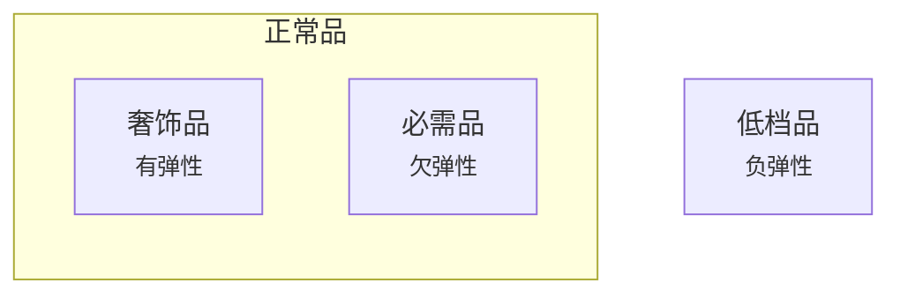

# 经济学概论

## 商品分类

> :material-clock-edit-outline: 2023年3月8日。

以上“弹性”是指需求—收入弹性。

如果需求—价格弹性，一般商品的弹性都是负的，但有一类特殊低档品—— [Giffen 商品](https://en.wikipedia.org/wiki/Giffen_good)的需求反而与价格正相关。（下表中“效应”是指需求—价格弹性）

|    类别     | 替代效应 | 收入效应 | 价格效应 |
| :---------: | :------: | :------: | :------: |
|   正常品    |    −     |    −     |    −     |
| 一般低档品  |    −     |    +     |    −     |
| Giffen 商品 |    −     |    ++    |    +     |

## Abbreviations

- P: Price.
- Q: Quantity.
- S: Supply.
- D: Demand.
- E: Elasticity.
- MRS: Marginal rate of substitution.
- TU: Total utility.
- MU: Marginal utility.
