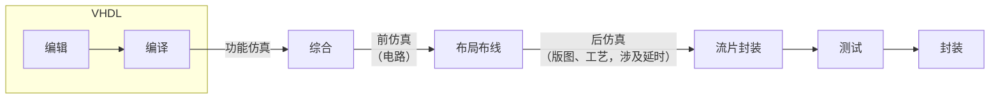

# 集成电路设计实践

!!! note 后来退课了

    因为用 VHDL 而非更新的 Verilog，且要写文献综述，我退课了。

## 第一节课

> :material-clock-edit-outline: 2022年4月18日。

VHDL 偏向并行，底层是有逻辑门的，验证时注重时序关系；C 语言偏向串行，注重变量的值。

晶圆（wafer）。线宽。



标准化集成电路涉及原件等高不等宽，电源、地线等距。

描述风格：行为、数据流、结构。

代码：库声明（`LIBRARY`，`ieee`、`std`、`work`）、实体（`ENTITY`）、结构体（`ARCHITECTURE`）。

```vhdl
LIBRARY ieee;
USE ieee.std_logic_1164.all;

ENTITY nand_gate IS
    PORT (
        a, b: IN BIT,
        x: OUT BIT
    );
END nand_gate;

ARCHITECTURE ... OF nand_gate IS
    []
BEGIN
    x <= a NAND b;
END nand_gate;

-- 这是注释……

```

`PROCESS`对应边沿触发。

数据类型：信号（signal）、变量（variable）、常量（constant）。

物理变量有数据、单位两部分。

`TYPE`，`SUBTYPE`。

`GENERATE`还是并行的，不能多值驱动。