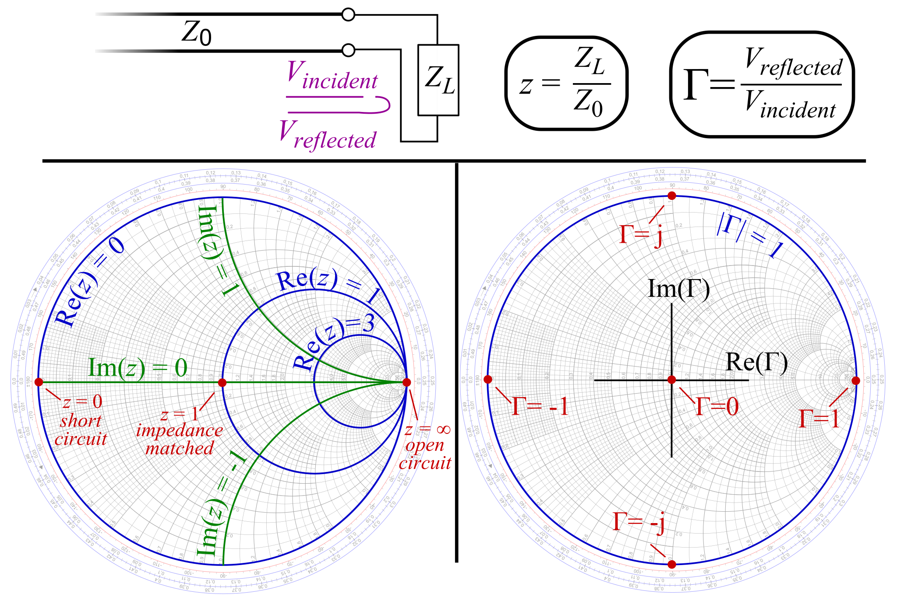

---
relevant:
  - ./semiconductor-physics.md
  - ./electromagnetic-field-and-wave.md
---

# 微波电路与系统

$$
\def\R{\mathbb{R}}
$$

## 无源器件和半导体器件

### Smith 圆图上的变换

> :material-clock-edit-outline: 2023年3月8日。

$z = \frac{Z_\text{in}}{Z_c}$，$\Gamma = \frac{z-1}{z+1}$。（一种 [Möbius 变换](https://en.wikipedia.org/wiki/M%C3%B6bius_transformation))

|  情况  |     $z$     |       $\Gamma$        |
| :----: | :---------: | :-------------------: |
|  短路  |     $0$     |         $-1$          |
|  开路  |  $\infty$   |          $1$          |
|  匹配  |     $1$     |          $0$          |
| 纯驻波 | $j\times\R$ | $e^{j\times[0,2\pi)}$ |

<figure markdown='span'>

<figcaption markdown='1'>Smith圆图｜[Wikimedia Commons](https://commons.wikimedia.org/wiki/File:Smith_chart_explanation.svg)</figcaption>
</figure>

|                     变换                     |         $\Gamma$ 的效果         | 解释                                |
| :------------------------------------------: | :-----------------------------: | ----------------------------------- |
| 沿传输线移动 $l$ （$+l$ 为“源→负载”方向） | 绕 $\Gamma = 0$ 旋转 $2\beta l$ | 入射、反射波分别转动 $\pm\beta l$。 |
|                  串联纯电抗                  |  沿内切于 $\Gamma=1$ 的圆转动   | $z$ 变化纯虚数                      |
|                  串联纯电阻                  |  沿正交于 $\Gamma=1$ 的圆转动   | $z$ 变化实数                        |
|                  并联纯电抗                  |  沿内切于 $\Gamma=-1$ 的圆转动  | $z^{-1}$ 变化纯虚数                 |
|                  并联纯电阻                  |  沿正交于 $\Gamma=-1$ 的圆转动  | $z^{-1}$ 变化实数                   |

!!! note "Möbius 变换的复合"

    $z \leftrightarrow \Gamma$，则 $z^{-1} \leftrightarrow -\Gamma$。

    $$
    \frac{z^{-1}-1}{z^{-1}+1}
    = \frac{1-z}{1+z}
    = - \frac{z-1}{z+1}.
    $$

### 用微带线实现集总电容、电感

> :material-clock-edit-outline: 2023年3月7–8日。

对于宽 $W$、厚 $d$ 的平板传输线，（传播方向）单位长度的电容、电感

$$
L_0 = \mu \frac{d}{W},\quad
C_0 = \varepsilon \frac{W}{d}.
$$

!!! note "平板传输线理想模型"

    电磁场方向、传播方向相互垂直。电磁场局限在平板之间的长方体中，并且均匀分布。
    
    此时 $E d = U$（电势定义），$H W = I$（安培环路定律）。

从而特性阻抗

$$
Z_c = \sqrt{\frac{L_0}{C_0}}
= \sqrt{\frac{\mu}{\varepsilon}} \frac{d}{W},
$$

以及传播速率

$$
\frac{\omega}{\beta} = \frac{1}{\sqrt{L_0 C_0}} = \frac{1}{\sqrt{\mu\varepsilon}} = c.
$$

#### 微带

由物理参数，可得以下近似。

|   $W/d$   |   $Z_c$   | 短线双端口特性 |
| :-------: | :-------: | :------------: |
|   $0^+$   | $+\infty$ |  仅有串联电感  |
| $+\infty$ |   $0^+$   |  仅有并联电容  |

!!! note "短线"

    以上“短线”是指传播方向上的长度小于 $\frac18 \lambda$。

也可从[转移参数](https://en.wikipedia.org/wiki/Two-port_network#ABCD-parameters)（输出电压电流 ↦ 输入电压电流）理解。

取 $+z$ 为“源→负载”方向，$\theta = \beta z$，则微带线的转移参数为

$$
\begin{bmatrix}
    \cos\theta & j \sin\theta Z_c \\
    j \sin\theta / Z_c & \cos\theta \\
\end{bmatrix}.
$$

!!! note "观察"

    - 行列式为一 ⇔ 倒易（reciprocal）。
    - 主对角线上两数相等 ⇔ 对称。（取逆再统一正方向后不变）
    - 主对角线纯实，反对角线纯虚 ⇐ 倒易 ∧ 无耗。
    - 特征值为 $\exp(\pm j\theta)$，特征向量分别是 $U = \pm I Z_c$。

对比串联电感、并联电容的转移参数

$$
\begin{bmatrix}
    1 & j\omega L \\
      & 1 \\
\end{bmatrix},
\quad
\begin{bmatrix}
    1 \\
    j\omega C  & 1 \\
\end{bmatrix},
$$

即得 $\theta \approx 0$，$Z_c \to +\infty$、$Z_c \to 0^+$ 下的近似。

#### 微带支线

除了用作双端口器件，还可用作支线（支线一端短路或开路，另一端接入电路），这相当于与负载**并联**一段传输线。（传输线的输入阻抗可由 Smith 圆图判断）