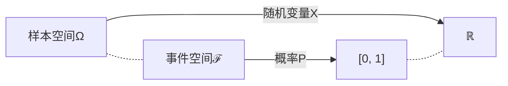

# 随机信号分析

## 杂项

### 连续型随机变量或分布

> :material-clock-edit-outline: 2023年2月22–23日。

确实有“像集可数/不可数 ⇔ 离散/连续型随机变量”的说法，但按这种定义，连续型随机变量并不一定有概率密度（从而与“连续型分布”定义不一致）：随机变量只涉及样本空间，都没谈概率呢。实际上，这种定义下还要进一步“绝对连续”才能有概率密度。

我们学的时候是先有累积分布，再借积分定义“连续型分布”，顺带绕回来提“连续型随机变量”。

像集不可数（甚至连续）但不是连续型的反例：

- 混合型。
- [Cantor 分布](https://en.wikipedia.org/wiki/Cantor_distribution)。

事实上按 [Lebesgue 分解](https://en.wikipedia.org/wiki/Lebesgue%27s_decomposition_theorem#Refinement)，随机变量可以分解成三部分：

- **绝对连续**：一般所谓的连续型。
- **奇异连续**：如上面的 Cantor 分布。
- **离散**：纯点状。
