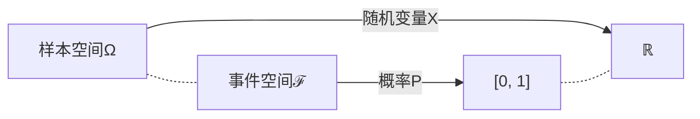

# 随机信号分析

$$
\DeclareMathOperator\expect{\mathbb{E}}
\def\tran{\mathsf T}
\def\R{\mathbb{R}}
$$

## §1 概率论

### 连续型随机变量或分布

> :material-clock-edit-outline: 2023年2月22–23日。

确实有“像集可数/不可数 ⇔ 离散/连续型随机变量”的说法，但按这种定义，连续型随机变量并不一定有概率密度（从而与“连续型分布”定义不一致）：随机变量只涉及样本空间，都没谈概率呢。实际上，这种定义下还要进一步“绝对连续”才能有概率密度。

我们学的时候是先有累积分布，再借积分定义“连续型分布”，顺带绕回来提“连续型随机变量”。

像集不可数（甚至连续）但不是连续型的反例：

- 混合型。
- [Cantor 分布](https://en.wikipedia.org/wiki/Cantor_distribution)。

事实上按 [Lebesgue 分解](https://en.wikipedia.org/wiki/Lebesgue%27s_decomposition_theorem#Refinement)，随机变量可以分解成三部分：

- **绝对连续**：一般所谓的连续型。
- **奇异连续**：如上面的 Cantor 分布。
- **离散**：纯点状。

### 多变量正态分布的边缘分布和条件分布

> :material-clock-edit-outline: 2023年2月22日–2023年3月5日。

#### 铺垫

[多变量正态分布](https://en.wikipedia.org/wiki/Multivariate_normal_distribution)有均值 $\vb*\mu$、协方差 $\Sigma$ 两个参数。

- 只考虑 $\vb*\mu = \vb*0$ 情形；若不为零，考虑减去 $\vb*\mu$ 的随机变量即可。
- 设随机变量 $X\in\R^{n\times 1}$，则 $\Sigma \coloneqq \expect[(X-\vb*\mu) (X-\vb*\mu)^\tran]$ 从而对称、半正定。下面只考虑正定的 $\Sigma$；若是退化情形，改到子空间考虑即可。

仍设随机变量 $X\in\R^{n\times 1}$，此时联合概率密度为

$$
\frac{1}{\sqrt{\abs{2\pi \Sigma}}} \exp(-\frac{\vb*X^\tran \Sigma^{-1} \vb*X}{2}).
$$

也可用 [precision matrix](https://stats.stackexchange.com/questions/10795/how-to-interpret-an-inverse-covariance-or-precision-matrix) $\Phi = \Sigma^{-1}$ 写为

$$
\sqrt{\abs{\frac{\Phi}{2\pi}}} \exp(-\frac{\vb*X^\tran \Phi \vb*X}{2}).
$$

在正态分布中，

- $\Phi_{ij} = 0 \iff$ $X_i, X_j$ 条件独立。（给定其它随机变量下）

  给定条件下，$\Phi_{ij} = 0$ 意味着联合概率密度无交叉项 $x_i x_j$，可直接分解为两个边缘密度。

- 分量两两线性无关 $\iff$ 分量相互独立。

  此时 $\Sigma$ 是对角阵，于是 $\Phi$ 也是。

#### 边缘分布和条件分布

现在设随机变量为

$$
\begin{bmatrix}
    \vb*X \\ \vb* Y
\end{bmatrix},
$$

相应设

$$
\begin{aligned}
\Sigma &= \begin{bmatrix}
    \Sigma_{XX} & \Sigma_{XY} \\
    \Sigma_{YX} & \Sigma_{YY} \\
\end{bmatrix}, \\
\Phi &= \begin{bmatrix}
    \Phi_{XX} & \Phi_{XY} \\
    \Phi_{YX} & \Phi_{YY} \\
\end{bmatrix}. \\
\end{aligned}
$$

!!! note "这很自然"

    例如，概率密度中的指数是 $\vb*X^\tran \Phi_{XX} \vb*X + \vb*X^\tran \Phi_{XY} \vb*Y + \vb*Y^\tran \Phi_{YX} \vb*X + \vb*Y^\tran \Phi_{YY} \vb*Y$。

考虑分布 $\vb*X$ 和 $\vb*Y | \vb*x$。

- **边缘分布 $\vb*X$**
  - $\mu_{\vb*X} = \vb*0$。
  - $\Sigma_{\vb*X} = \Sigma_{XX}$。
  
- **条件分布 $\vb*Y|\vb*x$**
  - $\mu_{\vb*Y | \vb*x} = \Sigma_{YX} {\Sigma_{XX}}^{-1} \vb*x$。
  
    这与最小二乘法一致。
  
    !!! info "最小二乘法"

        模型为 $y_i = A_{ij}\, x_j$，收到样本（samples）$y_{is}$ 与 $x_{js}$。试图解 $y_{is} = A_{ij}\, x_{js}$，但无解，转而考虑方程
      
        $$
        y_{is}\ x_{sk} = A_{ij}\ x_{js}\ x_{sk},
        $$
      
        于是 $\hat A_{ij} = \qty(y_{is}\ x_{sk}) \times \qty(x_{js} x_{sk})^{-1}$。
      
        把样本均值转为期望便是 $\hat A = \Sigma_{YX} {\Sigma_{XX}}^{-1}$。
  
  - $\Phi_{\vb*Y | \vb*x} = \Phi_{YY}$。
  
    若用 $\Sigma$ 表示，则为 $\Sigma / \Sigma_{XX}$（$\Sigma_{XX}$ 在 $\Sigma$ 中的 [Schur complement](https://en.wikipedia.org/wiki/Schur_complement)）。

这可以理解为配方：

$$
\begin{bmatrix}
    \vb*x \\ \vb*y
\end{bmatrix}^\tran
\Phi
\begin{bmatrix}
    \vb*x \\ \vb*y
\end{bmatrix}
=
\qty(\vb*y - \mu_{\vb*Y | \vb*x})^\tran \Phi_{YY} \qty(\vb*y - \mu_{\vb*Y | \vb*x})
+ \vb*{x}^\tran {\Sigma_{XX}}^{-1} \vb*x.
$$

!!! note "验证"

    将上式展开，反复利用 $\Phi \Sigma = I = \Sigma \Phi$ 的分块形式即可。
